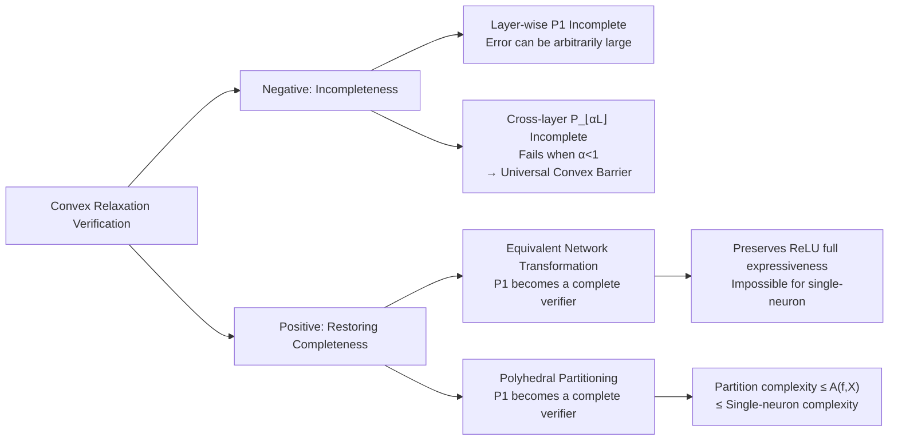

# Expressiveness of Multi-Neuron Convex Relaxations in Neural Network Certification

**Conference**: ICLR 2026  
**OpenReview**: [https://openreview.net/forum?id=f07Kf4pD0f](https://openreview.net/forum?id=f07Kf4pD0f)  
**Code**: To be confirmed  
**Area**: AI Safety / Neural Network Verification / Certified Robustness  
**Keywords**: Convex Relaxation, Multi-Neuron Relaxation, Completeness, Convex Barrier, Certified Robustness, Formal Verification  

## TL;DR
This paper rigorously characterizes the expressiveness of multi-neuron convex relaxations for the first time, proving they are **inherently incomplete** like single-neuron relaxations (generalizing the "single-neuron convex barrier" to a "universal convex barrier"). However, completeness can be restored through **equivalent network transformations** or **input domain polyhedral partitioning**, with the partitioning complexity being strictly superior to single-neuron relaxations.

## Background & Motivation
**Background**: Exact computation of adversarial robustness for neural networks is coNP-hard. Consequently, **convex relaxations** are used to provide a convex over-approximation of the network's output reachable set, thereby yielding provable lower bounds on robustness. These methods are used for both verification and "certification-aware training" to produce "certifiably robust models," serving as a cornerstone of the field.

**Limitations of Prior Work**: Convex relaxations are lossy. Single-neuron relaxations (which process ReLUs individually and ignore inter-neuron dependencies) suffer from the famous **single-neuron convex barrier**—even Triangle, the most precise single-neuron relaxation, cannot provide exact bounds for general ReLU networks. Baader et al. even proved it cannot accurately bound a simple $\max$ function in $\mathbb{R}^2$. To overcome this, researchers have heuristically proposed **multi-neuron relaxations** (k-ReLU, PRIMA, cross-layer relaxations, etc.) that jointly consider groups of neurons, showing higher empirical precision.

**Key Challenge**: The theoretical properties of multi-neuron relaxations remain largely unexplored. Two fundamental questions remain unanswered: (i) Given sufficient resources, can multi-neuron relaxations **bypass the convex barrier** to achieve complete verification? (ii) If not, do they have a **fundamental advantage** over single-neuron relaxations? These cannot be answered solely through experiments—multi-neuron relaxations can always become more precise by increasing resources at a high computational cost, and empirical exploration cannot reach their theoretical limits.

**Goal**: Formalize the concept of "multi-neuron relaxation" and rigorously characterize the boundaries of its expressiveness and completeness.

**Core Idea**: **Answer theoretical limits through network construction rather than experiments**. By constructing sub-networks where the "convex hull is strictly larger than the reachable set," the authors prove that any convex relaxation with a fixed layer window has failure cases with arbitrarily large errors (negative result). Simultaneously, they provide two feasible paths to restore completeness and quantify their complexity advantages (positive result).

## Method

### Overall Architecture
The paper avoids proposing a specific algorithm, building instead a theoretical framework regarding what convex relaxations "can and cannot do." The core abstractions are two types of most-precise relaxation operators: $P_1$ (the most precise **layer-wise**/cross-1-layer relaxation, taking the convex hull of each layer's output) and $P_r$ (the most precise **cross-$r$-layer** relaxation, taking the convex hull of the graph of $r$ adjacent layers). The paper first proves negative conclusions ($P_1$ and even $P_{\lfloor\alpha L\rfloor}$ are incomplete), upgrading the single-neuron barrier to a universal convex barrier. It then proves positive conclusions (restoring completeness via transformations and partitioning) and quantifies the complexity advantage of multi-neuron relaxations.

### Key Designs
**1. Incompleteness of layer-wise multi-neuron relaxations: "Phantom points" outside the convex hull cannot be eliminated.** The paper uses a small example with $X=[-1,1]^2$ to illustrate the intuition: after an affine layer and ReLU, the input box is mapped to a **non-convex union of polyhedra** $U$. A subsequent sub-network $f'$ takes its extreme value at a point $u^*=(1,1)$ which is in the convex hull of $U$ but not in $U$ itself. The essence of the problem is characterized by two lemmas—Lemma 3.1 states that constraints imposed by layer-wise relaxations at deeper layers **cannot retrospectively tighten the feasible sets of shallower layers** ($\pi_{v^{(i)}}(C_1)=\pi_{v^{(i)}}(C_2)$). Consequently, Lemma 3.2 gives $\ell(f,P_1,X)\le\min(f_2(\mathrm{conv}(f_1(X))))$: $P_1$ can at best be seen as splitting the network at a hidden layer into $f_2\circ f_1$, taking convex hulls separately, and concatenating them. As long as $\mathrm{conv}(f_1(X))\setminus f_1(X)\neq\varnothing$ and $f_2$ takes its minimum in this "phantom region outside the convex hull," the relaxation will be imprecise. Theorem 3.3 further proves that by scaling output layer weights, an error $\ell(f,P_1,X)\le\min f(X)-T$ can be constructed for any $0<T<\infty$, meaning the **error can be pushed arbitrarily large**.

**2. Universal Convex Barrier: Cross-layer relaxations cannot save it; $\alpha<1$ is a hard threshold.** A natural question follows: can cross-$r$-layer $P_r$ achieve completeness? Instead of fixing $r$ as a constant, the paper asks in the most general setting: does there exist an $\alpha\in(0,1)$ such that $P_{\max(1,\lfloor\alpha L\rfloor)}$ is exact for all $L$-layer networks? The answer is **no**. The key tool is Lemma 4.1, using a logic similar to the **Pumping Lemma**: by inserting several identity "dummy layers" between $f_1$ and $f_2$ to increase network depth, these layers **block** the cross-layer information exchange between $f_1$ and $f_2$, causing the cross-layer relaxation to degrade to $P_1$—even if it is exact for $f_1$ and $f_2$ individually. Thus, Theorem 4.2 proves that for any $\alpha\in(0,1)$, the error can be arbitrarily large. This establishes that "$P_{\lfloor\alpha L\rfloor}$ is complete at $\alpha=1$ but incomplete for $\alpha<1$" is a **hard threshold**. The "single-neuron barrier" is actually a misnomer and should be renamed the **universal convex barrier**. This conclusion can be extended to non-polynomial activations like tanh and sigmoid via the Universal Approximation Theorem.

**3. Restoring $P_1$ completeness via equivalent transformations: copying input information to the output.** Since pure relaxation is hopeless, the positive results ask: can we perform a **semantics-preserving structural transformation** to restore completeness? Theorem 5.1 provides an affirmative answer—for any network $f$ and polytope $X$, there exists $g=f$ (on $X$) such that $\ell(g,P_1,X)=\min f(X)$ and $u(g,P_1,X)=\max f(X)$. The construction targets the weakness of $P_1$ (losing information between layers): **widening each hidden layer to let additional neurons copy input variables layer by layer**. This ensures the final layer carries full input information, making $P_1$ on the last layer equivalent to taking the convex hull of $f[X]$. Corollary 5.2 yields a strong statement: **any continuous piecewise linear (CPWL) function** has a ReLU network encoding that can be exactly bounded by $P_1$—something **single-neuron relaxations fundamentally cannot do** (their exact expressiveness is trapped in 1-D). Case studies also show that in practice, $P_1$ is often overkill: the $\max$ function on $[0,1]^d$ only requires the much weaker $M_1$ (taking the convex hull for a single output) to be exact, whereas k-ReLU/Triangle give a loose bound of 1.5.

**4. Restoring $P_1$ completeness via polyhedral partitioning: complexity strictly superior to single-neuron.** The second path keeps the network unchanged and uses the divide-and-conquer approach of Branch-and-Bound (BaB): partition the input set into several convex sub-polytopes such that each piece **remains a convex polytope after passing through each layer**. Then $P_1$ is exact for each piece, and aggregating them gives the global exact bound (Proposition 5.3; this condition is both sufficient and necessary). The paper measures the required number of sub-problems as **partitioning complexity** $\#\mathrm{Partition}$ and uses the **number of activation patterns** $A(f,X)$ (the number of different activation patterns on $X$) as a benchmark (Proposition 5.6):
$$\#\mathrm{Partition}(\mathrm{BaB}(M),f,X)\le A(f,X)\le \#\mathrm{Partition}(\mathrm{BaB}(S),f,X)$$
This means the partitioning complexity of any multi-neuron relaxation $M$ is upper-bounded by $A(f,X)$, while any single-neuron relaxation $S$ must enumerate all activation patterns ($A(f,X)$ is its lower bound). The two are strictly separated by $A(f,X)$. For strong relaxations like $P_1$, this upper bound can even be extremely loose.

## Key Experimental Results
This work is purely theoretical and **contains no empirical experimental tables**. The core "data" consists of a set of theorems and their quantitative comparisons.

### Summary of Main Conclusions

| Conclusion | Setting | Result | Meaning |
|------|------|------|------|
| Theorem 3.3 | Layer-wise $P_1$ | $\exists f$ s.t. $\ell(f,P_1,X)\le\min f(X)-T,\ \forall T<\infty$ | Layer-wise multi-neuron relaxation is **incomplete**; error is unbounded |
| Theorem 4.2 | Cross-layer $P_{\max(1,\lfloor\alpha L\rfloor)},\ \alpha<1$ | $\exists f$ s.t. error $>T,\ \forall T$ | **Universal Convex Barrier**: Any fixed-ratio cross-layer relaxation is incomplete |
| Theorem 5.1 / Cor 5.2 | $P_1$ + Eq. Transformation | $\ell(g,P_1,X)=\min f(X)$ | $P_1$ is complete via transformation; preserves full CPWL expressiveness |
| Proposition 5.6 | BaB + Partitioning | $\#\mathrm{Part}(\mathrm{BaB}(M))\le A(f,X)\le\#\mathrm{Part}(\mathrm{BaB}(S))$ | Multi-neuron partitioning complexity is **strictly superior** to single-neuron |

### Single-neuron vs. Multi-neuron ($\max$ function case)

| Relaxation Method | Upper bound for $f=x_2+\rho(x_1-x_2)$ | Exact? |
|----------|------------------------------|----------|
| Triangle / k-ReLU | 1.5 | ✗ (Loose) |
| $M_1$ (Multi-neuron, weak) | 1 | ✓ (Exact) |
| IBP + Partitioning | At least $2-p$ | ✗ (Infinite partitioning complexity) |

### Key Findings
- **Negative**: Incompleteness of convex relaxations is not a limitation of "single-neuron" methods but a **universal ceiling** for the convex relaxation paradigm itself—as long as the layer window ratio $\alpha<1$, no amount of resources (neurons, layers) can fully recover accuracy.
- **Positive**: The key to completeness is "**allowing information to bypass the convex hull loss**"—either through structural transformations that carry input information to the final layer or through input partitioning that splits non-convex unions into convex pieces.
- **Fundamental Advantage**: The value of multi-neuron vs. single-neuron relaxations is quantified by a clear separation line where partitioning complexity is divided by the number of activation patterns $A(f,X)$.

## Highlights & Insights
- **Heuristic tools put on theoretical trial**: Multi-neuron relaxations were previously empirical (adding more neurons makes it more accurate). This paper provides the first rigorous characterization of their boundaries, answering what their actual strengths and weaknesses are.
- **The "Universal Convex Barrier" is an elegant and counter-intuitive negative result**: Intuition suggests that crossing enough layers could achieve completeness. This paper uses a pumping-lemma-style construction to prove a hard wall exists as long as $\alpha<1$, clarifying a long-misnamed concept (single-neuron barrier).
- **Symmetry of negative and positive results**: It doesn't just say "it's impossible"; it provides two paths for "how it's possible," each accompanied by a comparison with single-neuron relaxations, making the conclusions highly applicable to engineering.
- **Partitioning complexity using $A(f,X)$**: Proposes a clean sandwich-style separation $\#\mathrm{Part}(M)\le A(f,X)\le\#\mathrm{Part}(S)$, combining theoretical aesthetic with practical guidance.

## Limitations & Future Work
- **Conclusions limited to the defined verification framework**: Negative results target "convex relaxations with fixed resources + LP solving," and positive results are further restricted to **finite ReLU networks**, which might not hold for all verification paradigms.
- **Positive results not yet practical algorithms**: The equivalent transformation in Theorem 5.1 widens hidden layers, and solving $P_1$ for the transformed network may be computationally infeasible or intractable. The partitioning complexity upper bound may also be loose for strong relaxations. The paper explicitly leaves "practical algorithms" as future work.
- **Lack of empirical validation**: Understandable for a pure theory paper, but the actual speedup or training gains of multi-neuron relaxations in real BaB workflows remain at the "theoretical suggestion" level.
- **Future Work**: The authors point to two engineering directions: (i) using efficient multi-neuron relaxations as bounding subroutines in BaB (due to lower partition complexity); (ii) designing certified training methods specifically for multi-neuron relaxations (as they can exactly bound any CPWL function).

## Related Work & Insights
- **Single-neuron convex barrier** (Salman 2019, Palma 2021, Baader 2024) is the direct dialogue partner. Baader et al. proved Triangle fails for $\mathbb{R}^2$ max; this paper upgrades this impossibility to a universal barrier for all convex relaxations while providing a positive counterpart where multi-neuron methods succeed.
- **Multi-neuron relaxation family** (k-ReLU/Singh 2019, PRIMA/Müller 2022, cross-layer/Zhang 2022) provides the objects of analysis; this paper uses abstract operators like $M_k$ and $P_r$ to characterize their optimal limits.
- **Branch-and-Bound complete verification** (DeepPoly, $\alpha,\beta$-CROWN, etc., recent state-of-the-art complete verifiers) almost all use single-neuron relaxations for bounding. This paper's partition complexity results provide the theoretical basis for switching to multi-neuron bounding in BaB.
- **Insight**: For the certified robustness community, this work settles the fundamental question of "whether convex relaxation is the endgame"—the answer is "only as a subroutine for BaB," shifting research focus toward **multi-neuron bounding in BaB** and **multi-neuron certified training**.

## Rating
- **Novelty**: ⭐⭐⭐⭐⭐ First rigorous characterization of multi-neuron relaxation expressiveness; proposes the "universal convex barrier" and clarifies the single-neuron barrier; a foundational theoretical contribution.
- **Experimental Thoroughness**: ⭐⭐⭐ Pure theory work with no empirical experiments; theorems and case studies are self-consistent and complete, but practical algorithms are left for future work.
- **Writing Quality**: ⭐⭐⭐⭐ Symmetric presentation of negative/positive results; clear lemma-theorem logic chains; excellent use of examples (max, pumping lemma) for clarity.
- **Value**: ⭐⭐⭐⭐⭐ Clarifies a long-standing fundamental question in certified robustness, closing the door on pure convex relaxation while pointing to BaB subroutines and certified training as specific directions.

<!-- RELATED:START -->

## Related Papers

- [\[CVPR 2026\] Verifying Neural Network Robustness with Dual Perturbations](../../CVPR2026/ai_safety/verifying_neural_network_robustness_with_dual_perturbations.md)
- [\[NeurIPS 2025\] Influence Functions for Edge Edits in Non-Convex Graph Neural Networks](../../NeurIPS2025/ai_safety/influence_functions_for_edge_edits_in_non-convex_graph_neural_networks.md)
- [\[CVPR 2026\] RevINN: An End-to-End Invertible Neural Network for Reversible Adversarial Examples Generation](../../CVPR2026/ai_safety/revinn_an_end-to-end_invertible_neural_network_for_reversible_adversarial_exampl.md)
- [\[ICML 2025\] Convex Markov Games: A New Frontier for Multi-Agent Reinforcement Learning](../../ICML2025/ai_safety/convex_markov_games_a_new_frontier_for_multi-agent_reinforcement_learning.md)
- [\[AAAI 2026\] FairGSE: Fairness-Aware Graph Neural Network without High False Positive Rates](../../AAAI2026/ai_safety/fairgse_fairness-aware_graph_neural_network_without_high_false_positive_rates.md)

<!-- RELATED:END -->
