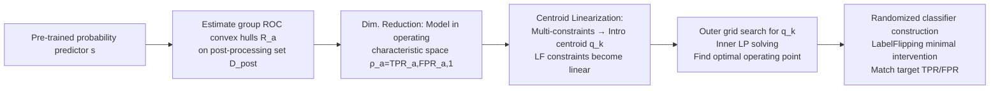

# Fair Classification by Direct Intervention on Operating Characteristics

**Conference**: ICLR 2026  
**OpenReview**: [https://openreview.net/forum?id=Vv3PGcSn7c](https://openreview.net/forum?id=Vv3PGcSn7c)  
**Code**: To be confirmed  
**Area**: AI Safety / Algorithmic Fairness (group fairness, post-processing)  
**Keywords**: Group fairness, ROC convex hull, post-processing, linear fractional constraints, demographic parity, equalized odds, predictive parity  

## TL;DR
Instead of searching in the classifier space, this work directly performs geometric optimization on the **group-level ROC convex hulls (operating characteristic space)** of a pre-trained classifier. It first locates the optimal operating point that satisfies multiple fairness constraints and then post-processes the base classifier using minimal label flipping to reach that point, satisfying multiple fairness metrics like DP, EO, and PP with near-oracle accuracy loss.

## Background & Motivation
**Background**: Group fairness requires certain performance metrics of a model to be equal across protected groups (e.g., race, gender). Common methods are categorized into three types: pre-processing (data modification), in-processing (objective/architecture modification), and post-processing (modifying predictions of a trained model). Post-processing is particularly favored in high-risk scenarios like COMPAS because it does not interfere with the training pipeline and is "plug-and-play."

**Limitations of Prior Work**: Real-world applications often require satisfying **multiple** fairness metrics (demographic parity, equalized odds, predictive parity, etc.) simultaneously. However, theoretical impossibility results suggest that an excessive number of metrics cannot be strictly satisfied at once, leading practitioners to seek "approximate fairness." Representative methods like Celis et al. (2019) optimize within the **classifier function space**, depending on the estimation of the Bayes regressor $\eta_a(x)$ and threshold searching. This step is **extremely sensitive to noise** when sample sizes are small, potentially making feasible constraints infeasible and causing significant accuracy drops.

**Key Challenge**: To satisfy multiple (including linear fractional) fairness constraints while minimizing accuracy loss and modification (intervention) to the base classifier—directly optimizing in the high-dimensional classifier space is neither stable nor efficient.

**Goal**: To design an approximate fairness post-processing method for binary classification problems with multiple fairness constraints that can be written as **linear fractional representations**, achieving near-oracle accuracy and low intervention rates on datasets like COMPAS and ACSIncome.

**Key Insight**: **Dimensionality reduction to the operating characteristic space**. Instead of optimizing the function $f$, the method directly optimizes the operating characteristics $(\text{TPR}_a, \text{FPR}_a)$ for each group. The key observation is that when randomized thresholding is allowed, all $(\text{TPR}, \text{FPR})$ values achievable from a base classifier form exactly the **convex hull** of its empirical ROC curve. Thus, fairness optimization transforms into a geometric problem over these low-dimensional convex polygons.

## Method

### Overall Architecture
The method **ROCF (Fair classification via operating characteristic feasibility regions)** consists of two steps: (A) limiting the search to the set of post-processors of a pre-trained probability predictor $s$; (B) moving the optimization from the function space to the operating characteristic space, finding the optimal operating point within each group's ROC convex hull that satisfies fairness constraints, and constructing a randomized classifier to reach that point.

### Key Designs

**1. Dimensionality reduction to ROC convex hull: Turning "finding a fair classifier" into "picking points in convex polygons."** Traditional post-processing searches for thresholds over functions $f$. This work instead defines an achievable ROC region for each group $\mathcal{R}_a(s) = \{(\text{tpr},\text{fpr}) \mid \exists f \in \mathcal{F}_N,\ (\text{TPR}_a(f),\text{FPR}_a(f))=(\text{tpr},\text{fpr})\}$. By allowing randomized mixed-threshold rules (mixed-GWTR), this reachable set is **convex**, equaling the convex hull of ROC points obtained by thresholding $s(\cdot,a)$. The optimization objective is rewritten to operate only on low-dimensional rate vectors $\vec{\rho}_a = (\text{TPR}_a, \text{FPR}_a, 1)^\top$, with the constraint $\vec{\rho}_a \in \widetilde{\mathcal{R}}_a(s)$, completely bypassing the need for precise estimation of $\eta_a(x)$. Theoretically, this **does not require** $s$ to be well-calibrated or close to Bayes optimality.

**2. Unified Linear Fractional (LF) Fairness Metrics + Centroid Linearization: Collapsing heterogeneous constraints into an LP.** The paper unifies DP, equal opportunity, predictive equality, predictive parity, FOR-parity, and accuracy parity into a linear fractional form $G_{k,a}(f) = \langle \vec{u}_{k,a}, \vec{\rho}_a\rangle / \langle \vec{v}_{k,a}, \vec{\rho}_a\rangle$ (linear constraints are special cases where the denominator is a constant component). Approximate fairness requires $|G_{k,a}-G_{k,a'}|\le\delta_k$. Directly handling pairwise difference constraints leads to an explosion in constraint numbers and non-convexity. The authors introduce a **centroid** $q_k$; the constraint is equivalent to the existence of $q_k$ such that $|G_{k,a}-q_k|\le\delta_k/2$ for all groups. For linear constraints, this is directly a linear inequality for $(\vec{\rho}_a,q_k)$. For LF constraints, once $q_k$ is **fixed**, 

$$U_{k,a}(\vec{\rho}_a) - \Big(q_k+\tfrac{\delta_k}{2}\Big)V_{k,a}(\vec{\rho}_a)\le 0,\quad \Big(q_k-\tfrac{\delta_k}{2}\Big)V_{k,a}(\vec{\rho}_a) - U_{k,a}(\vec{\rho}_a)\le 0$$

also becomes a linear inequality regarding $\vec{\rho}_a$. The whole problem is decomposed: the **outer loop** performs a grid search over the narrow intervals of LF centroids $Q_k=[\delta_k/2,\,1-\delta_k/2]$, while the **inner loop** solves a standard LP for each fixed $\vec{q}$. Theorem 4.1 proves that $\min_{\vec{q}\in Q}\Phi(\vec{q})$ equals the optimal value of the original problem, ensuring no loss of optimality.

**3. Randomized classifier construction + minimal intervention.** After obtaining the target operating point $(\widetilde{\text{TPR}}_a, \widetilde{\text{FPR}}_a)$, a classifier must be constructed to reach it. The base post-processor $f^{(0)}$ is a mixed-GWTR falling on the edge of the empirical ROC convex hull. **LabelFlipping** uses outcome-dependent flipping probabilities $\widetilde{p}_{a,y}=\Pr(\widetilde{f}=1\mid A=a, f^{(0)}=y)$ to randomly flip outputs of $f^{(0)}$, which induces a **linear mapping** on operating characteristics:

$$\widetilde{\text{TPR}}_a = \widetilde{p}_{a,1}\text{TPR}^{(0)}_a + \widetilde{p}_{a,0}\big(1-\text{TPR}^{(0)}_a\big),\quad \widetilde{\text{FPR}}_a = \widetilde{p}_{a,1}\text{FPR}^{(0)}_a + \widetilde{p}_{a,0}\big(1-\text{FPR}^{(0)}_a\big)$$

Geometrically, the reachable operating points are within the triangle spanned by the baseline hull point and the two trivial classifiers $(1,1)$ and $(0,0)$. Given the target point and mixing parameter $\theta_a$, the flipping probabilities are uniquely determined by a $2\times2$ system of linear equations (when the determinant is non-zero). The paper further selects the scheme with the **minimum expected label flipping count (intervention count)** among all target-hitting solutions. This explains why it achieves fairness with extremely low intervention rates (~6% for COMPAS, ~3% for ACSIncome). Compared to Hardt et al. (2016), which performs threshold search and label flipping **separately**, and Hsu et al. (2022), which **fixes thresholds at the score median**, this method optimizes thresholds and flipping simultaneously, covering a strictly larger set of operating points.

**4. Finite-sample convergence guarantees.** Theorem 4.2 proves that the operating point $\widehat{\varrho}$ returned by the empirical region search converges to the population optimum $\varrho^\star$ in terms of risk and fairness fulfillment at a rate of $\widetilde{O}(1/\sqrt{n})$. The core of the proof uses DKW inequalities to control the uniform convergence of the empirical ROC convex hull, combined with Lipschitz control of linear/linear-fractional constraints. When $s$ is exactly the Bayes optimal regressor, it achieves classic parametric rates. This provides statistical safety endorsement for "optimizing directly on the empirical ROC convex hull."

## Key Experimental Results

Datasets: COMPAS, Lawschool, BiasBios, ACSIncome, using a TRAIN/POST/TEST = 30/35/35 split; results are mean ± std dev across 50 random seeds. Baselines include META (Celis 2019), MFOpt (Hsu 2022), LPP (Xian & Zhao 2024), and an unattainable Oracle upper bound.

### Main Results (Controlling DP/EOpp/PEq/PP simultaneously, δ=0.05)

| Method | Acc | DP | EOpp | PEq | PP | Intervention Rate |
|------|-----|-----|------|-----|-----|--------|
| **COMPAS** Baseline | 0.68 | 0.28 | 0.27 | 0.19 | 0.07 | 0.00 |
| Oracle (Infeasible) | 0.62 | 0.04 | 0.03 | 0.05 | 0.05 | N/A |
| **ROCF-LF (Ours)** | 0.61 | **0.05** | **0.03** | **0.05** | 0.07 | 0.06 |
| MFOpt | 0.63 | 0.26✗ | 0.25✗ | 0.21✗ | 0.08 | 0.13 |
| META | 0.50 | 0.05 | 0.05 | 0.04 | 0.06 | 0.00 |
| LPP-DP | 0.67 | 0.06 | 0.04 | 0.03 | 0.15✗ | 0.00 |
| **ACSIncome** Baseline | 0.79 | 0.25 | 0.24 | 0.09 | 0.23 | 0.00 |
| Oracle (Infeasible) | 0.69 | 0.05 | 0.05 | 0.03 | 0.05 | N/A |
| **ROCF-LF (Ours)** | 0.69 | **0.05** | **0.05** | **0.03** | 0.07 | 0.03 |
| LPP-DP | 0.78 | 0.06 | 0.07 | 0.09✗ | 0.35✗ | 0.00 |
| LPP-EO | 0.78 | 0.12✗ | 0.06 | 0.06 | 0.33✗ | 0.00 |

Note: ✗ indicates that the fairness constraint was not satisfied.

### Ablation Study / Extensions (Adding a second LF constraint: FOR-parity)

| Dataset/Setting | Description |
|------|------|
| Lawschool (\|A\|=2, δ=0.03) | Still achieves targets under triple constraints: EOpp+PP+FOR (includes two LF) |
| ACSIncome (\|A\|=5, δ=0.10) | Scalable to 5 groups with multiple LF constraints, reaching nominal δ levels |
| Intervention Rate | Lawschool ≈1%, BiasBios ≈0.5%, ACSIncome ≈3% |

### Key Findings
- **Only method to meet all targets with near-oracle accuracy**: On COMPAS, only ROCF-LF and META controlled all four metrics, but META's accuracy crashed to 0.50, while the proposed method achieved 0.61, close to the oracle 0.62. Other baselines (MFOpt, LPP) always had metrics exceeding the limits.
- **Scalability for multiple LF constraints and groups**: The method succeeds on ACSIncome with 5 groups, suggesting that a "better $s$ + larger post-processing set" more accurately approximates the population feasible region.
- **Inevitable Trade-offs**: Even the oracle shows accuracy drops under four constraints, indicating that the fairness/accuracy trade-off is fundamental in this setting; the proposed method approximates this limit.
- **Minimal Intervention**: Across all datasets, intervention rates are between 0.5%–6%, causing very little change to the original classifier's predictions.

## Highlights & Insights
- **Paradigm Shift**: Moving fairness post-processing from "threshold search in function space" to "geometric optimization in low-dimensional ROC convex hulls" is both stable (avoids noise-sensitive $\eta_a$ estimation) and efficient (collapses constraints into an LP).
- **Unified LF Framework**: A single set of coordinate vectors $(\vec{u}_{k,a}, \vec{v}_{k,a})$ covers DP/EO/PP/FOR/accuracy parity, making it engineering-simple and easy to combine arbitrary constraints.
- **Centroid + Outer-search Inner-LP Decomposition**: Supported by optimality theorems (Thm 4.1) and finite-sample convergence rates (Thm 4.2), providing a clean theoretical foundation for the practical method.
- **"Minimum Intervention" Objective**: Aligns with real-world deployment needs, where regulators or practitioners prefer changing the original system's decisions as little as possible.

## Limitations & Future Work
- **Dependency on a good post-processing set and base predictor**: Both theory and experiments show that the better $s$ is trained and the larger $D_\text{post}$ is, the more accurate the feasible region approximation is. ROC hull estimation might still be limited in small-sample or weak $s$ scenarios (though more robust than direct $\eta_a$ estimation).
- **Inherent Trade-offs are Unavoidable**: Under four constraints, even the oracle drops accuracy; the method can only approximate, not exceed, this Pareto frontier.
- **Discrete Protected Attributes + Binary Focus**: Multi-class extensions are provided (§4.4), but experiments focus on binary classification; continuous protected attributes are not covered.
- **Acceptability of Randomized Classifiers**: The final classifier is randomized (labels are flipped with probability). In some strictly regulated legal/ethical scenarios, "the same input potentially receiving different decisions" might trigger controversy.

## Related Work & Insights
- **Celis et al. (2019) META**: Also targets multi-LF constraints but performs meta-optimization in the classifier space; the proposed ROC convex hull geometry yields significantly better accuracy.
- **Hsu et al. (2022) MFOpt**: Uses MILP + label flipping for multi-constraints but fixes group thresholds at the score median, limiting reachable points. This work optimizes both thresholds and flipping.
- **Hardt et al. (2016)**: Classic equalized odds post-processing separates threshold search and label flipping; the unified processing in this work widens the reachable set.
- **Xian & Zhao (2024) LPP**: SOTA for linear constraint post-processing but lacks support for LF constraints (e.g., PP/FOR), resulting in significant PP violations in experiments.
- **Insights**: Transforming "constrained optimization in complex model spaces" into a **low-dimensional, convex geometric object that can be robustly estimated from empirical data** is a strategy worth considering for other constrained learning problems like calibration, selective prediction, and multi-objective trade-offs.

## Rating
- **Novelty**: ⭐⭐⭐⭐ The combination of transferring fairness optimization to ROC hull geometry and centroid linearization is clean and original, fundamentally different from existing classifier-space methods.
- **Experimental Thoroughness**: ⭐⭐⭐⭐ Four datasets, multiple constraint combinations, 50 seeds, including oracle bounds and three strong baselines; covers intervention rates, accuracy, and five metrics.
- **Writing Quality**: ⭐⭐⭐⭐ The problem setup, unified LF framework, two-step method, and theorems progress logically with rigorous notation.
- **Value**: ⭐⭐⭐⭐ Meeting multiple constraints with "minimal intervention" and near-oracle accuracy has direct practical significance for high-risk fair decision-making; theoretical guarantees enhance trust.

<!-- RELATED:START -->

## Related Papers

- [\[ICLR 2026\] Rethinking Pareto Frontier: On the Optimal Trade-offs in Fair Classification](rethinking_pareto_frontier_on_the_optimal_trade-offs_in_fair_classification.md)
- [\[ICLR 2026\] Fair Conformal Classification via Learning Representation-Based Groups](fair_conformal_classification_via_learning_representation-based_groups.md)
- [\[ICML 2026\] Demystifying the Optimal Fair Classifier in Multi-Class Classification](../../ICML2026/ai_safety/demystifying_the_optimal_fair_classifier_in_multi-class_classification.md)
- [\[ICML 2026\] Fair Decisions from Calibrated Scores: Achieving Optimal Classification While Satisfying Sufficiency](../../ICML2026/ai_safety/fair_decisions_from_calibrated_scores_achieving_optimal_classification_while_sat.md)
- [\[ICLR 2026\] Private Rate-Constrained Optimization with Applications to Fair Learning](private_rate-constrained_optimization_with_applications_to_fair_learning.md)

<!-- RELATED:END -->
