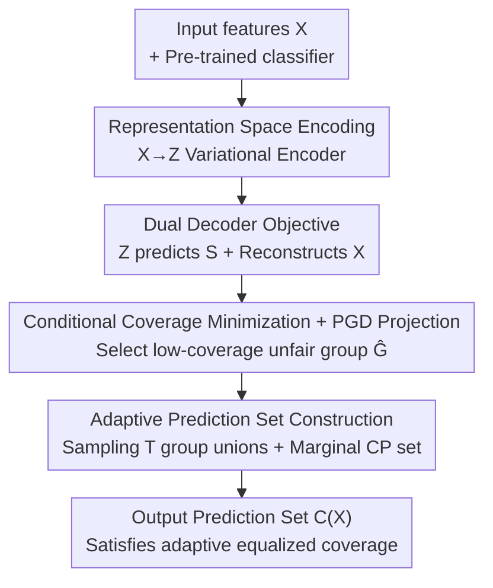

# Fair Conformal Classification via Learning Representation-Based Groups

**Conference**: ICLR2026  
**OpenReview**: [https://openreview.net/forum?id=aa91WoBZeg](https://openreview.net/forum?id=aa91WoBZeg)  
**Code**: https://github.com/Xusr1123/FaReG  
**Area**: AI Safety / Fairness / Conformal Prediction / Uncertainty Quantification  
**Keywords**: Conformal Prediction, Fairness, Equalized Coverage, Variational Information Bottleneck, Representation Learning

## TL;DR
FAREG shifts the task of "identifying subgroups discriminated against by algorithms" from the raw feature space to a latent representation space learned via Variational Information Bottleneck (VIB). This allows the model to capture unfair subgroups defined by non-linear combinations (such as XOR) and perform individual conformal calibration on these groups. It ensures adaptive equalized coverage while maintaining small, efficient prediction sets (complexity $O(N+M)$, significantly lower than AFCP's $O(N\log N+NM)$).

## Background & Motivation
**Background**: Conformal Prediction (CP) is a mainstream framework for providing "distribution-free, model-agnostic" coverage guarantees for any machine learning model. It outputs a prediction set $C(X)$ and ensures that the probability of the true label falling within the set is no lower than a user-defined $1-\alpha$ (e.g., 90%). Smaller sets are more informative, so CP simultaneously pursues coverage and efficiency (compact sets).

**Limitations of Prior Work**: By default, CP only provides **marginal coverage**, which holds on average across the entire population. However, algorithmic bias is often "local": error rates may systematically concentrate on certain subgroups defined by feature conditions (e.g., `Race=Black & Gender=Female`). Marginal coverage might fail significantly on these subgroups—appearing fine on average while performing poorly for marginalized groups. Addressing this is the goal of fairness.

**Key Challenge**: There is a tension between efficiency and fairness. CP seeks small sets, whereas achieving target coverage for every subgroup (equalized coverage) often requires larger sets. More critically, the number of "all possible subgroups" grows exponentially with the number of features, making enumeration statistically and computationally invisible. Previous work, such as the Partial method by Romano et al., can only use a **single feature** as a group condition (e.g., `Gender=Female`), lacking expressivity. AFCP advanced this by greedily selecting top-k sensitive features, but it **can only handle linear combinations of discrete features**, failing to capture non-linear unfair subgroups like "White Female OR Black Male" (XOR) and incurring high computational overhead due to its Naive Bayes foundation.

**Goal**: Design a group identification method that is expressive enough to characterize subgroups defined by non-linear combinations, computationally efficient, and capable of guaranteeing equalized coverage over these adaptively selected subgroups.

**Key Insight**: The authors observe that if linear/enumerative methods on raw features $X$ lack expressivity, one can **first encode $X$ into a high-level latent representation $Z=f(X)$ and then learn "which samples belong to low-coverage unfair groups" on $Z$**. Latent spaces naturally represent non-linear feature combinations, bringing XOR-type subgroups into scope, while interpretability can be recovered by reconstructing $X$ from $Z$.

**Core Idea**: Replace "enumerating subgroups in the raw feature space" with "learning unfair subgroups in a variational latent representation space" to simultaneously enhance expressivity and control complexity. Conformal calibration is then performed on the learned subgroups to realize equalized coverage guarantees.

## Method

### Overall Architecture
FAREG (Fair conformal prediction for REpresentation-based Groups) addresses the following: given a pre-trained classifier and a calibration set, automatically identify subgroups treated unfairly (low conditional coverage) and construct a prediction set that satisfies the target coverage for these groups while remaining compact. The pipeline consists of three stages: first, a variational encoder compresses input features $X$ into a latent representation $Z$; second, a binary membership variable $S$ (marking whether a sample belongs to an unfair group) is learned on $Z$, with a training objective to ensure $Z$ can both predict $S$ and reconstruct $X$; finally, the learned groups are repeatedly sampled for individual conformal calibration, and the union of these sets with the standard marginal prediction set is taken to obtain the final set with adaptive equalized coverage guarantees.

### Key Designs

**1. Representation-Based Grouping: Moving unfair subgroups from raw features to latent space**

This directly addresses the limitation where linear methods on raw features cannot capture XOR-style subgroups. FAREG no longer extracts groups from original $X$; instead, it learns a mapping $z=f(x)\in\mathcal{Z}$ to encode $x$ into a latent representation and defines group membership on $z$. Specifically, a binary random variable $S$ represents membership, characterized by the conditional distribution $P(S\mid Z)$—the probability that sample $x$ belongs to group $\hat{G}$ is $P(S=1\mid Z=f(x))$. Since $z$ is a high-level abstraction of feature combinations, a single latent dimension can encode non-linear interactions of multiple original features, allowing XOR subgroups like "White Female OR Black Male" to become areas linearly separable by a simple classifier on $Z$.

**2. Variational Information Bottleneck with Dual Decoders: Making $Z$ aware of groups while recovering features**

Simply moving to latent space is insufficient; $Z$ must carry information needed to identify unfair groups without becoming a memory of sample identity (to avoid overfitting) while also reconstructing $X$ for interpretability. The authors unify these objectives using Deep Variational Information Bottleneck (Deep VIB):

$$\max\ I(Z,S;\theta) + I(Z,X;\theta) - \beta I(Z,i;\theta)$$

The three terms are: mutual information between $Z$ and membership $S$ (should be large), mutual information between $Z$ and features $X$ (should be large), and mutual information between $Z$ and sample index $i$ (should be small to avoid leaking specific identities). This is implemented as an encoder-dual-decoder structure: the stochastic encoder $p_\theta(z\mid x)=\mathcal{N}(z\mid f_\mu(x),f_\sigma(x))$ outputs mean and variance; decoder $\varphi$ uses MSE to reconstruct $X$; decoder $\phi$ is a logistic regression $q_\phi(s\mid \tilde z)=\sigma(f_m(\tilde z))$ to predict membership $S$. The final loss is:

$$\mathcal{L} = \mathcal{L}_{CC} + \mathcal{L}_{MSE} - \beta \mathcal{L}_{KL},$$

where the KL term compresses $Z$ toward a standard normal distribution $r(z)=\mathcal{N}(0,1)$, discarding useless information including individual identities.

**3. Conditional Coverage Minimization with Minimum Group Constraint: Using PGD to ensure "large enough to be reliable"**

The membership decoder $\phi$ is trained to identify unfair groups by **minimizing the empirical conditional coverage on the selected group**, as unfair groups are those with the lowest coverage:

$$\min_{\phi}\ \mathbb{E}_{S\sim B}\big[P_n[Y\in C(X)\mid X\in\hat{G}_S]\big]\quad \text{s.t.}\quad \frac{1}{N}\sum_{i=1}^N q_\phi(S_i=1\mid \tilde z)\ge \delta.$$

Here $B=\prod_i \mathrm{Bernoulli}(q_\phi(S_i=1\mid\tilde z))$ is the joint Bernoulli distribution of group membership, and $\delta$ is the lower bound proportion of the group size relative to the dataset. The constraint is vital: Proposition 1 shows that the deviation between empirical coverage $P_n$ and true coverage $P$ is $\propto \sqrt{(R\log N+\tau)/(\delta N)}$, indicating that for reliable estimates, the group must be **sufficiently large** (hence $\ge\delta$). To solve this constrained optimization, Project Gradient Descent (PGD) is used: if the group size constraint is violated after a gradient step, $q_\phi$ is projected back to the feasible region via an $\ell_2$ minimization problem with a closed-form solution.

**4. Adaptive Prediction Set Construction: Achieving equalized coverage via sampled unions**

To turn identified unfair groups into effective prediction sets, FAREG first constructs a standard marginal prediction set $C_m(X_{N+1},D)$. It then samples $T$ groups $\hat{G}_{s_t}$ from the learned Bernoulli distribution $B$, constructs a prediction set $C_m(X_{N+1},\hat{G}_{s_t})$ **using each sampled group as its own calibration set**, and takes the union:

$$C(X_{N+1}) = C_m(X_{N+1},D)\ \cup\ \bigcup_{t=1}^{T} C_m(X_{N+1},\hat{G}_{s_t}).$$

The union ensures that any sample covered by a sampled group receives the calibration protection for that group. Theorem 1 proves that under the exchangeability assumption, this union prediction set satisfies adaptive equalized coverage for the set of selected groups $\{\hat{G}_{s_t}\}$, **even when the groups are defined by non-linear feature combinations**. The pipeline complexity is $O(N+M)$, whereas AFCP is $O(N\log N+NM)$.

### Loss & Training
The total loss is: $\mathcal{L}=\mathcal{L}_{CC}+\mathcal{L}_{MSE}-\beta\mathcal{L}_{KL}$, corresponding to conditional coverage minimization, reconstruction MSE, and KL compression. During training, reparameterization sampling $\tilde z\sim f(x,\epsilon)$ is used for each batch. If group size constraints are violated, the projection formula is applied. The parameter $\delta$ is set to 0.5 by default for WSC$^+$ evaluation.

## Key Experimental Results

### Main Results
On synthetic data (6-class labels, 4 sensitive + 6 non-sensitive features, unfair subgroup defined by `Color ⊙ Gender` (XNOR)) and real-world Nursery data (12,960 records), FAREG is compared against Marginal CP, Partial (single feature), and AFCP (AFCP1 with 1 sensitive feature / AFCP2 with a strong prior of 2 features):

| Method | Group Conditional Coverage (Target 0.9) | Prediction Set Size (Efficiency) | Time Complexity |
|------|------|------|------|
| Marginal | Failed (Subgroup under-coverage) | Small but unfair | $O(N+M)$ |
| Partial (Single Feature) | Failed (Insufficient expressivity) | Medium | — |
| AFCP1 | Failed (Linear, misses XOR) | Medium | $O(N\log N+NM)$ |
| AFCP2 (Prior of 2 features) | Only marginal >0.9 when N≥500 | **Significantly large** | $O(N\log N+NM)$ |
| **FAREG (Ours)** | **Only method ≥0.9 across all N** | **Small (near baseline)** | $O(N+M)$ |

Key Finding: On both synthetic and Nursery data, FAREG is the **only** method that consistently achieves effective coverage of 0.9 under both Group Coverage and non-linear WSC$^+_n$ metrics without causing the set size to explode. Training time is $O(N+M)$, making it much faster than AFCP.

### Ablation Study (WSC$^+$ Analysis)
The authors extend the traditional conditional coverage metric WSC (Worst-case Slab Coverage) to a non-linear version, WSC$^+$, replacing the linear mapping $v^TX$ with a quadratic function $\pi(x)=x^TWx+v^Tx$ to uncover low-coverage groups defined non-linearly.

| $\delta$ | 0.1 | 0.2 | 0.3 | 0.4 | 0.5 |
|------|------|------|------|------|------|
| WSC$_n$ | 0.616 | 0.748 | 0.793 | 0.822 | 0.842 |
| WSC$^+_n$ (Ours) | **0.582** | **0.674** | **0.750** | **0.800** | **0.829** |
| Gain | -5.52% | **-9.89%** | -5.42% | -2.68% | -1.54% |

The worst slab coverage found by WSC$^+$ is up to 9.89% lower than WSC$_n$, proving it discovers unfair groups that traditional linear metrics miss.

### Key Findings
- **Expressivity via Space Transformation**: As sample size increases, FAREG's frequency of selecting target features (especially the XOR pair) is significantly higher than benchmarks, confirming that latent representations make non-linear subgroups learnable.
- **Efficiency and Coverage can Coexist**: While AFCP2 can reach target coverage given enough samples, it does so at the cost of significantly larger prediction sets. FAREG achieves equalized coverage without sacrificing set size.
- **Interpretability via Reconstruction**: By applying small perturbations to latent representation $Z$, changes in reconstructed features $\hat X$ reflect which original sensitive features influence group membership.

## Highlights & Insights
- **The "Space Shift" is the Key**: Transforming the combinatorial explosion problem of "identifying subgroups on raw features" into "learning a simple classifier in a VIB latent space" provides both non-linear expressivity and reduced complexity.
- **Theory-Design Loop**: Proposition 1 translates "small VC dimension + large group size" directly into specific design choices (logistic regression $\phi$ + $\ge\delta$ constraint).
- **Reusable Evaluation Tool**: WSC$^+$ generalizes conditional coverage assessment from linear to quadratic slabs, providing a tool for any conformal method to evaluate non-linear fairness.

## Limitations & Future Work
- **Interpretability Trade-off**: Improving expressivity via latent space partially sacrifices transparency; latent groups are less intuitive than those defined by raw features. The authors use reconstruction as a mitigation, not a complete solution.
- **Prior Dependencies**: Comparisons against AFCP2 assume a strong prior (target group size), which is often unknown. FAREG's advantage in unknown scenarios is clear, but its performance on extremely high-order non-linearities remains for further study.
- **Coverage Guarantees**: Theorem 1 guarantees coverage for the **subset of sampled groups** $\{\hat G_{s_t}\}$; guarantees for un-sampled potential unfair groups are not explicitly provided.

## Related Work & Insights
- **vs Partial (Romano et al., 2020a)**: Partial introduced equalized coverage but was limited to pre-defined single features. FAREG adaptively identifies non-linear groups.
- **vs AFCP (Zhou & Sesia, 2024)**: AFCP handles discrete linear combinations with high complexity; FAREG handles non-linear subgroups with $O(N+M)$ complexity.
- **vs Label-Conditional Coverage**: Label-conditional methods partition groups by $Y$; FAREG partitions by latent features $X$, focusing on algorithmic bias stemming from feature distributions.

## Rating
- Novelty: ⭐⭐⭐⭐⭐ Transforming subgroup identification to VIB space and introducing non-linear WSC$^+$ is highly original.
- Experimental Thoroughness: ⭐⭐⭐⭐ Extensive comparison on synthetic and real data, though testing on more large-scale real datasets would be beneficial.
- Writing Quality: ⭐⭐⭐⭐ Clear motivation-theory-design loop with complete derivations.
- Value: ⭐⭐⭐⭐ Provides a practical path for expressive and efficient fair conformal prediction.

## Related Papers

- [\[ICLR 2026\] Fair Classification by Direct Intervention on Operating Characteristics](fair_classification_by_direct_intervention_on_operating_characteristics.md)
- [\[AAAI 2026\] Generalizing Fair Clustering to Multiple Groups: Algorithms and Applications](../../AAAI2026/ai_safety/generalizing_fair_clustering_to_multiple_groups_algorithms_and_applications.md)
- [\[ICLR 2026\] Rethinking Pareto Frontier: On the Optimal Trade-offs in Fair Classification](rethinking_pareto_frontier_on_the_optimal_trade-offs_in_fair_classification.md)
- [\[ICLR 2026\] Toward Enhancing Representation Learning in Federated Multi-Task Settings](toward_enhancing_representation_learning_in_federated_multi-task_settings.md)
- [\[ICML 2026\] Demystifying the Optimal Fair Classifier in Multi-Class Classification](../../ICML2026/ai_safety/demystifying_the_optimal_fair_classifier_in_multi-class_classification.md)

<!-- RELATED:END -->

<!-- RELATED:START -->

## Related Papers

- [\[ICLR 2026\] Fair Classification by Direct Intervention on Operating Characteristics](fair_classification_by_direct_intervention_on_operating_characteristics.md)
- [\[AAAI 2026\] Generalizing Fair Clustering to Multiple Groups: Algorithms and Applications](../../AAAI2026/ai_safety/generalizing_fair_clustering_to_multiple_groups_algorithms_and_applications.md)
- [\[ICLR 2026\] Rethinking Pareto Frontier: On the Optimal Trade-offs in Fair Classification](rethinking_pareto_frontier_on_the_optimal_trade-offs_in_fair_classification.md)
- [\[ICML 2026\] COFT: Counterfactual-Conformal Decoding for Fair Chain-of-Thought Reasoning in Large Language Models](../../ICML2026/ai_safety/coft_counterfactual-conformal_decoding_for_fair_chain-of-thought_reasoning_in_la.md)
- [\[ICLR 2026\] Toward Enhancing Representation Learning in Federated Multi-Task Settings](toward_enhancing_representation_learning_in_federated_multi-task_settings.md)

<!-- RELATED:END -->
