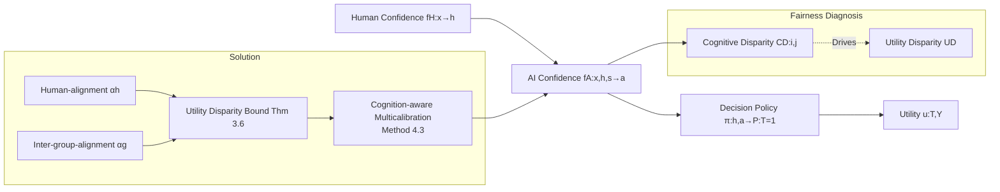

# Fair Decision Utility in Human-AI Collaboration: Interpretable Confidence Adjustment for Humans with Cognitive Disparities

**Conference**: ICLR 2026  
**OpenReview**: [https://openreview.net/forum?id=hqq6GyYISN](https://openreview.net/forum?id=hqq6GyYISN)  
**Code**: [AI-Ethics-Safety-PaperCode/Fair_HAI](https://github.com/WEILaboratory/AI-Ethics-Safety-PaperCode/tree/main/Fair%20HAI%20(ICLR2026))  
**Area**: AI Safety / Fairness in Human-AI Collaboration  
**Keywords**: Human-AI collaborative decision-making, AI confidence calibration, utility fairness, multicalibration, cognitive heterogeneity  

## TL;DR
Targeting scenarios where "experts and novices share the same AI-assisted decision-making system," this paper demonstrates that existing calibration and human-alignment methods fail to guarantee fair decision utility across populations with different cognitive abilities. It proposes a new objective, **inter-group-alignment**, and utilizes **cognition-aware multicalibration** to simultaneously achieve high utility and utility fairness.

## Background & Motivation
**Background**: In AI-assisted decision-making (e.g., medical diagnosis, credit risk control, judicial sentencing), the AI provides a confidence score $0–1$. Human decision-makers combine their own confidence $h$ with the AI's confidence $a$ to reach a final decision. Early work advocated for "perfectly calibrated" AI confidence (consistent with true label likelihood), while Corvelo Benz & Rodriguez (2023) later proved that "human-alignment" (aligning AI confidence with human judgment) is necessary to ensure optimal utility under monotonic decision strategies.

**Limitations of Prior Work**: Existing studies treat human decision-makers as a homogeneous group. However, in reality, human **cognitive abilities are heterogeneous** due to historical and social backgrounds—an expert's diagnosis is significantly more likely to be correct than a novice's, even when both report a confidence of $h=0.9$. This implies that identical AI confidence levels yield unequal real-world utility across different groups.

**Key Challenge**: This paper theoretically proves (Theorem 3.2 / 3.4) that **even if AI confidence is perfectly calibrated or perfectly human-aligned, utility disparity remains non-zero as long as the inter-group cognitive disparity $\text{CD}(i,j)\neq 0$**. Mathematically, mainstream calibration objectives cannot eliminate utility unfairness between groups.

**Consequences of the Key Challenge**: Such unfairness erodes the trust of disadvantaged groups (e.g., less experienced doctors) in AI and exacerbates the "Matthew Effect," further marginalizing groups that are already at an informational disadvantage.

**Goal**: Mitigate the AI-assisted decision utility unfairness caused by the heterogeneous cognitive abilities of human decision-makers without sacrificing overall utility.

**Core Idea (Inter-group-alignment)**: Beyond "human-alignment," a new alignment objective is introduced: given the same $h$ and $a$, the true distribution of positive labels $P(Y=1)$ should be statistically equal across different groups. This is implemented via a cognition-aware multicalibration algorithm that unifies both objectives.

## Method

### Overall Architecture
The paper formalizes the problem as a fairness issue driven by "cognitive disparity $\to$ utility disparity," derives a provable upper bound for utility disparity, and designs a "cognition-aware multicalibration" algorithm to minimize this bound. These three steps are closely linked: define metrics, derive bounds, and design algorithms to approach the zero-point of the bounds.

### Key Designs

**1. Cognitive Disparity and Utility Disparity: Quantifying "Unfairness."** The first step defines two metrics to transform abstract cognitive differences into optimizable statistics. Cognitive Disparity is defined as the difference in the true positive label probability between groups for the same human confidence $h$: $\text{CD}(i,j)=P(Y=1\mid z\in Z_{h,s_i})-P(Y=1\mid z\in Z_{h,s_j})$. If $\text{CD}\neq 0$ for any pair of groups, the population is cognitively heterogeneous. Based on this, Utility Disparity ($\text{UD}$) is defined to measure the difference in expected utility between two groups given the same $a, h$ and identical final decision probabilities $P(T=1)$. The fairness goal is to let $\text{UD}\to 0$. Theoretical results (Theorem 3.2/3.4) then prove that relying solely on calibration or human-alignment results in a non-zero $\text{UD}$ whenever $\text{CD}\neq 0$.

**2. Inter-group-alignment: Filling the Missing Dimension.** Since the root cause of failure is the differing true label distributions across groups for the same $h$, the method directly intervenes in this distribution. $\alpha_g$-inter-group-alignment requires that there exists a subset $Z'_h$ covering at least $(1-\alpha_g/2)$ of samples such that, given AI confidence $a$, the difference in positive label probability between groups is bounded: $\big|P(Y=1\mid f_A(z)=a, z\in Z'_{h,1})-P(Y=1\mid f_A(z)=a, z\in Z'_{h,0})\big|\le \alpha_g$. As $\alpha_g\to 0$, the statistical utility of making correct decisions converges across groups for the same $(h,a)$. It complements human-alignment: human-alignment governs "overall optimal utility," while inter-group-alignment governs "inter-group fair utility."

**3. Utility Disparity Upper Bound: An Interpretable Fairness Knob.** The theoretical core (Theorem 3.6) provides a tight upper bound anchoring utility disparity to both alignment levels:
$$\text{UD}\le \big(u(1,1)-u(0,1)-u(1,0)+u(0,0)\big)\cdot\Big[\tfrac{\alpha_h}{2}+\big(1-\tfrac{\alpha_h}{2}\big)\cdot(3\alpha_g-\alpha_g^2)\Big].$$
Since $3\alpha_g-\alpha_g^2\ge 0$, the bound is minimized at $\alpha_g=0$ (perfect inter-group-alignment). Furthermore, if $f_A$ achieves both perfect human-alignment and perfect inter-group-alignment, a monotonic strategy exists that achieves both optimal overall utility and fair utility (Corollary 4.2). This bound is **interpretable**—it informs practitioners that to achieve fairness, both the $\alpha_h$ and $\alpha_g$ knobs must be minimized.

**4. Cognition-aware Multicalibration: Achieving Dual Goals with One Algorithm.** Human decision-makers are divided into $N$ groups based on cognitive-related sensitive attributes. For each group $s_i$, a family of subsets $C_i=\{Z_{h,s_i}\}_{h\in H}$ is constructed. $f_A$ is required to satisfy $\alpha$-calibration across all these subsets (Method 4.3). Theorem 4.5 proves that if $f_A$ satisfies $\alpha/2$-cognition-aware multicalibration, it **simultaneously** satisfies $\alpha$-human-alignment and $\alpha$-inter-group-alignment. Implementation uses $\lambda$-discretization to partition $[0,1]$ into bins and iteratively corrects confidence scores within each bin (Algorithm 1: intra-group calibration followed by inter-group mean alignment).

## Key Experimental Results

### Settings
- **Data**: Public human-AI interaction datasets from Vodrahalli et al. (2022a), covering 4 tasks: Art (painting era), Cities (city identification), Sarcasm (Reddit sarcasm), and Census (income $\ge$\$50k). Groups are divided by education: $S{=}0$ (Master's and above), $S{=}1$ (Below Master's). Total 14,999 records from 469 participants.
- **Baselines**: ① No Adjust (original confidence); ② Cognition-unaware Multicalibration (Method 4.4, ignores cognitive differences). The proposed method is Cognition-aware Multicalibration (Method 4.3).
- **Hyperparameters**: $e_\alpha=0.0001, \lambda=0.125$; decision policy $\pi(h,a)$ learned via a single-hidden-layer 20-node ReLU MLP.
- **Metrics**: Accuracy for utility; Accuracy difference ($\text{Disp}$) for fairness; EAE/MAE and EIAE/MIAE for alignment errors (lower is better).

### Main Results: Alignment Quantization (Table 1, EIAE/MIAE, lower is better)

| Task | No Adjust EIAE | Method 4.4 EIAE | Method 4.3 EIAE | No Adjust MIAE | Method 4.3 MIAE |
|------|----------------|-----------------|-----------------|----------------|-----------------|
| 1 Art | 0.0525 | 0.0345 | **0.0209** | 0.4286 | **0.1360** |
| 2 Cities | 0.1094 | 0.0145 | **0.0031** | 0.4085 | **0.1132** |
| 3 Sarcasm | 0.1180 | 0.0784 | **0.0063** | 0.5702 | **0.0458** |
| 4 Census | 0.0794 | 0.0328 | **0.0072** | 0.3601 | **0.1062** |

Cognition-aware multicalibration achieves the best EIAE/MIAE across all 4 tasks, significantly reducing inter-group alignment errors while maintaining competitive human-alignment errors (EAE/MAE).

### T-test for Significance (Table 2, 100 iterations)

| Task | Utility t | Utility p | Utility Disp t | Utility Disp p |
|------|-----------|-----------|----------------|----------------|
| 1 | 3.018 | 0.003 | 9.486 | 0.000 |
| 2 | 0.345 | 0.731 | 15.484 | 0.000 |
| 3 | -12.187 | 0.000 | 3.186 | 0.002 |
| 4 | 4.839 | 0.000 | 27.556 | 0.000 |

### Ablation Study & Key Findings
- **Cognition-unaware calibration is insufficient**: In Task 1, the utility disparity of Method 4.4 actually exceeds the No Adjust baseline, showing that calibration ignoring cognitive differences fails to improve fairness.
- **Utility is not sacrificed**: Both calibration methods improve decision utility over the No Adjust baseline across all tasks, with comparable T-test performances (fairness is achieved without degrading overall utility).
- **Significant fairness improvement**: Cognition-aware multicalibration achieves the lowest utility disparity across all tasks, significantly narrowing the inter-group gap compared to both baselines.

## Highlights & Insights
- **First-of-its-kind Identification**: Recognizes and characterizes "human cognitive heterogeneity" as a previously overlooked source of utility unfairness in human-AI collaboration.
- **Impactful Impossibility Results**: Uses Theorems 3.2 and 3.4 to prove that mainstream calibration and human-alignment objectives are mathematically destined to be unfair under cognitive heterogeneity.
- **Interpretable Fairness Knobs**: Theorem 3.6 explicitly expresses utility disparity as a function of $\alpha_h$ and $\alpha_g$, providing clear operational guidance.
- **Theoretical-Algorithmic Synergy**: Theorem 4.5 bridges the theoretical upper bound and the practical algorithm by showing that one multicalibration condition satisfies both alignment objectives.

## Limitations & Future Work
- **Focus on Binary Classification**: Theory and main experiments focus on binary decisions and binary sensitive attributes. Multi-class and multi-group extensions are in the appendix but are not the core focus.
- **Reliance on Monotonic Decision Strategy Assumption** (Assumption 2.1): Assumes humans are rational and monotonic. While robustness to violations is discussed in the appendix, irrational behavior could weaken the guarantees.
- **Data Scale and Ecological Validity**: Based on a single public dataset with 469 people. Cognitive grouping in high-stakes scenarios (clinical, judicial) is more complex, and generalizability remains to be verified.
- **Availability of Sensitive Attributes**: The method requires explicit grouping by cognitive-related attributes. Handling missing, continuous, or intersecting attributes needs further exploration.

## Related Work & Insights
- **Confidence Objectives in AI-assisted Decision-making**: Evolves from calibration (Pakdaman Naeini 2015) to utility-optimized uncalibrated suggestions (Vodrahalli 2022b) and then to human-alignment for optimal utility (Corvelo Benz & Rodriguez 2023). This paper adds the "inter-group fairness" dimension.
- **Multicalibration**: Adopts the $\alpha_y$-calibration and $\lambda$-discretization from Hebert-Johnson et al. (2018), repurposing them to achieve simultaneous human and inter-group alignment.
- **Insight**: Moving "fairness" from the outcome layer (accuracy disparity) to the "confidence alignment objective" layer is a valuable approach for other human-AI collaboration scenarios, such as content moderation or assisted writing.

## Rating
- **Novelty**: ⭐⭐⭐⭐⭐ First to identify and formalize utility unfairness due to cognitive heterogeneity; introduces new "inter-group-alignment" objectives and impossibility results.
- **Experimental Thoroughness**: ⭐⭐⭐⭐ 4 real tasks, 100 repetitions, T-tests, and multi-group/multi-class verification; solid, though datasets are limited.
- **Writing Quality**: ⭐⭐⭐⭐ Logical theoretical progression; formula-heavy but theorems are well-connected.
- **Value**: ⭐⭐⭐⭐⭐ Addresses the "Matthew Effect" in high-stakes human-AI collaboration with an interpretable, practical, and utility-preserving fairness solution.

<!-- RELATED:START -->

## Related Papers

- [\[ICLR 2026\] Fair Reinforcement Learning for Just AI](fair_reinforcement_learning_for_just_ai.md)
- [\[ICLR 2026\] PluriHarms: Benchmarking the Full Spectrum of Human Judgments on AI Harm](pluriharms_benchmarking_the_full_spectrum_of_human_judgments_on_ai_harm.md)
- [\[ICLR 2026\] Uncertainty Estimation via Hyperspherical Confidence Mapping](uncertainty_estimation_via_hyperspherical_confidence_mapping.md)
- [\[ICLR 2026\] Generative Adversarial Post-Training Mitigates Reward Hacking in Live Human-AI Music Interaction](generative_adversarial_post-training_mitigates_reward_hacking_in_live_human-ai_m.md)
- [\[ICML 2026\] Position: Embodied AI Requires a Privacy-Utility Trade-off](../../ICML2026/ai_safety/position_embodied_ai_requires_a_privacy-utility_trade-off.md)

<!-- RELATED:END -->
