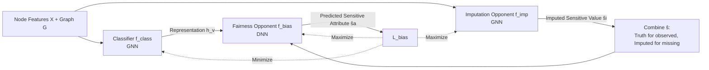

# Fair Graph Machine Learning under Adversarial Missingness Processes

**Conference**: ICLR 2026  
**OpenReview**: [https://openreview.net/forum?id=WgZJCnb8lJ](https://openreview.net/forum?id=WgZJCnb8lJ)  
**Code**: [https://github.com/DebolinaHalder/BFtS](https://github.com/DebolinaHalder/BFtS)  
**Area**: Graph Fairness / AI Security / Missing Data  
**Keywords**: Graph Neural Networks, Group Fairness, Missing Sensitive Attributes, Adversarial Missingness, Three-player Adversarial Learning, Worst-case Imputation

## TL;DR
This paper reveals an overlooked attack surface—**adversarial sensitive attribute missingness processes**—which can deceive fair GNNs by making imputation models "look fair." It proposes BFtS: a framework that uses a three-player adversarial game to impute missing sensitive values based on "worst-case fairness."

## Background & Motivation
**Background**: Graph Neural Networks (GNNs) are widely used in high-risk decision-making such as credit scoring and bail, which disproportionately affect specific groups. Consequently, fair GNNs have become a research hotspot. Existing fairness methods (FairGNN, FairVGNN, FairSIN, NIFTY, etc.) almost all assume that sensitive attributes (gender, race) are either **fully observable** or **Missing Completely At Random (MCAR)**.

**Limitations of Prior Work**: In reality, sensitive attributes are often the most likely to be missing—patterns in censuses or health surveys are frequently strongly correlated with gender, age, and race, a problem also found in disease transmission networks. Fairness methods are thus forced to perform missing value imputation first, but imputation errors contaminate downstream fairness evaluations.

**Key Challenge**: This paper points out a counter-intuitive and dangerous phenomenon—**adversarial missingness processes can make imputed datasets "look fairer than the ground truth."** The paper uses a credit example: ∆DP=0.25 when looking at observed values, while conventional imputation (assigning the majority neighbor's gender to missing nodes) yields a "best-case" of ∆DP=0.09. However, the true worst-case is ∆DP=0.47. If an attacker induces an imputation model to output the former while the ground truth is the latter, a "fair" model trained on imputed data remains biased relative to the complete data. This implies existing fairness guarantees may be **misleading**.

**Goal**: Design a framework for imputation and fair classification that is robust to adversarial missingness, ensuring fairness is evaluated and optimized under **worst-case imputation** to avoid deception by "disguised fairness."

**Key Insight**: **Better Fair than Sorry (BFtS)**—rather than believing an imputed value is the ground truth, it is better to let the imputation approach a situation "most unfavorable to fairness" and then let the classifier minimize this maximum bias (minimize the maximum bias).

## Method

### Overall Architecture
BFtS models "adversarial missingness" as a three-player adversarial game: a fair classifier $f_{class}$ against two collaborating opponents—a sensitive attribute predictor $f_{bias}$ and a missing value imputer $f_{imp}$. The classifier minimizes the maximum bias under the worst-case imputation, while the two opponents join forces to push the situation toward where "fairness is hardest to achieve." The objective is founded on Distributionally Robust Optimization (DRO): since the true distribution of sensitive values under adversarial missingness cannot be accurately estimated, the worst case is taken over all possible distributions in an uncertainty set $U$, $\theta^*_{class}=\arg\min_{\theta_{class}}\mathcal{L}_{class}+\alpha\max_{u\in U}\mathbb{E}_{s\sim u}[\mathcal{L}_{bias}]$.

### Key Designs

**1. Characterizing "Adversarial Missingness" with a threat model and proving the attack is NP-hard:** The paper first formalizes the attacker. An ideal attacker would solve a tri-level optimization (AMAFC): selecting a set of observed nodes $V_S$ such that the imputer and subsequent fair classifier trained on it exhibit maximum bias on the complete data—this is clearly infeasible. Thus, AMADB is defined as a fallback: select $V_S$ such that the "bias calculated based on imputed values and labels" is minimized, thereby misleading any classifier relying on that imputation. The paper proves **AMADB is still NP-hard** (reduced from the Set Cover problem). This "negative result" is actually a positive signal: even the attacker's simplified goal is difficult to optimize. More cleverly, the paper provides an efficient heuristic—the **degree bias assumption**: GNN imputations are less accurate for low-degree nodes ($\deg(u)>\deg(v)\Rightarrow p(s_v\neq\hat s_v)>p(s_u\neq\hat s_u)$), and low-degree nodes are easier to attack. Therefore, an attacker can effectively inject bias simply by **setting sensitive values of low-degree nodes to missing**. Experiments confirm this "degree" heuristic can cause imputation to underestimate true bias by as much as 433% on the NBA dataset.

**2. Three-player architecture and roles:** The three models perform distinct but interdependent functions. $f_{class}$ is a GNN classifier that does not use sensitive attributes directly but utilizes other related features; it pursues both accuracy and fairness, with fairness achieved by "making the opponent $f_{bias}$ unable to predict accurately." $f_{bias}$ is an adversarial network predicting sensitive attributes from the final layer representation $h_v$ of $f_{class}$—**if it can predict accurately, it indicates the representation of $f_{class}$ leaks sensitive information, i.e., it is unfair**. $f_{imp}$ is a GNN for imputing missing sensitive values, but it does not solely pursue imputation accuracy; it also acts as the second opponent: intentionally generating sensitive values that **maximize the accuracy of $f_{bias}$** (i.e., maximize bias). The three form a "classifier vs. two opponents" structure, pushing fairness to be tested under the worst possible conditions.

**3. Loss functions and the minimax objective for worst-case imputation:** Cross-entropy $\mathcal{L}_{class}$ is used for classification. LDAM (Label-Distribution-Aware Margin) loss $\mathcal{L}_{imp}$ is used for imputation to handle sensitive attribute class imbalance (margin $\Delta_j=C/n_j^{1/4}$, where minority classes receive larger margins). The bias loss is $\mathcal{L}_{bias}=\mathbb{E}_{h\sim p(h|\hat s=1)}[\log f_{bias}(h)]+\mathbb{E}_{h\sim p(h|\hat s=0)}[\log(1-f_{bias}(h))]$. Parameters are updated alternately: $\theta^*_{class}=\arg\min \mathcal{L}_{class}+\alpha \mathcal{L}_{bias}$, $\theta^*_{bias}=\arg\max \mathcal{L}_{bias}$, and $\theta^*_{imp}=\arg\min \mathcal{L}_{imp}-\beta \mathcal{L}_{bias}$, combined as $\min_{\theta_{class}}\max_{\theta_{imp},\theta_{bias}}\mathcal{L}_{bias}$. $\beta$ controls the trade-off between imputation "accuracy vs. worst-case."

**4. Operating with zero sensitive information + Convergence robustness guarantees:** When almost no sensitive information is available, BFtS lets $f_{imp}$ perform LDAM imputation directly from the training labels $y$ (replacing $V_S$ with $V_L$ and $s$ with $y$)—because worst-case fair models typically give better outcomes to the non-sensitive group and worse outcomes to the sensitive group, predicting minority class nodes as the sensitive group fits the worst-case assumption. Theoretically, the $f_{imp}$ learned by BFtS provides the worst-case imputation (Theorem 2), while $f_{class}$ achieves the minimum maximum ∆DP among all estimates (Theorem 3, minimax estimation). Corollary 1 further explains: inaccurate independent imputation causes the JS divergence between the two classes of representations in $f_{bias}$ to approach 0, leading $\mathcal{L}_{bias}$ to degenerate into a constant and causing non-convergence. BFtS, by optimizing the upper bound of the JS divergence, reduces the probability of vanishing divergence through three-player interaction, making adversarial training more stable.

## Key Experimental Results

### Main Results Table (Setting: Zero sensitive information, BFtS vs. RNF)
Values in percentages. Higher AVPR/F1 is better, lower ∆DP/∆EQ is better.

| Dataset | RNF %AVPR | RNF %F1 | RNF %∆DP | RNF %∆EQ | BFtS %AVPR | BFtS %F1 | BFtS %∆DP | BFtS %∆EQ |
| :--- | :--- | :--- | :--- | :--- | :--- | :--- | :--- | :--- |
| BAIL | 81.0 | 85.3 | 11.65 | 8.51 | **83.1** | **86.2** | **8.01** | **4.12** |
| CREDIT | 80.4 | 75.9 | 8.01 | 7.25 | **82.1** | **76.8** | **5.97** | **4.96** |
| GERMAN | 73.2 | 74.4 | 9.42 | 8.92 | **74.1** | **74.7** | **6.42** | 7.68 |
| NBA | 70.1 | 70.2 | 6.47 | 5.89 | **72.9** | 69.8 | **5.19** | **3.59** |
| POKEC-Z| 73.1 | 71.2 | 6.18 | 6.29 | **73.4** | **73.2** | **5.10** | **3.20** |
| POKEC-N| 71.6 | 72.2 | 7.58 | 7.09 | **72.6** | 69.6 | **4.29** | **3.01** |

BFtS outperforms RNF across all fairness metrics (∆DP/∆EQ), while accuracy (AVPR) is generally comparable or superior.

### Ablation Study and Analysis

| Experiment | Setting | Key Finding |
| :--- | :--- | :--- |
| Missingness Comparison | degree / targeted / random heuristics | The degree heuristic best enables independent GCN imputation to underestimate true bias, by up to **433%** on NBA with only 20% observation |
| Synthetic Graph Assortativity Scan | Assortativity 0.17→0.77 | At low assortativity, baselines (FairGNN/Debias) fail to converge or learn labels due to JS divergence approaching 0; BFtS consistently maintains a better fairness-accuracy trade-off |
| Real-world Fairness-Accuracy Trade-off | 6 real datasets vs. 5 baselines | BFtS achieves lower bias with similar F1 across BAIL/NBA/GERMAN/POKEC-N/POKEC-Z |
| Appendix Ablations | LDAM loss, $V_S$ ratio, hyperparameter sensitivity, GNN backbones, scalability | Validates effectiveness of components and scalability to large-scale graphs |

### Key Findings
- Off-the-shelf imputation systematically **underestimates data bias** under adversarial missingness, leaving "fair" models actually biased.
- The degree bias attack only requires graph topology and not true labels/sensitive values, making the threat model practically feasible (dropping fields does not break digital signature integrity).
- BFtS rarely underestimates bias and works even with completely zero sensitive information, being the only method to compete with and outperform RNF.

## Highlights & Insights
- **The Problem is a Contribution**: It is the first to propose "adversarial sensitive attribute missingness" as an independent threat surface against fairness, distinct from data poisoning/node injection/edge perturbation, argued to be more realistic in systems with integrity protection (dropping fields vs. tampering with values).
- **Elegant Worst-case Fairness Implementation**: Using DRO motivation and a three-player minimax, "untrustworthy imputation" is transformed into "robustness against the worst-case imputation," supported by NP-hard complexity proofs and minimax fairness upper bound guarantees.
- **Convergence Insight**: Points out that inaccurate independent imputation leads to adversarial loss degeneration (JS divergence disappearance), whereas the three-player structure optimizes the divergence upper bound, making it more stable—providing a theoretical explanation for an engineering training instability problem.

## Limitations & Future Work
- Fairness metrics focus on group fairness (∆DP/∆EQOP); the authors acknowledge reaching for metrics more sensitive to prediction ranking (e.g., individual or ranking fairness).
- The degree bias heuristic, while effective, relies on the empirical assumption that "low-degree node imputation is less accurate," which requires more validation for extreme graph structures.
- The overhead and stability of three-player adversarial training itself (tuning $\alpha, \beta$) on larger scale graphs are left to the appendix, suggesting high practical deployment barriers.
- Primarily focused on binary sensitive attributes; while claim as generalizable to multi-class/continuous attributes, empirical evidence in the main text is lacking.

## Related Work & Insights
- **Graph Fairness**: Pre-processing (FairOT/FairDrop/FairSIN/EDITS), objective modification (Fairwalk/NIFTY/FairVGNN), and adversarial classes (CFC/FLIP/Debias)—but all assume fully observable sensitive attributes. BFtS fills the "missing + adversarial" gap.
- **Fairness under Missing Sensitive Attributes**: Hashimoto's worst-group distribution, Lahoti's adversarial reweighting, FairGNN (independent imputation), FairAC (no imputation), RNF (proxy generation via labels)—BFtS follows the same lineage as RNF (both handle complete missingness) but implements "minimizing maximum bias" more thoroughly through three players.
- **Adversarial Attacks on Fairness**: UnfairTrojan/TrojFair backdoors, NIFA node injection, FATE bi-level poisoning—this paper shifts toward a more subtle attack feasible under compliance constraints: "manipulating only the missingness."
- **Insight**: Any pipeline relying on "impute first, then evaluate fairness" should reconsider if the imputation is manipulated by adversarial missingness; "modeling worst-case scenarios" instead of "trusting point estimates" is a more robust paradigm for handling missing sensitive data.

## Rating
- **Novelty**: ⭐⭐⭐⭐⭐ Proposes a completely new threat surface of adversarial missingness, providing a complexity proof and minimax solution; both the problem and method are novel.
- **Experimental Thoroughness**: ⭐⭐⭐⭐ Covers 6 real + synthetic datasets, 5 strong baselines, various missingness heuristics, and ablations, though main text tables are somewhat simplified with some key results in the appendix.
- **Writing Quality**: ⭐⭐⭐⭐ Uses a credit toy example to clearly explain the core conflict; theory and intuition are well-linked, though three-player formulas are dense.
- **Value**: ⭐⭐⭐⭐⭐ Directly addresses the security risk where existing fairness guarantees may be misled by "disguised fairness," providing practical significance for trustworthy deployment of high-risk graph decisions.

<!-- RELATED:START -->

## Related Papers

- [\[ICLR 2026\] Machine Unlearning under Retain–Forget Entanglement](machine_unlearning_under_retainforget_entanglement.md)
- [\[ICLR 2026\] Private Rate-Constrained Optimization with Applications to Fair Learning](private_rate-constrained_optimization_with_applications_to_fair_learning.md)
- [\[ICLR 2026\] Fair Reinforcement Learning for Just AI](fair_reinforcement_learning_for_just_ai.md)
- [\[ICLR 2026\] Fairness via Independence: A General Regularization Framework for Machine Learning](fairness_via_independence_a_general_regularization_framework_for_machine_learnin.md)
- [\[ICLR 2026\] ReTrace: Reinforcement Learning-Guided Reconstruction Attacks on Machine Unlearning](retrace_reinforcement_learning-guided_reconstruction_attacks_on_machine_unlearni.md)

<!-- RELATED:END -->
