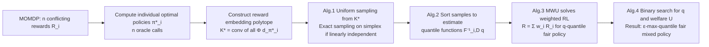

# Fair Reinforcement Learning for Just AI

**Conference**: ICLR 2026  
**OpenReview**: [https://openreview.net/forum?id=XNNDODynCl](https://openreview.net/forum?id=XNNDODynCl)  
**Code**: To be confirmed  
**Area**: AI Safety / Multi-objective Alignment / Fair Reinforcement Learning  
**Keywords**: quantile fairness, policy aggregation, oracle-efficient RL, pluralistic alignment, multiplicative weights  

## TL;DR
The authors transform "quantile fairness" from a tabular algorithm requiring complete MDP transition tables into an oracle-efficient algorithm that calls a standard policy optimization oracle (approximately $O(n)$ times). This allows "fair aggregation across multiple conflicting values" to scale to deep RL for the first time, achieving speeds several orders of magnitude faster than prior work.

## Background & Motivation
**Background**—Current state-of-the-art AI systems align with human values via RLHF. However, RLHF models human preferences as "noisy sampling around a single linear value ranking," essentially assuming the existence of a **single scalar reward**. This contradicts the reality of diverse, conflicting human values, prompting the community to shift toward *pluralistic alignment*: explicitly acknowledging the existence of multiple distinct reward/utility functions.

**Limitations of Prior Work**—Alamdari et al. (2024) introduced *policy aggregation*, mapping computational social choice theory onto RL through "quantile fairness": a policy is $q$-quantile fair if **each agent's return falls within the top $q$-quantile of their respective distributions**. However, their algorithm requires **explicit access to the full transition probability table** and involves solving a linear program (LP) scaled by the number of states $\times$ actions, which is entirely infeasible for deep RL.

**Key Challenge**—Theoretically elegant fairness guarantees are blocked by two issues during implementation: (1) Estimating quantiles requires **uniform sampling of policies** from the occupancy polytope $O$. This paper proves the existence of MOMDPs where non-trivial reward policies occupy an exponentially small volume, causing the sample complexity of uniform sampling to explode with the number of states; (2) Even if sampling were feasible, the LP size remains dependent on $|S|\cdot|A|$.

**Goal**—To answer: "Does a **provably oracle-efficient** fair RL algorithm exist?" That is, can one obtain a max-quantile fair policy through a polynomial number of calls to a "policy optimization oracle" without direct contact with the MDP structure?

**Core Idea**—**Change the sampling distribution + Change the solver**. Instead of defining fairness over the entire occupancy polytope, it is defined over $K^*$, the "convex hull spanned by the individual optimal policies of each agent." Furthermore, *multiplicative weights update* (MWU) replaces the LP, transforming the search for a fair policy into "repeatedly solving a series of weighted single-reward RL sub-problems."

## Method

### Overall Architecture
The problem is modeled as a Multi-Objective MDP (MOMDP) $(S,A,P,R_1,\dots,R_n,\rho_0,\gamma)$, where each agent has their own reward $R_i$ and return $J_i(\pi)=(1-\gamma)\mathbb{E}_\pi[\sum_t\gamma^tR_i(s_t,a_t)]$. The goal is to output a single (mixed) policy such that every agent's return simultaneously falls in a high quantile. A key observation is that $J_i(\pi)=\langle d_\pi,R_i\rangle$ is linear with respect to the occupancy measure $d_\pi$, and $d_\pi$ forms a convex occupancy polytope $O$. Thus, "fair aggregation among multiple policies" is geometricized as "selecting a point on a polytope according to the utility rankings of each agent." The pipeline consists of three steps: construct a "reward embedding polytope" $K^*$ using single-agent optimal policies as the reference distribution $D$; design an oracle-efficient sampler to estimate the quantile function $F_{i,D}^{-1}$ from $D$; and use MWU to solve for the policy that "satisfies quantile constraints + maximizes total welfare," using binary search for the maximum feasible quantile $q^*$. The entire process treats "policy optimization under weighted rewards" as a black-box oracle, making it directly compatible with high-dimensional deep RL.

### Key Designs

**1. Using Return Embeddings instead of Occupancy Measures—Moving fairness to $n$ dimensions.** The occupancy measure $d_\pi$ of a policy $\pi$ is massive ($S\times A$ dimensions), but agents only care about their respective returns. The authors define **return embeddings** $\Phi(d_\pi)=(J_1(\pi),\dots,J_n(\pi))$, compressing policies into an $n$-dimensional space ($n$ is the number of agents, usually much smaller than the state space). Since each return $J_i(\pi)=\langle d_\pi, R_i\rangle$ is a linear function of the occupancy measure, quantiles only depend on the relative ranking of returns and are invariant to positive affine transformations of rewards. This is why policy aggregation is superior to "weighted sum" methods: inferring rewards from behavior can only recover them up to a positive affine transformation, which this method naturally handles.

**2. Changing the Reference Distribution from $O$ to $K^*$—Bypassing exponential sampling complexity.** Quantile fairness requires a distribution $D$ to determine "what proportion of alternative policies are outperformed." Prior work used a uniform distribution over $O$ (the entire occupancy polytope), but Theorem 5.1 constructs an MOMDP where $q$-quantile fairness only yields non-trivial constraints when $q$ is exponentially close to 1, meaning uniform sampling requires an exponential number of samples. This paper uses a uniform distribution over $K^* = \mathrm{conv}\big(\{\Phi(d_{\pi_i^*})\}_{i\in[n]}\big)$, the **convex hull spanned by individual optimal policies** (Definition 5.3-5.4). Proposition 5.5 further ensures that $\Phi(d_{\pi_i^*})$ can be adjusted to be vertices of $K^*$. Theorem 5.6 proves that a $\tfrac{1}{e}$-quantile fair policy always exists on $K^*$, and each agent receives at least $\tfrac{1}{n}$ of their maximum return, providing a fair lower bound and non-trivial returns.

**3. Oracle-efficient Sampler—Degenerating to exact simplex sampling when linearly independent.** Calculating all $J_j(\pi_i^*)$ provides an $n$-dimensional explicit description of $K^*$ (requiring only $n$ oracle calls). When the embedding vectors $\Phi(d_{\pi_i^*})$ are **linearly independent**, $K^*$ is a simplex with $n$ vertices, allowing exact uniform sampling: draw $n$ independent $\mathrm{Exp}(1)$ variables $\alpha_j$, normalize to $\beta_j=\alpha_j/\sum_k\alpha_k$, and take the convex combination of vertices (Algorithm 1, Theorem 6.1, $O(n^2)$ time). In practical RLHF scenarios where rewards are noisy estimates, these vectors are linearly independent with high probability—meaning the fast path is almost always taken. Degenerate cases fall back to hit-and-run MCMC ($\tilde O(n^3)$ iterations). Algorithm 2 sorts samples to estimate $F_{i,D}^{-1}(q)$ with a sample complexity of only $O(q(1-q)/\epsilon^2)$.

**4. Using MWU Instead of LP—Solving only weighted single-reward RL.** With quantile estimates $v_i \approx F_{i,D}^{-1}(q)$, Algorithm 3 frames finding a "$q$-quantile fair policy with total welfare $\ge U$" as a multiplicative weights update problem from online convex optimization. It maintains weights $w_i$ and a welfare multiplier $u$, solving $\pi^t \in \arg\max_\pi \sum_i (w_i^t+u^t)J_i(\pi)$ per round—**this is exactly a standard single-reward RL problem** with reward $R = \sum_i (w_i^t+u^t)R_i$. Weights are updated via $w_i^{t+1} = w_i^t \exp(\eta(v_i-J_i(\pi^t)))$ to penalize agents who are below the threshold. After $T = \log(n+1)/\epsilon^2$ rounds, a uniform mixture policy is output. Theorem 6.3 guarantees the output is $(q-\epsilon)$-quantile fair with total welfare of at least $U-\epsilon$. Algorithm 4 performs binary search over $q$ and $U$ to find the max-quantile fair solution. The total number of oracle calls depends only on $n$ ($O(n)$ calls + $O(\log n)$ evaluations) and is **completely independent of $|S|$ and $|A|$**.

## Key Experimental Results

The environment follows the factory monitoring MDP from Alamdari et al. (2024) (MIT licensed, adapted from D'Amour et al. 2020): monitoring $m=5$ warehouses (one per step), with $n=10$ agents having different costs for accidents. Warehouses transition between normal/risky/incident states.

### Main Results

| Metric | Oracle-Efficient Max-Quantile (Ours) | Original Max-Quantile | Egalitarian | Utilitarian |
|---|---|---|---|---|
| Nash Welfare ↑ | **0.701 ± 0.015** | 0.654 ± 0.010 | 0.4655 ± 0.0581 | 0.5736 ± 0.0471 |
| Gini Coefficient ↓ | **0.087 ± 0.007** | 0.066 ± 0.003 | 0.2126 ± 0.0209 | 0.2020 ± 0.0182 |
| $q^*$ | 0.883 ± 0.055 | 0.999 ± 0.001 | N/A | N/A |

### Efficiency Comparison

| Method | Hardware / Configuration | Wall-clock Time |
|---|---|---|
| Ours (Oracle-Efficient) | Single Laptop (Intel Core Ultra 7 + 32 GB RAM) | ≈ **10 minutes** |
| Alamdari et al. (2024) | AMD EPYC 7502 (32 cores) + 258 GiB, 20 parallel threads | ≈ 2 hours |

### Key Findings
- **Both max-quantile methods significantly outperform utilitarian/egalitarian baselines** (higher Nash welfare, lower Gini), confirming that quantile fairness is more balanced than simply maximizing sums or minimizing the worst-case.
- **The pathology in Theorem 5.1 occurs in real environments**: even with $5\times 10^5$ policies sampled uniformly from $O$, the original method yielded $q^*=1-\epsilon\,(\epsilon=0.001)$—meaning almost all sampled policies had extremely low returns, making quantile estimates meaningless. Ours obtained a meaningful $q^*=0.883$ on $K^*$ (each agent in the top 12%), showing controllable sample complexity.
- Ranked return graphs show that except for the agent with the lowest return, **all agents receive higher returns under our method**, consistent with the intuition that $K^*$ prioritizes high-reward regions.

## Highlights & Insights
- **Changing the distribution is the soul of the paper**: Switching the reference distribution from the full occupancy polytope to the convex hull of optimal policies $K^*$ simultaneously solves the exponential volume problem and the oracle-efficient sampling problem while preserving positive affine invariance.
- **Translating social choice fairness into a pluggable RL subroutine**: Since each MWU round is a weighted single-reward policy optimization, any available RL algorithm (e.g., PPO) can be used to provide these fairness guarantees.
- **Linear Independence ⇒ Simplex Sampling** is a clever observation: it holds with high probability under noisy RLHF rewards, allowing most cases to use the $O(n^2)$ fast path instead of expensive MCMC.
- The work moves "pluralistic alignment" from a slogan to a **provable, computable algorithm** that can run on a laptop, offering direct value for multi-reward RLHF scenarios.

## Limitations & Future Work
- **Obtaining multiple true reward functions remains open**: Standard RLHF treats multiple preferences as noise for a single ground-truth reward; this paper assumes $n$ independent rewards $R_i$ exist, but how to learn them representatively is unresolved.
- **Small experimental scale**: Validated on a synthetic monitoring MDP ($5$ warehouses, $10$ agents); not yet demonstrated end-to-end on large-scale deep RL or real RLHF pipelines where each oracle call is expensive.
- **Degenerate case costs**: When embedding vectors are linearly correlated, it reverts to hit-and-run MCMC ($\tilde O(n^3)$ iterations, each solving an $n\times n$ LP). While independent of $|S||A|$, this remains a burden for large $n$.
- Lower bounds like $\tfrac{1}{e}$-quantile or $\tfrac{1}{n}$ return are worst-case guarantees and may still be far from "satisfying every agent." The $q^*$ in max-quantile is also bounded by the environment's structure.

## Related Work & Insights
- **Direct Predecessors**: Policy aggregation by Alamdari et al. (2024) (tabular, explicit MDP) and quantile fairness by Babichenko et al. (2024) (social choice theory). This work is their oracle-efficient extension.
- **RLHF and Social Choice**: Prior work found that Bradley-Terry-based RLHF implicitly uses Borda count for reward aggregation; von Neumann winner/maximal lotteries (Swamy et al. 2024; Wang et al. 2023) offer alternative aggregation paths.
- **Multi-Objective/Fair RL**: Methods like regularized maximin (Zhang & Shah, 2014) or Gini/Nash welfare (Ogryczak et al., 2013) merge multiple rewards numerically; this paper notes such methods **lose invariance to positive affine transformations**, whereas policy aggregation does not.
- **Alternative Fairness**: Jabbari et al. (2017) studied "learning process" fairness under a single reward (fairness of decision consequences), which is orthogonal to "final policy fairness" studied here.
- **Insight**: When a theoretical algorithm is blocked by "explicit access to environment structure," a common engineering path is to "find an oracle-efficient alternative distribution + use online learning/MWU to replace the constraint solver with repeated calls to an existing optimizer."

## Rating
- **Novelty**: ⭐⭐⭐⭐ — Transforming quantile fairness into an oracle-efficient form decoupled from $|S||A|$ is a strong insight.
- **Experimental Thoroughness**: ⭐⭐⭐ — Primarily theoretical; experiments are limited to a small synthetic MDP without evidence from real RLHF or large-scale deep RL.
- **Writing Quality**: ⭐⭐⭐⭐⭐ — Problem motivation, theorems, and algorithms proceed logically; the technical overview clearly explains how each hurdle was bypassed.
- **Value**: ⭐⭐⭐⭐ — Provides a provably fair algorithm for pluralistic AI alignment that can be plugged into any policy optimizer, significantly lowering implementation bars and increasing efficiency.

<!-- RELATED:START -->

## Related Papers

- [\[ICLR 2026\] Private Rate-Constrained Optimization with Applications to Fair Learning](private_rate-constrained_optimization_with_applications_to_fair_learning.md)
- [\[ICLR 2026\] ReTrace: Reinforcement Learning-Guided Reconstruction Attacks on Machine Unlearning](retrace_reinforcement_learning-guided_reconstruction_attacks_on_machine_unlearni.md)
- [\[ICLR 2026\] Beware Untrusted Simulators -- Reward-Free Backdoor Attacks in Reinforcement Learning](beware_untrusted_simulators_--_reward-free_backdoor_attacks_in_reinforcement_lea.md)
- [\[ICLR 2026\] Fair Decision Utility in Human-AI Collaboration: Interpretable Confidence Adjustment for Humans with Cognitive Disparities](fair_decision_utility_in_human-ai_collaboration_interpretable_confidence_adjustm.md)
- [\[ICLR 2026\] Fair Graph Machine Learning under Adversarial Missingness Processes](fair_graph_machine_learning_under_adversarial_missingness_processes.md)

<!-- RELATED:END -->
