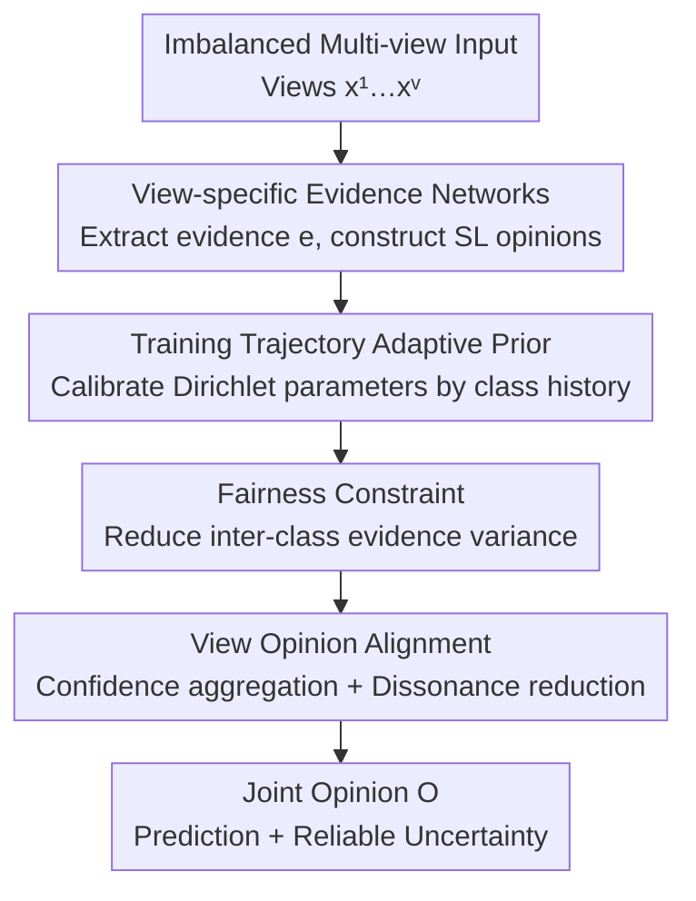

# Fairness-Aware Multi-view Evidential Learning with Adaptive Prior

**Conference**: ICLR 2026  
**OpenReview**: [https://openreview.net/forum?id=VaqTJ5srKa](https://openreview.net/forum?id=VaqTJ5srKa)  
**Code**: Uploaded as supplementary material (no public GitHub link provided in the paper)  
**Area**: Trustworthy Learning / Uncertainty Estimation / Multi-view Evidential Learning  
**Keywords**: Evidential Deep Learning, Multi-view Fusion, Class Imbalance, Fairness, Adaptive Prior

## TL;DR
Addressing the neglected issue in multi-view evidential learning where samples tend to allocate support evidence to majority classes—leading to unfair uncertainty estimation—this paper proposes FAML. By replacing the fixed uniform prior in evidential deep learning with a **training-trajectory-based adaptive prior**, and incorporating **fairness constraints** and **view opinion alignment**, FAML simultaneously improves classification accuracy (especially for tail classes) and uncertainty reliability across six real-world multi-view datasets.

## Background & Motivation
**Background**: Multi-view Evidential Learning (MVEL) is built upon Evidential Deep Learning (EDL) and Subjective Logic. Each view independently extracts "evidence" to parameterize a Dirichlet distribution, providing uncertainty estimation alongside classification predictions. Recent works mostly focus on "evidence-level fusion strategies" to achieve robustness, such as handling inter-view conflicts or downweighting low-quality views.

**Limitations of Prior Work**: Existing methods **assume that the evidence extracted by each view is inherently fair and reliable**, focusing only on the fusion stage. However, the authors' empirical analysis (on the imbalanced BRCA breast cancer dataset) reveals that this assumption holds no water. For minority classes (e.g., Her2), models often misallocate support evidence to majority classes (e.g., Normal in View 1, Basal in View 2), causing Her2 samples to be confidently misclassified. Conversely, correctly classified Her2 samples receive very little support evidence, leading the model to assign low confidence to correct predictions.

**Key Challenge**: The root cause is **quantity-induced bias**—the probability of assigning more evidence to a certain class is significantly higher for majority classes than for minority classes. This bias is also **view-specific**, meaning different views misallocate evidence of tail samples to different majority classes. This results in inherently unfair evidence distribution and unreliable uncertainty estimation. The authors term this new problem **Biased Evidential Multi-view Learning (BEML)**.

**Goal**: Eliminate evidence bias during the learning process to ensure that the expected evidence assigned to the ground-truth class is **class-invariant**, i.e., $\mathbb{E}_{(x,y=k)}[e^v_k(x)] = \mathbb{E}_{(x,y=k')}[e^v_{k'}(x)]$ for any classes $k, k'$, thereby achieving fair evidence allocation and reliable uncertainty.

**Key Insight**: Instead of focusing on "how to fuse evidence," the authors rewrite the entire evidence learning process from a **fair learning** perspective. A key observation is that the "uninformative uniform prior" in EDL (the constant 1 in $\alpha_k = e_k + 1$), often treated as negligible, actually dominates the posterior, especially for samples with sparse evidence. This prior can be refashioned into a tool that dynamically adjusts based on the performance of each class.

**Core Idea**: Replace the fixed uniform prior with a **training-trajectory-based adaptive prior**. The worse a class performs, the larger the adaptive prior becomes to provide more compensation; as training progresses, the prior gradually converges back to the fixed value used in standard EDL. Combined with fairness constraints and view opinion alignment, the "correction of evidence bias" is integrated into both the learning and fusion stages.

## Method

### Overall Architecture
FAML aims to solve the problem of "inputting imbalanced multi-view data and outputting fair, reliable predictions and uncertainty." The framework follows three steps: first, use view-specific evidence networks to extract evidence and construct subjective logic opinions; second, inject adaptive priors during Dirichlet parameter construction and use a fairness loss to constrain evidence variance, correcting bias within each view; finally, use confidence-based evidence aggregation and opinion alignment during the fusion stage to integrate multiple opinions into a consistent, mutually supportive joint opinion.

### Key Designs

**1. Training Trajectory Adaptive Prior: Transforming the "Negligible" Prior into a Regulator**

In standard EDL, the Dirichlet parameter is $\alpha_k = e_k + 1$, where the constant 1 represents a uniform prior indicating equal probability when no evidence is present. The authors argue this prior dominates for evidence-sparse samples, serving as a source of unfairness. FAML replaces it with a training trajectory prior for class $k$ at epoch $t$:

$$\beta_k = \eta \cdot N_k \Big/ \sum_{n: y_n=k} \kappa(y_n, f_\theta(x_n)), \quad \kappa(y_n, f_\theta(x_n)) = \begin{cases} 1, & y_n = f_\theta(x_n) \\ 0, & y_n \neq f_\theta(x_n) \end{cases}$$

Where $N_k$ is the number of samples in class $k$, $\eta$ is an upweight factor, and the denominator is the count of correctly classified samples for that class. Intuitively, **the fewer samples are correctly classified for a class (smaller denominator), the larger its $\beta_k$ becomes**—creating a "worse performance, more compensation" relationship. The Dirichlet concentration parameter becomes $\hat\alpha_k = e_k + \beta_k$. As training progresses and classes are learned better, $\beta_k$ converges toward a constant. Theorem 4.3 further proves that for minority classes with high imbalance ratios $\xi_k = N_{-k}/N_k \gg 1$, this adaptive prior raises the **evidence margin** ($\rho_n = e_{nk} - \max_{j\neq k} e_{nj}$), improving the generalization error bound by a factor of $\tilde{O}(1/\sqrt{\xi_k \Delta\beta_k})$.

**2. Fairness Constraint: Using Inter-class Evidence Variance as Explicit Regularization**

An adaptive prior alone provides implicit correction but cannot explicitly guarantee unbiased evidence allocation. The authors define a quantifiable metric, **Fairness Degree**, by taking the mean evidence $\bar{e}_k$ assigned to the ground-truth class for each class and calculating their variance:

$$f(\{\bar{e}_k\}_{k=1}^K) = \mathrm{Var}(\{\bar{e}_k\}) = \frac{1}{K}\sum_{k=1}^K (\bar{e}_k - \bar{e})^2$$

A low variance suggests fair treatment with similar support evidence across classes. This is used as the fairness loss $\mathcal{L}_{fc} = \mathrm{Var}(\{\bar{e}_k\})$. During training, its weight $\mu_t = \min(1.0, t/T)$ follows an annealing schedule, allowing the model to learn raw evidence early on and gradually enforcing fairness constraints. This significantly improves ECE (Calibration Error) by suppressing evidence variance.

**3. View Opinion Alignment: Eliminating View-Specific Bias via Second-Order Uncertainty**

Since bias is view-specific, fusion must also calibrate views against each other. FAML uses **confidence-based aggregation** instead of equal weighting, defining confidence as $c = 1 - u$ ($u$ is uncertainty). Aggregated evidence is $e_k = \frac{c_A}{c_A + c_B}e^A_k + \frac{c_B}{c_A + c_B}e^B_k$, trusting views with lower uncertainty. It also introduces **Dissonance Degree** to measure differences between views—not by first-order probability differences, but by the variance of their Dirichlet distributions $\mathrm{Var}(\alpha^v_k) = p^v_k(1-p^v_k)\frac{u^v}{K+u^v}$, which captures **second-order uncertainty**: $d(w^A,w^B) = \sum_k |\mathrm{Var}(\alpha^A_k) - \mathrm{Var}(\alpha^B_k)|$. Minimizing this as a consistency loss $\mathcal{L}_{con}$ forces views to agree not just on "which class" but on "how confident" the prediction is.

### Loss & Training
The supervision term uses Expected Cross Entropy (ACE) between ground-truth labels and Dirichlet means: $\mathcal{L}_{ace}(\hat\alpha_n) = \sum_k y_{nk}(\psi(S_n) - \psi(\hat\alpha_{nk}))$. Combined with class-balancing and fairness loss, the batch-level $\mathcal{L}_{acc} = \sum_n \frac{1}{N_{y_n}}\mathcal{L}_{ace}(\hat\alpha_n) + \mu_t \mathcal{L}_{fc}$. The total loss sums $\mathcal{L}_{acc}$ for the aggregated opinion and individual views plus the consistency loss: $\mathcal{L} = \mathcal{L}_{acc} + \sum_{v=1}^V \mathcal{L}^{(v)}_{acc} + \lambda \mathcal{L}_{con}$. A warm-up period for view-specific networks is used to ensure stability before introducing the adaptive prior.

## Key Experimental Results

### Main Results
Testing on six multi-view datasets (Handwritten, Animal, Scene15, YaleB, Caltech-101, BRCA), FAML was compared against single-view (TLC, I-EDL, R-EDL) and multi-view (TMC, ETMC, CCML, ECML) evidential methods. Results are reported for Head, Medium, and Tail class regions for ACC and ECE.

| Dataset | Metric | FAML | Second Best | Note |
|--------|------|------|------|------|
| Handwritten | ACC All / Tail | 94.2 / 92.5 | 90.2 / 83.1 (ETMC) | Significant lead in tail accuracy |
| Animal | ACC All | 76.3 | 68.9 (TLC/R-EDL) | ~7.4% improvement in All |
| Caltech-101 | ACC All / Tail | 83.6 / 67.8 | 75.9 / 57.5 | All +7.7%, Tail +10.3% |
| BRCA | ACC All / ECE All | 82.9 / 15.0 | 77.1 / 24.3 | Highest ACC, lowest ECE |

Uncertainty reliability (Failure Prediction task):

| Dataset | AUROC↑ FAML / Second Best | FPR-95↓ FAML / Second Best |
|--------|--------------------|----------------------|
| Handwritten | 85.7 / 81.9 | 64.3 / 66.5 |
| Animal | 82.1 / 79.4 | 75.3 / 74.4 |
| YaleB | 90.3 / 88.7 | 57.1 / 61.0 |
| BRCA | 82.9 / 77.1 | 75.6 / 83.7 |

FAML achieves higher AUROC and lower FPR-95 across nearly all datasets, with significantly lower ECE in all class regions. Evidence strength visualizations show that while comparative methods stack evidence in head classes and starve tail classes, FAML maintains a relatively uniform evidence distribution.

### Ablation Study
Incremental addition of components (AP = Adaptive Prior, $\mathcal{L}_{fc}$ = Fairness Loss, $\mathcal{L}_{con}$ = Consistency Loss) for BRCA and Handwritten (ACC↑ / ECE↓):

| AP | $\mathcal{L}_{fc}$ | $\mathcal{L}_{con}$ | BRCA ACC/ECE | Handwritten ACC/ECE |
|----|------|------|--------------|---------------------|
| – | – | – | 74.3 / 28.0 | 85.7 / 32.9 |
| ✓ | – | – | 77.5 / 21.5 | 86.3 / 27.7 |
| ✓ | ✓ | – | 81.1 / 16.2 | 87.3 / 25.2 |
| ✓ | ✓ | ✓ | **82.9 / 15.0** | **94.2 / 20.6** |

### Key Findings
- **Adaptive Prior is the fundamental contributor**: Adding only AP improved BRCA ACC from 74.3% to 77.5% and ECE from 28.0% to 21.5%, validating the effectiveness of trajectory-based compensation.
- **Fairness Loss targets calibration**: Adding $\mathcal{L}_{fc}$ over AP specifically improved ECE by suppressing evidence variance.
- **Consistency Loss depends on view count**: Gains from $\mathcal{L}_{con}$ vary; it is more effective when there are more views, as conflicts and dissonance are more likely to occur.
- **Warm-up and Hyperparameters**: Training without warm-up (0 epochs) yields worse results; 10–20 epochs are optimal. The upweight factor $\eta$ shows a peak and then decline (avoiding overconfidence), and the consistency weight $\lambda$ is stable in the $[1, 5]$ range.

## Highlights & Insights
- **Turning the "Irrelevant Prior" into a Tool**: By observing that the standard prior in EDL ($\alpha_k = e_k + 1$) disproportionately affects evidence-sparse samples, the authors cleverly transformed it into an adaptive regulator—an elegant leverage point.
- **Fairness Degree as both Diagnostic and Objective**: Using evidence variance as both a metric to diagnose bias and a loss term to optimize it creates a clean, closed-loop solution.
- **Alignment via Second-Order Uncertainty**: Measuring dissonance through Dirichlet variance rather than first-order probability differences allows the model to optimize whether views "agree on their confidence," a strategy transferable to other multimodal/multi-expert fusion scenarios.
- **Theoretical Grounding**: The margin theory providing a $\tilde{O}(1/\sqrt{\xi_k \Delta\beta_k})$ factor explains why tail classes benefit most, aligning empirical visualizations with theoretical proof.

## Limitations & Future Work
- The method is currently limited to **supervised multi-view classification**, relying on complete labels; future work could explore fairness in evidence learning without explicit labels (e.g., clustering-driven).
- The adaptive prior depends on "correct classification counts" along the training trajectory, which might be unstable with high label noise (despite warm-up), a scenario not deeply explored.
- Experimental datasets are mostly traditional feature views (Handwritten, Scene, Omics); validation on large-scale deep features or real-world multimodal (Image-Text) scenarios is needed to confirm scalability.
- Several hyperparameters ($\eta$, $\lambda$, warm-up, annealing steps $T$) are introduced, which may require some tuning across different datasets.

## Related Work & Insights
- **vs. Mainstream MVEL (TMC / ECML / CCML)**: These methods assume evidence is inherently fair and only optimize the fusion stage; FAML identifies that the extraction stage itself is biased and shifts the correction forward into the views.
- **vs. Imbalance/Fairness Methods (UMIX / GroupDRO)**: Unlike methods requiring re-sampling or pre-defined subgroup information, FAML is an endogenous framework that adapts priors solely based on training trajectories.
- **vs. EDL Variants (R-EDL / I-EDL)**: While these improve evidence collection, most still use fixed uniform priors; FAML is the first to introduce trajectory-driven adaptive priors for Dirichlet construction to address evidence bias.

## Rating
- Novelty: ⭐⭐⭐⭐⭐ First to formalize the BEML problem; adaptive prior is clever and theoretically supported.
- Experimental Thoroughness: ⭐⭐⭐⭐ Six datasets with multiple metrics; detailed regional class analysis; lacks large-scale multimodal scenarios.
- Writing Quality: ⭐⭐⭐⭐ Logic is clear, empirical motivation is strong, and visualizations support theories.
- Value: ⭐⭐⭐⭐⭐ High practical value for trustworthy uncertainty estimation in high-stakes scenarios like medical diagnosis and autonomous driving.

<!-- RELATED:START -->

## Related Papers

- [\[ICLR 2026\] Robust Adversarial Quantification via Conflict-Aware Evidential Deep Learning](robust_adversarial_quantification_via_conflict-aware_evidential_deep_learning.md)
- [\[ICLR 2026\] RESFL: An Uncertainty-Aware Framework for Responsible Federated Learning by Balancing Privacy, Fairness and Utility](resfl_an_uncertainty-aware_framework_for_responsible_federated_learning_by_balan.md)
- [\[ICLR 2026\] Bridging Fairness and Explainability: Can Input-Based Explanations Promote Fairness in Hate Speech Detection?](bridging_fairness_and_explainability_can_input-based_explanations_promote_fairne.md)
- [\[CVPR 2026\] When CLIP Sees More, It Fights Back Harder: Multi-View Guided Adaptive Counterattacks for Test-Time Adversarial Robustness](../../CVPR2026/ai_safety/when_clip_sees_more_it_fights_back_harder_multi-view_guided_adaptive_counteratta.md)
- [\[ICLR 2026\] Toward Enhancing Representation Learning in Federated Multi-Task Settings](toward_enhancing_representation_learning_in_federated_multi-task_settings.md)

<!-- RELATED:END -->
