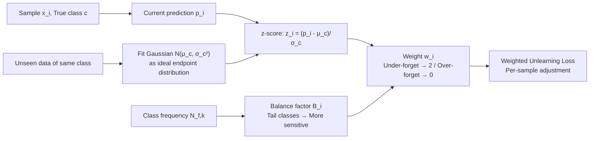

# FaLW: A Forgetting-aware Loss Reweighting for Long-tailed Unlearning

**Conference**: ICLR 2026  
**OpenReview**: [https://openreview.net/forum?id=kBnvzwO5pN](https://openreview.net/forum?id=kBnvzwO5pN)  
**Code**: Provided with paper supplementary materials  
**Area**: Machine Unlearning / Data Privacy / Long-tailed Learning / AI Safety  
**Keywords**: Machine Unlearning, Long-tailed Distribution, Loss Reweighting, Right to be Forgotten, Unlearning Deviation  

## TL;DR
This paper is the first to investigate the realistic scenario where the "forget set follows a long-tailed distribution." It identifies that existing approximate unlearning methods produce **heterogeneous unlearning deviation** and **skewed unlearning deviation**. The authors propose FaLW, a plug-and-play instance-level dynamic loss reweighting method that uses the "predictive probability distribution of unseen data" to measure the unlearning state of each sample and adaptively adjust the unlearning intensity.

## Background & Motivation
**Background**: Machine Unlearning aims to efficiently erase the influence of specific data from a trained model to fulfill the GDPR "Right to be Forgotten." While retraining from scratch is the gold standard, it is computationally prohibitive. Thus, approximate unlearning has become the mainstream, using specialized loss functions to guide the model in erasing specified data, with empirical metrics like Membership Inference Attacks (MIA) used for evaluation.

**Limitations of Prior Work**: Previous evaluations almost exclusively construct the forget set as a **randomly sampled** subset. The authors empirically observe (Figure 1a) that the class distribution of a 20% subset repeatedly sampled from CIFAR-100 is almost balanced—which is highly inconsistent with reality. Real-world unlearning requests are naturally long-tailed: when a user deletes an account, their data is shaped by personal interests and tends to concentrate in a few categories. **No prior work has investigated what happens when the forget set itself is long-tailed.**

**Key Challenge**: The authors introduce the concept of "Unlearning Deviation"—using the probability of the retrained model $\theta^*$ on the true class as the ideal target. Predictions of approximate models are categorized as under-forgetting (confidence remains too high), faithful unlearning, or over-forgetting (confidence is suppressed too low). On long-tailed forget sets, they observe two phenomena: **① Heterogeneous Unlearning Deviation**—models under-forget head class samples and over-forget tail class samples; **② Skewed Unlearning Deviation**—the magnitude of this deviation is disproportionately more severe for tail classes. Existing methods use a "holistic" design focused on aggregate effects, failing to handle these sample-wise and class-wise deviations.

**Goal**: Design an adaptive mechanism that adjusts unlearning intensity at a finer grain (sample/class level) to mitigate both heterogeneous and skewed deviations.

**Core Idea**: **Calibrate unlearning progress using the "unseen data distribution"**. For a sample to be forgotten, its ideal endpoint should match the predictive confidence of a "model that has never seen it," which can be approximated by the predictive probability distribution of unseen data of the same class. Based on this, a **forgetting-aware dynamic weight** is designed to adjust each sample's unlearning intensity in real-time, combined with a **balance factor** to make adjustments more aggressive for tail classes.

## Method

### Overall Architecture
FaLW is a plug-and-play instance-level loss reweighting module that can be integrated into general gradient-based approximate unlearning objectives. Instead of applying a uniform unlearning loss to the forget set, it multiplies each sample $(x_i,y_i)$ by a dynamic weight $w_i$:

$$\min_{\theta_u}\ \alpha\sum_{(x_i,y_i)\in D_f} w_i\cdot L((x_i,y_i);\theta_u) + \beta\cdot L(D_r;\theta_u) + \lambda\cdot R(\theta_u,\theta_o)$$

The process consists of three steps: first, **measure** how far each sample is from the "ideal unlearning endpoint" (using unseen data distribution as a reference); second, calculate a **forgetting-aware weight** to accelerate under-forgotten samples and halt over-forgotten ones; finally, apply a **balance factor** based on class frequency to amplify adjustment sensitivity for tail classes.

### Key Designs

**1. Approximating Unlearning Endpoints with Unseen Data: Making unlearning completeness measurable.** The essence of unlearning is restoring the model state from "seen" to "unseen." The ideal endpoint is the retrained model's confidence $p_{\theta^*}(c\mid x_i)$. Proposition 2 proves that a model retaining knowledge of a sample will have higher true-class confidence than a retrained model, i.e., $p_{\theta_o}(c\mid x_i)\ge p_{\theta^*}(c\mid x_i)$. This defines an ideal trajectory: confidence should decrease monotonically and stop upon reaching the target. Since $p_{\theta^*}$ for a single sample is unavailable, the authors relax the "deterministic target" to a "target distribution": a faithfully forgotten sample's confidence should be indistinguishable from that of **data never seen by the model** for that class. Using a held-out validation set, the predictive probabilities of unseen samples for each class $c$ are fitted to a Gaussian $p_\theta(c\mid x')\sim\mathcal N(\mu_c,\sigma_c^2)$, serving as the reference for "faithful unlearning." This can be estimated dynamically during unlearning, bypassing the need for retraining.

**2. Forgetting-aware Weight: Locking samples to the trajectory by accelerating or braking via z-score.** For sample $(x_i,y_i=c)$, the standard z-score $z_i=(p_i-\mu_c)/\sigma_c$ measures deviation from the target distribution. The weight is constructed as:

$$w_i = 1 + \operatorname{sign}(z_i)\cdot\big(\tanh(|z_i|)\big)^{1/\eta},\quad z_i=\frac{p_i-\mu_c}{\sigma_c}$$

Where $\tanh(\cdot)$ bounds the deviation within $(-1,1)$, $\operatorname{sign}(\cdot)$ determines the direction, and hyperparameter $\eta>0$ controls sensitivity. Intuition: If a sample is **over-forgotten**, $p_i$ is much lower than the mean, $z_i$ is a large negative value, and $w_i\to 1-1=0$, cutting off unlearning pressure. If a sample is **under-forgotten**, $p_i$ is a positive outlier, $z_i$ is a large positive value, $w_i\to 1+1=2$, doubling the unlearning intensity. This prevents both over- and under-forgetting without class-specific priors, directly addressing "heterogeneous unlearning deviation."

**3. Balance Factor: Adjusting sensitivity by class frequency.** While heterogeneous weights solve the direction, "skewed unlearning deviation" indicates that tail classes have larger deviations requiring more aggressive correction. The authors introduce a balance factor inversely proportional to class frequency:

$$B_i=\Big(\frac{N_f}{C\cdot N_{f,k}}\Big)^{\tau}$$

$N_f$ is the total forget set size, $N_{f,k}$ is the count for class $c$, $C$ is the number of classes, and $\tau\ge 0$ is a hyperparameter. Tail classes have smaller $N_{f,k}$ and larger $B_i$. This is substituted into the weight exponent:

$$w_i = 1 + \operatorname{sign}(z_i)\cdot\big(\tanh(|z_i|)\big)^{1/B_i}$$

A larger $B_i$ makes $w_i$ respond more steeply to $z_i$, meaning tail class deviations are corrected faster. Combined, FaLW mitigates both deviation types: heterogeneity via weight direction and skewness via balance factor sensitivity.

## Key Experimental Results

### Main Results
VGG-16 on CIFAR-10 (10% unlearning, $\gamma=1$) and Tiny-ImageNet (40% unlearning, $\gamma=1/2$). Metrics: FA / RA / TA / MIA and **Avg. Gap** relative to Retrain (lower is better):

| Method | CIFAR-10 Avg. Gap | CIFAR-10 std | Tiny-ImageNet Avg. Gap | Tiny-IN std |
|---|---|---|---|---|
| FT | 31.95 | 2.85 | 2.18 | 0.39 |
| RL | 3.69 | 0.94 | 4.13 | 0.99 |
| GA | 27.77 | 2.06 | 10.42 | 3.09 |
| IU | 38.18 | 0.18 | 19.61 | 0.50 |
| L1-sparse | 38.07 | 0.77 | 10.54 | 1.71 |
| SFRon | 3.68 | 0.76 | 2.93 | 1.02 |
| SalUn | 2.45 | 0.41 | 2.14 | 0.15 |
| **Ours (FaLW)** | **0.35** | 0.20 | **0.40** | 0.19 |

> FaLW's Avg. Gap is an order of magnitude smaller than the second-best SalUn (0.35 vs 2.45), and it is closest to Retrain across almost all individual metrics.

### Ablation Study
**Avg. Gap of FaLW vs SalUn under different imbalance levels (CIFAR-100, ResNet-18, 30% unlearning, $\gamma$ from 0 to 2)**:

| $\gamma$ | 0 | 1/4 | 1/3 | 1/2 | 1 | 3/2 | 2 |
|---|---|---|---|---|---|---|---|
| SalUn | 1.55 | 1.54 | 1.54 | 1.19 | 2.04 | 1.22 | 2.29 |
| **Ours (FaLW)** | **0.68** | **0.91** | **0.86** | **0.93** | **0.93** | **0.85** | **1.30** |

**Ablation of Balance Factor (CIFAR-100, ResNet-18, 30% unlearning, lower $\Delta$FA magnitude is better)**:

| $\gamma$ | Balance Factor | $\Delta$Mid FA | $\Delta$Tail FA |
|---|---|---|---|
| 1.5 | ✘ | -9.98 | -12.19 |
| 1.5 | ✔ | **-8.04** | **-9.46** |
| 2 | ✘ | -12.56 | -18.76 |
| 2 | ✔ | **-10.71** | **-13.04** |

### Key Findings
- **SalUn flips from "over-forgetting" to "under-forgetting" as imbalance increases**: FA is lower than Retrain at low imbalance and higher at high imbalance. FaLW's FA remains close to Retrain across all $\gamma$, confirming it mitigates heterogeneous deviation.
- **The Balance Factor is a trade-off**: Adding it slightly decreases head class FA but significantly improves tail class FA (e.g., at $\gamma=2$, tail $\Delta$FA narrows from -18.76 to -13.04), verifying its role against skewed deviation.
- FaLW is plug-and-play and can be added to existing gradient-based methods.

## Highlights & Insights
- **Novel Problem Setting**: First to identify that "random sampling = balance" in unlearning evaluations is disconnected from real-world long-tailed requests. Formalizes heterogeneous and skewed deviations.
- **Clever Measurable Proxy**: Uses "unseen data predictive distribution" as the reference for unlearning completeness. Converting the unavailable $p_{\theta^*}$ into an estimable Gaussian is the key to practical implementation.
- **Strong Intuition**: The z-score + tanh mechanism naturally achieves "braking for over-forgetting / accelerating for under-forgetting" between weights of 0 and 2. The balance factor decouples sensitivity modulation using class frequency.

## Limitations & Future Work
- **Evaluation Limited to Image Classification**: Does not cover more complex tasks like LLMs, generative models, or detection/segmentation. It is unknown if long-tailed unlearning effects manifest similarly there.
- **Dependency on Unseen Data for Estimation**: Requires a validation set that reflects class distributions. If tail classes have extremely few samples in the validation set, Gaussian estimation may be unstable.
- **Hyperparameter Overhead**: $\eta$, $\tau$, and $\alpha/\beta/\lambda$ all require tuning. The slight regression in head class FA due to high $B_i$ in tail classes suggests an inherent trade-off.

## Related Work & Insights
- **Machine Unlearning**: Divided into exact unlearning (provable erasure, requires retraining) and approximate unlearning (gradient-based, guided erasure). FaLW enhances approximate unlearning by addressing the long-tailed gap.
- **Long-tailed Learning (LTL)**: Involves re-weighting/sampling, transfer learning, etc. The authors emphasize that long-tailed unlearning differs from LTL: LTL seeks to improve tail performance, while long-tailed unlearning seeks to **erase** information from an imbalanced set while balancing unlearning performance across classes.
- **Insight**: Relaxing an "ideal but unavailable target" into an "estimable distribution" and using statistical deviations (z-score) for adaptive control is a transferable idea for other scenarios requiring knowledge of when to stop optimization (e.g., stability-plasticity in continual learning).

## Rating
- **Novelty**: ⭐⭐⭐⭐⭐ First to formalize long-tailed unlearning; clever proxy design.
- **Experimental Thoroughness**: ⭐⭐⭐⭐ Coverying 3 datasets, 2 architectures, and 9 baselines; however, lacks validation on non-classification tasks.
- **Writing Quality**: ⭐⭐⭐⭐ Logical flow from motivation to observation to method; clear propositions and figures.
- **Value**: ⭐⭐⭐⭐ Reveals a major assumption flaw in unlearning evaluation; the plug-and-play nature is practical for privacy compliance.

<!-- RELATED:START -->

## Related Papers

- [\[CVPR 2026\] FedCART: Tackling Long-Tailed Distributions in Federated Adversarial Training via Classifier Refinement](../../CVPR2026/ai_safety/fedcart_tackling_long-tailed_distributions_in_federated_adversarial_training_via.md)
- [\[ICLR 2026\] Remaining-data-free Machine Unlearning by Suppressing Sample Contribution](remaining-data-free_machine_unlearning_by_suppressing_sample_contribution.md)
- [\[ICLR 2026\] Towards Privacy-Guaranteed Label Unlearning in Vertical Federated Learning: Few-Shot Forgetting without Disclosure](towards_privacy-guaranteed_label_unlearning_in_vertical_federated_learning_few-s.md)
- [\[ICML 2026\] Forgetting is Not Deletion: An Investigation of Reversibility in LLM Machine Unlearning](../../ICML2026/ai_safety/unlearning_isnt_deletion_investigating_reversibility_of_machine_unlearning_in_ll.md)
- [\[ICML 2025\] Rethinking the Bias of Foundation Model under Long-tailed Distribution](../../ICML2025/ai_safety/rethinking_the_bias_of_foundation_model_under_long-tailed_distribution.md)

<!-- RELATED:END -->
