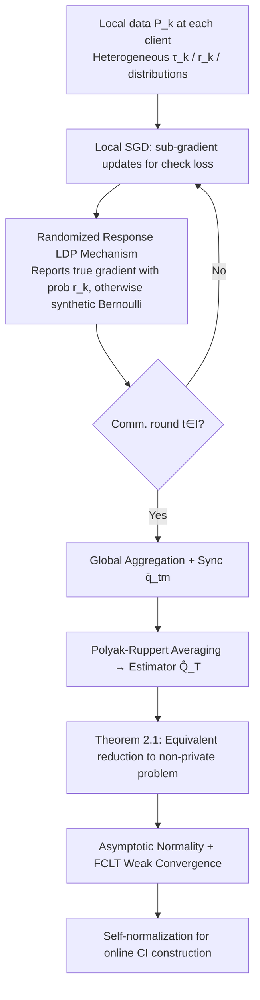

# Federated Learning of Quantile Inference under Local Differential Privacy

**Conference**: ICLR 2026  
**OpenReview**: [https://openreview.net/forum?id=a5bFKVtTyF](https://openreview.net/forum?id=a5bFKVtTyF)  
**Code**: To be confirmed  
**Area**: Federated Learning / Differential Privacy / Statistical Inference  
**Keywords**: Local Differential Privacy, Quantile Inference, Federated Learning, Local SGD, Self-normalization, Functional Central Limit Theorem  

## TL;DR
This paper proposes a Local SGD algorithm for federated quantile **inference** (not just point estimation) under Local Differential Privacy (LDP). By utilizing a privacy mechanism that transforms the LDP problem into an equivalent non-private one, the authors establish the first weak convergence theory for Local SGD under non-smooth quantile loss and employ self-normalization to construct valid confidence intervals without estimating asymptotic variance.

## Background & Motivation

**Background**: Modern data ecosystems increasingly require distribution-level guarantees rather than simple means—hospitals monitor the 0.9 quantile of emergency wait times, and financial institutions use VaR/ES to assess tail risks. These objectives involve quantiles of potentially heavy-tailed and heterogeneous distributions. Since data is naturally dispersed across institutions, centralizing raw data is often infeasible due to communication, storage, privacy, and regulatory barriers, making Federated Learning (FL) a natural choice.

**Limitations of Prior Work**: ① Privacy protection solely at the server or silo level is no longer sufficient; medical and financial data breaches show that Central DP (CDP) cannot protect individuals if the aggregator is compromised. LDP randomizes each record before it leaves the device, corresponding to the most conservative trust assumption ("trust neither the server nor the silos"). However, the error rate degrades from $O(n^{-1})$ in CDP to $O(n^{-1/2})$, which **shifts the limit distribution and inflates asymptotic variance**, making it difficult to estimate variance consistently from point estimates alone. ② Existing LDP methods for quantiles are either single-machine processes ignoring client heterogeneity or only provide point estimates without general inference guarantees.

**Key Challenge**: Performing quantile inference in a heterogeneous LDP federated environment faces three main hurdles: inference requires both the limit distribution and a consistent estimate of the asymptotic variance. Standard SGD variance estimation typically relies on the **Hessian of a smooth loss**, whereas quantile loss is non-smooth. Under LDP, one can only observe perturbed gradients, and naive variance estimation would either consume more privacy budget or require data splitting. Furthermore, federated algorithms must be robust to heterogeneous losses and client-level privacy parameters.

**Goal**: To design a federated quantile process under LDP that provides **valid confidence intervals and hypothesis testing** while accommodating client heterogeneity in quantile targets, privacy budgets, and data distributions, even with non-smooth losses.

**Core Idea**: **[Reduction + Self-normalization]** First, a randomized response LDP mechanism is used to **equivalently rewrite the private federated quantile estimation as a non-private quantile optimization problem** (where only the distribution and quantile levels are shifted). This shifts the difficulty to analyzing the statistical properties of non-private estimators. Second, self-normalization is used to construct pivotal statistics, bypassing the estimation of nuisance parameters such as variance or density.

## Method

### Overall Architecture

Consider $K$ clients, each holding local data i.i.d. sampled from an unknown distribution $P_k$, with weights $p_k$ and local quantile levels $\tau_k$. The global objective is to collaboratively estimate the global quantile $Q^\star$ satisfying $\sum_{k=1}^K p_k F_k(Q^\star)=\tau$ (where $\sum_k p_k\tau_k=\tau$, and only the global $\tau$ is required). The pipeline consists of three steps: clients run Local SGD using the sub-gradient of the check loss; gradients are perturbed via a randomized response mechanism and aggregated only at communication rounds $\mathcal{I}$ (using Polyak–Ruppert averaging to obtain $\widehat{Q}_T$); the LDP process is theoretically proven to be equivalent to a non-private problem to establish asymptotic normality and the Functional Central Limit Theorem (FCLT); finally, self-normalization is used for online construction of confidence intervals.

### Key Designs

**1. Randomized Response LDP Mechanism: Perturbing quantile gradients as binary responses.** A key observation is that the gradient structure of the check loss $\ell_{\tau_k}(x,Q)=(x-Q)\{\tau_k-\mathbb{I}(x<Q)\}$ is essentially a **binary response** (depending on $\mathbb{I}(x_t^k>q_t^k)$). Thus, privatization can be achieved via randomized response: each client reports the true response with probability $r_k\in(0,1]$ or a synthetic Bernoulli random variable otherwise. This yields $\epsilon_k$-LDP, where $\epsilon_k=\log(1+r_k)-\log(1-r_k)$. The algorithm satisfies $(\max_k \epsilon_k,0)$-LDP by composition. Smaller $r_k$ implies stronger privacy but lower accuracy. By representing the "privacy budget" as an adjustable response rate, it naturally supports client-level heterogeneous privacy.

**2. Equivalence Transformation Theorem: Rewriting private problems as non-private ones (Theorem 2.1).** This is the theoretical cornerstone. Let $\tilde\tau_k=r_k\tau+(1-r_k)/2$. The paper proves that solving the federated loss (2.1) with data from $P_k$ under $\epsilon_k$-LDP is **equivalent** to solving a non-private problem:
$$Q^\star=\arg\min_Q \sum_{k=1}^K \frac{p_k}{r_k}\,\mathbb{E}_{x_k\sim\widetilde{P}_k}\{\ell_{\tilde\tau_k}(x_k,Q)\},$$
where LDP data is replaced by non-private data sampled from a shifted distribution $\widetilde{P}_k$ at a shifted quantile level $\tilde\tau_k$. This step transforms the difficulty of "analyzing perturbed gradients" into the standard task of "analyzing non-private non-smooth quantile estimators." The impact of privacy is fully encoded in the scaling of $(\widetilde{P}_k,\tilde\tau_k)$ and $r_k$. The algorithm correction term balances heterogeneous LDP mechanisms during aggregation.

**3. Weak Convergence Theory under Non-smooth Loss (Theorem 3.1–3.2).** Based on the reduced non-private problem, the paper establishes asymptotic normality: $\sqrt{t_T}(\widehat{Q}_T-Q^\star)\xrightarrow{d}\mathcal{N}\big(0,\ \nu\sum_k p_k^2 [r_k^{-2}-(2Q_k-1)^2]/[4(\sum_k p_k f_k(Q^\star))^2]\big)$. The convergence rate is determined by $(\min_k r_k\,t_T)^{-1/2}$ (the client with the strongest privacy), characterizing the privacy-utility tradeoff. Furthermore, a FCLT is established: the partial sum process $Q_T(s)$ weakly converges to a Brownian motion in $\ell^\infty[0,1]$. **A highlight is that this bypasses the common L-average smoothness assumption** found in literature; since quantile loss violates this condition, the authors claim to provide the **first weak convergence result** for Local SGD when this condition fails.

**4. Self-normalized Online Inference: Constructing CIs without variance estimation.** Directly constructing CIs via Theorem 3.1 requires unknown $Q_k$ and densities $f_k(Q^\star)$, which are extremely difficult to estimate consistently from perturbed gradients. The authors instead use self-normalization: by defining $V_T=\sum_m (r_m-r_{m-1})\{Q_T(r_m)-\tfrac{m}{T}Q_T(1)\}^2$, the statistic $Q_T(1)/\sqrt{V_T}$ converges to a **distribution-free (pivotal)** limit $B(1)/[\int_0^1\{B(r)-g(r)B(1)\}^2 dr]^{1/2}$. This allows for CI construction without spending extra privacy budget on nuisance parameters. This L2-norm self-normalizer can be **computed online** (Algorithm 2), making it suitable for streaming federated scenarios.

## Key Experimental Results

### Main Results (Hete L setting, Normal distribution, 95% nominal coverage)

With $K=10$ and $p_k=1/K$, comparing three communication strategies (C1=Parallel SGD, C5, Log) against three baselines (DP-SGD, Divide and Conquer DC, Single-machine LDP Single). Table shows ECP (MAE in parentheses):

| Setting | τ | r | C1 (Ours) | DP-SGD | DC | Single |
|---|---|---|---|---|---|---|
| $t_T=10000$ | 0.3 | hetero | 0.949(0.0096) | 0.947(0.0142) | 0.898(0.1302) | 0.954(0.0095) |
| $t_T=10000$ | 0.8 | hetero | 0.962(0.0122) | 0.943(0.0186) | 0.709(0.2684) | 0.958(0.0114) |
| $t_T=10000$ | 0.8 | 0.9 | 0.990(0.0042) | 0.968(0.0065) | **0.049**(0.2098) | 0.966(0.0067) |
| $t_T=50000$ | 0.3 | hetero | 0.911(0.0056) | 0.885(0.0083) | **0.093**(0.1282) | 0.958(0.0038) |

### Ablation Study

| Dimension | Observation |
|---|---|
| Comm. Strategy | C1 (most frequent) has the smallest MAE; for fixed $t_T$, C1 ≈ Single baseline. |
| Fixed Comm. Rounds | The Log strategy is overall optimal, minimizing MAE while balancing communication/statistical efficiency. |
| Sample size / Response rate | MAE decreases monotonically as $t_T$ or $r$ increases, consistent with the theoretical convergence rate. |
| Comparison with DP-SGD | DP-SGD coverage is often near 95%, but its MAE is consistently higher than Ours. |

### Key Findings
- The proposed method maintains an ECP near or above the 95% nominal level in all scenarios, while **Divide and Conquer (DC) fails significantly in heterogeneous settings**: e.g., for Hete L, τ=0.8, r=0.9, ECP is only 0.049. This validates that simply merging single-machine LDP estimates causes significant bias and invalid inference.
- Real-world data experiments (estimating US national median income from state data) confirm the ability to handle data and privacy heterogeneity.

## Highlights & Insights
- **Reduction to non-private problems is an elegant theoretical lever**: Absorbing all privacy effects into shifted distributions and quantile levels via Theorem 2.1 is the key to making LDP inference tractable.
- **Bridging the gap for "Inference" rather than just "Estimation"**: Valid CI/testing under LDP is harder than point estimation. Self-normalization cleverly avoids the obstacle of nuisance parameter estimation under non-smooth loss without extra privacy cost.
- **Substantial theoretical novelty**: Providing a FCLT for Local SGD without the average-smoothness condition is a significant advancement in stochastic optimization theory, where non-smooth quantile loss is a prime application.
- **Proper Heterogeneity Modeling**: Clients can have distinct targets $\tau_k$, privacy budgets $r_k$, and distributions, fitting real-world FL environments.

## Limitations & Future Work
- The theory and method focus on **one-dimensional scalar quantiles**; multi-dimensional quantiles or quantile regression (with covariates) are not yet covered.
- The privacy mechanism relies on randomized response, requiring a binary response structure—ideal for check loss but unclear for more general non-smooth losses.
- The convergence rate is bottlenecked by the most private client (smallest $r_k$); there is a lack of adaptive weighting or robust handling for extreme privacy outliers.
- Experiments are primarily simulation-based with a fixed $K=10$; large-scale clients, dropouts, or asynchronous communication in real federated systems have not been fully tested.

## Related Work & Insights
- **Federated Local SGD Inference**: Li et al. (2022), Xie et al. (2024), and Zhu et al. (2024) established weak convergence under average-smoothness. This paper extends this line to non-smooth losses.
- **LDP Mechanisms**: The randomized response builds on the single-machine LDP quantile framework of Liu et al. (2023b), extending it to FL with general inference guarantees. It contrasts with DP-SGD using Laplace noise (Song et al. 2013), which shows larger MAE.
- **Self-normalized Inference**: Following the paradigm of Shao (2015) and Liu et al. (2023b), the "FCLT → pivotal self-normalized statistic" approach is adapted for LDP-FL, providing a framework for other non-smooth, privacy-constrained online inference problems.

## Rating
- Novelty: ⭐⭐⭐⭐ — The combination of "reduction to non-private + weak convergence of Local SGD under non-smooth loss + self-normalized LDP inference" offers substantial theoretical novelty and fills a gap.
- Experimental Thoroughness: ⭐⭐⭐ — Covers various heterogeneous scenarios and real-world data, but lacks large-scale/asynchronous system-level validation.
- Writing Quality: ⭐⭐⭐⭐ — Clear motivation, distinct challenges, and logical contribution layers.
- Value: ⭐⭐⭐⭐ — Provides a practical and theoretically sound tool for distribution-level inference in privacy-sensitive, heterogeneous federated environments.

<!-- RELATED:START -->

## Related Papers

- [\[ICLR 2026\] Convergent Differential Privacy Analysis for General Federated Learning](convergent_differential_privacy_analysis_for_general_federated_learning.md)
- [\[ICLR 2026\] Protection against Source Inference Attacks in Federated Learning](protection_against_source_inference_attacks_in_federated_learning.md)
- [\[ICLR 2026\] INO-SGD: Addressing Utility Imbalance under Individualized Differential Privacy](ino-sgd_addressing_utility_imbalance_under_individualized_differential_privacy.md)
- [\[CVPR 2026\] LDP-Slicing: Local Differential Privacy for Images via Randomized Bit-Plane Slicing](../../CVPR2026/ai_safety/ldp-slicing_local_differential_privacy_for_images_via_randomized_bit-plane_slici.md)
- [\[ICLR 2026\] RESFL: An Uncertainty-Aware Framework for Responsible Federated Learning by Balancing Privacy, Fairness and Utility](resfl_an_uncertainty-aware_framework_for_responsible_federated_learning_by_balan.md)

<!-- RELATED:END -->
