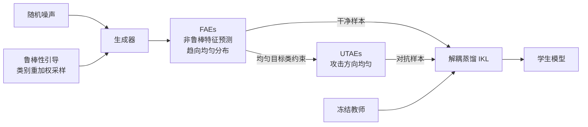

# FERD: Fairness-Enhanced Data-Free Adversarial Robustness Distillation

**Conference**: ICLR 2026  
**OpenReview**: [https://openreview.net/forum?id=jGXTx64gal](https://openreview.net/forum?id=jGXTx64gal)  
**Code**: [https://github.com/mayaobuduyao/FERD](https://github.com/mayaobuduyao/FERD)  
**Area**: Adversarial Robustness / Data-Free Knowledge Distillation / Robust Fairness  
**Keywords**: data-free robustness distillation, robust fairness, adversarial examples, class reweighting, information bottleneck  

## TL;DR
FERD introduces "robust fairness" into data-free robustness distillation for the first time. By applying **class proportion** reweighting on synthetic samples and **distribution** uniformization of adversarial targets, it significantly enhances student model robustness on the weakest classes, mitigating the severe inter-class robustness imbalance.

## Background & Motivation
**Background**: Lightweight models exhibit poor robustness when deployed on edge devices. Adversarial Robustness Distillation (ARD) transfers the defensive capabilities of a robust teacher to a student. However, real training data is often inaccessible, leading to the rise of Data-Free Robustness Distillation (DFRD) — using generators to synthesize surrogate samples to transfer robustness without relying on original data.

**Limitations of Prior Work**: Existing DFRD methods (DFARD, DERD, DFHL, etc.) focus solely on the "overall robustness" metric, completely neglecting **robust fairness**. A model might be extremely robust for certain classes while remaining highly vulnerable for others, creating a massive inter-class gap. This imbalance poses reliability and security risks in practical applications.

**Key Challenge**: This study empirically identifies two overlooked phenomena: (1) Even when distilling with **equal-proportion** synthetic data, student robustness varies significantly across categories, and this inter-class gap is further **amplified** during distillation. (2) Student defense against different **attack target classes** is also uneven — for instance, samples with ground truth label 0 are easily misclassified when the attack target is class 9, but remain stable against other classes. This indicates that "equal-proportion sampling + unconstrained attack directions" are the two primary sources of unfairness.

**Goal**: To simultaneously improve the student's overall robustness and inter-class fairness without accessing training data, specifically boosting the robustness of the "weakest classes."

**Core Idea**: **Regulate adversarial samples from both proportion and distribution dimensions** — reweight proportions to synthesize more samples for weak robustness classes, and uniformize the distribution of attack targets to ensure they cover the entire category space uniformly, avoiding concentrated attacks on a few fragile classes.

## Method

### Overall Architecture
FERD is a two-stage "generation + distillation" framework. **Generation Stage**: An adversarial margin-based class reweighting strategy guides the generator to synthesize more samples for weak robustness classes, coupled with a uniformity constraint on non-robust feature predictions to produce Fairness-Aware Examples (FAEs) as clean samples. **Distillation Stage**: Starting from FAEs, Uniform Target Adversarial Examples (UTAEs) are constructed by imposing a uniform target class constraint. Finally, a decoupled distillation loss is used to transfer teacher robustness to the student.

### Key Designs

**1. Robustness-guided Class Reweighting: Feeding the Weak Classes More**
Traditional DFRD samples synthetic labels from a uniform distribution $y_i \sim U(0, C-1)$, leaving weak robustness classes "malnourished." FERD first generates adversarial versions $x_i^{adv}$ of synthetic samples using PGD-20, then calculates the adversarial margin under the teacher $m_i = (f^T(x_i^{adv}))_{y_i} - \max_{j \neq y_i}(f^T(x_i^{adv}))_j$. This measures the gap between the correct class confidence and the strongest confounding class; a negative value indicates a successful attack. Aggregating negative margins per class $D_c = \frac{1}{N_c}\sum_{i:y_i=c}(-m_i)$ measures class fragility — larger values imply higher susceptibility to misclassification. Finally, applying softmax to $D_c$ yields sampling probabilities $p_c$, adaptively synthesizing more samples for weak classes. In experiments, the sampling weight for the weakest class reached 0.314, far exceeding others.

**2. Non-robust Feature Suppression for FAEs: Balancing Attack Inclinations**
Adversarial perturbations naturally prefer classes dominated by "non-robust features." FERD utilizes the **Information Bottleneck** concept to decouple non-robust features $Z_{nr}$ from teacher intermediate features $Z = f^T_l(x)$. It injects learnable noise into features $Z_I = f^T_l(x_i) + \text{softplus}(\lambda_r)\cdot\epsilon,\ \epsilon\sim N(0,I)$, balancing "predictability" and "noise robustness" by minimizing $L(\lambda_r) = CE(f^T_{l+}(Z_I), y_i) + \beta\sum_c\left(\frac{v_c}{\lambda_c^2} + \log\frac{\lambda_c^2}{v_c} - 1\right)$. Non-robust channels are identified via channel mask $Z_{nr}$ based on whether $\lambda_r^2$ is smaller than the maximum variance. Since non-robust feature predictions are highly correlated with adversarial predictions, FERD forces them toward a uniform distribution $L_{uni} = KL(U, f^T_{l+}(Z_{nr}))$, suppressing the dominance of specific non-robust features and ensuring balanced representation in FAEs. The generator's total loss is jointly optimized with $L_{adv}$ (diversity), $L_{bn}$ (BatchNorm alignment), and $L_{oh}$ (teacher predictability).

**3. Uniform Target Adversarial Examples (UTAEs): Flattening Attack Directions Across All Classes**
To address the uneven defense against different target classes, FERD adds a uniform target class constraint during adversarial sample generation: $x_U^{t+1} = \Pi_{x_U+S}\left(x_U^t + \alpha\cdot\text{sign}\left(\nabla_{x_U^t}\left[KL(f^T(x_i), f^T(x_U^t)) - \gamma\cdot KL(U, f^T(x_U^t))\right]\right)\right)$. The term $-\gamma\cdot KL(U, f^T(x_U^t))$ pushes the adversarial target distribution toward uniformity, preventing attacks from concentrating on "easy-to-misclassify" classes. When $\gamma=0$, it degrades to standard PGD. Experiments show that low-to-medium intensity (0.1–0.5) works best; excessively high values (0.7/0.9) suppress adversarial loss too much, weakening the attack intensity.

**4. Decoupled Distillation Loss: FAEs as Clean Samples, UTAEs as Adversarial Samples**
FAEs and UTAEs are used as clean and adversarial samples, respectively, for robustness distillation. Instead of traditional KL divergence, FERD adopts a Decoupled Knowledge Distillation loss $L_{IKL}$ (a combination of wMSE and Cross-Entropy). The first term minimizes the structural difference between teacher and student logits, while the second aligns the predicted distributions. This decoupling breaks the asymmetric optimization nature, performing better in both distillation and adversarial training. The final student loss is $L_{stu} = \lambda_1 L_{IKL}(f^T(x_F), f^S(x_F)) + \lambda_2 L_{IKL}(f^T(x_F), f^S(x_U))$, with $\lambda_1=5/6,\ \lambda_2=1/6$.

## Key Experimental Results

### Main Results (CIFAR-10, Compared with 7 DFRD Baselines)
Avg.=Average Robustness↑, Worst=Weakest Class Robustness↑, NSD=Normalized Standard Deviation between classes↓. Teacher is WideResNet-34-10.

| Student | Method | Clean Worst | PGD Worst | AA Avg. | AA Worst | AA NSD |
|------|------|------|------|------|------|------|
| RN-18 | DFHL (Best Baseline) | 58.60 | 19.30 | 36.39 | 18.50 | 0.351 |
| RN-18 | **FERD** | **65.90** | **20.40** | **40.12** | **20.80** | **0.325** |
| MN-V2 | DERD/DFHL | 50.60 | 14.20~15.10 | 32.58 | 13.70 | 0.368 |
| MN-V2 | **FERD** | **64.10** | **20.80** | **38.06** | **20.30** | **0.349** |

On CIFAR-10 + MobileNet-V2, FERD improves weakest class robustness against FGSM/PGD/CW∞/AA by **11.3%, 5.7%, 6.2%, and 6.6%** respectively compared to the best baseline, with the highest average accuracy increase reaching 13.05% and generally lower NSD. Similar conclusions are drawn on CIFAR-100 and Tiny-ImageNet (using worst-10% instead of worst-class).

### Ablation Study (CIFAR-10, RN-18, AA Attack)

| Configuration | Clean Avg. | Clean Worst | AA Avg. | AA Worst |
|------|------|------|------|------|
| **FERD (Full)** | 79.26 | **65.90** | 42.24 | 20.80 |
| w/o Reweighting | 79.53 | 63.20 | 42.54 | 17.20 |
| w/o FAEs | 78.42 | 65.30 | 41.01 | 19.90 |
| w/o UTAEs | 77.57 | 65.10 | 41.24 | 20.00 |
| w/o FAEs+UTAEs | 77.48 | 62.50 | 40.92 | 20.30 |

Removing reweighting causes AA-Worst to plummet from 20.80 to 17.20 (though Clean-Avg slightly increases, confirming the "trade-off between fairness and overall accuracy"). FAEs and UTAEs are complementary; removing either leads to overall degradation, and removing both results in the worst performance.

### Key Findings
- **Reweighting Decisively Targets Weak Classes**: t-SNE and per-class robustness plots show that reweighting significantly boosts weak class robustness, with weight for the weakest class (Class 4) rising to 0.314.
- **Robust Across Teachers**: FERD remains superior when using WRN-34-20 as the teacher, leading in both AA average and worst robustness by +2.08% and +0.4% respectively, showing transferability across architectures.
- **Higher Quality Synthetic Samples**: Visualizations reveal that while CMI and Fast encounter model collapse, FERD recovers identifiable, high-quality samples from the robust teacher.

## Highlights & Insights
- **Pioneering Problem Definition**: First to systematically research robust fairness in data-free robustness distillation, decomposing unfairness into "source data class proportion" and "attack target bias" — providing clear, actionable targets.
- **Proportion + Distribution Synergy**: Reweighting manages "which classes to generate more," while FAEs/UTAEs manage "how samples and attack directions are distributed." These two dimensions are orthogonal and complementary, resulting in a self-consistent design.
- **Ingenious Use of Information Bottleneck**: Mapping the abstract problem of "which classes adversarial perturbations prefer" to "whether non-robust feature predictions are concentrated" allows direct intervention through uniform constraints, providing a computable handle.

## Limitations & Future Work
- Experiments are limited to small-scale classification on CIFAR-10/100 and Tiny-ImageNet; fairness gains on ImageNet-scale or complex tasks like detection/segmentation remain unverified.
- Generation overhead is significant due to reliance on PGD-20 for online adversarial margin evaluation and per-channel optimization for Information Bottleneck; no training cost comparison is reported.
- Fairness improvements come with a slight sacrifice in overall Clean accuracy (as seen in ablation); narrowing this trade-off remains an open challenge.
- Hyperparameters ($\lambda$ series, $\gamma$) are tuned based on experience; the cost of migration to new datasets or architectures is not fully discussed.

## Related Work & Insights
- **Data-Free Robustness Distillation**: DFARD first defined DFRD and identified low information upper bounds; DERD used homogeneous experts and random gradient aggregation; DFHL proposed High Entropy Examples (HEEs) for complete boundary characterization. FERD is orthogonal — others optimize overall robustness, FERD specializes in fairness.
- **Robust Fairness**: FRL first proposed "robust fairness" and adjusted decision margins; BAT distinguished between source/target class unfairness and adjusted per-class attack intensity; Fair-ARD weighted hard classes; ABSLD adjusted soft label smoothness. FERD migrates these ideas from "data-available" scenarios to the data-free setting, marking the first implementation in DFRD.
- **Insight**: FERD reveals that "equal-proportion sampling" is a source of implicit bias in data-free scenarios. This perspective can be extended to other data-free tasks (e.g., incremental learning, compression), where all synthetic-sample-dependent scenarios should be checked for "fair distribution."

## Rating
- Novelty: ⭐⭐⭐⭐ First to introduce robust fairness to DFRD; the dual-dimension approach and Information Bottleneck usage for non-robust feature decoupling are original.
- Experimental Thoroughness: ⭐⭐⭐⭐ Three datasets, two student architectures, four attack types, seven baselines + comprehensive ablation + teacher transfer + visualization. Deducted for lack of large-scale datasets and cost analysis.
- Writing Quality: ⭐⭐⭐⭐ Clear logical chain from observation to motivation to method; formulas align well with the framework diagram; empirical foundations for the two root causes are convincing.
- Value: ⭐⭐⭐⭐ Robust fairness is practical for edge security; methods are transferable to other data-free tasks; open-source code facilitates reproduction.

<!-- RELATED:START -->

## Related Papers

- [\[ICLR 2026\] Remaining-data-free Machine Unlearning by Suppressing Sample Contribution](remaining-data-free_machine_unlearning_by_suppressing_sample_contribution.md)
- [\[ICLR 2026\] On the Interaction of Compressibility and Adversarial Robustness](on_the_interaction_of_compressibility_and_adversarial_robustness.md)
- [\[ICLR 2026\] Dataset Distillation for Memorized Data: Soft Labels can Leak Held-Out Teacher Knowledge](dataset_distillation_for_memorized_data_soft_labels_can_leak_held-out_teacher_kn.md)
- [\[CVPR 2025\] Data-free Universal Adversarial Perturbation with Pseudo-Semantic Prior](../../CVPR2025/ai_safety/data-free_universal_adversarial_perturbation_with_pseudo-semantic_prior.md)
- [\[ICLR 2026\] Nasty Adversarial Training: A Probability Sparsity Perspective for Robustness Enhancement](nasty_adversarial_training_a_probability_sparsity_perspective_for_robustness_enh.md)

<!-- RELATED:END -->
