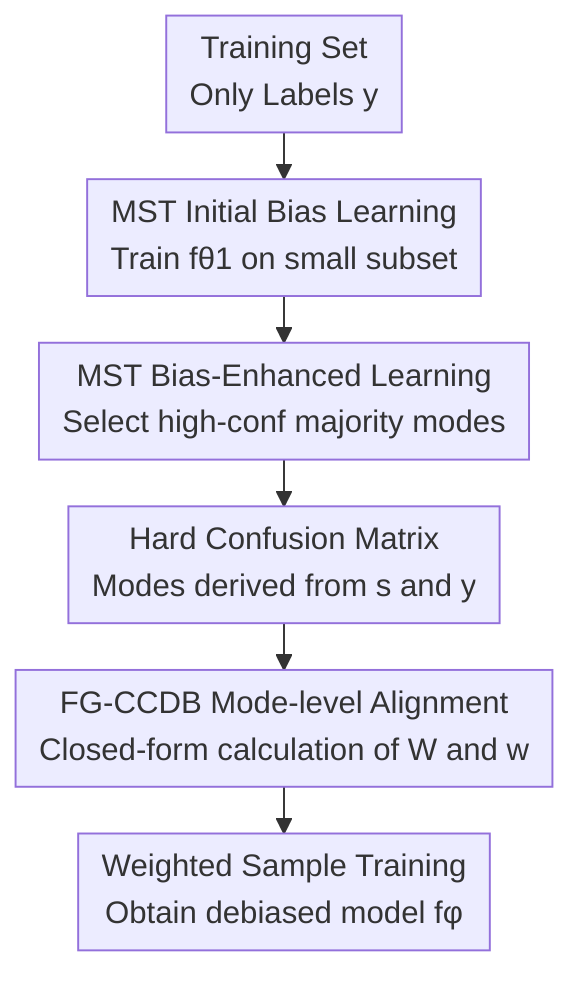

# Fine-Grained Class-Conditional Distribution Balancing for Debiased Learning

**Conference**: ICLR 2026  
**OpenReview**: [https://openreview.net/forum?id=NEFldJX4zb](https://openreview.net/forum?id=NEFldJX4zb)  
**Code**: https://github.com/MiaoyunZhao/FG_CCDB  
**Area**: AI Safety / Robust Learning / Debiased Learning  
**Keywords**: Spurious Correlation, Debiased Learning, Worst-group Robustness, Class-conditional Distribution Balancing, Sample Reweighting  

## TL;DR
This paper decomposes group-robust learning without bias annotations into "overfitting a model to identify bias patterns followed by fine-grained class-conditional distribution matching via a confusion matrix." It proposes MST and FG-CCDB, which approach or exceed the performance of methods relying on manual group annotations in binary, multi-shortcut, and extreme multi-class scenarios.

## Background & Motivation
**Background**: In classification tasks with spurious correlations, standard ERM often learns the easiest shortcut features rather than the core semantic features required for the task. A typical example is traffic sign classification where "red color" is highly correlated with stop signs, leading the model to rely on color for prediction. On datasets like Waterbirds, CelebA, CivilComments, and UrbanCars, similar backgrounds, attributes, or text identity words form majority groups, resulting in high average accuracy but very low worst-group accuracy.

**Limitations of Prior Work**: The most direct robust approach involves obtaining combined annotations of classes and bias attributes, followed by group-balanced training or last-layer retraining using methods like GroupDRO or DFR. However, bias attributes in real-world data are often expensive to label and may not consist of a single nameable attribute. Unlabeled methods typically exploit ERM's overfitting to bias by treating misclassified or low-confidence samples as bias-conficting for weighting. Nonetheless, these methods rely on empirical hyperparameters, and binary splitting is insufficient to describe complex bias structures under multi-class or multi-shortcut settings.

**Key Challenge**: The authors argue that the fundamental challenge is not just "too few minority group samples," but the excessively strong dependency between the target class $y$ and the bias information $z$. Existing CCDB addresses this by minimizing $I(z,y)-H(y)$, using sample reweighting to align the class-conditional bias distribution with the global bias distribution. However, CCDB uses a single Gaussian to approximate each distribution, which is too coarse for real data: a single class may contain multiple bias patterns, and unimodal approximation erases these mode differences, leaving unaddressed spurious correlations.

**Goal**: This paper aims to solve two sub-problems simultaneously. First, how to reliably estimate which "bias mode" a sample belongs to without manual bias labels. Second, once these modes are estimated, how to perform finer-grained distribution balancing than CCDB without introducing significant feature storage or iterative optimization overhead.

**Key Insight**: The authors leverage the "free lunch" of ERM: on biased data, predictions from an overfitted model tend to reflect bias signals rather than core semantics. Instead of merely checking for misclassification, this paper combines the biased model's predicted class $s$ with the ground truth class $y$ into a hard confusion matrix. Diagonal entries correspond to bias-aligning majority modes, and off-diagonal entries correspond to bias-conflicting minority modes. With a single shortcut, this degrades to traditional group partitioning; with multiple or entangled shortcuts, it provides a finer discrete mode description.

**Core Idea**: Amplify ERM overfitting into a bias predictor via Multi-stage Selective Retraining (MST), then use the hard confusion matrix for mode-wise closed-form sample reweighting (FG-CCDB), achieving fine-grained class-conditional distribution balancing without manual bias annotations.

## Method
### Overall Architecture
The framework first trains an auxiliary model intentionally biased toward shortcuts to predict bias labels $s$ for each training sample. It then constructs a $C \times C$ hard confusion matrix from $s$ and true labels $y$, treating each cell as a bias mode. Finally, it estimates class-conditional and marginal bias distributions from the matrix, computes sample weights for each mode in closed form, and trains the final debiased model using a WeightedRandomSampler. MST "clarifies the bias structure," while FG-CCDB "aligns the bias distributions seen by each class."

### Key Designs
**1. MST Initial Bias Learning: Intentionally creating a bias detector**

The first step is not to train a robust model but to obtain a bias predictor. The authors randomly sample a subset $D_1$ with ratio $\gamma$ from the training set $D=\{(x_i,y_i)\}_{i=1}^N$ and train a biased model $f_{\theta_1}$ using standard ERM on this small subset. Since the data inherently contains strong spurious correlations, training on a small subset makes it easier to overfit majority modes, resulting in high confidence for bias-aligning samples and poor performance for bias-conflicting samples.

This design is similar to methods that "train a weak model to find failure samples," but with a clearer goal: rather than seeking generalization, the auxiliary model is meant to expose the strongest shortcut signals. Experiments show $\gamma=0.1$ is a sweet spot; as $\gamma$ increases to 0.5, the auxiliary model becomes less biased, leading to a drop in mode prediction accuracy and minority mode recall. In other words, the first stage of MST actively creates a "bias magnifier."

**2. MST Bias-Enhanced Learning: Filtering minority modes with high-confidence samples**

The initial random subset may still contain bias-conflicting samples that weaken the auxiliary model's dependency on bias. To address this, MST scores the entire training set using $f_{\theta_1}$ and selects the top $\beta$ proportion of samples with the highest confidence within each class to form a more biased subset $D'_1$. The intuition is: if $f_{\theta_1}$ is already biased toward majority modes, its most confident samples are highly likely to be bias-aligning. Retraining $f_{\theta_2}$ on these samples further forces the model to overfit majority modes, making its predictions closer to "bias labels" than true core features.

The final biased model yields a predicted class $s$ for each sample. Here, $s$ is not necessarily a human-interpretable attribute (like color or background) but a set of shortcut signals that would induce other classes to be misclassified as class $s$. Thus, $(s,y)$ jointly defines a mode $M=S\times Y$, which is a cell in the hard confusion matrix: the diagonal represents majority modes (bias aligns with class), and off-diagonal entries represent minority modes (bias conflicts with class). This enhancement can be repeated; results show one repetition yields the most gain, while further iterations primarily improve minority mode recall with diminishing marginal returns.

**3. Hard Confusion Matrix: Reformulating implicit bias from unimodal to discrete multimodal**

A weakness of the original CCDB is the use of a single Gaussian to describe $p(z\mid y)$ and $p(z)$, assuming a single bias center per class. FG-CCDB avoids storing all sample features and instead uses the confusion matrix $M\in\mathbb{R}^{C\times C}$ from MST to approximate the joint bias-class distribution. Element $M_{i,j}$ denotes the count of samples with bias prediction $s=i$ and ground truth class $y=j$, corresponding to a joint probability matrix $J$:

$$
J_{i,j}=\frac{M_{i,j}}{N}.
$$

In this discrete view, the class-conditional bias distribution for class $j$ is the normalized $j$-th column of $J$, and the marginal bias distribution is the sum across all columns:

$$
p(z\mid y=j)\approx P_{:,j}=\frac{J_{:,j}}{\sum_i J_{i,j}},\quad p(z)\approx q=\sum_j J_{:,j}.
$$

This step transforms the "bias distribution" from a coarse unimodal estimate in continuous feature space to a discrete multimodal estimate composed of confusion matrix cells. While it sacrifices continuous detail, it provides two benefits: first, different bias modes within a class are explicitly separated; second, it eliminates the need to store full feature representations or optimize weights per sample.

**4. FG-CCDB Mode-level Reweighting: Closed-form alignment vs. simple group balancing**

FG-CCDB follows the CCDB objective of making bias information and class labels independent by reducing $I(z,y)-H(y)$ while avoiding class imbalance. The difference is it calculates a weight matrix $W\in\mathbb{R}^{C\times C}$ at the mode level. For mode $(s,y)=(i,j)$, if the current proportion of bias mode $i$ under class $j$ is $P_{i,j}$ and the marginal proportion of that bias mode is $q_i$, the alignment weight is:

$$
W_{i,j}=\frac{q_i}{P_{i,j}}.
$$

This ensures $W_{:,j}\odot P_{:,j}=q$ for every column, meaning all class-conditional bias distributions are pulled to the same marginal bias distribution. Assuming uniform contribution within a mode, the weight for a single sample is:

$$
w_{i,j}=\frac{W_{i,j}}{M_{i,j}}.
$$

This weight is not equivalent to simply leveling all group counts. Group balancing aims to make all cells equal, whereas FG-CCDB only requires that the bias distribution seen across different classes is consistent, allowing internal structure within a column. The authors emphasize this as performing covariate balance from a causal inference perspective: finding a reweighting that makes the confounding bias variable independent of the treatment-like core class information. Since weights are computed in closed form and shared within modes, training only requires passing these weights to PyTorch's `WeightedRandomSampler`, incurring minimal computation and storage costs.

### A Walkthrough Example
Consider a 3-class target recognition task where $y$ is "Car, Bird, Dog," and color or background forms a shortcut. A standard ERM might learn "Red background is usually a car, Blue sky is usually a bird, and Grass is usually a dog." MST stage 1 trains $f_{\theta_1}$ on 10% of data, making it very confident in majority modes. Stage 2 keeps the top 50% high-confidence samples per class, such as "Red cars," "Birds in blue sky," and "Dogs on grass," to train $f_{\theta_2}$.

Subsequently, $f_{\theta_2}$ predicts a bias class $s$ for all samples. If a "Car in a blue sky" is predicted as a Bird by the biased model while the true label is Car, it falls into the $(s=Bird, y=Car)$ off-diagonal mode, representing a bias-conflicting cell. After placing all samples into the $3 \times 3$ matrix, FG-CCDB observes that the "blue sky" mode is underrepresented in the "Car" column relative to the global marginal, thus increasing the sampling weight for such samples; simultaneously, it reduces the weight for majority modes like "Red cars." The final debiased model sees bias-conflicting combinations more frequently, forcing it to rely on shape, texture, or semantic cores rather than background shortcuts.

### Loss & Training
The weight optimization objective for FG-CCDB is derived from CCDB:

$$
L_\omega=I(z,y)-H(y)=\mathbb{E}_{p_\omega(y)}D_{KL}[p_\omega(z\mid y)\|p(z)]+\mathbb{E}_{p_\omega(y)}\log p_\omega(y).
$$

Where $z$ is the latent feature extracted before the fully connected layer of the biased model, which original CCDB uses to approximate bias; FG-CCDB replaces the continuous Gaussian approximation with the discrete modes of the hard confusion matrix. Training follows two paths: the bias exploration path samples data by $\gamma$ to train $f_{\theta_1}$, and then selects high-confidence samples by $\beta$ to train $f_{\theta_2}$ (repeated three times by default). The debiasing training path uses the final mode weights $w_{i,j}$ for weighted sampling to train the target model $f_\phi$. Model selection follows existing conventions by using worst-class accuracy on the validation set to pick the best checkpoint, though the method itself does not require manual bias labels for training or validation.

## Key Experimental Results
### Main Results
The paper first compares worst-group accuracy (WGA) on real binary group robustness datasets, then evaluates accuracy drops caused by rare shortcut combinations on the multi-shortcut UrbanCars dataset. The core advantage of FG-CCDB is not necessarily the highest i.i.d. accuracy, but significantly improved performance on the worst group or hardest combinations without using bias labels.

| Dataset | Metric | FG-CCDB | CCDB | Supervised Ref. | Observation |
|---------|--------|---------|------|-----------------|-------------|
| Waterbirds | WGA | 90.56±0.24 | 90.48±0.28 | DFR 92.90±0.2 | Close to CCDB, significantly higher than ERM 72.60 |
| CelebA | WGA | 89.22±0.19 | 85.27±0.28 | GroupDRO 88.90 | Exceeds supervised GroupDRO without labels |
| CivilComments | WGA | 78.52±0.42 | 75.00±0.26 | GroupDRO 73.7 | Notable improvement on text toxicity worst groups |
| UrbanCars | BG+CoObj gap | -4.9 | N/A | GroupDRO -16.4 | Much smaller performance drop under multi-shortcuts |

In UrbanCars, ERM has a BG+CoObj gap of -69.2, indicating it fails almost entirely when both background and co-occurring objects are rare. FG-CCDB reduces this gap to -4.9 while maintaining 92.98 I.D. accuracy. DDB has an even smaller gap but its I.D. accuracy is only 86.39, suggesting FG-CCDB is better balanced.

| Method | bias label | cMNIST 0.5% | cMNIST 5% | cCIFAR10 0.5% | cCIFAR10 5% |
|--------|------------|-------------|-----------|---------------|-------------|
| ERM | None | 35.19±3.49 | 82.17±0.74 | 23.08±1.25 | 39.42±0.64 |
| GroupDRO | Training+Val | 63.12 | 84.20 | 33.44 | 57.32 |
| uLA | None | 75.13±0.78 | 92.79±0.85 | 34.39±1.14 | 74.49±0.58 |
| GERNE | None | 77.25±0.17 | 90.98±0.13 | 39.90±0.48 | 56.53±0.32 |
| CCDB | None | 83.20±2.17 | 96.37±0.25 | 55.07±0.85 | 74.64±0.34 |
| FG-CCDB | None | 89.02±0.45 | 98.21±0.02 | 55.28±0.54 | 78.06±0.30 |

Extreme multi-class experiments best demonstrate the value of fine-grained modeling. cMNIST and cCIFAR10 compress bias-conflicting ratios to 0.5%–5%, where minority modes are extremely scarce and classes are numerous. FG-CCDB significantly outperforms CCDB on cMNIST and shows clear advantages on cCIFAR10 (2% and 5%), proving that confusion-matrix-level multimodal matching is more suitable for complex bias structures than single Gaussian matching.

### Ablation Study
| Config | Waterbirds WGA | CelebA WGA | cMNIST | cCIFAR10 | Description |
|--------|----------------|------------|--------|----------|-------------|
| GroupDRO | 91.40 | 88.90 | 84.20 | 57.32 | Supervised method using real bias annotations |
| GroupDRO-MST | 88.47±0.35 | 85.21±0.02 | 84.07±0.22 | 55.73±0.54 | Replacing manual group labels with MST predictions |
| DFR | 92.90±0.2 | 88.30±1.1 | - | - | Re-training last layer with real bias labels |
| DFR-MST | 91.49±0.72 | 85.87±0.29 | - | - | MST as approx. bias labels also supports DFR |
| FG-CCDB | 90.56±0.24 | 89.22±0.19 | 98.21±0.02 | 78.06±0.30 | Full unsupervised scheme |
| FG-CCDB-sup | 91.76±0.13 | 89.09±0.12 | 98.26±0.21 | 78.53±0.37 | Replacing MST with real bias labels (minimal gap) |

The ablation clarifies two points: pseudo mode labels from MST are sufficient to replace manual labels for GroupDRO or DFR; FG-CCDB gains little when using real bias labels, indicating the bottleneck is not MST but the fact that mode-wise reweighting already captures the essential bias structure.

### Key Findings
- MST's repetitions primarily improve minority mode recall. Accuracy on minority modes rises significantly after the first repetition and plateaus thereafter.
- $\gamma$ should be small. When $\gamma\le 0.2$, the mode prediction accuracy is higher. $\gamma=0.1$ maintains a strong bias signal; $\gamma=0.5$ makes the auxiliary model less "biased," which is counterproductive.
- $\beta=50\%$ is a robust default. F1 scores for the smallest modes across datasets show that $50\%$ is a reliable compromise that does not depend on strong priors.
- Feature correlation analysis supports the mechanism: before weighting, the biased model's latent features are strongly correlated with bias; after FG-CCDB weighting, bias correlation decreases as class correlation increases.

## Highlights & Insights
- Interpreting a biased model's predicted class as a "bias label" is clever. It does not require bias to be a human-nameable attribute; $s$ represents a composite shortcut signal, naturally covering multiple and entangled biases.
- The hard confusion matrix is a low-cost yet expressive intermediate representation. It is finer than a binary "misclassification" label but cheaper than storing latent features for Gaussian matching.
- The distinction between FG-CCDB and group balancing is insightful. Many methods aim to flatten all group counts, whereas FG-CCDB only requires $p(z\mid y)$ to align with $p(z)$. This "covariate balancing" approach can be extended to domain shift or long-tail classification.
- Closed-form weights lower the barrier for implementation. Since weights are shared within modes and computed directly, the method can be easily integrated into existing pipelines using a standard sampler.

## Limitations & Future Work
- The method relies on the premise that "overfitted models will capture shortcuts." If overfitting patterns do not stably correspond to bias cues, MST weakens.
- The hard confusion matrix assumes $|S|=|Y|$. If the number of bias attributes is unrelated to the number of classes, or if diverse shortcuts map to the same $s$, the representation might merge too much.
- Weights can be aggressive. Max-to-min weight ratios can reach 1000, which helps minority modes but might amplify noise, outliers, or incorrect pseudo-labels.
- While the method covers vision and text, it is mostly tested on classification benchmarks. Future work could explore detection, segmentation, or medical diagnosis.

## Related Work & Insights
- **vs. CCDB**: FG-CCDB inherits the same mutual information objective but replaces continuous Gaussian approximation with a discrete multimodal structure via the hard confusion matrix, making it more effective for multi-class tasks.
- **vs. GroupDRO / DFR**: These rely on manual annotations. MST can produce pseudo-labels to serve as a high-quality substitute for these supervised methods.
- **vs. JTT / LfF / SELF**: These methods use ERM failure samples to identify bias but often rely on binary splits and empirical upweighting. MST constructs a $C \times C$ mode matrix to describe the "direction" of bias relative to classes.
- **Insight**: For unsupervised robust learning, one should acknowledge that models will "learn the wrong things" and convert those failure patterns into a usable structure. MST transforms ERM's failures into coordinates in a bias space for statistical alignment.

## Rating
- Novelty: ⭐⭐⭐⭐☆ Upgrades CCDB from unimodal matching to fine-grained mode matching using a hard confusion matrix, naturally combining with observations on bias overfitting.
- Experimental Thoroughness: ⭐⭐⭐⭐⭐ Covers binary, multi-shortcut, and extreme multi-class data, with comprehensive analyses on mode prediction and hyperparameters.
- Writing Quality: ⭐⭐⭐⭐☆ Clear motivation and formula logic, though some experimental sections are dense and require careful table referencing.
- Value: ⭐⭐⭐⭐⭐ Highly practical for worst-group robustness without labels, providing a reusable framework for "discovering bias through model overfitting."

<!-- RELATED:START -->

## Related Papers

- [\[ICLR 2026\] Fine-Grained Iterative Adversarial Attacks with Limited Computation Budget](fine-grained_iterative_adversarial_attacks_with_limited_computation_budget.md)
- [\[ICLR 2026\] RESFL: An Uncertainty-Aware Framework for Responsible Federated Learning by Balancing Privacy, Fairness and Utility](resfl_an_uncertainty-aware_framework_for_responsible_federated_learning_by_balan.md)
- [\[ICML 2026\] VPD-100K: Towards Generalizable and Fine-grained Visual Privacy Protection](../../ICML2026/ai_safety/vpd-100k_towards_generalizable_and_fine-grained_visual_privacy_protection.md)
- [\[CVPR 2026\] RankOOD: Class Ranking-based Out-of-Distribution Detection](../../CVPR2026/ai_safety/rankood_-_class_ranking-based_out-of-distribution_detection.md)
- [\[ECCV 2024\] SkyMask: Attack-Agnostic Robust Federated Learning with Fine-Grained Learnable Masks](../../ECCV2024/ai_safety/skymask_attack-agnostic_robust_federated_learning_with_fine-grained_learnable_ma.md)

<!-- RELATED:END -->
