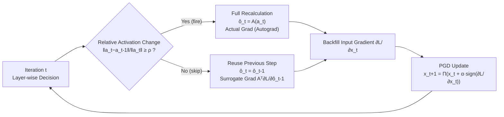

# Fine-Grained Iterative Adversarial Attacks with Limited Computation Budget

**Conference**: ICLR 2026  
**OpenReview**: [https://openreview.net/forum?id=GW9sp1g9qh](https://openreview.net/forum?id=GW9sp1g9qh)  
**Code**: TBD (Committed to open source after acceptance)  
**Area**: AI Security / Adversarial Robustness  
**Keywords**: Adversarial Attacks, PGD, Computation Budget, Spiking Mechanism, Activation Reuse, Surrogate Gradient, Adversarial Training  

## TL;DR
This paper models the maximization of iterative adversarial attack strength under a fixed computation budget as a layer-wise and step-wise combinatorial optimization problem. It proposes an event-driven **Spiking-PGD**: when the relative change of activations between adjacent iterations in a layer is below a threshold, the previous output is reused and recalculation is skipped. Virtual surrogate gradients are used to recover backpropagation signals blocked by spiking gates. This approach significantly outperforms existing attacks under equivalent computation budgets and achieves comparable robustness in adversarial training using only approximately 30% of the budget.

## Background & Motivation
**Background**: Iterative adversarial attacks, represented by PGD, I-FGSM, and MI-FGSM, are considered the "gold standard oracles" for evaluating model robustness and serve as the core engine for generating hard examples in adversarial training. However, they are inherently expensive, requiring a full forward and backward pass at every step. Robustness evaluation commonly uses PGD-20/50/100, which costs 40–200 times more than standard inference; PGD-10 used in adversarial training is also about 10 times more expensive than standard training.

**Limitations of Prior Work**: As models and datasets grow, this overhead restricts the scalability of attacks and defenses on large-scale models, particularly for researchers outside major industrial labs. Previous acceleration strategies (momentum updates, input diversity transformations, translation-invariant gradients, black-box query efficiency, sparse perturbations) focus on different aspects but generally assume full-precision computation for every layer, relying solely on the coarse-grained knob of reducing the number of iterations $T$. Once $T$ is reduced, attack strength collapses significantly.

**Key Challenge**: From a combinatorial optimization perspective, restricting the computation allocation to a uniform execution of a fixed $T$ iterations for all layers is rarely optimal. The authors' pilot study on ResNet-18/CIFAR-10 revealed two key phenomena: (1) after a few iterations, the relative activation change between adjacent steps $\|a_t-a_{t-1}\|/\|a_t\|$ decays rapidly (more so for robust models), indicating significant redundancy; (2) decay rates vary across different layers. This implies that computation should be allocated more finely across both **iteration dimensions** and **layer dimensions**.

**Goal**: To maximize the final adversarial loss under a given computation budget $C_{total}$.

**Core Idea**: **[Fine-grained Computation Control]** A binary mask $\Delta \in \{0, 1\}^{T \times L}$ determines which layers are calculated at which iterations. Recalculation is triggered adaptively by an event-driven spiking mechanism based on activation changes, while virtual surrogate gradients are employed to fix the gradient flow interrupted by reuse.

## Method

### Overall Architecture
The method consists of three components: reformulating the iterative attack as a **layer-wise and step-wise combinatorial optimization problem**, efficiently approximating the solution using **Spiking Forward Computation** with a single threshold $\rho$, and recovering lost gradients through **Virtual Backward Computation**. Combined, these form Spiking-PGD.

### Key Designs

**1. Iterative Attack as Combinatorial Optimization.** The total cost is decomposed by layer as $\sum_{t=1}^{T}\sum_{l=1}^{L} C_{t,l}\,\delta_{t,l}$. Budget-constrained attack seeks the optimal mask $\Delta$: $\max_{\Delta}\,\mathcal{L}(x_{T+1}(\Delta),y)\ \text{s.t.}\ \sum_{t,l} C_{t,l}\delta_{t,l}\le C_{total}$. Standard "early stopping" (reducing iterations from $T$ to $S$) is a degenerate case where $t \le S$ is fully calculated and $t > S$ is fully skipped. Proposition 4.1 proves this is merely a subset of the feasible region, thus $V_{coarse} \le V_{fine}$. Fine-grained masks are theoretically stronger under the same budget. Since the search space is $O(2^{T \times L})$, brute force or dynamic programming are impractical, necessitating efficient approximation.

**2. Spiking Forward Computation: Event-driven via Threshold $\rho$.** Leveraging the linearity of layer $A^{(l)}$, the output is rewritten as: $o_t^{(l)}=A^{(l)}(a_t^{(l)}-a_{t-1}^{(l)})+o_{t-1}^{(l)}$. When the residual is small, this term is negligible. A spiking gate $S_\rho(a_t,a_{t-1})$ is introduced: if $\|a_t-a_{t-1}\|/\|a_t\|\ge\rho$, the gate "fires" and computes $\hat o_t^{(l)}=A^{(l)}(a_t^{(l)})$; otherwise, the gate closes, the residual is zeroed, and the update becomes $\hat o_t^{(l)}=o_{t-1}^{(l)}$. This transforms the forward pass into an event-driven process triggered by activation magnitude changes. A single threshold $\rho \in [0, 1]$ manages the efficiency-effectiveness trade-off without retraining or mask searching.

**3. Virtual Surrogate Gradient: Fixing Gradient Vanishing.** In PyTorch autograd, reused layers follow the chain rule through the spiking gate. Since the gate derivative $S'_\rho$ is zero in the skip branch, $\partial\mathcal{L}/\partial a_t^{(l)}=0$, causing the attack to fail as no useful gradient reaches the input. The key observation is that although the forward pass reuses $\hat o_{t-1}^{(l)}$, the backward pass can "pretend" the path exists by manually multiplying the upstream gradient by $A^{(l)\top}$. This is implemented by marking cached outputs as `requires_grad_()` and injecting the surrogate gradient $A^{(l)\top}(\partial\mathcal{L}/\partial\hat o_{t-1}^{(l)})$ via `register_hook` when a layer is skipped. This restores effective gradient flow while preserving computation savings.

## Key Experimental Results

### Main Results (Attack Strength vs. Computation Cost)
Iteration reference $T_0=20$ for vision tasks and $T_0=200$ for graph tasks. Baselines are measured by $T/T_0 \times 100\%$ relative cost; Spiking-PGD is measured by the actual percentage of full-precision operations.

| Task / Dataset | Baselines | Key Conclusion |
|---|---|---|
| Vision: CIFAR-10 / 100 / Tiny-ImageNet | I-FGSM, MI-FGSM, PGD, AutoAttack | Spiking-PGD outperforms baselines at any given budget (lower accuracy under attack), with the **most significant gap in low-budget regions**. |
| Graph: Cora / Citeseer | PGD topology attack | PGD strength drops sharply at low computation; Spiking-PGD remains stronger, especially at low-to-medium budgets. |

Observations: MI-FGSM is generally stronger than I-FGSM/PGD due to momentum, but its strength collapses when iterations are reduced. AutoAttack has high absolute strength but excessive overhead, making it less efficient than other attacks under equivalent budgets.

### Adversarial Training (CIFAR-10)
Embedding Spiking-PGD into adversarial training, comparing constant thresholds with an exponentially decaying threshold schedule $\rho(t)=\rho_0\cdot\frac{e^{-\lambda t/N}-e^{-\lambda}}{1-e^{-\lambda}}$ ($\rho_0=0.1, N=200$):

| Setting | Phenomenon |
|---|---|
| Epoch 25–50 | Low threshold leads to frequent reuse; robust accuracy temporarily drops but recovers as $\rho$ decays and full computation increases. |
| $\lambda=1.0$ (Low) | Saves computation for longer but robustness recovers more slowly. |
| $\lambda=3.0$ (High) | Faster refinement, smoother curve closer to PGD-AT. |
| $\lambda=2.0$ | **Matches PGD-AT's best clean/robust accuracy while using less than 30% of the computation.** |

### Ablation Study

| Target | Conclusion |
|---|---|
| Threshold $\rho$ | Increasing $\rho$ results in more skips and lower cost, while attack strength only decreases mildly—a healthy Pareto trade-off. |
| Surrogate Gradient | Significantly improves attack strength, especially in low-computation regions, providing faithful backpropagation signals. |
| Attack Radius $\epsilon$ | For $\epsilon \in \{2,4,8\}/255$, smaller radii show slower strength decay when costs are reduced (smaller perturbations allow for more skip opportunities). |

### Key Findings
- Spiking-PGD pushes the Pareto frontier of efficiency vs. effectiveness: it is stronger at the same cost and more efficient at the same strength.
- Its advantages are **most prominent in low-budget scenarios**, aligning with the needs of resource-constrained researchers.
- The method generalizes across vision (pixel perturbation) and graph (structural attack) tasks.

## Highlights & Insights
- **New Perspective**: Expands attack acceleration into an orthogonal direction—fine-grained activation control—and theoretically proves early stopping is a degenerate subset.
- **Inspiration from SNNs**: Adapts the event-driven philosophy of Spiking Neural Networks to the iteration dimension of attacks, using activation changes as a natural trigger for computation.
- **Engineering Solutions**: Addresses the inevitable gradient vanishing from reuse by implementing virtual surrogate gradients using `register_hook` and low-level primitives.
- **Dual Utility**: Simultaneously accelerates attack evaluation and adversarial training (achieving results with 30% budget), providing immediate practical value.

## Limitations & Future Work
- **Linear Layer Dependency**: Residual decomposition for spiking forward passes relies on the linearity of $A^{(l)}$. The fidelity of surrogate gradients in modules with strong non-linearity or normalization coupling requires further evaluation.
- **Surrogate Approximation**: Reusing gradients accumulates bias over many skip steps; the theoretical impact on the final attack direction lacks a strict bound.
- **Scheduling Sensitivity**: Results are sensitive to $\rho$ and decay $\lambda$; an automated mapping from budget to threshold is not yet provided.
- **Black-box Generalization**: While potentially applicable to black-box attacks relying on iterative gradient estimation, this was not experimentally verified.
- **Scale**: Experiments were limited to ResNet-18/GCN and standard datasets (CIFAR/Tiny-ImageNet); benefits for Large Language Models or Transformers remain to be seen.

## Related Work & Insights
- **Iterative Attack Taxonomy**: FGSM → I-FGSM → PGD → MI-FGSM (Momentum) / DI-FGSM (Diversity) / TI-FGSM (Translation-invariant). This work is orthogonal to these strength-enhancing methods and can be combined.
- **Efficient Attacks**: Bandit-based, Boundary, and Square attacks focus on query reduction; One-Pixel/SparseFool focus on perturbation constraints. This work focuses on activation redundancy.
- **Insight**: High temporal correlation of intermediate states is common in iterative processes (e.g., Diffusion sampling, Autoregressive decoding). The "event-driven skipping + surrogate gradient" paradigm may be transferable to these fields.

## Rating
- **Novelty**: ⭐⭐⭐⭐ — Reframing acceleration as layer-wise combinatorial optimization via spiking mechanisms is a solid orthogonal perspective.
- **Experimental Thoroughness**: ⭐⭐⭐⭐ — Covers vision and graph tasks, multiple baselines, and both attack/defense scenarios; however, model and data scales are relatively small.
- **Writing Quality**: ⭐⭐⭐⭐ — Clear logical flow from motivation and pilot study to method and implementation.
- **Value**: ⭐⭐⭐⭐ — Directly addresses the pain point of robustness research under limited compute, effectively pushing the Pareto frontier.

<!-- RELATED:START -->

## Related Papers

- [\[ICLR 2026\] Fine-Grained Class-Conditional Distribution Balancing for Debiased Learning](fine-grained_class-conditional_distribution_balancing_for_debiased_learning.md)
- [\[ICLR 2026\] Robust Spiking Neural Networks Against Adversarial Attacks](robust_spiking_neural_networks_against_adversarial_attacks.md)
- [\[ICLR 2026\] Robust Adversarial Attacks Against Unknown Disturbances via Inverse Gradient Sample](robust_adversarial_attacks_against_unknown_disturbance_via_inverse_gradient_samp.md)
- [\[ICLR 2026\] Robust Fine-Tuning from Non-Robust Pretrained Models: Mitigating Suboptimal Transfer with Epsilon-Scheduling](robust_fine-tuning_from_non-robust_pretrained_models_mitigating_suboptimal_trans.md)
- [\[ICLR 2026\] On the Interaction of Compressibility and Adversarial Robustness](on_the_interaction_of_compressibility_and_adversarial_robustness.md)

<!-- RELATED:END -->
