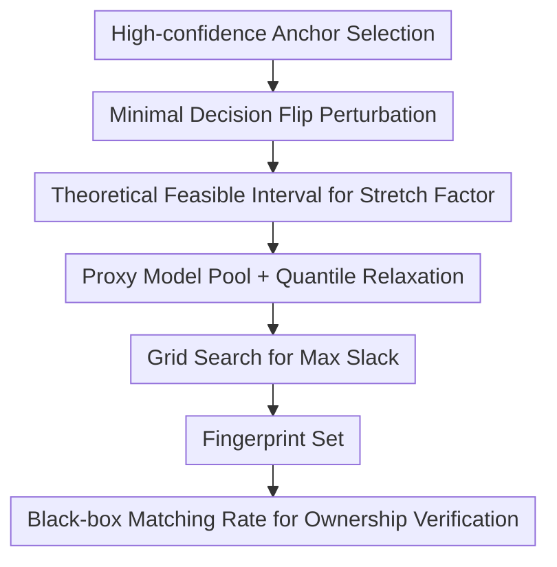

# Fingerprinting Deep Neural Networks for Ownership Protection: An Analytical Approach

**Conference**: ICLR2026  
**OpenReview**: [https://openreview.net/forum?id=sg3UNWKVFt](https://openreview.net/forum?id=sg3UNWKVFt)  
**Paper**: OpenReview  
**Code**: Not released  
**Area**: AI Security / Model IP Protection / Model Fingerprinting  
**Keywords**: Model Fingerprint, Ownership Verification, Adversarial Examples, Decision Boundary, Model Modification Attacks  

## TL;DR
AnaFP reformulates the empirical problem of "how far a fingerprint should be from the decision boundary" into finding a feasible interval for a stretch factor. By constraining adversarial fingerprints using both a robustness lower bound and a uniqueness upper bound, AnaFP distinguishes pirated models from independent models more stably than existing methods across CNNs, MLPs, and GNNs.

## Background & Motivation
**Background**: As deep networks are deployed as online services, attackers can steal models and re-distribute them via black-box APIs after altering their appearance through fine-tuning, pruning, knowledge distillation, or adversarial training. Model owners typically use watermarks or fingerprints for attribution. Watermarking requires embedding extra behaviors, which may degrade performance or introduce security risks. Fingerprinting uses external query samples to exploit the model's inherent decision characteristics for verification, making it ideal for scenarios where the original model must remain unchanged.

**Limitations of Prior Work**: Adversarial fingerprints are a natural choice. They start from clean samples and find the minimal perturbation to cross the decision boundary of the protected model, using these perturbed samples as queries. However, if fingerprints are too close to the boundary, slight shifts caused by fine-tuning or pruning make them fail. Conversely, if pushed too far, they might cross the boundaries of independently trained models, leading to false positives.

**Key Challenge**: Robustness and uniqueness impose conflicting requirements on fingerprint placement. Robustness demands that fingerprints stay far from the protected model's boundary so that modified models still output the target label. Uniqueness demands they stay close enough not to affect independent models. Previous methods relied on empirical margins, generators, or heuristic distances without identifying the theoretical feasible range.

**Goal**: The authors aim not to create a new category of adversarial fingerprints, but to provide a computable constraint for the placement distance. Specifically, the paper derives a lower and upper bound for a stretch factor $\tau$ for each anchor: the lower bound ensures robustness against modifications, while the upper bound ensures uniqueness against independent models. Only fingerprints within this interval are retained.

**Key Insight**: The authors exploit the local geometry near the decision boundary. By finding the minimal perturbation where the prediction flips and stretching it further along that same direction, the distance is controlled by $\tau$. This factor is constrained by the logit margin, local Lipschitz constants, and the logit shift caused by model modifications.

**Core Idea**: Replace empirical boundary distance tuning with a theoretically derived feasible interval for the stretch factor, ensuring each fingerprint simultaneously maximizes "pirated model hit rate" and "independent model miss rate."

## Method
### Overall Architecture
The AnaFP pipeline consists of fingerprint generation and ownership verification. In generation, high-confidence anchors are selected from training data, and a minimal perturbation is computed for each to reach the boundary point. A feasible interval for $\tau$ is estimated based on robustness and uniqueness constraints, and a stretch factor with the largest slack is chosen via grid search. In verification, the suspicious model is queried, and the ratio of fingerprints returning the target label is calculated.

The mechanism can be understood as a chain from "boundary point" to "verifiable fingerprint":

Let the protected model be $P$, the set of pirated models be $V_P$, and independent models be $I_P$. Each fingerprint is $(x_i^\star, y_i^\star)$. If a suspicious model $S$ satisfies $S(x_i^\star)=y_i^\star$ for sufficiently many fingerprints, it is identified as a pirated model. The key is whether the fingerprint set can separate the matching rate distributions of pirated and independent models.

### Key Designs
**1. High-confidence Anchors: Ensuring Independent Model Label Retention**

AnaFP avoids building fingerprints from arbitrary samples. It selects samples where the protected model is highly confident. For a sample $(x,y)$, the logit margin is defined as $g_P(x)=s_{P,y}(x)-\max_{k\ne y}s_{P,k}(x)$. Samples are only used as anchors if $g_P(x_a)\ge m_{anchor}$. High-margin samples carry more stable features, so independent models are more likely to predict the original label $y$, preventing them from accidentally matching the fingerprint's target label.

**2. Minimal Decision Flip Perturbation: Locating the Boundary**

For each anchor $(x_a,y)$, the minimal $\ell_2$ perturbation $\delta^\star$ is solved such that $P(x_a+\delta^\star)\ne y$, typically approximated using the C&W-$\ell_2$ attack. The resulting $q=x_a+\delta^\star$ is the boundary point. This provides a geometric origin. Since $q$ is fragile to model modifications, the sample is pushed further along the $\delta^\star$ direction using a scalar $\tau > 1$: $x^\star=x_a+\tau\delta^\star$.

**3. Robustness Lower Bound and Uniqueness Upper Bound: Sandwiching the Distance**

The core contribution is deriving the bounds for $\tau$. Robustness requires $P'(x^\star)$ to match the target label $y^\star$ for modified models $P'$. If $\epsilon_{logit}$ bounds the logit shift and $c_g=\|\nabla g_P(q)\|_2$ is the gradient norm of the logit margin, the first-order approximation yields:

$$
\tau > \tau_{lower}=1+\frac{2\epsilon_{logit}}{c_g\|\delta^\star\|_2}.
$$

Uniqueness requires independent models $I$ to retain the original label $y$ at $x^\star$. If $m_{min}$ is the minimum logit margin at the anchor and $L_{uniq}$ is the local Lipschitz constant, then:

$$
\tau < \tau_{upper}=\frac{m_{min}}{2L_{uniq}\|\delta^\star\|_2}.
$$

Fingerprints are generated only if $\tau_{lower}<\tau<\tau_{upper}$ exists.

**4. Proxy Model Pools, Quantile Relaxation, and Grid Search**

Since $V_P$ and $I_P$ are infinite, AnaFP uses finite proxy pools. The pirated pool includes variants like fine-tuned or distilled models, while the independent pool includes models with different architectures or seeds. To avoid overly conservative estimates that result in empty feasible sets, quantile relaxation (using $q_{margin}$, $q_{lip}$, and $q_{eps}$) is applied. Finally, $\tau^\star$ is chosen through grid search to maximize the slack (distance) from both bounds, providing a buffer against estimation errors.

### Loss & Training
AnaFP is a post-processing fingerprinting pipeline rather than a training scheme. Training occurs only for the proxy model pools: the protected model is trained normally, pirated proxies are generated via fine-tuning/distillation, and independent proxies are trained from scratch. For fingerprint generation, C&W-$\ell_2$ is optimized (default 3000 steps, 0.01 learning rate).

## Key Experimental Results
### Main Results
AnaFP was tested on CNN/CIFAR-10, CNN/CIFAR-100, MLP/MNIST, and GNN/PROTEINS against baselines like UAP, IPGuard, MarginFinger, AKH, ADV-TRA, and GMFIP. The metric is AUC, representing the probability of a pirated model having a higher matching rate than an independent model.

| Model / Dataset | AnaFP AUC | Best Baseline AUC | Gap |
|--------|------|----------|------|
| CNN / CIFAR-10 | $0.957\pm0.002$ | $0.878\pm0.012$ (ADV-TRA) | Significant distribution separation |
| CNN / CIFAR-100 | $0.893\pm0.005$ | $0.850\pm0.024$ (ADV-TRA) | Robust across many classes |
| MLP / MNIST | $0.963\pm0.002$ | $0.906\pm0.004$ (UAP) | Near perfect separation |
| GNN / PROTEINS | $0.926\pm0.005$ | $0.854\pm0.021$ (AKH) | Effective on non-Euclidean data |

Under modification attacks on CNN/CIFAR-10:

| Attack Type | AnaFP AUC | Best Baseline AUC | Insight |
|------|---------|------|------|
| Pruning | $1.000\pm0.000$ | ~1.000 | Easy to detect |
| Fine-tuning | $0.979\pm0.008$ | $0.923\pm0.010$ (ADV-TRA) | Stretch factor aids robustness |
| KD | $0.756\pm0.023$ | $0.679\pm0.013$ (UAP) | Distillation remains difficult |
| AT | $0.983\pm0.015$ | $0.783\pm0.041$ (UAP) | Fingerprints survive Adv Training |

### Ablation Study
The size of the proxy pool and the strategy for choosing $\tau$ were analyzed. AUC stabilizes once more than 6 proxy models are used.

| Design Choice | Observation |
|------|---------|
| Proxy Pool Size 2 -> 10 | AUC stabilizes quickly after 6 proxies. |
| Conservative Quantiles | 0 feasible fingerprints found. |
| Slack Maximization | Outperforms selecting values near $\tau_{lower}$ or $\tau_{upper}$. |

### Key Findings
- Gains come from adaptive feasible intervals per sample rather than a global empirical distance.
- High-confidence anchors are critical; low-confidence ones yielded zero valid fingerprints.
- Knowledge Distillation (KD) and Prune-KD are the most effective attacks as they restructure the decision behavior, though AnaFP still outperforms baselines.
- Computational costs involve ~33 min for ResNet-18 and ~1.5 hours for ViT-S/16, primarily due to the minimal perturbation search.

## Highlights & Insights
- The primary contribution is transforming a heuristic engineering problem into an explainable geometric constraint problem.
- Quantile relaxation is a pragmatic bridge between rigid theory and practical algorithm implementation.
- Maximizing slack acknowledges the inherent estimation errors in the proxy pool, improving real-world stability.
- The method's effectiveness on GNNs demonstrates its independence from specific Euclidean image structures.

## Limitations & Future Work
- **Classification focus**: Relies on logit margins and decision boundaries, making it inapplicable to regression or generative models.
- **Approximation dependence**: First-order Taylor expansions and finite proxy pools mean the "theoretical guarantee" is an approximation.
- **Knowledge Distillation weakness**: KD can alter the student's boundary significantly, reducing the transferability of fingerprints.
- **Computational cost**: High-resolution models or large-scale generation require significant VRAM and time.

## Related Work & Insights
- **vs IPGuard**: AnaFP provides a formulaic explanation for distances that IPGuard chooses empirically.
- **vs MarginFinger**: While both control distance, AnaFP uses two-sided constraints to ensure both robustness and uniqueness.
- **vs Watermarking**: AnaFP is a non-intrusive post-processing solution suitable for pre-trained models.

## Rating
- Novelty: ⭐⭐⭐⭐☆
- Experimental Thoroughness: ⭐⭐⭐⭐☆
- Writing Quality: ⭐⭐⭐⭐☆
- Value: ⭐⭐⭐⭐☆

<!-- RELATED:START -->

## Related Papers

- [\[ICLR 2026\] Benchmarking Stochastic Approximation Algorithms for Fairness-Constrained Training of Deep Neural Networks](benchmarking_stochastic_approximation_algorithms_for_fairness-constrained_traini.md)
- [\[ICLR 2026\] Fisher-Rao Sensitivity for Out-of-Distribution Detection in Deep Neural Networks](fisher-rao_sensitivity_for_out-of-distribution_detection_in_deep_neural_networks.md)
- [\[ICLR 2026\] Robust Spiking Neural Networks Against Adversarial Attacks](robust_spiking_neural_networks_against_adversarial_attacks.md)
- [\[ICML 2026\] Singular Bayesian Neural Networks](../../ICML2026/ai_safety/singular_bayesian_neural_networks.md)
- [\[ICML 2026\] Antidistillation Fingerprinting](../../ICML2026/ai_safety/antidistillation_fingerprinting.md)

<!-- RELATED:END -->
