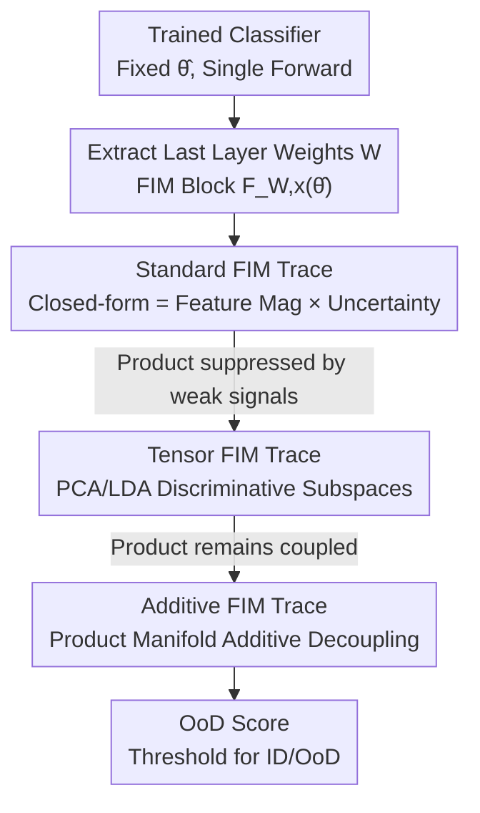

# Fisher-Rao Sensitivity for Out-of-Distribution Detection in Deep Neural Networks

**Conference**: ICLR 2026  
**OpenReview**: [https://openreview.net/forum?id=GEtOzC4MIi](https://openreview.net/forum?id=GEtOzC4MIi)  
**Area**: AI Safety / OOD Detection  
**Keywords**: Out-of-Distribution Detection, Information Geometry, Fisher-Rao Metric, Fisher Information Matrix, Post-hoc Detector

## TL;DR
This paper revisits Out-of-Distribution (OoD) detection through the lens of Riemannian information geometry, treating the network's prediction for an input as a statistical manifold. It is discovered that OoD inputs exhibit **higher local Fisher-Rao sensitivity** at the trained parameters. The authors quantify this sensitivity using the trace of the Fisher Information Matrix (FIM). Theoretically, they derive a "feature magnitude $\times$ output uncertainty" product form that unifies existing OoD signals. Furthermore, using a product manifold construction, they upgrade this into a more robust **additive score**, achieving competitive detection performance with a single forward pass, no retraining, and no OoD data.

## Background & Motivation

**Background**: Deep networks often exhibit **overconfidence** on inputs outside the training distribution—producing high confidence despite incorrect predictions—which is a core obstacle for safety-critical AI deployment. Prevailing OoD detection approaches fall into two categories: those modifying the training process (outlier exposure, activation shaping, Lipschitz constraints, etc.) and **post-hoc** methods—which calculate a score based on features/outputs after inference without altering the model. Post-hoc methods are further divided into "inference-time modifications" (ReAct, DICE, ASH) and "purely analytical" (Mahalanobis, Deep k-NN, ViM, IGEOOD, GradNorm, ODIN), which only read existing values.

**Limitations of Prior Work**: Most purely analytical methods rely on **heuristic** signal combinations—GradNorm uses gradient norms, Energy uses logit energy, and ViM combines feature residuals with logits. While empirically effective, they lack a unified theoretical explanation: why do "feature magnitude" and "output uncertainty," two seemingly unrelated signals, both indicate OoD? Why do SOTA detectors favor **adding** signals rather than **multiplying** them? Work by Igoe et al. even questioned if GradNorm's success is merely a simple combination of these two signals rather than the merit of the gradient itself.

**Key Challenge**: There is a lack of a geometric framework capable of deriving these signals from first principles and explaining their combination mechanisms, leading to method designs based on trial-and-error parameter tuning.

**Goal**: (1) Provide a rigorous derivation for "feature magnitude $\times$ uncertainty" signals using information geometry; (2) explain why SOTA uses additive combinations; (3) construct an theoretically grounded and competitive post-hoc detector.

**Key Insight**: A family of parameterized distributions $p(y|x,\theta)$ forms a statistical manifold equipped with the Fisher-Rao metric. For a fixed input $x$, varying parameters $\theta$ traces a manifold $S_x$. At the trained parameters $\hat\theta$, **local sensitivity** measures how much a "infinitesimal perturbation of $\hat\theta$ changes the prediction." The authors hypothesize that since training optimizes $\hat\theta$ to a stable point for ID data, local sensitivity is low for ID inputs. This stability is learned from ID data and **does not necessarily hold for OoD**, leading to higher sensitivity for OoD inputs.

**Core Idea**: Use the **per-input FIM trace** $\mathrm{Tr}(F_x(\hat\theta))$ as the OoD score—a large trace indicates that small perturbations strongly affect the output (OoD), while a small trace indicates local stability (ID). This geometric intuition is refined into a practical additive detector.

## Method

### Overall Architecture

The method consists of a **multi-stage theoretical derivation chain**: starting from "quantifying sensitivity with FIM trace," the trace is restricted to the last layer weights to obtain a **closed-form solution** (Standard FIM Trace), which happens to equal "feature magnitude $\times$ uncertainty," bridging geometry with heuristics. Since the product form can be suppressed by a single weak signal, the authors use tensor decomposition to restrict the trace to discriminative subspaces (Tensor FIM Trace) and then use **product manifolds** to decouple the product into three independent additive signals (Additive FIM Trace), with hyperparameters determined analytically via variance balancing.

Let the last layer be a linear head $h_{\hat\theta}(x)=W^\top f_{\hat\theta}(x)+b$, where $f_{\hat\theta}(x)\in\mathbb{R}^D$ is the penultimate feature and $p_{\hat\theta}(x)=\mathrm{softmax}(h_{\hat\theta}(x))$ is the $K$-class prediction. Since the full FIM is computationally intractable, the analysis focuses **solely on the FIM block $F_{W,x}(\hat\theta)$ corresponding to the last layer weights $W$**—as it directly controls how high-level features translate into final predictions.

### Key Designs

**1. Standard FIM Trace: Mapping Geometric Sensitivity to a Closed-form Solution**

This serves as the foundation (Theorem 5.1). The pain point is that "feature magnitude" and "uncertainty" have lacked a unified origin. The authors restrict the FIM trace to the coordinate subspace spanned by $W$. Utilizing the fact that the gradient of the linear output layer decomposes as $\nabla_W\log p=(e_y-p_{\hat\theta})f_{\hat\theta}^\top$ (class-dependent term $\otimes$ feature-dependent term), the squared feature norm $\|f_{\hat\theta}\|_2^2$ is factored out. The remaining term $\mathbb{E}_y[\|e_y-p_{\hat\theta}\|_2^2]$ is exactly the multinomial variance $1-\|p_{\hat\theta}\|_2^2$, yielding:

$$\mathrm{Tr}\big(F_{W,x}(\hat\theta)\big)=\|f_{\hat\theta}(x)\|_2^2\,\big(1-\|p_{\hat\theta}(x)\|_2^2\big).$$

This proves that the Fisher-Rao sensitivity of the last layer **equals the product of feature magnitude and output uncertainty**. This bridges information geometry with heuristic scores like GradNorm and Energy, providing them with a geometric derivation. Empirical results on ImageNet/Places365 confirm that OoD scores shift right (higher sensitivity), though overlapping distributions suggest the pure product form is insufficient.

**2. Tensor FIM Trace: Amplifying Separability via PCA/LDA Subspaces**

The standard trace treats **all perturbation directions equally**, yet not all directions differentiate ID from OoD. The key insight is to compute the trace only on a **more discriminative low-dimensional subspace**.

Since the gradient naturally decomposes via tensor products $\mathrm{vec}(\nabla_W\log p)=(e_y-p_{\hat\theta})\otimes f_{\hat\theta}(x)$, the parameter space decomposes accordingly. A subspace is defined using tensor product bases $P=Q\otimes R$, where $Q\in\mathbb{R}^{K\times r_c}$ spans the **probability space** and $R\in\mathbb{R}^{D\times r_f}$ spans the **feature space**. The restricted trace (Prop 5.2) becomes the product of reflected uncertainty $U_{\hat\theta}(x)=\mathrm{Tr}(Q^\top S_{p_{\hat\theta}(x)}Q)$ and projected magnitude $M_{\hat\theta}(x)=\|R^\top f_{\hat\theta}(x)\|_2^2$. The projection matrices are constructed based on the geometry of their respective spaces: $Q$ uses **PCA** on ID softmax distributions to extract principal directions of confusion; $R$ uses **LDA** (with re-orthogonalization) on features to maximize between-class variance and minimize within-class variance, ensuring ID features have high projection norms while OoD features leave significant orthogonal components.

**3. Additive FIM Trace: Decoupling via Product Manifolds and Variance Balancing**

The tensor trace remains a product $U_{\hat\theta}(x)\cdot M_{\hat\theta}(x)$. **Product coupling allows one weak signal to suppress another**, which is why SOTA methods prefer additive combinations. The authors treat the signals as independent sources of geometric sensitivity by modeling a **product manifold** $\mathcal{M}=U\times U \times U$. Total feature energy is split via the Pythagorean theorem into "projected magnitude + residual energy" $\|f_{\hat\theta}\|_2^2=\|R^\top f_{\hat\theta}\|_2^2+\|f_{\hat\theta}-RR^\top f_{\hat\theta}\|_2^2$. The residual $y_{\hat\theta}(x)$ represents feature components unexplained by the learned subspace. On the product manifold, three metrics are defined such that their sum yields the total sensitivity:

$$\mathrm{Tr}(F^\oplus_{W,x}(\hat\theta))=\underbrace{U_{\hat\theta}(x)}_{\text{Uncertainty}}+\lambda_M\underbrace{M_{\hat\theta}(x)}_{\text{Proj. Magnitude}}+\lambda_y\underbrace{\|f_{\hat\theta}(x)-RR^\top f_{\hat\theta}(x)\|_2^2}_{\text{Residual}\;y_{\hat\theta}(x)}.$$

This provides a geometric basis for additive structures in SOTA like ViM. Hyperparameters $(\lambda_M, \lambda_y)$ are determined without OoD labels using the **principle of indifference**: assuming components are independent, weights are set to equalize their contribution to total variance by solving $L=(\mathrm{Var}[\lambda_y y]-\mathrm{Var}[U])^2+(\mathrm{Var}[\lambda_M M]-\mathrm{Var}[U])^2$, yielding analytical solutions $|\lambda|=\sqrt{\mathrm{Var}(U)/\mathrm{Var}(\text{signal})}$. This score also satisfies **reparameterization invariance** (Prop 5.4).

### Loss & Training
The method is purely post-hoc, requiring **no retraining or inference modifications**. The only "fitting" involves sampling a calibration set $D_{val}$ from ID training data (e.g., 50k for ImageNet) to construct the projection matrices $Q$ (PCA), $R$ (LDA), and solve for $\lambda_M, \lambda_y$. The entire pipeline requires only a single forward pass and no exposure to OoD data.

## Key Experimental Results

### Main Results
Using ResNet-50 / ViT-B/16 on ImageNet-1K as the base, with OoD sets including Places365 / ImageNet-O / iNaturalist / SUN. Metrics are AUROC (%) and TNR@TPR95. Below is the AUROC comparison for ViT-B/16:

| Method | ImageNet-O | iNaturalist | Places365 | SUN |
|------|-----------|-------------|-----------|-----|
| Energy Score | 91.72 | 97.85 | 89.05 | 90.57 |
| GradOrth | 93.22 | 98.98 | 89.78 | 93.15 |
| ViM (SOTA Additive) | 92.26 | 98.87 | 90.83 | 93.32 |
| IGEOOD (Info Geo) | 91.66 | 97.89 | 87.31 | 90.32 |
| Standard FIM Trace (Ours) | 89.03 | 96.92 | 86.28 | 88.56 |
| Tensor FIM Trace (Ours) | 90.12 | 97.27 | 86.92 | 90.23 |
| **Additive FIM Trace (Ours)** | **92.61** | **98.82** | **89.51** | **93.38** |

The additive score is on par with ViM and GradOrth, outperforming the standard/tensor versions, validating the motivation to move from product to sum. Results on CIFAR-10/100 demonstrate similar stability and competitiveness.

### Ablation Study

| Configuration | iNaturalist AUROC | Places365 AUROC | Description |
|------|-------------------|------------------|------|
| Standard FIM Trace | 89.74 | 78.92 | Pure product, all parameter directions |
| Tensor FIM Trace | 89.89 | 81.46 | + PCA/LDA discriminative subspaces |
| Additive FIM Trace | **90.61** | **82.93** | + Product manifold additive decoupling |

### Key Findings
- **Additive > Tensor > Standard** holds across all datasets and architectures, confirming that discriminative subspaces and additive decoupling each provide incremental gains.
- **LDA outperforms PCA** for the feature subspace, as it explicitly maximizes class separability, better identifying OoD features as orthogonal residuals.
- The method is **robust to calibration set size**, indicating that subspace estimation does not require exhaustive sampling.
- On ResNet-50, where some baselines fluctuate (e.g., Mahalanobis scoring only 52.01 on iNaturalist), the additive score remains stable, showcasing the reliability of the geometric framework.

## Highlights & Insights
- **Closed-form Unification**: $\mathrm{Tr}(F_{W,x})=\|f\|^2(1-\|p\|^2)$ proves that "feature magnitude" and "uncertainty" are natural decompositions of Fisher-Rao sensitivity, providing theoretical backing for multiple heuristic methods.
- **"Product vs. Sum" Explained**: While SOTA favored additive combinations empirically, this work uses product manifolds to provide the first geometric answer: independent signals on a product manifold result in additive sensitivities.
- **Analytical Hyperparameters**: Variance balancing removes the need for manual tuning or OoD data by using ID statistics to determine weights.
- **Zero-cost Deployment**: Competitive with SOTA like ViM while offering high interpretability and efficiency (single forward pass).

## Limitations & Future Work
- Analysis is restricted to the **last layer weight geometry**. While direct, OoD signals likely manifest in the geometry of deeper layers; extending sensitivity analysis to intermediate representations is a natural next step.
- Performance is "competitive/SOTA-level" rather than a breakthrough—the value lies in **interpretability and stability** rather than significant gains.
- The additive score relies on independence assumptions in the product manifold and variance balancing; performance may degrade if uncertainty and feature signals are strongly coupled.
- Requires an ID calibration set for subspace construction, which is a one-time overhead.

## Related Work & Insights
- **vs. IGEOOD**: IGEOOD uses Fisher-Rao **geodesic distance**; this work uses **local FIM trace (sensitivity/curvature)**, focusing on local stability at the trained point, which proves more effective empirically.
- **vs. GradNorm / GradOrth**: GradNorm uses gradient norms; this work shows that gradient signals are essentially "feature magnitude $\times$ uncertainty" and upgrades them to an additive geometric form.
- **vs. ViM**: ViM uses feature residuals and logits additively; this work provides a geometric justification for such combinations using product manifolds.
- **vs. Global Uncertainty (Ensembles/Bayesian)**: While those methods explore the posterior, this work suggests uncertainty is **locally encoded** in the statistical manifold's geometry, allowing efficient extraction via local analysis.

## Rating
- Novelty: ⭐⭐⭐⭐⭐ 
- Experimental Thoroughness: ⭐⭐⭐⭐ 
- Writing Quality: ⭐⭐⭐⭐ 
- Value: ⭐⭐⭐⭐ 

<!-- RELATED:START -->

<!-- RELATED:END -->

## Related Papers

- [\[ICLR 2026\] AP-OOD: Attention Pooling for Out-of-Distribution Detection](ap-ood_attention_pooling_for_out-of-distribution_detection.md)
- [\[ICLR 2026\] Fingerprinting Deep Neural Networks for Ownership Protection: An Analytical Approach](fingerprinting_deep_neural_networks_for_ownership_protection_an_analytical_appro.md)
- [\[ICLR 2026\] GradPCA: Leveraging NTK Alignment for Reliable Out-of-Distribution Detection](gradpca_leveraging_ntk_alignment_for_reliable_out-of-distribution_detection.md)
- [\[ICLR 2026\] Benchmarking Stochastic Approximation Algorithms for Fairness-Constrained Training of Deep Neural Networks](benchmarking_stochastic_approximation_algorithms_for_fairness-constrained_traini.md)
- [\[ICLR 2026\] SCOPED: Score–Curvature Out-of-Distribution Proximity Evaluator for Diffusion](scoped_scorecurvature_out-of-distribution_proximity_evaluator_for_diffusion.md)

<!-- RELATED:END -->
