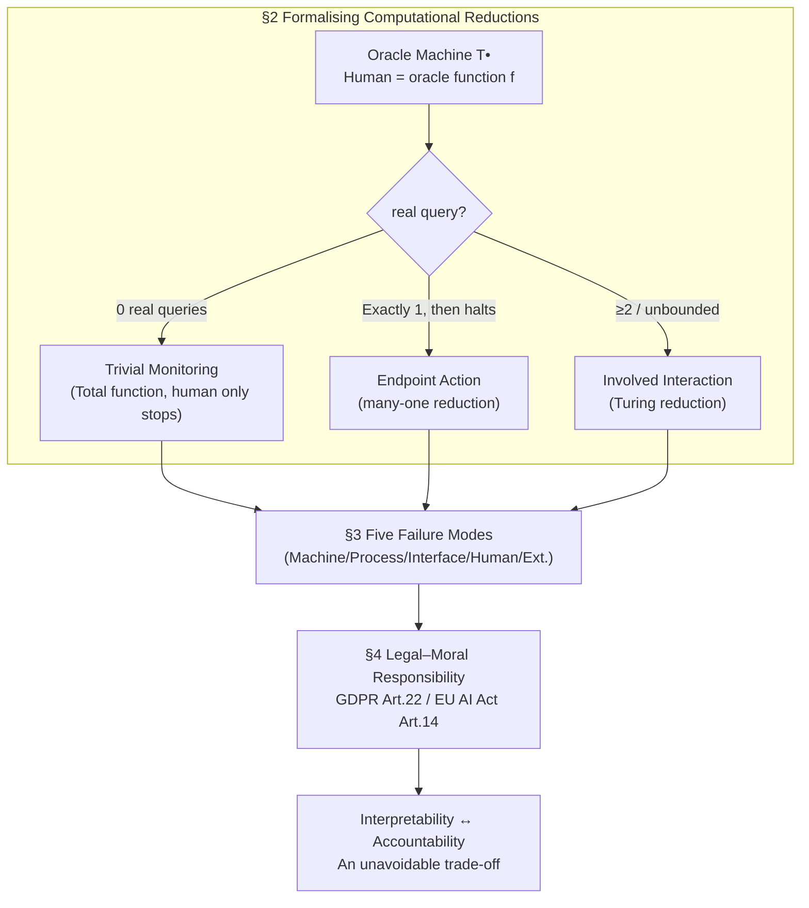

# Formalising Human-in-the-Loop: Computational Reductions, Failure Modes, and Legal–Moral Responsibility

**Conference**: ICLR 2026  
**OpenReview**: [https://openreview.net/forum?id=KR8viVTrX4](https://openreview.net/forum?id=KR8viVTrX4)  
**Code**: None (Purely theoretical/legal analysis)  
**Area**: AI Safety / Human-AI Collaboration / AI Governance & Responsibility  
**Keywords**: Human-in-the-Loop, Computability Theory, Oracle Machines, Computational Reductions, Failure Mode Classification, Legal Responsibility, GDPR, EU AI Act  

## TL;DR
This paper utilizes the concepts of oracle machines and "reductions" from computability theory to rigorously formalize diverse Human-in-the-Loop (HITL) human oversight schemes into three categories—Trivial Monitoring, Endpoint Action, and Involved Interaction. Based on this, it establishes a failure mode classification system and analyzes blind spots in UK/EU laws, ultimately revealing an unavoidable "Accountability ↔ Technical Interpretability" trade-off.

## Background & Motivation

**Background**: In AI safety and regulatory discourse, "Human-in-the-Loop (HITL)" is treated almost as a universal safeguard—GDPR Article 22 and EU AI Act Article 14 codify "human oversight" into law as a core protection against harm from Automated Decision-Making Systems (ADMS). A plethora of terms has emerged in academia: HOTL (Human-on-the-loop), HOOTL (Human-out-of-the-loop), HIC (Human-in-command), MHC (Meaningful Human Control), etc.

**Limitations of Prior Work**: These concepts overlap yet remain fragmented, lacking a unified and precise formal definition. Consequently, "HITL" has become a vague label—a company can implement "tokenistic HITL" human review to claim regulatory compliance, while regulators can neither verify if the "human" is actually effective nor distinguish the vast differences in safety between different schemes. Worse, when systems fail, the human in the loop often becomes what Elish calls a "moral crumple zone," taking the blame for flawed machines (e.g., the Uber self-driving case where responsibility fell entirely on the safety driver).

**Key Challenge**: Law assumes "human oversight = safety," but the effectiveness of HITL **critically depends on the specific technical design of the system**. Under the same "HITL" label, human capabilities can range from "only pressing an emergency stop" to "deep collaboration with the machine," yet existing laws only focus on the final and weakest forms of oversight.

**Goal**: To answer "when, if, and how should HITL be used to truly reduce harm and risk," transforming HITL from a vague slogan into a formal object that is analyzable, verifiable, and legally actionable.

**Core Idea**: **Model the "human" as an "oracle" called by a machine** using oracle machines—the machine is a deterministic automaton $T^\bullet$, and human judgment is the oracle function $f$. The frequency and manner in which the machine calls the human correspond to two classical reductions in computability theory (many-one reduction and Turing reduction), thereby placing "human involvement" into a spectrum with a rigorous mathematical definition.

## Method

### Overall Architecture

This is not an algorithmic paper, but a **formal analysis framework** consisting of three interconnected parts: first, formalizing HITL into three computational reduction types using oracle machines (§2); next, building a two-dimensional failure mode classification system on top of these types (§3); and finally, mapping these dimensions to UK/EU law to reveal responsibility trade-offs (§4). The logical chain is: **Computational structure determines what humans can do → What humans can do determines how things fail → Failure modes determine how law should allocate responsibility**.

### Key Designs

**1. Formalizing "Human" as an oracle and distinguishing genuine involvement via "real query"**: The foundation of the framework models the algorithm as an oracle machine $T^\bullet$—a deterministic automaton with a work tape, an extra "oracle tape," and specific "oracle states." When the machine enters an oracle state, the content $w$ on the oracle tape is instantly replaced by $f(w)$, where $f$ represents the human judgment (a "human query"). The key is not just calling the human, but whether the call is "actually useful." This paper defines a **real query**—a query is "real" if and only if the computation tree branches at that oracle call point and not all branches lead to the same set of outputs. This definition elegantly excludes two types of "token participation": one where the machine ignores the human's answer, and another ("all roads lead to Rome") where the machine produces the same result regardless of the human's input. Furthermore, humans can write an emergency stop symbol $!$ at any time, which terminates the machine with no output; however, this "stop" is excluded from the output set for determining a real query, strictly separating the "ability to halt" from the "ability to influence computation."

**2. Three reduction categories: Trivial Monitoring / Endpoint Action / Involved Interaction**: Based on real queries, the paper classifies all HITL into three types by the number of real queries issued. If the machine never issues a real query (human can at most halt), it is **Trivial Monitoring**—here $T^\bullet$ defines a **total function independent of the human**, placing the human in a position where they can only terminate the process before completion without true insight. If the machine issues **exactly one** real query and halts, outputting the human's answer, it is **Endpoint Action**—this corresponds to a **many-one reduction** from $g$ to $f$ (the machine reduces the problem to the human but is not a total function itself). If the machine issues **potentially unbounded (at least two)** real queries, engaging in "computational ping-pong" with the human, it is **Involved Interaction**—this corresponds to a **Turing reduction** (the machine Turing-reduces the calculation to the human, but not via many-one reduction). The paper emphasizes that the setup type is determined by the **shortest** potential path in the computation tree (the human's "agency lower bound"), not the longest. A path-planning example illustrates this: machine gives one route for human acceptance/rejection (Trivial Monitoring), gives several routes for human selection (Endpoint Action), or collaborates throughout the process from departure time to route optimization (Involved Interaction).

**3. The counter-intuitive "Weak Reduction is Better" proposal and increasing interpretability**: In pure computability theory, Turing reduction is seen as "weaker" than many-one reduction. However, this paper argues tasks in HITL scenarios demand the opposite: by **fixing the oracle (human)** and asking "what problems can be solved with this human," **Involved Interaction (Turing reduction) allows solving the most problems with the same person**, granting the human maximal agency, alignment, and safety potential. Furthermore, more real queries "unmask" the machine's "black box": each real query corresponds to a human-comprehensible question, revealing information about what the machine is currently doing. Trivial Monitoring is a single large black box; Endpoint Action unmasks one step at the end; Involved Interaction transforms the process into "a chain of many small black boxes linked by human inputs," where each small box is more interpretable. This "computational chain" directly informs the responsibility analysis in §4.3.

**4. 2D Failure Mode Classification linked to reduction types**: Synthesizing ethics consulting experience with startups and literature from 2020–2022, the paper proposes **five failure categories** ordered by "amount of human-ness" from purely digital to purely social: ① Machine component failure (abnormal inputs/outputs, biased/erroneous output, problematic adaptation); ② Process and workflow failure (insufficient human power/control/reaction time, unrealistic expectations, delayed notifications); ③ Human-machine interface failure (unintelligible output, poor UI, insufficient training); ④ Human component failure (cognitive bias, automation bias, fatigue, lack of courage, stress overload); ⑤ Exogenous failure (unreasonable laws, social expectations, workplace requirements). The Key Insight is that **different reduction types are prone to different failures**: Trivial Monitoring, due to the human's passive role, easily triggers human component failures like automation bias and fatigue; Endpoint Action concentrates risk at the single interaction point, making interface failures and single-point cognitive biases fatal; Involved Interaction provides maximal human intervention power, but the complex back-and-forth makes failure mechanisms more intricate, potentially leading to "quantity masquerading as quality" (many shallow interactions never truly changing the output). The Uber fatal crash is used as a case study, showing how its failure spanned all five categories.

**5. Legal blind spots and the "Interpretability ↔ Accountability" trade-off**: Mapping the formalization to law, the paper finds that GDPR Article 22 (governing "solely automated decision-making") and EU AI Act Article 14 (requiring "meaningful/effective oversight") essentially only recognize Endpoint Action level involvement and focus only on the human at the very end of the process. The paper argues that law should require stronger reductions (Involved Interaction) to count as "meaningful," as only then can humans truly fulfill safeguarding duties. However, an **unavoidable trade-off** emerges: while Involved Interaction improves transparency by recording every query and answer, the deep entanglement of human and machine makes tracing "which decision point caused the failure" nearly impossible, creating an **accountability gap**. Conversely, in Trivial Monitoring/Endpoint Action, human influence is clearly attributable but the system is a deeper black box. In short: **The more interpretable the HITL, the harder it is to assign responsibility; the easier it is to assign responsibility, the more "black box" the HITL**. The paper draws inspiration from the UK asbestos/mesothelioma cases (apportioning liability based on exposure ratio) for "accountability gap" cases, opposing treating humans as scapegoats to protect corporations as in the Uber case.

## Key Experimental Results

This is a **purely theoretical and legal analysis** paper with no quantitative experiments. Its arguments are supported by formal definitions, real-world case studies, and legal textual analysis. The core conclusions are summarized below.

### Comparison of the Three HITL Reduction Types

| Dimension | Trivial Monitoring | Endpoint Action | Involved Interaction |
|------|------|------|------|
| Computational Reduction Type | Total Function (Human Independent) | many-one reduction | Turing reduction |
| Number of real queries | 0 (Emergency stop only) | Exactly 1 | Potentially unbounded (≥2) |
| Human Agency | Lowest | Medium | Highest |
| Interpretability | Single large black box | Unmasked one step at the end | Chain of small boxes, Highest |
| Accountability Clarity | Clear | Clear | Blurred (Accountability Gap) |
| GDPR/AI Act Compliance | Generally fails "Meaningful" | Barely meets "Meaningful" | Ours: Should be the target |
| Typical Patterns | HOTL, Thumbs up/down | Recommendation System | Human-AI collab, LLM co-creation |

### Key Findings

- **Unification**: The three reduction types unify scattered terms like HOTL/HOOTL/HIC/MHC, providing regulators with a consistent testing framework to identify "tokenistic" HITL.
- **Counter-intuitive Conclusion**: Turing reduction (Involved Interaction), though "weaker" in pure theory, is optimal in HITL contexts—it solves the most problems and provides the most agency and interpretability.
- **Joint Analysis**: Reduction types and the five failure categories must be **considered simultaneously**—ignoring an entire failure category almost certainly leads to failure.
- **Legal Blind Spot**: GDPR/AI Act only recognize up to Endpoint Action, ignoring substantive human intervention at earlier stages; the SCHUFA credit scoring case showed a weak Endpoint Action being ruled as Trivial Monitoring.
- **Core Trade-off**: Interpretability and Accountability are naturally opposed in HITL; legislation must face this when aiming to "encourage better HITL."
- **Six Recommendations**: ① Specify HITL computational type; ② Avoid "plug-in" HITL, require deep integration; ③ Develop oversight guidelines specific to HITL types; ④ Match expectations to human capability; ⑤ Prevent humans from becoming "moral crumple zones"; ⑥ Understand the trade-off to allocate liability more granularly.

## Highlights & Insights

- **Precise Interdisciplinary Grafting**: Applying oracle machines and reductions from computability theory to AI governance is highly original, and the "real query" definition perfectly captures "genuine participation."
- **Perspective Shift on "Weak Reductions"**: The insight that Turing reduction is a superior HITL form because of the fixed-oracle constraint is a brilliant theoretical flip.
- **Complete Formal-to-Legal Loop**: Few papers trace a path from abstract math to specific legal advice, anchored by real cases (Uber, Notre-Dame, SCHUFA).
- **Revealing a Real Trade-off**: The paper honestly admits that Involved Interaction introduces its own "accountability gap," avoiding the "silver bullet" fallacy.

## Limitations & Future Work

- **Practical Identification of Reduction Types**: Proving "no simpler reduction exists" is technically difficult and hard to verify in legal/ethical settings; the suggestion to shift the burden of proof to developers remains to be tested.
- **Thin Empirical Foundation**: The failure mode classification is based on limited consulting experience and literature rather than large-scale empirical testing; its "completeness" is more of an assertion.
- **Focus on Extremes**: The paper focuses on three distinct types, leaving intermediate forms (like bounded truth-table reductions) to the appendix.
- **UK/EU-Centric Analysis**: The legal analysis is limited to GDPR and the EU AI Act; adaptability to other jurisdictions (like the US) is an open question.
- **Future Work**: Combine learning mechanisms (learning to defer, conformal prediction) with the reduction framework to trigger real queries automatically; operationalize asbestos-case liability apportionment for HITL.

## Related Work & Insights

- **Computability Theory**: Oracle machines and Turing/many-one reductions (Soare 1987; van Melkebeek 2000) are the direct sources of formalization.
- **HITL Taxonomies**: Meaningful Human Control, moral crumple zone (Elish 2019), Human-centric computing (Yuen et al. 2009); this paper unifies these and notes that existing design patterns (Andersen & Maalej 2024) are mostly Endpoint Action or Trivial Monitoring.
- **AI Oversight Theory**: Sterz et al. (2024) proposed four conditions for effective oversight; this paper makes them operational by mapping them to reduction types.
- **Legal Accountability**: Matthias (2004) on accountability gaps, UK asbestos cases (House of Lords 2006).
- **Insight**: For AI safety researchers, HITL is a mathematical spectrum, not a boolean toggle. For interpretability researchers, the tension with accountability is a critical challenge.

## Rating
- **Novelty**: ⭐⭐⭐⭐⭐ (Formalizing HITL via computability is a truly original interdisciplinary perspective).
- **Experimental Thoroughness**: ⭐⭐⭐ (Theoretical/legal analysis; case studies are solid but the failure classification needs more empirical backing).
- **Writing Quality**: ⭐⭐⭐⭐⭐ (Logical chain is tight, case anchors are clear, interdisciplinary expression is smooth).
- **Value**: ⭐⭐⭐⭐⭐ (Provides a unified language for AI governance and compliance in the EU AI Act era).

<!-- RELATED:START -->

## Related Papers

- [\[ICLR 2026\] MoReBench: Evaluating Procedural and Pluralistic Moral Reasoning in Language Models, More than Outcomes](morebench_evaluating_procedural_and_pluralistic_moral_reasoning_in_language_mode.md)
- [\[ICLR 2026\] PluriHarms: Benchmarking the Full Spectrum of Human Judgments on AI Harm](pluriharms_benchmarking_the_full_spectrum_of_human_judgments_on_ai_harm.md)
- [\[ACL 2025\] PrivaCI-Bench: Evaluating Privacy with Contextual Integrity and Legal Compliance](../../ACL2025/ai_safety/privacibench_evaluating_privacy_with_contextual_integrity.md)
- [\[ICLR 2026\] Fair Decision Utility in Human-AI Collaboration: Interpretable Confidence Adjustment for Humans with Cognitive Disparities](fair_decision_utility_in_human-ai_collaboration_interpretable_confidence_adjustm.md)
- [\[ICLR 2026\] Generative Adversarial Post-Training Mitigates Reward Hacking in Live Human-AI Music Interaction](generative_adversarial_post-training_mitigates_reward_hacking_in_live_human-ai_m.md)

<!-- RELATED:END -->
