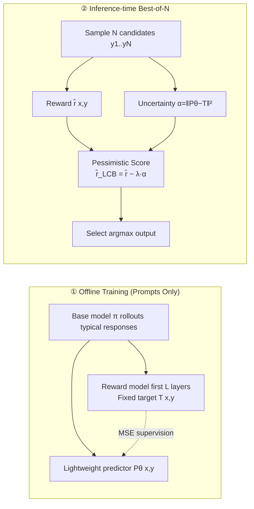

# From Curiosity to Caution: Mitigating Reward Hacking for Best-of-$N$ with Pessimism

**Conference**: ICLR 2026  
**OpenReview**: [https://openreview.net/forum?id=EZn2TmBBfF](https://openreview.net/forum?id=EZn2TmBBfF)  
**Code**: To be confirmed  
**Area**: AI Safety / Alignment (Inference-time Reward Hacking Mitigation)  
**Keywords**: Best-of-N, Reward Hacking, Pessimism, Uncertainty Estimation, RND, OOD Detection  

## TL;DR
This paper reverses the idea of using "curiosity" reward prediction error as an exploration signal in Reinforcement Learning. Instead, it trains a predictor to fit the internal features of a reward model on typical responses and uses the prediction error as an "out-of-distribution uncertainty" penalty for reward scores. This ensures that Best-of-$N$ sampling no longer degrades as $N$ increases but rather improves monotonically.

## Background & Motivation
- **Background**: Inference-time scaling is a dominant paradigm for improving LLM performance. Best-of-$N$ (BoN) sampling is its simplest and most effective method—sampling $N$ candidate responses for a prompt, scoring them with a reward model $\hat r$, and outputting the one with the highest score. Intuitively, a larger $N$ should lead to better answers.
- **Limitations of Prior Work**: The upper bound of BoN is strictly capped by the quality of the reward model $\hat r$. In practice, an "inverted U-curve" is commonly observed—performance worsens after $N$ exceeds a certain threshold. This is **reward hacking**: BoN increasingly favors "atypical" responses that exploit $\hat r$'s flaws (e.g., formatting preferences, surface patterns) rather than being truly high-quality. This essentially reflects Goodhart's Law (when a measure becomes a target, it ceases to be a good measure).
- **Key Challenge**: Existing mitigation methods face a trade-off. One approach is to **build stronger reward models**, but "exhausting all hacking strategies" is naturally asymmetric and infeasible. Another approach is **distribution-level regularization** by Huang et al. (2025b), which constrains the sampling distribution to be close to the base policy $\pi$. While theoretically sound, it is **overly conservative**—it penalizes all OOD responses equally, rejecting "slightly OOD but genuinely better" responses and wasting the benefits of inference-time scaling.
- **Goal**: Design a BoN scheme that is resistant to reward hacking while fully harvesting the benefits of inference-time scaling.
- **Core Idea**: **[Inference-time Instantiation of Pessimism]** Borrowing the pessimism principle from RL—using the lower confidence bound of value estimates to avoid OOD actions with uncertain rewards. The key innovation is moving pessimism from "distribution-level" down to "per-response reward-level": estimating an uncertainty $\alpha(x,y)$ for each response, subtracting it from $\hat r$, and selecting the one with the highest pessimistic score. The source of $\alpha$ is the "dual" of curiosity—**curiosity rewards prediction error (encouraging novelty exploration), whereas caution penalizes prediction error (treating it as a signal of distribution uncertainty)**.

## Method

### Overall Architecture
The method is called **caution**, the dual of curiosity. During the offline training phase: the hidden states of the first $L$ layers of the reward model are used as a fixed target network $T(x,y)$, and a lightweight predictor $P_\theta(x,y)$ is trained to fit them. The supervision data consists of responses rolled out by the base model $\pi$ on training set prompts (no labeling required). During inference: for $N$ candidates, the prediction error $\alpha(x,y)=\|P_\theta-T\|^2$ is used as an uncertainty penalty. Results are reranked by the pessimistic reward $\hat r_{\text{LCB}}=\hat r-\lambda\alpha$, and the highest score is selected. This adds only two parallelizable lightweight forward passes alongside the original $\hat r$, with overhead comparable to calculating $\hat r$.

### Key Designs

**1. Downshifting "distribution-level pessimism" to "per-response reward-level pessimism" to address over-conservatism.** Huang et al. (2025b) constrain the sampling policy $\hat\pi$ to be close to $\pi$ at the distribution level. The issue is that it **penalizes all possible OOD responses equally**, regardless of whether the response originates from a flaw in $\hat r$. Ours instead regularizes the reward estimate directly: designing an uncertainty function $\alpha:\mathcal X\times\mathcal Y\to\mathbb R_{\ge 0}$ to measure the confidence in $\hat r(x,y)$, yielding the pessimistic reward $\hat r_{\text{LCB}}(x,y)=\hat r(x,y)-\lambda\alpha(x,y)$, and finally selecting $\hat i=\arg\max_{i\in[N]}\hat r_{\text{LCB}}(x,y_i)$. As long as $\alpha$ is small for typical samples and large for atypical ones, it ensures $\hat r_{\text{LCB}}\le r^\star$ and approximately equals $r^\star$ for truly high-quality responses—penalties are precisely applied to "suspicious responses" without harming "slightly OOD but better" ones.

**2. caution—an offline dual of curiosity, using prediction error as an OOD detector.** The core of curiosity (RND, Pathak et al. 2017; Burda et al. 2018) is to continuously train a predictor to fit a fixed target, using supervision error as a novelty signal to encourage exploration; OOD states are beneficial in online RL. The offline scenario in this paper is the opposite—OOD responses must be avoided because $\hat r\approx r^\star$ only holds for typical responses of $\pi$. Thus, it inherits the "prediction error as OOD signal" core but remains **completely offline**: the fixed target $T(x,y)=h^R_L(x,y)$ is the hidden state of the $L$-th layer of the reward model, and the trainable predictor $P_\theta$ fits it using MSE $L(\theta)=\mathbb E_{(x,y)\sim D_{\text{train}}}\big[\|P_\theta(x,y)-T(x,y)\|^2\big]$. Since it lacks the continuous training of student networks required in online RL, it saves memory and time overhead and is extremely simple to implement. $P_\theta$ can flexibly use lightweight structures (shared embeddings / simplified encoders / projection layers).

**3. Distilling reward model features rather than random network features is the winning move over traditional RND.** Traditional RND fits the output of a **randomly initialized** network, where the OOD signal is unrelated to "reward reliability." This paper intentionally sets the target as the **reward model's own internal representations**, making $\alpha$ a "reward-aware" uncertainty—high prediction error corresponds to regions where $\hat r$ is unreliable. Ablations (Table 2) show that with the same $\lambda$, distilling RM features significantly outperforms distilling random features: at $\lambda=0.8$, caution achieves a peak of 82.1% and a final of 81.0%, while traditional RND reaches only 78.1% / 74.9%. Training data requires only prompts (much cheaper than high-quality labels for RM training), and the authors found OOD detection is quite robust to prompt distribution.

**4. Theoretical guarantees under a simplified linear setting.** In a simplified setting where $y_i\in\mathbb R^d$ are independently sampled and $r^\star$ is linear (Theorem 1 / Appendix Theorem 3), let $i^\star$ be the optimal response, $\hat i$ be the standard BoN choice, and $i_{\text{pess}}$ be the caution choice. Under appropriate conditions for the target network, $r^\star$, $\hat r$, $\pi$, and the predictor, we have $\mathbb E[r^\star(y_{i_{\text{pess}}})-r^\star(y_{\hat i})]\gtrsim\sqrt{\log N}$ (advantage over BoN grows with $N$), and $\lim_{N\to\infty}\mathbb E[r^\star(y_{i^\star})-r^\star(y_{i_{\text{pess}}})]/\mathbb E[r^\star(y_{i^\star})]=0$ (asymptotic optimality). The authors claim this is the first theoretical guarantee for curiosity/RND-style methods used for OOD detection. $\lambda$ controls pessimism intensity; $\lambda=0$ reduces to standard BoN.

## Key Experimental Results

Experiments used Llama-3.2-3B-Instruct as the base model $\pi$, OASST as the primary reward model, and $r^\star$ as binary (answer correctness). vLLM was used for sampling with 3 bootstrap runs for confidence intervals. The predictor was trained only on GSM8K training set rollouts.

### Main Results
$N$ ranges from 1 to 512, comparing RM, Pessimism-only, and RM+Pessimism (Peak = Highest accuracy, Final = Accuracy at $N{=}512$, Degr. = Drop from peak to final, lower is better):

| Method | GSM8K Peak | GSM8K Final | Degr. | MATH-500 Peak | MATH-500 Final | Degr. | BBH-Hard Peak | BBH-Hard Final | Degr. |
|---|---|---|---|---|---|---|---|---|---|
| Reward Model | 79.3 | 71.5 | 7.7 | 11.5 | 8.5 | 3.0 | 17.3 | 1.7 | 15.6 |
| Pessimism Only | 81.3 | 80.3 | **1.0** | **13.6** | **11.9** | 1.7 | **22.9** | **22.1** | **0.9** |
| RM + Pessimism | **82.6** | **81.1** | 1.5 | 12.3 | 10.1 | 2.3 | 18.5 | 11.0 | 7.5 |

Since the predictor was trained only on GSM8K, MATH-500 is out-of-distribution (OOD) and BBH-Hard is entirely out-of-domain. On GSM8K, caution's peak is 4.2% higher and final is 15.5% higher than pure RM, showing monotonic improvement with $N$.

### Ablation Study
Scanning pessimism intensity $\lambda$ on GSM8K, comparing distillation of RM features (Ours) vs. random networks (traditional RND):

| $\lambda$ | Caution Peak | Caution Final | RND Peak | RND Final |
|---|---|---|---|---|
| 0.0 (RM Only) | 78.9 | 71.2 | 78.9 | 71.2 |
| 0.4 | 80.3 | 76.0 | 78.5 | 72.1 |
| 0.6 | 81.5 | 80.2 | 78.4 | 73.1 |
| 0.8 | **82.1** | **81.0** | 78.1 | 74.9 |
| 1.0 (Caution Only) | 81.3 | 79.8 | 77.0 | 72.9 |

Predictor architecture ablation (Table 3): Lightweight architectures actually outperformed "full" ones—Lightweight+Separate Emb. achieved an 82.7% peak, whereas the Full architecture generalized poorly (peak only 80.3%) despite lower reconstruction loss (0.127 vs. 0.24).

### Key Findings
- **The harder the task and the less reliable the reward model, the better pure pessimism performs**: On MATH-500 and BBH-Hard, Pessimism-only outperformed RM+Pessimism. On BBH-Hard, RM nearly collapsed (final 1.7%) because spurious correlations dominated far outside the training distribution; caution maintained a stable 22.1% final accuracy by "staying close to the familiar distribution."
- caution remains monotonic throughout, completely eliminating the "inverted U-curve" of reward hacking and outperforming Huang et al. (2025b)—the latter is monotonic but struggles to exceed standard BoN at its optimal $N$.
- Low reconstruction loss $\neq$ better downstream performance: Overfitting RM features weakens OOD discriminability; lightweight predictors generalize better.

## Highlights & Insights
- **Elegant Conceptual Duality**: curiosity uses reward prediction error for exploration, while caution uses it for avoidance—the same RND mechanism, with a sign flip, transitions from "online exploration" to "offline OOD detection," and the offline setting removes engineering burdens.
- **"Reward-aware Uncertainty" is the Real Key**: Distilling the reward model's own features (rather than a random network) aligns uncertainty signals with "where the reward is unreliable," which is the fundamental reason it crushes traditional RND.
- **Ultra-low Cost**: Only two additional parallelizable forward passes are needed, reusing $\hat r$ features with almost zero extra overhead; training requires only prompts without expensive labeling.
- Provides the first theoretical guarantee for curiosity/RND-style methods in OOD detection, elevating an empirical trick to a provable improvement for BoN.

## Limitations & Future Work
- **Idealized Theoretical Setup**: Theorem 1 relies on linear rewards, i.i.d. sampling, and strong assumptions about target/predictor networks, which is far from real autoregressive LLMs and serves only as a proof-of-concept.
- **Hyperparameter $\lambda$ Tuning**: The optimal $\lambda$ shifts with task difficulty (approx. 0.8 for GSM8K, while hard tasks favor pure pessimism/higher $\lambda$), and an adaptive selection mechanism is lacking.
- **RM can become a burden cross-domain**: Adding $\hat r$ on BBH-Hard actually hindered performance, indicating the method cannot yet automatically decide "when to trust the reward vs. distribution similarity."
- **Limited Evaluation Scale**: Primarily validated on 3B models and math/reasoning tasks; effectiveness on larger models, open-ended generation, and safety alignment requires further validation.
- **Empirical Designs**: Layer selection $L$ and predictor structure remain largely empirical and lack systematic guidance.

## Related Work & Insights
- **Reward Hacking and Mitigation**: Gao et al. (2023) and Huang et al. (2025b) characterized BoN over-optimization; this paper proposes more precise per-response reward-level pessimism compared to the distribution-level regularization of Huang et al. (2025b).
- **Pessimistic RL**: The LCB pessimism principle from Jin et al. (2021) and Guo et al. (2022) is instantiated for inference-time BoN selection for the first time.
- **Curiosity / RND**: The intrinsic reward mechanism of Pathak et al. (2017) and Burda et al. (2018) is "reversed" as an OOD penalty, providing a paradigm for transferring online exploration tools to offline selection.
- **Mechanism**: Prediction error as distribution uncertainty is a lightweight, universal OOD signal. The idea of "distilling the supervised model's own features for task-aware uncertainty" can be generalized to RAG filtering, safety refusals, and agent action selection.

## Rating
- Novelty: ⭐⭐⭐⭐ —— The duality of curiosity/caution is a fresh perspective. Moving pessimism to the reward level and distilling RM features for reward-aware uncertainty is an insightful combination.
- Experimental Thoroughness: ⭐⭐⭐ —— Covers ID/OOD/Cross-domain across three datasets with thorough $\lambda$ and architecture ablations, though limited to a single 3B model and reasoning tasks.
- Writing Quality: ⭐⭐⭐⭐ —— Clear motivation, fitting dual metaphor, intuitive figures, and natural transition between theory and evidence.
- Value: ⭐⭐⭐⭐ —— Effectively eliminates BoN reward hacking at ultra-low cost. Highly practical and provides the first theoretical support for curiosity-style OOD detection, relevant for both inference-time scaling and alignment.

<!-- RELATED:START -->

## Related Papers

- [\[ICLR 2026\] Robust Optimization for Mitigating Reward Hacking with Correlated Proxies](robust_optimization_for_mitigating_reward_hacking_with_correlated_proxies.md)
- [\[ICLR 2026\] Generative Adversarial Post-Training Mitigates Reward Hacking in Live Human-AI Music Interaction](generative_adversarial_post-training_mitigates_reward_hacking_in_live_human-ai_m.md)
- [\[ICLR 2026\] Beware Untrusted Simulators -- Reward-Free Backdoor Attacks in Reinforcement Learning](beware_untrusted_simulators_--_reward-free_backdoor_attacks_in_reinforcement_lea.md)
- [\[ICLR 2026\] Mitigating Privacy Risk via Forget Set-Free Unlearning](mitigating_privacy_risk_via_forget_set-free_unlearning.md)
- [\[ICLR 2026\] Robust Fine-Tuning from Non-Robust Pretrained Models: Mitigating Suboptimal Transfer with Epsilon-Scheduling](robust_fine-tuning_from_non-robust_pretrained_models_mitigating_suboptimal_trans.md)

<!-- RELATED:END -->
