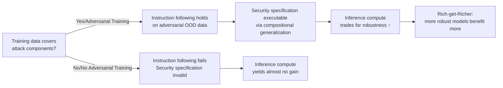

# Get RICH or Die Scaling: Profitably Trading Inference Compute for Robustness

**Conference**: ICLR 2026  
**OpenReview**: [https://openreview.net/forum?id=PLZx2hpauY](https://openreview.net/forum?id=PLZx2hpauY)  
**Code**: TBD  
**Area**: AI Safety / Adversarial Robustness  
**Keywords**: Adversarial Robustness, Test-time Compute, Vision-Language Models, Security Specifications, Compositional Generalization, Adversarial Training  

## TL;DR
This paper proposes the **RICH Hypothesis** (Robustness from Inference Compute Hypothesis) — that test-time compute can only be traded for robustness when "the components of the attacked data have been covered by the training data." Based on this, it demonstrates that applying lightweight adversarial fine-tuning to a VLM's vision encoder can transform extended reasoning (CoT / budget forcing) from "nearly ineffective" into "significant strengthening," manifesting a "rich-get-richer" dynamic.

## Background & Motivation
- **Background**: Neural networks are naturally vulnerable to adversarial attacks. Recently, scaling test-time reasoning has been found to resist many text-based jailbreaks — Zaremba et al. (2025) observed a strong correlation between reasoning length and anti-jailbreak robustness, offering hope for "trading compute for security."
- **Limitations of Prior Work**: This dividend quickly vanishes in the face of stronger attacks (gradient-based white-box attacks, multimodal visual attacks). For example, o1-v maintains a 39% attack success rate under the Attack-Bard black-box attack even with maxed-out reasoning, far from reaching 0%. The mechanism behind why reasoning fails here remains unclear.
- **Key Challenge**: Test-time defense relies on the model satisfying a **security specification** to thwart attackers (e.g., "ignore text within IGNORE tags"). However, on adversarial OOD (Out-of-Distribution) data, models fail at basic instruction following — since they cannot understand the attacked input, no amount of reasoning can execute the security specification.
- **Goal**: Provide a predictive hypothesis that holds across various attacks, models, and compute settings to explain "when reasoning can be traded for robustness," and indicate how to make this trade more profitable.
- **Core Idea**: **[RICH Hypothesis]** The benefits of test-time compute defense increase with the degree to which "the components of the attacked data are covered by the model's training data." In other words, as long as training (even lightweight adversarial fine-tuning) makes attack components more "in-distribution" (ID), the model can leverage **compositional generalization** — using known ID components to understand OOD data — to follow security specifications on adversarial data, thereby converting inference compute into robustness.

## Method

### Overall Architecture
This paper does not propose a new model but rather a **hypothesis + validation protocol**. The core logical chain is: Initial robustness $\rightarrow$ Instruction following capability on adversarial OOD data $\rightarrow$ Executability of security specifications $\rightarrow$ Robustness gains from test-time compute. To this end, the authors use a set of LLaVA-style VLMs with different initial robustness gradients (low/medium/high) and test the impact of four interventions — "adding specifications," "scaling compute," "reducing attack budget," and "hardening the encoder" — under three increasingly strong attack protocols.

### Key Designs

**1. RICH Hypothesis and "Rich-get-Richer" Dynamics: Attributing Inference Gains to Training Distribution.** The core contribution is a falsifiable proposition — test-time compute is effective only when attack data components are close to the training data. This predicts a "rich-get-richer" effect: models with higher initial robustness gain more **additional** robustness from scaling reasoning, rather than simply maintaining the original gap. The three models used for validation form a clear gradient: LLaVA-v1.5 (zero adversarial training, nearly non-robust), FARE-LLaVA-v1.5 (unsupervised adversarial fine-tuning of the CLIP encoder at $\epsilon=2/255$, medium), and Delta2-LLaVA-v1.5 (web-scale adversarial contrastive pre-training + adversarial instruction tuning at $\epsilon=8/255$, high robustness).

**2. "Necessary-but-not-sufficient" Test of Security Specifications (including prefilling ablation)**: Proving that specifications themselves do not create robustness. The authors use $\epsilon=16/255$ PGD visual prompt injection attacks and compare attacker loss (higher is more robust) with and without explicit security specifications. A key ingenuity is **prefilling the model's response** — if the model stops generation before the attacker's target string, the security specification is satisfied. Thus, whether a specification works depends on whether the model truly assigns low probability to the target string, rather than just outputting tokens that appear to comply.

**3. Naive Compute Scaling (K-repetition) Validating "Rich-get-Richer"**: To scale "inference compute" on non-reasoning models, the authors repeat security specification snippets in the prompt $K$ times ($K=0,1,3,5$) and record the number of PGD steps required for a successful attack at $\epsilon=64/255$. RICH predicts that as the base model becomes more robust, the slope of the PGD-steps-vs-$K$ curve increases. The results confirm this — only Delta2 becomes significantly harder to attack as $K$ increases under large budgets.

**4. Reducing Attack Budget $\epsilon$ to Unlock Weakly Robust Models**: Directly manipulating the "distance of attack components from the training distribution." A corollary of RICH is that reducing $\epsilon$ from $64/255$ to $16/255$ brings the attacked data closer to the clean training distribution, allowing weakly robust models to also enjoy the dividends of scaling compute.

**5. Hardening Before Scaling: Creating the First Adversarially Robust RL-Reasoning VLM**. Returning to the Attack-Bard black-box setting, the authors performed lightweight unsupervised adversarial fine-tuning on the ViT of InternVL 3.5 gpt-oss 20B and then used budget forcing to scale reasoning to thousands of tokens. Results (Figure 1) show that while scaling reasoning in the original model barely increases robustness, the hardened ViT yields +4.5% adversarial accuracy when scaled to 2048 tokens.

## Key Experimental Results

### Main Results: Robustness Gains from Security Specifications (PGD Attacker Loss, higher is more robust, $\epsilon=16/255$)

| Model | Initial Robustness | Add Security Spec | Step 100 Loss ↑ | Step 300 Loss ↑ | Gain from Spec |
| :--- | :--- | :--- | :--- | :--- | :--- |
| LLaVA | Low | No | 6.4 | 2.0 | — |
| LLaVA | Low | Yes | 2.9 | Attack Success | Negative |
| FARE | Medium | No | 7.5 | 7.0 | — |
| FARE | Medium | Yes | 9.3 | 7.2 | Neutral |
| Delta2 | High | No | 13.5 | 12.4 | — |
| Delta2 | High | Yes | 21.2 | 21.1 | Positive |

### Ablation Study: PGD Steps Required for Success (higher is more robust, "–" = not broken within 100 steps)

| Model | $\epsilon{=}16/255$ K=0 | K=3 | K=5 | $\epsilon{=}64/255$ K=0 | K=3 | K=5 |
| :--- | :--- | :--- | :--- | :--- | :--- | :--- |
| LLaVA-v1.5 | 5.7 | 7.6 | 7.0 | 6.2 | 7.6 | 7.4 |
| FARE-LLaVA-v1.5 | 18.8 | 26.5 | 27.2 | 6.7 | 9.3 | 9.2 |
| Delta2-LLaVA-v1.5 | – | – | – | 25.4 | 57.5 | 63.2 |

### Key Findings
- **Specifications do not create robustness**: Non-robust models achieve the same attack success rates with or without specifications, even when prefilled with tokens that satisfy the spec; the dividend of specifications depends entirely on the amount of adversarial training.
- **Rich-get-Richer**: Scaling inference compute significantly hardens only those models that are already initially robust, and the gain increases with initial robustness.
- **Budget unlocks weak models**: Reducing $\epsilon$ to bring attack components closer to the training distribution allows even zero-AT models like LLaVA to benefit from scaling compute.
- **Model scale is not the key factor**: CoT gains on adversarial data were insignificant for Llama-3.2-Vision-90B and Qwen-2.5-VL-72B, ruling out "scale explains everything" and highlighting that robust training is the primary switch.

## Highlights & Insights
- **Unified Explanation**: RICH unifies scattered phenomena — why reasoning works for text jailbreaks but fails for visual attacks, why robust models benefit more, and why reducing $\epsilon$ helps weak models — into a single, falsifiable hypothesis.
- **Prefilling Ablation**: By using prefilling to decouple "surface-level spec compliance" from "true spec compliance," the authors cleanly debunk the naive intuition that "specification equals robustness."
- **Economics Narrative**: By framing adversarial fine-tuning as a small upfront investment and scaled reasoning as a high-yield operating expense, the paper provides a clear practical recommendation: "harden first, scale later."
- **First Adversarially Robust RL-Reasoning VLM**: The byproduct of the research fills the gap where "robustness" and "reasoning capability" were previously difficult to achieve simultaneously.

## Limitations & Future Work
- **Focus on Small VLMs**: Validation was primarily on the LLaVA family; the costs and benefits of adversarial fine-tuning on frontier large models have yet to be verified.
- **Robustness Trade-offs**: Adversarial training can degrade performance on non-adversarial OOD data; the authors suggest this approach is best suited for safety-critical applications.
- **Inverse Scaling Risks**: Concurrent work suggests that expanding reasoning might increase adversarial risk if models take autonomous actions; this paper mitigates this by scaling prompts rather than just generation, but the risk remains.

## Related Work & Insights
- **Direct Comparison**: Addresses Zaremba et al. (2025), which proposed "trading reasoning for robustness" but found it failed on visual attacks; this paper provides the mechanistic explanation for that failure.
- **Compositional Generalization**: Leverages the concept of using ID components to understand OOD data as the theoretical pillar of RICH.
- **Inspiration**: Security defense should be a **synergy between train-time and test-time** rather than an "either-or" choice; test-time defense "is built upon and depends on" train-time data and defenses.

## Rating
- **Novelty**: ⭐⭐⭐⭐ Proposes a highly predictive, falsifiable hypothesis that unifies the reasoning-robustness relationship.
- **Experimental Thoroughness**: ⭐⭐⭐⭐ Cross-validation across three levels of robustness, four interventions, and black-box/white-box settings.
- **Writing Quality**: ⭐⭐⭐⭐ Clear logical chain with a生动 economic metaphor and "Q&A style" summaries for each section.
- **Value**: ⭐⭐⭐⭐ Sets boundaries for "trading compute for security" and provides an actionable recipe for practical implementation.

<!-- RELATED:START -->

<!-- RELATED:END -->

## Related Papers

- [\[AAAI 2026\] SecMoE: Communication-Efficient Secure MoE Inference via Select-Then-Compute](../../AAAI2026/ai_safety/secmoe_communication-efficient_secure_moe_inference_via_select-then-compute.md)
- [\[ICLR 2026\] Robust Federated Inference](robust_federated_inference.md)
- [\[ICLR 2026\] On the Interaction of Compressibility and Adversarial Robustness](on_the_interaction_of_compressibility_and_adversarial_robustness.md)
- [\[ICLR 2026\] Nasty Adversarial Training: A Probability Sparsity Perspective for Robustness Enhancement](nasty_adversarial_training_a_probability_sparsity_perspective_for_robustness_enh.md)
- [\[ICLR 2026\] Tug-of-War No More: Harmonizing Accuracy and Robustness in Vision-Language Models via Stability-Aware Task Vector Merging](tug-of-war_no_more_harmonizing_accuracy_and_robustness_in_vision-language_models.md)

<!-- RELATED:END -->
