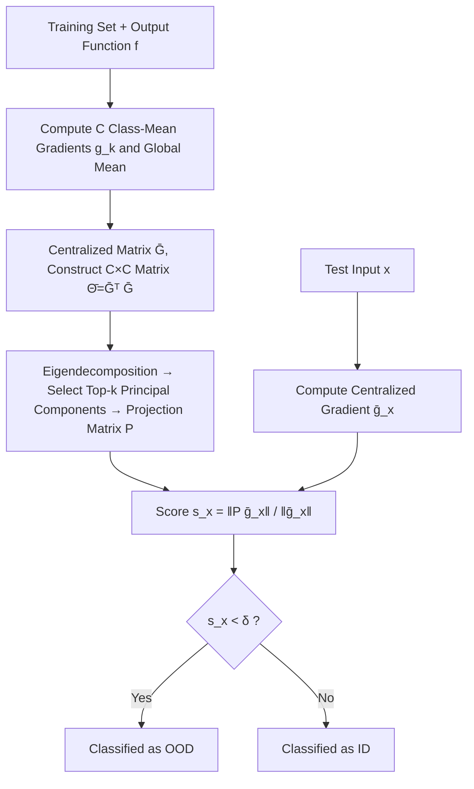

# GradPCA: Leveraging NTK Alignment for Reliable Out-of-Distribution Detection

**Conference**: ICLR 2026  
**OpenReview**: [https://openreview.net/forum?id=7rvMexIZA1](https://openreview.net/forum?id=7rvMexIZA1)  
**Code**: Open source (Paper GitHub repository, JAX implementation)  
**Area**: AI Safety / OOD Detection  
**Keywords**: Out-of-Distribution Detection, Neural Tangent Kernel, NTK Alignment, Spectral Methods, PCA, Gradient-based Detection  

## TL;DR
GradPCA leverages the low-rank structure of network gradients induced by NTK alignment. By performing PCA on "class-mean gradients" to characterize the ID subspace, it identifies inputs with gradients falling outside this subspace as OOD. It achieves more **consistent** (rather than occasionally optimal) detection performance across multiple image classification benchmarks and provides a theoretical framework for spectral OOD detection.

## Background & Motivation

**Background**: OOD detection enables models to "know what they don't know," which is a prerequisite for deployment in safety-critical scenarios. Existing methods vary widely, ranging from confidence-based (MSP/ODIN/Energy) and feature geometry-based (Mahalanobis/KNN) to recent gradient-based approaches.

**Limitations of Prior Work**: These methods themselves are often **unreliable**. Within the same architecture and ID dataset, detection performance may fluctuate drastically with different random seeds or data splits. When a method is effective often depends on hidden assumptions, lacking theoretical guidance and relying on empirical hyperparameter tuning. In other words, "OOD detection designed for reliability is itself unreliable."

**Key Challenge**: Purely empirical detectors cannot predict effectiveness in new settings, while principled designs lack theoretical support explaining why a particular feature space is suitable for spectral analysis.

**Goal**: Design a **principled, interpretable, and cross-scenario consistent** OOD detector, providing a theoretical characterization of spectral OOD detection to answer "what kind of feature space allows for effective spectral detection."

**Core Idea** (**Gradient Low-rank + NTK Alignment**): The empirical NTK of well-trained networks gradually aligns with the task structure (NTK alignment), manifesting as an approximate block-diagonal structure where intra-class gradients are highly correlated and inter-class correlations are weak. Consequently, ID sample gradients concentrate in a **low-dimensional subspace** spanned by class directions (rank approximately equal to the number of classes $C$). Applying PCA to the gradient space and exposing inputs outside this subspace as OOD results in GradPCA.

## Method

### Overall Architecture
GradPCA makes "gradient covariance PCA"—principally simple but computationally infeasible—practical. Given that both parameter count $P$ and data volume $N$ are excessive, direct eigendecomposition of the covariance $\hat{S}=FF^\top\in\mathbb{R}^{P\times P}$ or the dual matrix $F^\top F\in\mathbb{R}^{N\times N}$ is prohibitive. The key observation is that the dual matrix is precisely the empirical NTK $\hat\Theta=F^\top F$. NTK alignment allows this to be decomposed into a rank-$C$ block structure plus small perturbations, meaning the spectrum is determined by the $C$ **class-mean gradients** $g_1,\dots,g_C$. GradPCA thus only requires eigendecomposition of a small $C\times C$ matrix offline to construct the projection subspace, using the "retention ratio" of test sample projections as the detection score online.

### Key Designs

**1. Mapping PCA to Gradient Space and compressing it via NTK Alignment**: The dual matrix $\hat\Theta=F^\top F$ is the empirical NTK. Under alignment, it is expressed as $\hat\Theta = G^\top G \otimes \mathbf{1}_m\mathbf{1}_m^\top + \xi$, where the primary term has rank $C \ll N, P$ and the residual satisfies $\|\xi\|\le\epsilon$. This implies the $P\times P$ covariance $\bar S=\bar G\bar G^\top$ shares non-zero eigenvalues with the small matrix $\bar\Theta=\bar G^\top\bar G\in\mathbb{R}^{C\times C}$. Eigendecomposition is performed on $\bar\Theta=V\Sigma V^\top$, and principal components are lifted to parameter space via $U_k=\bar G V_k\Sigma_k^{-1/2}$, with projection matrix $P=U_kU_k^\top$. This avoids storing the full dataset, utilizing only $C$ class-mean gradient vectors.

**2. Angular-based Score instead of Reconstruction Error**: During the online stage, the norm ratio of the projected centralized gradient $s(x)=\|P\bar g(x)\|/\|\bar g(x)\|$ is used as the score. ID samples typically yield higher values within the subspace. This is equivalent to the cosine of the angle between the gradient and its projection $s(x)=\cos\angle(\bar g(x),P\bar g(x))$. While classic PCA detectors use reconstruction error $\|\bar g(x)-P\bar g(x)\|$, prior work suggests the "angle" is more discriminative for OOD than residual magnitude. The decision rule is $D(x)=\mathbb{1}_{[0,\delta)}(s(x))$.

**3. Scalar Aggregation and Parameter Subset Scaling**: The method applies to a scalar output function $f$. Since classifiers output $\mathbb{R}^C$ vectors, aggregation is required—defaulting to the maximum logit $f(x)=\max_c f^c(x)$ (though GradPCA-Vec computes outputs for each head separately). For efficiency, gradients are computed only for a **parameter subset** (defaulting to the last hidden layer). Ablations show optimal subsets vary by model, reflecting where OOD information resides. Spectra are truncated using threshold $\epsilon$ (default 0.99 trace retention), enabling scalability to ImageNet.

**4. Theoretical Framework and Per-sample Certificates**: The paper provides a theoretical basis for why spectral methods work. A sufficient condition (Thm 4.1) states that for any $h\in L^2(\mu_{id})$ and covariance $S(h)=\mathbb{E}[h(X)h(X)^\top]$, if $\|Ph(x)\|^2<\|h(x)\|^2$, then $x$ must be OOD—a rare per-sample, one-sided OOD certificate. A robust version (Thm 4.2) utilizes the Davis–Kahan theorem to characterize error tolerance when empirical covariance approximates rank-$C$ population covariance by $\epsilon$. A necessary condition (Thm 4.5) requires $\mathrm{rank}(S(h))<\dim\{h(x):x\in X\}$. Comparing logits, hidden activations, and gradients, only gradients possess both low-rank structure and high dimensionality (via NTK alignment), making the alignment subspace difficult to mimic and providing the strongest spectral separation.

## Key Experimental Results

Evaluations conducted on CIFAR-10, CIFAR-100, and ImageNet-1k using at least two models per dataset (**comparable ID accuracy but different feature quality**: one pre-trained then fine-tuned, one trained from scratch) across 6 OOD benchmarks (SVHN/Places/LSUN-c/LSUN-r/iSUN/Textures). Metrics: AUROC↑ and FPR95↓.

### Main Results (CIFAR-10, ResNetV2-50 BiT-M Pre-trained, Average)

| Method | Type | Avg FPR95 ↓ | Avg AUROC ↑ |
|------|------|-------------|-------------|
| Max logits | Anomaly-based | 63.96 | 84.21 |
| MSP | Anomaly-based | 68.98 | 82.13 |
| ODIN | Anomaly-based | 63.98 | 84.21 |
| Energy | Anomaly-based | 58.41 | 85.51 |
| DICE | Anomaly-based (Sparse) | 28.30 | 93.20 |
| Mahalanobis | Pattern-based | 42.71 | 90.71 |
| **GradPCA** | Pattern-based (Ours) | — | **near-SOTA, highest avg across 6 benchmarks** |

### Aggregation across 6 Benchmarks (Avg AUROC, sorted by average)

| Method | Average AUROC ↑ |
|------|--------------|
| **GradPCA** | **95.96** (Highest, top 3 in almost all settings) |
| KNN | 92.85 |
| GAIA-A | 94.01 |
| Energy | 86.04 |
| Max logits | 82.10 |
| ODIN | 90.22 |
| Mahalanobis | 98.95 (Strong in specific cases, high variance) |

### Key Findings
- **Consistency is the Main Selling Point**: GradPCA maintains the highest average AUROC (95.96) and low fluctuation, ranking in the top three across most settings. Many baselines (e.g., Mahalanobis on LSUN-r) perform poorly in specific scenarios. This is attributed to NTK alignment being universal in well-trained networks.
- **Feature Quality Determines Performance**: Pattern-based methods (GradPCA, KNN, Mahalanobis) perform best on **pre-trained** general features. Anomaly-based methods (GAIA, ODIN, Energy) are closer to SOTA on **trained-from-scratch** models, as general features smooth out the irregularities that anomaly-based methods target.
- **Acceptable Computational Cost**: Batch evaluation allows GradPCA to match the speed of logit-based methods like MSP/ODIN on CIFAR; the cost is $O(C)$ vector memory and one offline training phase. On ImageNet, it processes 100+ samples per second.

## Highlights & Insights
- **First OOD method utilizing NTK alignment**: Translates "gradient low-rank" phenomena into a practical detector with clear theoretical motivation.
- **Efficiency via "Class Means"**: Collapsing $P\times P$ to $C\times C$ makes gradient-space PCA scalable to ImageNet.
- **Per-sample OOD Certificates**: Providing one-sided theoretical guarantees (Thm 4.1/4.2) is rare in empirical-heavy OOD literature.
- **Feature Quality as a First-class Citizen**: Distinguishes between pre-trained and scratch training to predict which detector type will prevail.
- **Gradient Space against Adversarial Mimicry**: Higher dimensionality and the alignment subspace make gradients harder to mimic than hidden activations, leading to more robust spectral separation.

## Limitations & Future Work
- **Dependency on NTK Alignment**: Effectiveness relies on networks being well-trained with strong alignment (small residual $\xi$); performance may degrade in under-trained models.
- **Loss in Scalar Aggregation**: Compressing vector outputs to scalars (max logit) may lose information; variants like GradPCA-Vec mitigate this but introduce post-aggregation selection challenges.
- **Offline Stage and O(C) Storage**: Requires a one-time offline construction and storage of class means, which increases as $C$ grows.
- **Domain Limitation**: Evaluations are restricted to image classification; transferability to NLP or structured output tasks (detection/segmentation) remains unverified.

## Related Work & Insights
- **Spectral / PCA OOD**: Classic kernel PCA, Revisited PCA (Guan et al. 2023), Kernel PCA CoRP (Fang et al. 2024). GradPCA uses task/model-dependent NTK as the kernel.
- **Gradient OOD**: GAIA, GradOrth, Projected Gradients (Wu et al. 2024). 
- **Theoretical Foundations**: NTK alignment, local elasticity, Neural Collapse, Davis–Kahan Theorem.
- **Mechanism**: Treating "structural phenomena of training dynamics" as a design prior for detectors, rather than an afterthought for explanation, provides both interpretability and theoretical criteria for application.

## Rating
- **Novelty**: ⭐⭐⭐⭐⭐ First to apply NTK alignment to OOD detection with an efficient algorithm and theoretical framework.
- **Experimental Thoroughness**: ⭐⭐⭐⭐ Covers 3 ID datasets, 6 OOD benchmarks, and pre-training vs. scratch comparisons, though limited to vision.
- **Writing Quality**: ⭐⭐⭐⭐ Clear progression from motivation to theory and experiments; notation is dense.
- **Value**: ⭐⭐⭐⭐⭐ Insights into "consistency" and "feature quality" are highly instructive for deployment.

<!-- RELATED:START -->

## Related Papers

- [\[ICLR 2026\] AP-OOD: Attention Pooling for Out-of-Distribution Detection](ap-ood_attention_pooling_for_out-of-distribution_detection.md)
- [\[CVPR 2025\] Leveraging Perturbation Robustness to Enhance Out-of-Distribution Detection](../../CVPR2025/ai_safety/leveraging_perturbation_robustness_to_enhance_out-of-distribution_detection.md)
- [\[ICLR 2026\] Fisher-Rao Sensitivity for Out-of-Distribution Detection in Deep Neural Networks](fisher-rao_sensitivity_for_out-of-distribution_detection_in_deep_neural_networks.md)
- [\[NeurIPS 2025\] SPROD: Spurious-Aware Prototype Refinement for Reliable Out-of-Distribution Detection](../../NeurIPS2025/ai_safety/spurious-aware_prototype_refinement_for_reliable_out-of-distribution_detection.md)
- [\[NeurIPS 2025\] Revisiting Logit Distributions for Reliable Out-of-Distribution Detection](../../NeurIPS2025/ai_safety/revisiting_logit_distributions_for_reliable_out-of-distribution_detection.md)

<!-- RELATED:END -->
