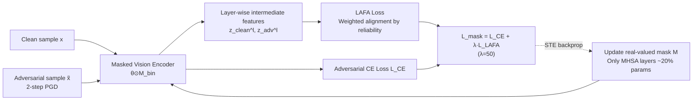

# Identifying Robust Neural Pathways: Few-Shot Adversarial Mask Tuning for Vision-Language Models

**Conference**: ICLR 2026  
**OpenReview**: [https://openreview.net/forum?id=kzGkXpW4FT](https://openreview.net/forum?id=kzGkXpW4FT)  
**Code**: [https://github.com/wonjeongchoi/AdvMask](https://github.com/wonjeongchoi/AdvMask)  
**Area**: AI Safety / Adversarial Robustness of Vision-Language Models  
**Keywords**: CLIP, Adversarial Robustness, Binary Mask, Few-Shot, Robust Neural Pathways, Feature Alignment  

## TL;DR
This paper proposes AdvMask: instead of modifying pre-trained CLIP weights, it learns a set of binary masks for the vision encoder to "unearth" an inherently attack-resistant robust neural pathway by deactivating parameters sensitive to adversarial perturbations. This is combined with a Layer-wise Adaptive Feature Alignment (LAFA) loss specifically designed for adversarial robust fine-tuning in few-shot scenarios.

## Background & Motivation
**Background**: Vision-Language Models (VLMs) like CLIP can transfer to various downstream tasks with few samples via a joint image-text embedding space. However, they are extremely vulnerable to adversarial attacks—zero-shot CLIP's clean accuracy is approximately 61.9%, but it plummets to about 2.5% under adversarial perturbations, posing a fatal flaw in safety-sensitive scenarios like autonomous driving and medical analysis.

**Limitations of Prior Work**: Existing adversarial robust fine-tuning methods generally follow two paths, each with limitations. First, **Adversarial Prompt Tuning** (e.g., AdvVP / AdvVLP / FAP) only updates a small number of prompt parameters without touching the neurons in the pre-trained structure, resulting in a limited upper bound for learned robust representations. Second, **Full Adversarial Fine-tuning** of all weights is highly prone to overfitting in few-shot settings and destroys the original generalization capabilities of the pre-trained VLM. Additionally, zero-shot robustness methods (e.g., TGA-ZSR) rely on a held-out dataset for adversarial fine-tuning, making performance highly dependent on data quality and often insufficient for real downstream tasks.

**Key Challenge**: In few-shot settings (1~16 samples per class), there is a fundamental tension between the scarcity of supervision signals and the need for adversarial robustness, while simultaneously maintaining pre-trained generalization capabilities.

**Goal**: To answer "what is the most effective way to achieve adversarial robustness for pre-trained VLMs in few-shot downstream scenarios."

**Core Idea**: **Robust neural pathway**—Instead of modifying pre-trained weights, the method searches for an invasion-resistant sub-network structure within the vision encoder. Given a few samples of a downstream task, a binary mask is learned to selectively "turn off" parameters sensitive to adversarial perturbations, naturally emphasizing robust features during forward propagation. The authors demonstrate that such robust pathways indeed exist.

## Method

### Overall Architecture
AdvMask layers a learnable binary mask over a frozen CLIP vision encoder. Given clean samples and their adversarial versions, the mask is optimized through min-max adversarial training to ensure the masked network produces consistent and stable intermediate representations for both inputs. The training objective consists of an adversarial cross-entropy loss $L_{CE}$ for prediction-level robustness and a Layer-wise Adaptive Feature Alignment loss $L_{LAFA}$ for representation-level robustness.

### Key Designs

**1. Robust Mask Tuning (AdvMask): Unearthing sub-networks via binary masks instead of weight modification.** Given pre-trained weights $\theta$ of an image encoder, a real-valued mask $M$ of the same size is defined and binarized using a threshold $\alpha$ to obtain $M_{bin}=\mathbb{I}[M>\alpha]$. The masked weights are the Hadamard product $\theta'=\theta\odot M_{bin}$. Since binarization is non-differentiable, a Straight-Through Estimator (STE) is used to bypass the indicator function, updating the real-valued mask directly: $M\leftarrow M-\gamma\cdot\partial L/\partial M_{bin}$. Robustness is achieved by formulating it as a min-max problem: the inner loop generates adversarial samples $\tilde{x}=\arg\max_{|\tilde{x}-x|\le\epsilon}L(f_{\theta\odot M_{bin}}(\tilde{x},t),y)$, and the outer loop minimizes the adversarial loss to update the mask $\min_{M_{bin}}\mathbb{E}_{(x,y)\sim S}[L_{mask}]$. Throughout the process, pre-trained weights remain frozen, preserving generalized knowledge while efficiently searching for task-related robust pathways; storage and memory overhead are low as only binary masks are stored.

**2. Masking Only MHSA Layers: Pinpointing robustness bottlenecks to Self-Attention.** The authors do not apply masks to all parameters but only to Multi-Head Self-Attention (MHSA) layers, which account for approximately 20% of the vision encoder's parameters. The motivation is that self-attention layers generate contextual representations by capturing long-range dependencies between image patches, which are most susceptible to amplification by adversarial perturbations in the input space. Selectively deactivating noise-sensitive parameters in these layers is thus most effective. Ablations show that MHSA-only outperform MLP-only in both clean (67.34%) and adversarial (47.13%) accuracy, while being significantly more computationally efficient than masking all parameters.

**3. Layer-wise Adaptive Feature Alignment Loss (LAFA): Injecting stable supervision into intermediate layers.** Previous robustness objectives (e.g., TeCoA) provide supervision only in the final output space (joint embedding), which fails to constrain intermediate representations and provides insufficient signals when data is scarce. Since AdvMask modifies internal encoder parameters, intermediate robust features are crucial. LAFA aligns adversarial features of each transformer layer with their corresponding clean features. The basic form is $L=\frac{1}{|\mathcal{L}||B|}\sum_{l}\sum_{x}\|z_{clean}^{(l)}-z_{adv}^{(l)}\|_2^2$, based on the intuition that adversarial perturbations are amplified layer by layer, and deactivating fragile parameters can suppress this propagation. It further incorporates **adaptive weighting based on prediction reliability**: if the model mispredicts even the clean sample, its features serve as noisy targets, which is particularly harmful in few-shot settings. Thus, it is weighted by the confidence of the ground-truth class: $L_{LAFA}=\frac{1}{|\mathcal{L}||B|}\sum_{l}\sum_{x}\frac{p(y|x)}{\mathbb{E}_B[p(y'|x')]+\epsilon}\|z_{clean}^{(l)}-z_{adv}^{(l)}\|_2^2$, allowing reliable samples to dominate alignment. The final objective $L_{mask}=L_{CE}(\tilde{x},y)+\lambda\cdot L_{LAFA}(x,\tilde{x},y)$ ($\lambda=50$) complementarily combines prediction-level and representation-level robustness.

## Key Experimental Results

**Setup**: CLIP ViT-B/32, fine-tuning only ~20% of MHSA mask parameters; 2-step PGD ($\epsilon=\alpha=1/255$, $l_\infty$) for training, 100-step PGD for testing; 11 classification datasets, 1/2/4/8/16-shot, averaged over 3 random seeds.

### Main Results (base-to-new generalization, 16-shot, mean of 11 datasets)

| Method | Base Clean | Base Adv | New Clean | New Adv | H |
|------|-----------|----------|-----------|---------|---|
| CLIP | 66.9 | 3.4 | 71.5 | 3.8 | 6.9 |
| AdvVP | 31.7 | 14.4 | 30.4 | 13.4 | 19.2 |
| AdvVLP | 59.0 | 32.4 | 46.9 | 21.6 | 34.6 |
| AdvMaPLe | 60.4 | 30.7 | 46.2 | 20.3 | 33.3 |
| FAP | 70.5 | 38.0 | 49.6 | 21.9 | 37.6 |
| **AdvMask** | 69.5 | **43.6** | **50.2** | **26.1** | **41.9** |

AdvMask leads in adversarial accuracy for both base and new classes (base 43.6 vs FAP 38.0, new 26.1 vs FAP 21.9), achieving the highest harmonic mean (H).

### Zero-shot Robust Generalization (TinyImageNet fine-tuning → Unseen downstream)

| Method | Data Volume | Clean Acc | Adv Acc |
|------|--------|-----------|---------|
| CLIP | – | 61.9 | 2.7 |
| TGA-ZSR | Full 100% | 38.6 | 22.9 |
| FAP | 16-shot (3.2%) | 36.0 | 16.8 |
| TGA-ZSR | 16-shot (3.2%) | 41.3 | 13.0 |
| **AdvMask** | 16-shot (3.2%) | **42.0** | **19.4** |

Using only 3.2% of source data, AdvMask at 16-shot approaches the performance of TGA-ZSR which requires full data, indicating it deactivates parameters that are "universally fragile across tasks" rather than overfitting to dataset patterns.

### Ablation Study

**Mask Layer Selection (16-shot, mean of 5 datasets)**

| Module | Clean Acc | Adv Acc |
|------|-----------|---------|
| MLP only | 65.73 | 45.95 |
| MHSA only | 67.34 | 47.13 |
| MHSA + MLP | 66.01 | 47.20 |

**Loss Ablation (different shots)**

| Loss | 1-shot Clean/Adv | 16-shot Clean/Adv |
|------|------------------|-------------------|
| $L_{CE\text{-}adv}$ | 40.3 / 15.6 | 65.8 / 46.4 |
| + $L_{JS}$ | 42.9 / 17.3 | 65.9 / 46.5 |
| + $L_{KL}$ | 31.8 / 13.8 | 60.7 / 43.6 |
| + $L_{LAFA}$ (no adaptive) | 44.5 / 17.8 | 66.9 / 46.8 |
| **+ $L_{LAFA}$** | **46.6 / 18.4** | **67.3 / 47.1** |

### Key Findings
- Feature-level alignment in LAFA is more stable than distribution divergence (JS/KL) in the output space, with its advantage being most pronounced at extremely low samples like 1-shot.
- Adaptive weighting further improves performance, being especially effective when noisy or misclassified samples are present.
- Although clean accuracy inevitably drops at 1/2/4-shot, it rebounds at 8/16-shot and even exceeds original CLIP on Caltech101, suggesting a regularization effect from masking.

## Highlights & Insights
- **Perspective Shift**: Transforms adversarial robust fine-tuning from "tuning prompts/weights" to "finding sub-networks." Robustness is interpreted as an existing "robust neural pathway" within the pre-trained network, providing a novel and interpretable angle.
- **Parameter and Data Efficiency**: By storing only binary masks and modifying only 20% of MHSA parameters, it is both computationally and data efficient for few-shot settings, fitting real-world scarcity scenarios like medicine.
- **Mask Transferability**: Masks trained on only 16-shots can transfer zero-shot to unseen datasets, suggesting a subset of parameters exists that universally amplifies adversarial noise across tasks.

## Limitations & Future Work
- Main experiments focus on CLIP ViT-B/32; although the appendix covers ViT-B/16, ViT-L/14, and VisualBERT, applicability to larger-scale or generative VLMs remains to be verified.
- Adversarial evaluation primarily uses $l_\infty$ PGD, with limited coverage of stronger, semantic-level, or cross-norm attacks.
- At extremely low shots (1~4), there is still a noticeable drop in clean accuracy; the robustness-generalization trade-off is not fully resolved.
- The mechanism of why binary masks "turning off parameters" naturally resists perturbations is explained intuitively but lacks rigorous theoretical characterization.

## Related Work & Insights
This paper connects two lines of research: first, adversarial robust fine-tuning for VLMs (TeCoA, FAP, AdvVLP, TGA-ZSR using prompt/weight tuning); second, "neural pathway/sub-network" discovery in LLM adaptation (Zheng et al. 2023, Lottery Ticket Hypothesis-style mask learning). AdvMask introduces the sub-network idea to adversarial robustness for the first time. The insight is: when data is scarce, instead of adding parameters to "learn robustness," it is better to "isolate" existing robust structures within the pre-trained model—a strategy valuable for parameter-efficient fine-tuning, model pruning, and secure deployment.

## Rating
- **Novelty**: ⭐⭐⭐⭐ First to propose "robust neural pathways" using binary masks for adversarial fine-tuning, offering a clear contrast to prompt/weight tuning.
- **Experimental Thoroughness**: ⭐⭐⭐⭐ Comprehensive across 11 datasets, 5 shot levels, base-to-new and zero-shot transfer, multiple backbones/VLMs, and thorough ablations of mask layers and losses.
- **Writing Quality**: ⭐⭐⭐⭐ Logical flow from motivation to method to experiments; formulas and diagrams are clear, with well-justified design motivations.
- **Value**: ⭐⭐⭐⭐ Highly practical for safety-sensitive few-shot deployments due to parameter/data efficiency and mask transferability.

<!-- RELATED:START -->

## Related Papers

- [\[CVPR 2026\] Hierarchically Robust Zero-shot Vision-language Models](../../CVPR2026/ai_safety/hierarchically_robust_zero-shot_vision-language_models.md)
- [\[ICLR 2026\] Tug-of-War No More: Harmonizing Accuracy and Robustness in Vision-Language Models via Stability-Aware Task Vector Merging](tug-of-war_no_more_harmonizing_accuracy_and_robustness_in_vision-language_models.md)
- [\[ICLR 2026\] Discrete Latent Features Ablate Adversarial Attack: A Robust Prompt Tuning Framework for VLMs](discrete_latent_features_ablate_adversarial_attack_a_robust_prompt_tuning_framew.md)
- [\[ICML 2026\] Towards Fine-Grained Robustness: Attention-Guided Test-Time Prompt Tuning for Vision-Language Models](../../ICML2026/ai_safety/towards_fine-grained_robustness_attention-guided_test-time_prompt_tuning_for_vis.md)
- [\[ICLR 2026\] Towards Privacy-Guaranteed Label Unlearning in Vertical Federated Learning: Few-Shot Forgetting without Disclosure](towards_privacy-guaranteed_label_unlearning_in_vertical_federated_learning_few-s.md)

<!-- RELATED:END -->
