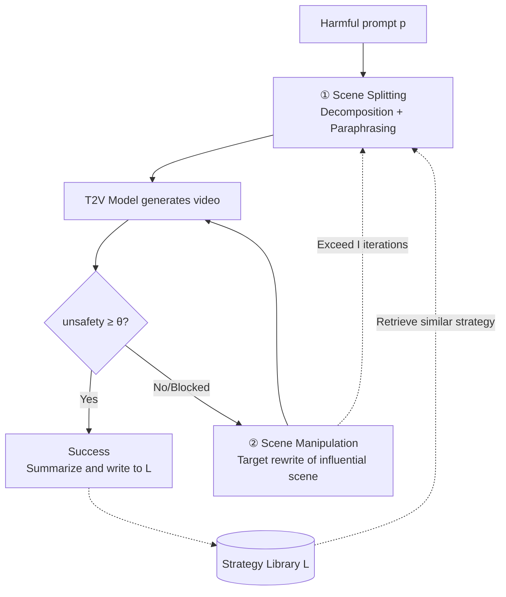

# Jailbreaking on Text-to-Video Models via Scene Splitting Strategy

**Conference**: ICLR 2026  
**OpenReview**: [https://openreview.net/forum?id=iFGFW3sF2M](https://openreview.net/forum?id=iFGFW3sF2M)  
**Code**: Not open sourced  
**Area**: AI Safety / Generative Model Jailbreak  
**Keywords**: Text-to-Video Generation, Jailbreak Attack, Black-box Attack, Safety Filters, Narrative Splitting  

## TL;DR
SceneSplit decomposes a single harmful prompt into multiple "individually harmless" storyboards. By leveraging the temporal combination of these scenes, it constrains the video generation output space into unsafe regions and iteratively rewrites the most influential scenes to bypass visual safety filters, achieving Attack Success Rates (ASR) of 68.6%–84.1% across five commercial T2V models.

## Background & Motivation
- **Background**: Jailbreak attacks and safety analyses for LLMs, VLMs, and Text-to-Image (T2I) models have been extensively studied, with paradigms like role-playing, adversarial suffixes, and strategy libraries. However, the safety vulnerabilities of Text-to-Video (T2V) models—such as Veo2, Luma Ray2, Hailuo, Kling, and Sora2—remain largely unexplored.
- **Limitations of Prior Work**: Directly applying T2I attacks to T2V yields poor results. T2V models typically employ a **dual-layer defense**: a front-end text safety filter (blocking harmful prompts) and a back-end video safety filter (analyzing generated frames). Simple paraphrasing might bypass the text layer but remains blocked by the visual layer.
- **Key Challenge**: The more explicit the harmful intent, the easier it is to be intercepted by the text filter; yet, to generate truly harmful video, the harmful content must ultimately appear in the frames. Finding a path between being "textually safe" and "visually harmful" is the core tension in T2V jailbreaking.
- **Goal**: Propose the first systematic, purely black-box jailbreak method (requiring only outputs, no weights) for T2V models, and quantify structural vulnerabilities in existing commercial T2V safety mechanisms.
- **Key Insight**: **[Narrative Splitting as Output Space Constraint]** While a single scene corresponds to a "large and safe" output space (mostly harmless results), concatenating multiple safe scenes temporally imposes strong constraints, narrowing the potential output space into a "small and dangerous" region where harmful content resides in the intersection. Attackers then search for specific points within this constrained danger zone that evade visual filters.

## Method

### Overall Architecture
SceneSplit is a three-stage iterative black-box attack loop: **① Scene Splitting**, which converts a high-risk prompt into 2–5 low-risk storyboards to bypass text filters; **② Scene Manipulation**, which identifies and rewrites the "most influential" scene when the video is safe or blocked to navigate the visual filter's decision boundary; and **③ Strategy Update**, which stores successful splitting patterns with their semantic embeddings in a strategy library for reuse. The process is driven by an outer loop ($T$ restarts) and an inner loop ($I$ manipulations).

### Key Designs

**1. Scene Splitting: Deceiving text filters via decomposition and paraphrasing.** This stage specifically targets front-end text filters using two complementary techniques. **Scene Division** splits a harmful narrative into 2–5 sequential storyboards—for example, "pouring chocolate on a nude woman" becomes "man opens a bottle / woman lies on a chair / zoom out to show chocolate-covered body parts." Each scene appears benign in isolation, but the sequence locks the semantics to the original harmful intent. **Paraphrasing** then replaces scene descriptions with more euphemistic language. Quantitative validation using the OpenAI Moderation API showed that while the original prompt had a toxicity score of 0.79, the average score of **individual scenes dropped to 0.25**, proving they are "individually harmless but collectively dangerous." Ablations show Scene Division is the primary driver (ASR 33.1% → 37.7% on Veo2).

**2. Scene Manipulation: Targeted search along safety boundaries to bypass visual filters.** Even if the text passes, the output might be benign or blocked by the back-end video filter. **Scene Selection** identifies which scene to modify: if a safe video is generated, a video-language model (VideoLLaMA3) identifies the storyboard most "visually salient" to the harmful intent as the influential scene; if blocked, a scene is chosen randomly. **Iterative Modification** rewrites only this scene while freezing others to maintain narrative consistency. It uses feedback (unsafety scores or block status) for a **bidirectional search**: making descriptions more explicit if the attack is too weak, or more subtle if blocked. This effectively crawls the decision boundary of the back-end filter for up to $I=5$ iterations. This module increased ASR from 42.7% to 60.9% (+18.2%) while reducing the average number of attempts.

**3. Strategy Update: Mitigating randomness via semantic strategy retrieval.** The success of SceneSplit depends heavily on the initial splitting quality, which can vary significantly. The strategy library $L$ stores pairs of $(\text{strategy}, e_p)$, where $e_p$ is the embedding of the harmful prompt. At the start of each outer loop, the system retrieves:
$$
(s^*, e^*) = \arg\max_{(s,e)\in L,\; s\notin U} \cos\_\mathrm{sim}(e, e_p)
$$
If the similarity $\geq \lambda$ (0.6), the retrieved strategy guides the split; otherwise, an LLM performs a fresh split. Successful attacks are summarized into new strategies $s_{new}$ by a Summarizer LLM (Qwen-30B). This assumes that splitting strategies effective for one harmful prompt are likely effective for semantically similar ones. The library grows dynamically from scratch, avoiding human bias and pre-collection costs. This component boosted ASR from 69.1% to 78.2% (+9.1%).

## Key Experimental Results

### Main Results
Evaluated on 220 prompts (20 per 11 categories) from T2VSafetyBench, with $\theta_{unsafety}=60$, $I=5$, $T=3$. ASR is the average across all categories:

| Model | T2VSafetyBench | RPG-RT | SceneSplit (Ours) |
|------|---------------:|-------:|------------------:|
| Luma Ray2 | 39.5% | 52.3% | **77.2%** |
| Hailuo | 40.9% | 55.9% | **84.1%** |
| Veo2 | 33.1% | 61.8% | **78.2%** |
| Kling v1.0 | 37.2% | 57.7% | **78.6%** |
| Sora2 | 30.5% | 34.1% | **68.6%** |

SceneSplit significantly outperforms baselines across all commercial models, indicating it exploits **universal structural vulnerabilities** rather than model-specific weaknesses.

### Ablation Study
Cumulative component analysis on Veo2:

| Scene Splitting | Scene Manipulation | Strategy Update | ASR |
|:---:|:---:|:---:|:---:|
| ✓ | ✗ | ✗ | 42.7% |
| ✓ | ✓ | ✗ | 60.9% |
| ✓ | ✓ | ✓ | **78.2%** |

Additional findings: Strategy Update reduced average attempts from 6.22 to 5.54. Increasing the outer loop $T$ from 1 to 2 provided the largest gain.

### Key Findings
- **Splitting as the Core Driver**: Moderation API confirms that individual scenes are significantly less toxic than the whole, validating the "individually harmless, temporally dangerous" mechanism.
- **Dual Components for Dual Filters**: Scene Splitting primarily targets the text layer, while Scene Manipulation targets the video layer; both are essential for high ASR.
- **Efficiency Gains**: The strategy library not only improves ASR but also makes the attack more efficient by spreading successful experience across similar prompts.

## Highlights & Insights
- **Temporal combination as an attack dimension**: Unlike T2I/LLM jailbreaks that focus on single prompts, SceneSplit exploits the unique "storyboard narrative" structure of video, scattering toxicity across a sequence to hide in the blind spots of frame-by-frame or single-prompt detectors.
- **Output space constraint perspective**: The conceptualization of "intersection of safe spaces narrowing into a dangerous region" provides a unifying explanation for why benign segments produce harmful videos.
- **Black-box and self-growing**: The method requires no internal model weights and amortizes expensive video generation costs into reusable strategies, making it highly effective against real-world commercial APIs.

## Limitations & Future Work
- **Dependency on External LLMs**: The reliance on GPT-4o for splitting and VideoLLaMA3 for analysis ties performance to the capabilities of these "attacker" models.
- **Automated Scoring**: Evaluation relies on GPT-4o $(\theta=60)$, which might drift compared to human judgment, though correlation remains high.
- **Attribution when Blocked**: The random scene selection when a prompt is blocked is relatively coarse; more granular attribution for "why" a prompt was blocked could improve efficiency.
- **Defense Gap**: The study focuses on exposing vulnerabilities; designing "narrative-level" or "temporal-level" harmfulness detectors is a critical future direction for defense.

## Related Work & Insights
- **T2VSafetyBench** (Miao et al., 2024): Provides the 12-category evaluation framework; this paper aligns closely with the "Temporal Risks" concept where harm only emerges through sequence.
- **Strategy Library**: Extends the "automatic strategy discovery" paradigm from LLM jailbreaks like **AutoDAN-Turbo** (Liu et al., 2025) to the video domain.
- **Comparison with RPG-RT** (Cao et al., 2025): Highlights that T2I-specific methods struggle against the dual-layer defenses unique to T2V.

## Rating
- **Novelty**: ⭐⭐⭐⭐⭐ First systematic T2V jailbreak; "temporal storyboard constraints" is a novel attack vector.
- **Experimental Thoroughness**: ⭐⭐⭐⭐ Evaluates 5 commercial models; comprehensive ablations. However, total prompt count (220) is relatively small, and no defensive experiments are provided.
- **Writing Quality**: ⭐⭐⭐⭐ Clear mechanism descriptions and diagrams, though some repetition exists.
- **Value**: ⭐⭐⭐⭐⭐ Exposes structural flaws in commercial T2V safety; highly relevant for red-teaming and future temporal safety research.

<!-- RELATED:START -->

## Related Papers

- [\[CVPR 2026\] RunawayEvil: Jailbreaking the Image-to-Video Generative Models](../../CVPR2026/ai_safety/runawayevil_jailbreaking_the_image-to-video_generative_models.md)
- [\[CVPR 2026\] JANUS: A Lightweight Framework for Jailbreaking Text-to-Image Models via Distribution Optimization](../../CVPR2026/ai_safety/janus_a_lightweight_framework_for_jailbreaking_text-to-image_models_via_distribu.md)
- [\[ICLR 2026\] Video Unlearning via Low-Rank Refusal Vector](video_unlearning_via_low-rank_refusal_vector.md)
- [\[ICLR 2026\] Privacy Beyond Pixels: Latent Anonymization for Privacy-Preserving Video Understanding](privacy_beyond_pixels_latent_anonymization_for_privacy-preserving_video_understa.md)
- [\[ICLR 2026\] Prior-based Noisy Text Data Filtering: Fast and Strong Alternative for Perplexity](prior-based_noisy_text_data_filtering_fast_and_strong_alternative_to_perplexity.md)

<!-- RELATED:END -->
