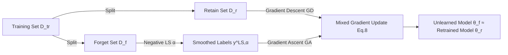

# Label Smoothing Improves Machine Unlearning

**Conference**: ICLR 2026  
**OpenReview**: [https://openreview.net/forum?id=X74KnsoYEM](https://openreview.net/forum?id=X74KnsoYEM)  
**Code**: [https://github.com/UCSC-REAL/Label-Smoothing-Unlearn](https://github.com/UCSC-REAL/Label-Smoothing-Unlearn)  
**Area**: AI Safety / Privacy / Machine Unlearning  
**Keywords**: Machine Unlearning, Label Smoothing, Gradient Ascent, Negative Label Smoothing, Local Differential Privacy  

## TL;DR
This paper integrates "Negative Label Smoothing" into Gradient Ascent-based machine unlearning, proposing a plug-and-play method named UGradSL. By performing gradient ascent with negative smoothed labels on the forget set and gradient descent on the retain set, Ours significantly closes the performance gap with the "Retrained Model" with almost zero additional computational overhead, while providing theoretical proof of improved label-level local differential privacy.

## Background & Motivation
- **Background**: Machine Unlearning (MU) requires "erasing" the memory of specific data from a trained model to comply with privacy regulations (e.g., the right to be forgotten in GDPR). The cleanest approach is retraining from scratch (Retrain) after removing the data, but the computational cost for large models is prohibitive. Thus, mainstream research focuses on approximate unlearning to balance unlearning effectiveness and computational cost.
- **Limitations of Prior Work**: Gradient Ascent (GA) is the most natural approach as it serves as the "inverse process of training"—since learning is gradient descent, unlearning should be ascent. However, once the model converges, the loss of well-memorized data approaches 0 and the gradient nears 0. Consequently, GA has limited momentum to push parameters. Other approximate methods (influence functions, sparsification, random labels, etc.) are either computationally heavy, result in incomplete unlearning, or damage the accuracy of the retain set.
- **Key Challenge**: The contradiction between the desire for "fast and effective unlearning" and the "exhausted GA dynamics at the convergence point." There is a lack of a low-cost, plug-and-play module that can continuously provide valid gradient directions for unlearning.
- **Goal**: Design a plug-and-play module with almost no extra computation that allows gradient-based unlearning (GA/FT) to significantly approach the retrained model without degrading accuracy on the retain and test sets.
- **Core Idea**: **[Reverse Label Smoothing]** While Label Smoothing (LS) enhances generalization and reduces model confidence in forward training, Ours does the opposite—using "Negative Label Smoothing" (NLS) in GA. This is equivalent to forcing the model to produce incorrect predictions with similarly low confidence on the forget set, thereby rapidly pushing the model into a state of "amnesia" for forget data, approaching the retrained model.

## Method

### Overall Architecture
Upon receiving an unlearning request, the training set $D_{tr}$ is split into a forget set $D_f$ and a retain set $D_r$. For each sample $z_f=\{x,y\}$ in $D_f$, (negative) label smoothing is first applied to obtain smoothed labels $y^{LS,\alpha}$, followed by a "gradient mixing" update: gradient descent on $D_r$ (to preserve learned knowledge) and gradient ascent on $D_f$ with smoothed labels (to erase memory). The smoothing rate $\alpha$ can be fixed or sample-adaptive. The entire process does not require Hessian calculations (Hessian only appears in theoretical proofs), ensuring minimal overhead.

### Key Designs

**1. Negative Label Smoothing as an Unlearning Regularizer: Compensating for the Failure of "Anti-Training"** The authors first express GA using influence functions and Taylor expansion as $\theta_r^* - \theta_f^* = \Delta\theta_r - \Delta\theta_f$, proving (Theorem 1) that GA achieves exact unlearning only when the learning direction $\Delta\theta_r$ exactly equals the unlearning direction $\Delta\theta_f$—which is nearly impossible in practice. NLS fills this gap: under the Generalized Label Smoothing (GLS) framework, the smoothed label is $y^{GLS,\alpha} = (1-\alpha)\,y + \frac{\alpha}{K}\mathbf{1}$. When $\alpha<0$, it becomes NLS. Substituting this into cross-entropy adds a term $\frac{\alpha}{K}\sum_{y'\neq y}\ell(h_\theta,(x,y'))$, driving the model to make incorrect predictions for forget samples with uniform low confidence. After expansion, the unlearning error becomes $\theta_r^*-\theta_{f,LS}^* \approx \Delta\theta_r-\Delta\theta_f + \frac{1-K}{K}\alpha\,(\Delta\theta_n-\Delta\theta_f)$, where $\Delta\theta_n$ captures the gradient influence of smoothed non-target labels. Theorem 2 further proves: as long as $\langle\Delta\theta_r-\Delta\theta_f,\ \Delta\theta_n-\Delta\theta_f\rangle\le 0$, there exists some $\alpha<0$ such that NLS pushes the unlearned parameters closer to the retrained model, i.e., $\|\theta_r^*-\theta_{f,NLS}^*\| < \|\theta_r^*-\theta_f^*\|$. An elegant equivalence is: the gradient of the smoothing term in GA paired with NLS is identical to doing gradient descent under standard (positive) LS—essentially translating forward LS generalization benefits into unlearning gains.

**2. Mixed Gradient Update: Balancing Unlearning and Retaining** Blindly applying GA to $D_f$ can destroy knowledge in $D_r$. Ours uses a weighted mixed loss to combine both forces:

$$L(h_\theta, B_f^{NLS,\alpha}, B_r, p) = p\cdot\sum_{z_r\in B_r}\ell(h_\theta,z_r) - (1-p)\cdot\sum_{z_i^{f,NLS,\alpha_i}\in B_f^{NLS,\alpha}}\ell(h_\theta, z_i^{f,NLS,\alpha_i})$$

where $p\in[0,1]$ balances gradient descent and ascent, and the minus sign represents GA on the forget batch. Since $|D_r|>|D_f|$ typically holds, $D_f$ iterates multiple times per epoch of $D_r$. Two variants are derived: UGradSL uses GA as the backbone with $D_f$ convergence as the stopping criterion; UGradSL+ uses Fine-Tune (FT) as the backbone with $D_r$ convergence as the criterion—the latter is more comprehensive but costlier.

**3. Adaptive Smoothing Rate: Allocating α Based on "Forgettable-ness"** Different samples have different "inherent deniability": if a sample $z_f$ lies in a dense neighborhood of $D_r$, it is naturally easier to confuse and requires less unlearning effort, meaning $\alpha$ should be smaller. Practically, for each $(z_i^r, z_j^f)$ pair, the feature distance $d(h_\theta(z_i^r), h_\theta(z_j^f))\in[0,1]$ is computed. For each $z_j^f$, the count $c_j^f$ of retain samples within threshold $\beta$ is tallied, and $\alpha_j = c_j^f/|B_f|$ is set. The algorithm automatically switches to this adaptive version when $\alpha$ is not explicitly provided, saving per-dataset tuning.

**4. Link to Local Differential Privacy: Unlearning with Privacy Guarantees** The authors reinterpret NLS from a privacy perspective: label smoothing reduces the likelihood of a specific label, making it easier to "blend in" with other candidates. Defining Label-level LDP (Label-LDP): a mechanism $M$ satisfies $\epsilon$-Label-LDP if for any $y,y',y_{pred}$, $\frac{P(M(y)=y_{pred})}{P(M(y')=y_{pred})}\le e^\epsilon$. Theorem 3 proves that GA+NLS induces Label-LDP on the forget set with $\epsilon=\big|\log(\frac{K}{\alpha}(1-\frac{\gamma_1}{\gamma_2})+1-K)\big|,\ \alpha<0$. More negative $\alpha$ yields stronger privacy, reaching $\epsilon\to0$ as $\alpha\to(1-\gamma_1/\gamma_2)$—though the theorem warns $\alpha$ cannot be infinitely negative, providing a safety boundary for the smoothing rate.

## Key Experimental Results

### Main Results (Class Unlearning, lower Avg. Gap is better)

| Method | CIFAR-100 Avg.Gap ↓ | CIFAR-100 RTE | ImageNet Avg.Gap ↓ | ImageNet RTE |
|------|------|------|------|------|
| Retrain | — | 26.95 min | — | 26.18 hr |
| GA | 10.36 | 0.06 | 11.43 | 0.01 |
| FT | 43.12 | 1.74 | 23.25 | 2.87 |
| SalUN | 1.02 | 2.15 | 3.87 | 1.95 |
| PABI | 0.83 | 20.09 | — | — |
| **UGradSL** | 11.93 | **0.07** | **2.23** | **0.01** |
| **UGradSL+** | **0.64** | 3.37 | 2.32 | 4.19 |

On ImageNet, UGradSL achieves the best Avg. Gap of 2.23% with only 0.01 hours of runtime, delivering "retrain-level" quality at almost zero additional cost.

### Ablation Study (Random Unlearning, CIFAR-100 / Tiny-ImageNet)

| Method | CIFAR-100 Avg.Gap ↓ | Tiny-ImageNet Avg.Gap ↓ |
|------|------|------|
| GA | 20.64 | 16.39 |
| FT | 18.83 | 11.03 |
| RL | 7.41 | 4.04 |
| SalUN | 12.10 | 5.48 |
| **UGradSL** | 6.95 | 13.82 |
| **UGradSL+** | **3.75** | **3.57** |

Switching the baseline from GA (20.64) to UGradSL (6.95) or FT to UGradSL+ (3.75) shows visible improvements, validating the core claim of "label smoothing as a plug-and-play gain."

### Key Findings
- **Almost Zero-Cost Improvement for GA**: The RTE increase of UGradSL relative to GA is negligible (e.g., 0.06→0.07 min on CIFAR-100), yet it significantly lowers the Avg. Gap without sacrificing efficiency.
- **Superiority in Challenging Scenarios**: Random unlearning is harder as it requires reducing forget set accuracy while maintaining RA/TA. Thanks to the mixed gradient design, UGradSL+ achieves the lowest Avg. Gap (3.75 / 3.57) on both datasets.
- **Robust Across Modalities and Scales**: Consistently effective across six datasets (CIFAR-10/100, SVHN, CelebA, Tiny-ImageNet, ImageNet, 20 Newsgroups), two backbones (ResNet-18 and BERT), and three unlearning paradigms (class/random/group).

## Highlights & Insights
- **Elegant Transfer of "Forward Tricks to Reverse Use"**: Label smoothing is originally a training trick for generalization. The authors discovered its "inverse" (negative smoothing) provides valid unlearning directions for exhausted GA gradients, solidifying this intuition with an equivalence relation (NLS smoothing term ≡ GD under positive LS).
- **Closed-Loop Theory-Method-Privacy**: From proving GA failure conditions (Th.1) to showing NLS improves unlearning (Th.2) and linking it to Label-LDP (Th.3), the paper explains "why it works" and "collateral privacy benefits" rather than just piling formulas.
- **Truly Plug-and-Play**: It requires no Hessian computations or backbone architecture changes and can be mounted on both GA and FT, lowering the barrier for engineering deployment.

## Limitations & Future Work
- Theoretical analysis relies on first-order Taylor approximations of influence functions and specific inner product conditions (e.g., $\langle\cdot,\cdot\rangle\le0$); empirical characterization of these assumptions in deep non-convex models is lacking.
- Experiments focus on small-to-medium scale classification tasks; scalability to large-scale generative scenarios like LLMs remains unverified.
- Although an adaptive version of $\alpha$ is provided, the joint tuning of $\alpha$, $p$, and distance threshold $\beta$, alongside the "not infinitely negative" safety boundary, still requires empirical judgment in practice.

## Related Work & Insights
- **Machine Unlearning Taxonomy**: From exact unlearning (Retrain, SISA) to approximate unlearning (Influence functions IU, ℓ1-sparse, Random Labels RL, SCRUB, SalUN, Boundary Unlearning BU, etc.), Ours sits in the "gradient-based approximate unlearning" branch, using lightweight label-level modification to fix GA's weaknesses.
- **LS and Noisy Labels**: Extending the perspective of Generalized/Negative Label Smoothing by Wei et al., translating the regularization effect of reducing confidence from "noise-resistance/generalization" to "unlearning."
- **Differential Privacy**: Explicitly linking unlearning to Label-LDP encourages future work to provide provable privacy budgets during algorithm design rather than relying solely on post-hoc Membership Inference Attacks (MIA).

## Rating
- **Novelty**: ⭐⭐⭐⭐ —— The "reverse use of LS for unlearning" is novel and self-consistent; the connection between equivalence and Label-LDP is an insightful contribution.
- **Experimental Thoroughness**: ⭐⭐⭐⭐ —— Extensive comparison across six datasets, two backbones, and three paradigms with over ten strong baselines, though lacking LLM/generative scenarios.
- **Writing Quality**: ⭐⭐⭐⭐ —— Clear theoretical exposition with well-aligned methods and theorems; notation is dense but the logic is coherent.
- **Value**: ⭐⭐⭐⭐ —— Simple plug-and-play enhancement for gradient unlearning with privacy guarantees; highly practical and deployment-friendly.

<!-- RELATED:START -->

## Related Papers

- [\[ICLR 2026\] Decoupling the Class Label and the Target Concept in Machine Unlearning](decoupling_the_class_label_and_the_target_concept_in_machine_unlearning.md)
- [\[ICLR 2026\] ReTrace: Reinforcement Learning-Guided Reconstruction Attacks on Machine Unlearning](retrace_reinforcement_learning-guided_reconstruction_attacks_on_machine_unlearni.md)
- [\[ICLR 2026\] Towards Privacy-Guaranteed Label Unlearning in Vertical Federated Learning: Few-Shot Forgetting without Disclosure](towards_privacy-guaranteed_label_unlearning_in_vertical_federated_learning_few-s.md)
- [\[ICLR 2026\] Machine Unlearning under Retain–Forget Entanglement](machine_unlearning_under_retainforget_entanglement.md)
- [\[ICLR 2026\] Distributional Machine Unlearning via Selective Data Removal](distributional_machine_unlearning_via_selective_data_removal.md)

<!-- RELATED:END -->
