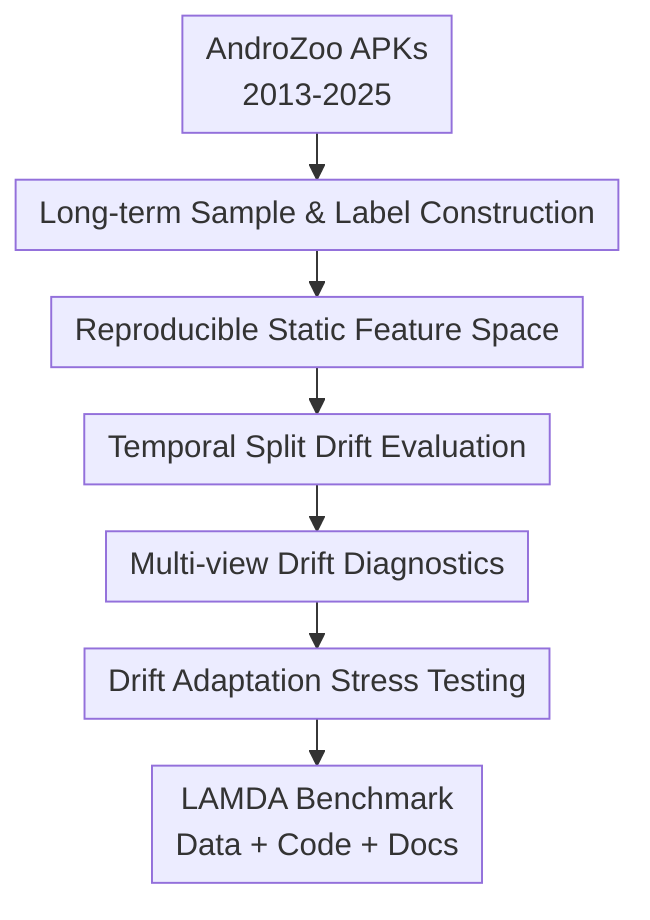

# LAMDA: A Longitudinal Android Malware Benchmark for Concept Drift Analysis

**Conference**: ICLR2026  
**OpenReview**: [https://openreview.net/forum?id=1FnCrZtBNQ](https://openreview.net/forum?id=1FnCrZtBNQ)  
**Code**: https://github.com/IQSeC-Lab/LAMDA  
**Area**: AI Security / Android Malware Detection  
**Keywords**: Android Malware, Concept Drift, Security Benchmark, Static Features, Long-term Generalization

## TL;DR
LAMDA constructs a long-term malware benchmark covering over 1 million Android APKs from 2013 to 2025. Using Drebin static features, family labels, and multiple temporal splitting systems, it reveals that existing malware detectors degrade rapidly under real-world concept drift.

## Background & Motivation
**Background**: In Android malware detection, many machine learning systems still follow the static analysis route: extracting features such as permissions, components, API calls, and URLs/IPs from APK manifests and smali code, then training SVMs, tree models, neural networks, or Transformer-based classifiers to distinguish between benign and malware. The advantages of this paradigm are interpretability, low cost, and ease of large-scale deployment. Consequently, datasets like Drebin, TESSERACT, and APIGraph have long supported security detection research.

**Limitations of Prior Work**: The real Android ecosystem is not static. API versions change, developer habits evolve, and malware authors actively rewrite manifests, replace API calls, incorporate obfuscation, or migrate to new services to bypass detection. As a result, the learned representation of "what malware looks like" in a training set becomes obsolete over time. More problematic is that many classic datasets either have a short time span, small sample sizes, or lack long-term coverage at the family level, making it difficult for researchers to judge if a method is truly drift-resilient or just appears stable on a milder, older dataset.

**Key Challenge**: Malware detection requires evaluating long-term generalization. However, long-term generalization itself requires a dataset to simultaneously satisfy temporal continuity, sufficient sample size, a wide variety of malware families, and reproducible labels and features. Past datasets typically only met a subset of these: for instance, Drebin is interpretable but dated with a short span; APIGraph has API semantics and temporal structure but limited scale and years; Windows-side datasets like EMBER, SOREL-20M, and BODMAS cannot directly answer questions regarding family evolution in the Android ecosystem.

**Goal**: The goal of LAMDA is not to propose a new detection model, but to fill the gap of a benchmark capable of conducting "serious research on Android malware concept drift." It aims to answer specific questions: how to construct an Android sample collection spanning 12 years; how to assign binary and family labels to samples; how to convert millions of APKs into unified, trainable static features; how to design temporal splits to expose concept drift; and to what extent existing supervised learning, interpretability analysis, and drift adaptation methods degrade on this more realistic benchmark.

**Key Insight**: The authors started from AndroZoo, a long-term APK repository, to re-sample, download, decompile, and extract Drebin-style features, then used VirusTotal and AVClass2 for binary and family-level labeling. The value of this perspective lies in placing "time" at the center of the dataset structure: every year maintains independent training/testing splits, samples are organized by actual submission time, and subsequent experiments can directly compare performance drops across IID, near-future, and far-future scenarios.

**Core Idea**: Instead of proposing another detector tuned only on old benchmarks, it is better to first build a large-scale, long-term, family-rich, and interpretable Android malware benchmark. This allows for systematic measurement of concept drift, explanation drift, label drift, and drift adaptation failures.

## Method

### Overall Architecture
The "method" of LAMDA is essentially a benchmark construction and validation pipeline: first obtaining APKs and metadata across years from AndroZoo, then determining binary and family labels via VirusTotal and AVClass2, followed by decompiling APKs to extract Drebin static features for unified vectorization. Finally, temporal splitting, distribution distance measures, SHAP explanations, and drift adaptation experiments are used to verify that this benchmark exposes long-term degradation more effectively than existing datasets. Its output is not just a data file, but a comprehensive long-term security evaluation environment for reproducible experiments.

### Key Designs
**1. Long-term Sample & Label Construction: Making drift stem from the real timeline rather than artificial perturbations**

LAMDA first extends the sample collection range to 2013-2025; except for 2015, which lacked valid hashes in AndroZoo, all other years are included. The authors targeted 50,000 malware and 50,000 benign samples annually, maintaining a monthly distribution where possible, resulting in 1,008,381 APKs (638,475 benign, 369,906 malware). The key to this scale is not "larger" per se, but that the multi-year coverage is long enough for a model to learn from the old ecosystem in 2013-2014 and be tested against the new ecosystem in 2016-2025.

Binary labels come from VirusTotal detection counts in AndroZoo: `vt_detection = 0` is treated as benign, `vt_detection >= 4` as malware, and samples with counts between 1 and 3 are discarded. This threshold follows heuristics from works like Drebin and TESSERACT to reduce label noise from single AV false positives. For malware, the authors re-retrieval VirusTotal reports and used AVClass2 to normalize noisy vendor naming into family labels; thus, LAMDA supports both binary classification and the analysis of how 1,380 malware families and 150,604 singleton samples evolve over time.

**2. Reproducible Static Feature Space: Connecting detection, explanation, and drift analysis with Drebin-style features**

Dataset construction did not stop at raw APK files; each APK was decompiled with apktool into manifest and smali representations to extract Drebin-style static features. The manifest side includes requested permissions, activities, services, broadcast receivers, hardware components, and intent filters; the smali side includes restricted API calls, suspicious API calls, and network indicators like hardcoded URLs/IPs. Although these features do not cover runtime behavior, their semantics are clear, facilitating the use of SHAP or family stability scores to explain why models drift.

All samples were converted into bag-of-tokens binary vectors: a feature is 1 if the token exists, else 0. The original global vocabulary was nearly 9.69 million dimensions, which is impractical for training. Thus, the authors constructed the vocabulary on the training set and applied `VarianceThreshold` for dimensionality reduction. The main experiment used a threshold of 0.001, resulting in 4,561 final binary features; variants at 0.01 and 0.0001 are provided in the appendix. This allows different years to share the same feature space, avoiding incomparable results due to feature growth over time, and allows researchers to map future samples into the LAMDA space using the same threshold object.

**3. Temporal Split Drift Evaluation: Clearly separating IID, NEAR, and FAR**

The core evaluation of LAMDA is not random partitioning but AnoShift-style temporal splitting. The authors used 2013-2014 as the TRAIN+IID set: the last month of each year served as IID testing, while the remaining months were used for training. 2016-2017 served as NEAR, and 2018-2025 as FAR. This design forces models to face increasingly large time gaps, so that performance degradation can be interpreted as temporal distribution shifts rather than standard random test errors.

This split is highly suitable for security scenarios. In reality, detectors are trained on old samples and deployed on future ones; if a model achieves an F1 near 97% on IID but drops to 40%-50% on FAR, it indicates the model learned static correlations from past years rather than malicious behaviors that remain stable across ecosystem changes. LAMDA also compares this split against APIGraph, concluding not just that "all datasets drift," but that "the drift captured by LAMDA is stronger, more unstable, and closer to long-term deployment pressure."

**4. Multi-view Drift Diagnostics: Asking where the drop comes from, not just observing F1 decline**

Rather than simplifying concept drift into a final score, the authors diagnosed it from multiple angles. First, a Jeffreys divergence heatmap measured differences in static feature distributions across years, showing LAMDA's distribution diverges significantly as the time gap increases, especially between 2022-2025 and earlier years. Second, t-SNE visualizations demonstrated structural changes in low-dimensional space, with LAMDA showing more dispersed clusters in 2016-2017 compared to the relatively compact APIGraph.

At the family level, the authors calculated Jaccard similarity stability scores for top malware families and used OTDD to observe distribution distances of the same family over time. Regarding explanations, they used top features from SHAP to calculate Jaccard and Kendall distances, observing whether the feature sets and rankings the model relies on change monthly. For labels, they compared historical AndroZoo labels with new VirusTotal reports to count samples with strengthened, weakened, or changed-to-benign detection counts. This combination makes LAMDA’s value concrete: it doesn't just say "the model is broken," but provides clues that feature distributions, family behaviors, explanation logic, and label consensus are all changing together.

### Loss & Training
LAMDA itself is not a new model, so it lacks a proprietary loss function; the training strategy is reflected in the standardized evaluation protocol. Supervised experiments used Linear SVM, LightGBM, MLP, XGBoost, detectBERT, and ViT, all repeated over 5 random seeds on LAMDA-baseline features, reporting mean and standard deviation for IID, NEAR, and FAR. LightGBM used up to 5000 trees, a learning rate of 0.02, and early stopping; MLP used a multi-layer fully connected network with Adam; SVM used LinearSVC with a calibrator for probability output; XGBoost, detectBERT, and ViT served as high-capacity comparison models.

Drift adaptation experiments utilized the monthly active learning framework by Chen et al., comparing Chen et al., CADE, and TRANSCENDENT with annotation budgets of 50, 100, 200, and 400. The training logic involves selecting a batch of samples each month for labeling and then retraining or updating the model to mitigate drift. This setting mimics security operations; however, LAMDA’s results show that existing adaptation methods cannot recover high F1 scores as they do on APIGraph, even with increased annotation budgets.

## Key Experimental Results

### Main Results
The supervised detection results directly demonstrate the difficulty of LAMDA: while most models achieve high F1 on IID, F1 drops significantly and FNR rises sharply on NEAR and FAR, while FPR remains relatively low. This means models increasingly misclassify future malicious samples as benign—the most dangerous type of degradation in security detection.

| Dataset | Model | IID F1 | NEAR F1 | FAR F1 | Key Phenomenon |
|--------|------|--------|---------|--------|----------|
| LAMDA | LightGBM | 97.49±0.17 | 59.48±28.20 | 47.24±27.33 | FNR rose from 1.74% to 64.10%, severe long-term misses |
| LAMDA | MLP | 97.21±0.12 | 56.57±28.41 | 47.59±25.30 | Neural networks also degrade over time |
| LAMDA | SVM | 94.98±1.07 | 52.91±28.40 | 41.86±22.55 | Linear detectors show weakest long-term generalization |
| LAMDA | XGBoost | 97.05±0.14 | 55.84±29.73 | 42.75±25.86 | Tree models cannot offset long-term drift |
| APIGraph | LightGBM | 85.95±0.00 | 66.77±0.00 | 68.20±4.63 | Long-term F1 did not continue to slide significantly |
| APIGraph | ViT | 86.64±0.00 | 72.15±0.00 | 68.47±3.94 | Drift pressure is clearly weaker than in LAMDA |

Another important observation is the precipitous drop in 2017-2018. The paper correlates this with multiple pieces of evidence: Jeffreys divergence rises around 2016-2018, family feature stability fluctuates more in the same interval, and SHAP explanation drift shows changes in model decision logic. In other words, the performance drop is not an accidental failure of a single model but a simultaneous shift in data distribution, family behavior, and explanatory features.

### Ablation Study
The paper lacks traditional model ablations (removing module A/B) because the primary contribution is the benchmark; ablation-like experiments focused on feature selection thresholds and drift adaptation budgets. Feature threshold experiments showed that smaller or larger feature spaces shift the false positive/negative balance, while drift adaptation experiments showed that existing CDA methods on LAMDA cannot restore F1 to APIGraph levels even with higher budgets.

| Configuration | Key Metric | Description |
|------|----------|------|
| LAMDA baseline, `VarianceThreshold=0.001` | LightGBM FAR F1 47.24±27.33 | Main setting with 4,561 static features, the core baseline |
| LAMDA, `VarianceThreshold=0.01` | SVM NEAR FPR 17.09±2.87 | Aggressive reduction slightly improved misses but significantly increased false positives |
| LAMDA, `VarianceThreshold=0.0001` | SVM NEAR F1 51.19±29.64 | Larger feature space did not fundamentally solve drift; still unstable long-term |
| Chen et al. on LAMDA, budget 400 | F1 43.00±1.60, FPR 89.80±2.10 | Active learning strong on APIGraph but shows extremely high false positives on LAMDA |
| CADE on LAMDA, budget 400 | F1 45.40±1.10, FNR 59.20±1.50 | Drift sample explanation/detection still misses many malware samples |
| TRANSCENDENT on LAMDA, budget 400 | F1 40.60±1.10, FPR 82.80±1.20 | Selective prediction struggle to adapt to complex long-term drift |

### Key Findings
- LAMDA's drift is stronger than APIGraph's. On APIGraph, LightGBM's F1 from IID to FAR is roughly 85.95% to 68.20%, whereas on LAMDA it drops from 97.49% to 47.24%, with significantly higher standard deviations, indicating that difficulty varies drastically across different future years.
- Misclassification (misses) is the primary security risk. FNR on the LAMDA FAR split often reaches ~60%, implying that old models will let through a large volume of attack samples when facing new malware; FPR remains relatively low, suggesting models tend to perceive future malware as normal.
- 2017-2018 is a critical drift interval. Performance curves, Jeffreys divergence, family stability, and SHAP explanation drift all signal anomalies around this period, suggesting a significant change in the Android ecosystem or malware family behavior.
- Existing drift adaptation methods are insufficient for LAMDA. Even with a monthly budget of 400 annotations, F1 scores for Chen et al., CADE, and TRANSCENDENT on LAMDA remain around 40%-45%, far below the ~90% seen on APIGraph.

## Highlights & Insights
- The greatest value of LAMDA is elevating the "long-term timeline" to a first-class citizen of the benchmark. Many malware detection papers claim to handle concept drift, but if the dataset only spans a few years or lacks family coverage, the conclusions are easily over-optimistic; LAMDA brings this issue back to the reality of deployment over 12 years and millions of samples.
- The paper turns the benchmark into an interpretability analysis platform rather than just a collection of samples. Componentizing Drebin features, AVClass2 labels, SHAP attribution, feature stability, and label drift allows researchers to track why models suddenly fail in certain years.
- The "low FPR but high FNR" phenomenon is a valuable insight for security system design. it shows that old models under drift do not necessarily manifest as chaotic alerts, but as excessive trust in future samples being benign; this is more insidious than high false positives and matches the risk brought by continuous attacker evolution.
- The insights from this paper are not limited to Android. Any ML system deployed in an adversarial environment faces the co-evolution of training and attack distributions; LAMDA's temporal splitting, label drift analysis, and explanation drift analysis can be transferred to phishing, spam, fraud, and model abuse detection.
- The paper also reminds us that a benchmark's "difficulty" should not only come from more complex models or larger inputs, but from more realistic evaluation protocols. LAMDA exposes the long-term generalization shortcomings of many mature detectors without needing fancy new architectures.

## Limitations & Future Work
- LAMDA utilizes only Drebin-style static features and does not cover dynamic sandbox behavior, control flow graphs, runtime network behavior, or enriched threat intelligence. This limits the dimensions of behavior captured for malware that heavily depends on runtime triggers.
- The dataset attempts to maintain a near 50:50 malware/benign ratio, which benefits learning and family coverage but does not match the actual class distribution in the app ecosystem. In real deployment, benign samples far outnumber malware, requiring additional evaluation of threshold selection, calibration, and false positive costs.
- The number of malware samples from 2023-2025 is significantly lower, especially in 2025 with only 23 samples. While this reflects reality in sampling and label availability, the statistical stability of the latest years should be interpreted with caution.
- Labels still rely on VirusTotal consensus and AVClass2 normalization. Although label drift was analyzed, updates to VT engines, changes in vendor policies, and family naming inconsistencies may still affect ground truth; future work could combine manual analysis or multi-source intelligence to reduce label bias.
- An obvious extension is making LAMDA a multi-modal security benchmark: adding dynamic behavior, control flow execution features, network communication, and intelligence feeds alongside static tokens, forcing models to face feature drift, label drift, and cross-modal drift simultaneously.

## Related Work & Insights
- **vs Drebin**: Drebin provided a classic starting point for Android static features and interpretable detection, but its span was limited to 2010-2012 with small sample and family scales. LAMDA inherits the feature style but expands to 12 years and millions of samples, making it suitable for long-term drift research.
- **vs TESSERACT**: TESSERACT emphasized avoiding temporal and spatial bias in malware classification, noting that random partitioning overestimates performance. LAMDA continues this ideology but covers more years and samples, adding finer diagnostics like family evolution and explanation drift.
- **vs APIGraph**: APIGraph focuses on API semantic enhancement and evolved malware detection with a temporal structure. LAMDA’s advantage lies in its coverage extending to 2025, 1M+ samples, and richer family/singleton variety, with experiments showing it presents stronger distribution drift.
- **vs CADE / TRANSCENDENT / Chen et al.**: These methods attempt to detect or adapt to concept drift and performed well on milder benchmarks. LAMDA shows they are insufficient for complex, long-term Android drift, leaving clear research space for dynamic learning, semi-supervised updates, continual learning, and drift-aware calibration.
- **Insights for Security ML Benchmarks**: A good benchmark should not just ask "what is the average accuracy," but also "how many years separate the training and deployment data," "which new families is the model missing," "why have important features changed," and "is the label consensus shifting." LAMDA systematizes these questions.

## Rating
- Novelty: ⭐⭐⭐⭐☆ Not a new model innovation, but the construction of a million-scale, family-level, and interpretable long-term drift benchmark for Android is a solid contribution.
- Experimental Thoroughness: ⭐⭐⭐⭐⭐ Covers supervised detection, distribution distance, t-SNE, family stability, SHAP explanations, label drift, drift adaptation, and continual learning across a complete set of validation dimensions.
- Writing Quality: ⭐⭐⭐⭐☆ Clear main line and ample data tables; however, some sections and expressions are slightly repetitive, and minor English layout or grammatical issues occasionally affect flow.
- Value: ⭐⭐⭐⭐⭐ Highly useful for Android security, concept drift, and evaluating ML generalization in adversarial environments, especially as a stress test for future drift adaptation methods.

<!-- RELATED:START -->

## Related Papers

- [\[ICLR 2026\] DRIFT: Divergent Response in Filtered Transformations for Robust Adversarial Defense](drift_divergent_response_in_filtered_transformations_for_robust_adversarial_defe.md)
- [\[ICLR 2026\] Concept-based Adversarial Attack: a Probabilistic Perspective](concept-based_adversarial_attack_a_probabilistic_perspective.md)
- [\[ICLR 2026\] Convergent Differential Privacy Analysis for General Federated Learning](convergent_differential_privacy_analysis_for_general_federated_learning.md)
- [\[ICLR 2026\] Decoupling the Class Label and the Target Concept in Machine Unlearning](decoupling_the_class_label_and_the_target_concept_in_machine_unlearning.md)
- [\[ICLR 2026\] Concept-Aware Privacy Mechanisms for Defending Embedding Inversion Attacks](concept-aware_privacy_mechanisms_for_defending_embedding_inversion_attacks.md)

<!-- RELATED:END -->
