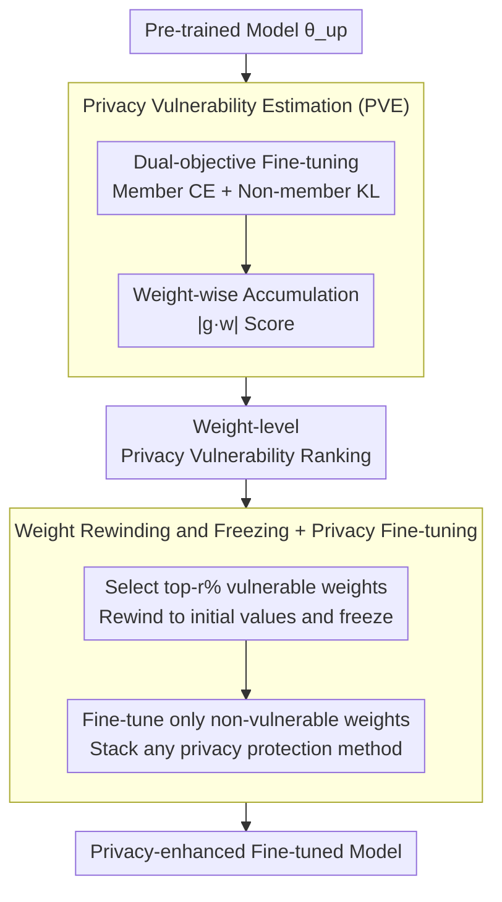

# Learnability and Privacy Vulnerability are Entangled in a Few Critical Weights

**Conference**: ICLR 2026  
**arXiv**: [2603.13186](https://arxiv.org/abs/2603.13186)  
**Code**: None  
**Area**: AI Security / Privacy Protection  
**Keywords**: Membership Inference Attack, Weight Importance, Privacy Vulnerability, Weight Rewinding, Fine-grained Privacy Defense

## TL;DR

This paper reveals that privacy vulnerability is concentrated in a very small number of critical weights (as low as 0.1%) and is highly entangled with learnability (Pearson r > 0.9). It proposes the CWRF method, which achieves a superior privacy-utility trade-off by rewinding and freezing privacy-vulnerable weights while fine-tuning only the remaining weights.

## Background & Motivation

**Background**: Membership Inference Attacks (MIA) infer data membership by exploiting the behavioral differences of a model between training and non-training data. Existing privacy protection methods (such as DP-SGD, RelaxLoss, HAMP, etc.) typically update or retrain all weights, which is not only computationally expensive but may also lead to unnecessary utility loss. **Limitations of Prior Work**: Existing work (such as the Lottery Ticket Hypothesis) has shown that only a few weights are crucial for model performance, but weight-level analysis of privacy vulnerability remains completely unexplored. Standard pruning techniques (such as TFO) actually increase privacy risk after removing "unimportant" weights—at 90% sparsity, the model's test loss increases while the MIA success rate remains constant or even higher. **Key Challenge**: Intuitively, "privacy-vulnerable" weights should be removed, but these weights are precisely the "learnability-critical" weights—the two attributes are highly entangled in a very small number of weights (Pearson r > 0.9), making simple pruning impossible. **Goal**: Precisely locate and process privacy-vulnerable weights to reduce MIA risk without destroying model performance. **Key Insight**: Since position is more important than numerical value (retaining the position of critical weights allows performance recovery), privacy-vulnerable weights are rewound to their initial values—eliminating privacy risk while preserving connection topology—then frozen, with only the remaining weights being fine-tuned. **Core Idea**: Instead of deleting privacy-vulnerable weights, they are rewound to their initialization values and frozen. The insight of "position > value" is leveraged to allow the model to recover performance during fine-tuning while protecting privacy.

## Method

### Overall Architecture

CWRF (Critical Weights Rewinding and Finetuning) starts from a pre-trained model and outputs a privacy-enhanced fine-tuned model via two steps: first, a dual-objective fine-tuning of "learning members + forgetting non-members" is used to assign a Privacy Vulnerability Estimation (PVE) score to each weight to identify which weights are most prone to leaking privacy; second, the top-r% most vulnerable weights are selected according to the scores, rewound to their initialization values, and frozen. Only the remaining non-vulnerable weights are fine-tuned—this step can seamlessly integrate with any privacy-preserving training method (DP-SGD, RelaxLoss, etc.). The core intuition is "position > value": vulnerable weights are also learnability-critical and cannot be deleted, but resetting their values to the initial state while preserving the connection topology eliminates absorbed privacy information while allowing fine-tuning to recover performance.

### Key Designs

**1. Privacy Vulnerability Estimation (PVE): Measuring privacy leakage per weight via "Learn + Forget" signals**

To precisely handle privacy-vulnerable weights, a metric is needed to measure each weight's contribution to privacy leakage. Traditional importance metrics (like TFO) only focus on accuracy and fail to measure the privacy dimension. PVE performs a dual-objective fine-tuning on the pre-trained model: minimizing cross-entropy loss on the training set (member data) to let the model "learn" member information, while minimizing KL divergence from the initial model on a reference set (non-member data) to let the model "forget" non-member information. The loss function is:

$$\mathcal{L}_{\text{pve}} = (1-\lambda)\mathcal{L}_{\text{ce}}(f(x_{tr};\theta_{up}), y_{tr}) + \lambda\mathcal{L}_{\text{kl}}(f(x_{re};\theta_{up}), f(x_{re};\theta_{vn}))$$

During the iteration, the $|g_i \cdot w_i|$ score (gradient × weight magnitude) is accumulated for each weight, resulting in a weight-level privacy vulnerability ranking. The key lies in this dual signal: high-scoring weights are exactly those that intensify training data behavior while widening the gap between training and non-training data behavior—a gap exploited by MIA. Thus, high PVE scores identify privacy "leakage points" rather than mere "performance essentials."

**2. Weight Rewinding and Freezing + Privacy Fine-tuning: Reseting to initial values instead of deletion**

Knowing which weights are vulnerable, the intuition might be to prune them, but experiments show the opposite—these are also learnability-critical weights, and pruning them causes accuracy to collapse. CWRF's solution is rewinding rather than removal: the top-r% most vulnerable weights based on PVE scores are reset to their initialization values using a mask, $\theta_{rw} = \mathcal{B}_f \odot \theta_{up} + \mathcal{B}_r \odot \theta_{vn}$. This wipes the privacy information they absorbed during training while preserving their "position" (connection topology). These weights are then frozen—prevented from being updated via a gradient mask $\mathcal{G}_p \leftarrow \mathcal{B}_f \odot \mathcal{G}_p$—and only the remaining non-vulnerable weights are fine-tuned. The learning rate is also rewound to its initial value and managed with a cosine annealing schedule. Preserving position over value works because ablation shows that while direct weight removal (A1) leads to an unrecoverable collapse in accuracy, both rewinding+fine-tuning (A2, A3/CWRF) can recover performance; crucially, fine-tuning non-vulnerable weights (A3) offers a significantly better privacy-utility trade-off than fine-tuning vulnerable ones (A2). Since the fine-tuning phase is agnostic to the loss form, CWRF can be directly stacked on any privacy protection method (DP-SGD, RelaxLoss, HAMP, CCL, etc.).

### Loss & Training

The PVE stage uses $\mathcal{L}_{\text{pve}}$ (CE + KL dual-objective) to accumulate scores over $T$ steps. The fine-tuning stage adopts the user-selected privacy protection method (standard CE or its variants) and updates only the non-frozen weights via a gradient mask. The learning rate starts from the initial value with cosine annealing for $E$ epochs. The total computational overhead is significantly lower than retraining from scratch.

## Key Experimental Results

### Main Results

**Entanglement Quantification** (Table 1, Pearson Correlation Coefficient):

| Architecture | Weight Type | Pearson r | Param Ratio |
| :--- | :--- | :--- | :--- |
| ResNet18 | Conv | **0.9410** | 99.50% |
| ResNet18 | Linear | 0.8096 | 0.45% |
| ResNet18 | Norm | 0.6776 | 0.05% |
| ViT | Att+MLP | **0.9068** | 99.39% |
| ViT | Linear | 0.8642 | 0.54% |
| ViT | Norm | 0.7336 | 0.07% |

**CIFAR-10 Defense Performance** (Table 3, ResNet18, LiRA Attack AUC ↓ lower is better):

| Defense Method | Test Acc (%) | LiRA AUC (%) | LiRA TPR@0.1%FPR (%) |
| :--- | :--- | :--- | :--- |
| No Defense | 79.44 | 85.00 | 2.18 |
| RelaxLoss | 77.10 | 70.51 | 1.38 |
| RelaxLoss+CWRF | 76.86 | **68.31** | **0.03** |
| CCL | 79.56 | 83.95 | 1.50 |
| CCL+CWRF | 77.77 | **64.82** | **0.22** |

### Ablation Study

| Config | Rewinding Rate | Training Loss | Test Loss | Description |
| :--- | :--- | :--- | :--- | :--- |
| A1 (Remove+Fine-tune non-vulnerable) | 0.1-5% | — | — | Accuracy collapses, unrecoverable |
| A2 (Rewind+Fine-tune vulnerable) | 3.0% | 0.4326 | 0.9288 | Larger Loss gap |
| A3/CWRF (Rewind+Fine-tune non-vulnerable) | 3.0% | 0.4473 | **0.8044** | Smallest Loss gap |
| From scratch (RelaxLoss) | — | 0.8087 | 1.5398 | Poor global training effect |

With a 3% rewinding rate, CWRF achieves a test Loss of only 0.8044, which is far superior to 1.5398 from training from scratch.

### Key Findings

- Standard pruning (TFO 90% sparsity) does not reduce and may even increase MIA success rates—once redundancy is reduced, the impact of vulnerable weights is concentrated and amplified.
- Weight "position" is more critical than "value": accuracy can be fully recovered by retraining after rewinding to initialization, while it is unrecoverable if removed.
- Attention layers in Transformers exhibit higher privacy vulnerability than convolutional layers in CNNs.
- CWRF can be stacked onto existing privacy-preserving training methods, bringing improvements to all four tested methods: DP-SGD, RelaxLoss, HAMP, and CCL.
- On ViT, DP-SGD+CWRF further reduces LiRA AUC from 54.97% to 55.68% (close to random 50%) and TPR@0.1‱FPR from 0.17% to 0.00%.

## Highlights & Insights

- This is the first study to analyze privacy vulnerability at weight granularity, revealing deep entanglement with learnability—this fundamentally explains why traditional pruning failed to improve privacy.
- The "position > value" finding echoes the Lottery Ticket Hypothesis but provides new evidence and applications from a privacy protection perspective.
- CWRF has a much lower computational cost than global methods like DP-SGD—it only requires fine-tuning a small number of weights, making it a practical lightweight privacy enhancement solution.
- normalization layers, despite accounting for only 0.05-0.07% of parameters, contain highly privacy-vulnerable weights with lower correlation to learnability, suggesting they may play a unique role in privacy protection.

## Limitations & Future Work

- Validated only on classification models (ResNet18, ViT) and small-scale datasets (CIFAR-10/100, CINIC-10); applicability to LLMs is unknown.
- The rewinding rate $r$ requires selection via cross-validation; an automated strategy is lacking.
- PVE requires a non-member reference set—this assumption may not hold in some scenarios.
- The formal theoretical connection with Differential Privacy is not established, so formal privacy guarantees cannot be provided.

## Related Work & Insights

- **vs DP-SGD**: DP-SGD adds noise globally, while CWRF precisely locates vulnerable weights. CWRF can serve as a complement to DP-SGD (stacked usage showed better results in experiments).
- **vs Lottery Ticket Hypothesis/Model Pruning**: Pruning focuses on efficiency, CWRF focuses on privacy. Both share the insight that a few weights determine model behavior, but CWRF discovers that the privacy and utility dimensions are highly coupled.

## Rating
- Novelty: ⭐⭐⭐⭐ Weight-level privacy analysis is a fresh perspective, with three core insights progressing logically.
- Experimental Thoroughness: ⭐⭐⭐⭐ Validated across two architectures (ResNet/ViT), two attacks (LiRA/RMIA), and stacked with four defense methods.
- Writing Quality: ⭐⭐⭐⭐ Excellent visualization and a clear chain of argumentation from observation to hypothesis to validation.
- Value: ⭐⭐⭐⭐ Provides a new approach for lightweight privacy-preserving fine-tuning with low practical deployment barriers.

<!-- RELATED:START -->

## Related Papers

- [\[ICLR 2026\] Towards Privacy-Guaranteed Label Unlearning in Vertical Federated Learning: Few-Shot Forgetting without Disclosure](towards_privacy-guaranteed_label_unlearning_in_vertical_federated_learning_few-s.md)
- [\[ICLR 2026\] Robustify Spiking Neural Networks via Dominant Singular Deflation under Heterogeneous Training Vulnerability](robustify_spiking_neural_networks_via_dominant_singular_deflation_under_heteroge.md)
- [\[ICLR 2026\] Identifying Robust Neural Pathways: Few-Shot Adversarial Mask Tuning for Vision-Language Models](identifying_robust_neural_pathways_few-shot_adversarial_mask_tuning_for_vision-l.md)
- [\[ICLR 2026\] Privacy Beyond Pixels: Latent Anonymization for Privacy-Preserving Video Understanding](privacy_beyond_pixels_latent_anonymization_for_privacy-preserving_video_understa.md)
- [\[ICML 2026\] Right Predictions, Misleading Explanations: On the Vulnerability of Vision-Language Model Explanations](../../ICML2026/ai_safety/right_predictions_misleading_explanations_on_the_vulnerability_of_vision-languag.md)

<!-- RELATED:END -->
