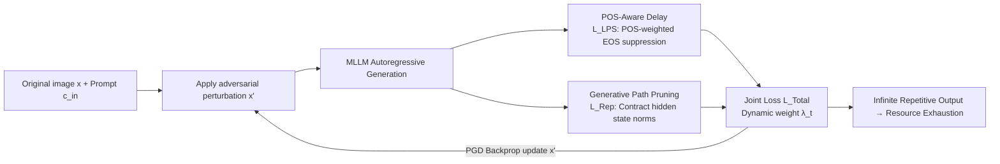

# LingoLoop Attack: Trapping MLLMs via Linguistic Context and State Entrapment into Endless Loops

**Conference**: ICLR 2026  
**OpenReview**: [https://openreview.net/forum?id=kxEM2vc7ne](https://openreview.net/forum?id=kxEM2vc7ne)  
**Code**: To be confirmed  
**Area**: AI Security / Energy-Latency Attack / Multimodal Large Language Model Adversarial Defense  
**Keywords**: energy-latency attack, sponge attack, MLLM, EOS suppression, repetitive generation, DoS  

## TL;DR
LingoLoop injects subtle adversarial perturbations into input images to trap Multimodal Large Language Models (MLLMs) into infinite repetitive generation. By utilizing "POS-prior-based EOS suppression" and "hidden state contraction-induced loops," it produces up to 367× more tokens than normal inputs when generation limits are relaxed, causing compute/energy-exhaustion Denial-of-Service (DoS).

## Background & Motivation
**Background**: MLLMs (e.g., GPT-4o, Qwen2.5-VL) are typically deployed as cloud services with token-based billing due to high computational costs. This exposes a vulnerability to "energy-latency attacks" (also known as sponge attacks), where attackers construct adversarial inputs to induce excessively long outputs, consuming disproportionate compute resources and energy to slow down or paralyze services (DoS).

**Limitations of Prior Work**: The previous SOTA method, Verbose Images, suppresses the probability of the EOS (End of Sentence) token **uniformly** across all output positions via image perturbations. However, its effectiveness is limited. This paper attributes this inefficiency to two factors: (1) Different **Parts-of-Speech (POS)** have vastly different tendencies to trigger EOS—for instance, punctuation is far more likely to be followed by EOS than adjectives or progressive verbs. Uniform pressure wastes effort on positions unlikely to terminate; (2) Sentence-level structural patterns are ignored, specifically failing to explicitly exploit "repetitive loops" which can drastically inflate output length.

**Key Challenge**: To maximize output length, the attack must simultaneously counter the model's natural tendency to terminate and its inherent preference for diverse, coherent generation. Uniform pressure fails to address either effectively.

**Goal**: Under white-box constraints and an $\ell_\infty$ perturbation budget $\|x'-x\|_p \le \epsilon$, maximize the number of output tokens: $\max_{x'} N_{out}(x')$.

**Core Idea**: **(1) Injecting linguistic priors into the attack**—adaptively suppressing EOS based on the POS of the preceding token; **(2) Forcing the model into a representation collapse state**—actively contracting hidden state norms to deprive the model of generation diversity and induce stable repetitive loops.

## Method

### Overall Architecture
LingoLoop is a two-stage collaborative attack: the **POS-Aware Delay Mechanism** prevents termination at "natural stop points," while the **Generative Path Pruning Mechanism** contracts hidden states to squeeze the model into a low-variance subspace, inducing "unstoppable" repetitive loops. These are combined into a joint loss with dynamic weights, optimized via PGD on the image.

### Key Designs

**1. POS-Aware Delay Mechanism: Focusing suppression on "true termination" points**
The authors observed that EOS occurrence is strongly correlated with the **POS of the preceding token** (Figure 3, where EOS probability after punctuation is much higher than after adjectives). Based on this, they calculate an offline **Statistical Weight Pool** by running models on ImageNet/MSCOCO images to find the empirical prior $\bar{P}_{EOS}(t)$ for each POS $t$. During the attack, for the $i$-th step, the POS of the previous token $t_{i-1}=\mathrm{POS}(y_{i-1})$ is identified, and a weight $w_i = \phi_w(\bar{P}_{EOS}(t_{i-1}); \theta_w)$ is retrieved. Higher priors lead to larger weights. The **Linguistic Prior Suppression Loss** is then defined to focus suppression on these high-risk positions:

$$\mathcal{L}_{LPS}(x') = \frac{1}{N_{out}} \sum_{i=1}^{N_{out}} \left( w_i \cdot f^{EOS}_i(x') \right).$$

Compared to uniform suppression, the gradient signal is adaptively scaled by $w_i$, making the inhibition more efficient by focusing on linguistically likely termination contexts.

**2. Generative Path Pruning Mechanism: Squeezing the model into repetitive loops**
Mere EOS suppression is insufficient for extreme inflation. True long-tail outputs rely on forcing the model into a **repetitive loop state**. The authors verified this via intra-batch mixing experiments: increasing the proportion of loop-inducing adversarial samples $M_{adv}$ leads to a simultaneous drop in the **mean and variance** of L2 norms of hidden states, inversely correlated with output length and repetition. Consequently, the **Repetition Promotion Loss** is proposed to punish the average hidden state norm across all $L$ layers:

$$\mathcal{L}_{Rep}(x') = \frac{\lambda_{rep}}{N_{out}} \sum_{k=1}^{N_{out}} \bar{r}_k,$$

where $\bar{r}_k = \frac{1}{L}\sum_{l=1}^{L}\|h^{(l)}_k(x')\|_2$. Minimizing this reduces the magnitude of hidden states, forcing the model trajectory into a restricted subspace where diversity degrades into stable cycles.

**3. Dynamic Weighted Optimization: Auto-focusing objectives during iterations**
The total objective is $\mathcal{L}_{Total}(x',t) = \alpha \cdot \mathcal{L}_{LPS}(x') + \lambda(t) \cdot \mathcal{L}_{Rep}(x')$. Following the dynamic weighting logic of Verbose Images, $\lambda(t)$ is adjusted based on the $\ell_1$ magnitude ratio of the two losses from the previous round, multiplied by a temporal decay function $T(t)=a\ln(t)+b$:

$$\lambda(t) = \frac{\|\mathcal{L}_{LPS}(x'_{t-1})\|_1}{\|\mathcal{L}_{Rep}(x'_{t-1})\|_1} \cdot T(t).$$

This ensures the attack focuses on EOS suppression early on and shifts toward inducing repetition later. Optimization is performed using PGD with momentum for $T$ steps.

## Key Experimental Results

### Main Results (200 images each for MS-COCO / ImageNet, $\epsilon=8$, max 1024 tokens)

| Model | Method | Tokens (COCO) | Energy/J | Latency/s |
|------|------|--------------:|---------:|----------:|
| InstructBLIP | None | 86.11 | 428.72 | 4.91 |
| InstructBLIP | Verbose Images | 332.29 | 1241.89 | 17.79 |
| InstructBLIP | **Ours** | **1002.08** | **3152.26** | **57.30** |
| Qwen2.5-VL-3B | None | 66.64 | 430.01 | 2.24 |
| Qwen2.5-VL-3B | Verbose Images | 394.74 | 2682.38 | 13.12 |
| Qwen2.5-VL-3B | **Ours** | **1020.38** | **7090.58** | **32.94** |

Ours pushed outputs to the limit across four models. For Qwen2.5-VL-3B, it achieved 15.3× the tokens of clean inputs and 2.6× compared to Verbose Images, with 14.7× energy consumption. Random noise was nearly identical to clean inputs, proving naive perturbations ineffective.

### Relaxed Upper Bound Experiments (Qwen2.5-VL-3B, varied max_new_tokens)

| max tokens | Method | Tokens (COCO) | Energy/J |
|-----------:|------|--------------:|---------:|
| 256 | **Ours** | **256.00** | **2069.87** |
| 1024 | **Ours** | **1024.00** | **6926.44** |
| 2048 | **Ours** | **2048.00** | **14386.41** |

Regardless of how high the limit was set, **Ours** consistently hit the ceiling, whereas Verbose Images could not reach the upper bounds. This demonstrates the power of the "loop state."

### Ablation Study (Component Contribution, Qwen2.5-VL-3B, MS-COCO)

| $\mathcal{L}_{LPS}$ | $\mathcal{L}_{Rep}$ | Mom. | Tokens | Energy |
|:---:|:---:|:---:|------:|-------:|
| Uniform | ✗ | ✗ | 843.86 | 5329.82 |
| ✓ | ✗ | ✗ | 926.94 | 6265.61 |
| ✓ | ✓ | ✓ | **1024.00** | **6926.44** |

### Key Findings
- POS-aware suppression outperformed uniform EOS suppression (926.94 vs 843.86).
- $\lambda_{rep}$ has an optimal value (~0.5); if too large, it over-constrains the state space, leading to ineffective short cycles.
- Convergence analysis showed the full method reaches the token limit in ~300 steps, much faster than partial versions.

## Highlights & Insights
- **Linguistic structure in energy attacks**: This is the first work to explicitly use POS priors to locate "where to suppress EOS," upgrading from uniform pressure to context-aware precision.
- **Physical metric for loops**: The paper identifies "hidden state norm contraction → representation collapse → repetitive loops" as a causal chain that can be supervised via loss functions.
- **Practical threat**: The ability to hit any token limit reliably translates to real-world economic and availability damage for token-billed MLLM services.

## Limitations & Future Work
- **White-box Assumption**: Requires full gradient/architecture knowledge; the utility against black-box cloud services (GPT-4o) remains a barrier despite some transferability experiments.
- **Task Scope**: Experiments are concentrated on image captioning; generalization to VQA or video understanding needs further validation.
- **Defensive Countermeasures**: While the paper mentions resilience to some defenses, systematic evaluation against repetition penalty decoding or perplexity filtering is needed.
- **Detectability**: Extreme repetition has strong statistical signatures and could be intercepted by heuristic rules in production environments.

## Related Work & Insights
- **Energy-latency/Sponge Attack Lineage**: From CNN activation sparsity to Transformer NMTSloth and NICGSlowDown for captioning, this work pushes the frontier to MLLM visual inputs.
- **Insights**: (1) "Token-level linguistic priors" are a reusable paradigm for both attack and defense weighting. (2) Hidden state norms are observable indicators for detecting anomalous generation. (3) Resource-based attacks highlight the need for runtime circuit breakers based on output length and repetition.

## Rating
- Novelty: ⭐⭐⭐⭐ Combines linguistic priors with representation collapse for the first time.
- Experimental Thoroughness: ⭐⭐⭐⭐ Tested across multiple models and datasets with comprehensive ablations.
- Writing Quality: ⭐⭐⭐⭐ Clear chain of logic from observation to mechanism.
- Value: ⭐⭐⭐⭐ Directly addresses economic/availability risks in cloud-deployed MLLMs.

<!-- RELATED:START -->

## Related Papers

- [\[ICLR 2026\] Action-Free Offline-to-Online RL via Discretised State Policies](action-free_offline-to-online_rl_via_discretised_state_policies.md)
- [\[ICML 2026\] MLUBench: A Benchmark for Lifelong Unlearning Evaluation in MLLMs](../../ICML2026/ai_safety/mlubench_a_benchmark_for_lifelong_unlearning_evaluation_in_mllms.md)
- [\[CVPR 2025\] Towards General Visual-Linguistic Face Forgery Detection](../../CVPR2025/ai_safety/towards_general_visual-linguistic_face_forgery_detection.md)
- [\[ICML 2026\] Semantic Router: On the Feasibility of Hijacking MLLMs via a Single Adversarial Perturbation](../../ICML2026/ai_safety/semantic_router_on_the_feasibility_of_hijacking_mllms_via_a_single_adversarial_p.md)
- [\[ICML 2026\] Robust In-Context Reinforcement Learning Under Reward Poisoning Attacks](../../ICML2026/ai_safety/robust_in-context_reinforcement_learning_under_reward_poisoning_attacks.md)

<!-- RELATED:END -->
