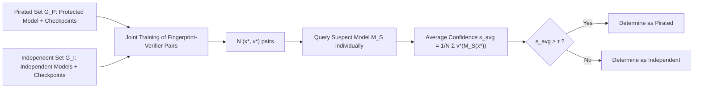

# LiteGuard: Efficient Task-Agnostic Model Fingerprinting with Enhanced Generalization

**Conference**: ICLR 2026  
**OpenReview**: [https://openreview.net/forum?id=TFC25ZT9nI](https://openreview.net/forum?id=TFC25ZT9nI)  
**Code**: To be confirmed  
**Area**: AI Security / Model Copyright Protection / Task-Agnostic Fingerprinting  
**Keywords**: Model Fingerprinting, Intellectual Property Protection, Task-Agnostic, Generalization, Computational Efficiency, Overfitting  

## TL;DR
LiteGuard employs two strategies—expanding model sets using training checkpoints and assigning a lightweight local verifier to each fingerprint—to minimize the training requirement for task-agnostic model fingerprinting (requiring as few as 1 real model per set). It outperforms the SOTA MetaV in AUC across five categories of tasks while reducing training costs by 5 to 10 times.

## Background & Motivation
- **Background**: Model fingerprinting protects DNN Intellectual Property (IP) against theft and pirated deployment by constructing input samples that elicit unique outputs, treating these "input-output pairs" as fingerprints to verify ownership. Most methods are task-specific (specialized for classification, GNNs, or GANs); only MetaV is truly task-agnostic, jointly training a set of fingerprints and a neural-network-based global verifier end-to-end.
- **Limitations of Prior Work**: To ensure generalization, MetaV relies on large and diverse model sets—comprising a pirated set (the protected model and its variants) and an independent training set. However, publicly available models are scarce in many domains, and training numerous models from scratch is prohibitively expensive, hindering practical deployment.
- **Key Challenge**: Reducing the number of models in the set saves computation but leads to severe overfitting. MetaV’s design, which involves "entangled joint training of all fingerprints and the global verifier," exacerbates this. The number of fingerprints $N$ is typically large, leading the input dimension of the global verifier to grow linearly with $N \cdot O$. Consequently, the parameter count swells with $N$, causing severe overfitting on limited models and causing generalization to collapse on unseen models.
- **Goal**: Achieve enhanced generalization performance under extremely low computational constraints (as few as 1 real-trained model per set).
- **Core Idea**: **[Decoupling + Cheap Augmentation]** On one hand, model diversity is expanded for free using intermediate checkpoints naturally generated during training. On the other hand, the "single global verifier" is replaced by "independent lightweight local verifiers" for each fingerprint, fundamentally reducing entangled parameters and suppressing overfitting.

## Method

### Overall Architecture
LiteGuard jointly learns a set of **fingerprint-verifier pairs** in an end-to-end manner. The process consists of three steps: **Model Set Construction** (augmenting pirated and independent sets with checkpoints), **Joint Training of Fingerprint-Verifier Pairs** (independent optimization for each pair), and **Ownership Verification** (independent scoring by each pair followed by averaging and threshold comparison).

### Key Designs

**1. Checkpoint Model Set Augmentation: Turning "training waste" into a free source of diversity.** Since MetaV’s generalization depends heavily on model set scale, LiteGuard observes that training any model produces numerous intermediate snapshots (checkpoints). These snapshots reflect diverse decision behaviors from random initialization to convergence at almost no extra cost. LiteGuard augments both the pirated set $G_P$ and the independent set $G_I$. The selection of checkpoints is critical: sampling begins at epoch $e_s$ and proceeds every $l$ epochs. The value of $e_s$ is key—early snapshots (e.g., $e_s=10$) lack meaningful decision behavior, while late snapshots (near convergence) are too similar to the final model. The middle stage (35-85% of training progress) balances noise avoidance and diversity. Ablations show AUC drops when $l$ increases from 6 to 30 (fewer snapshots) and saturates when decreasing from 6 to 2.

**2. Local Verifier Architecture: Achieving constant complexity independent of $N$ through decoupling.** This is the core mechanism for suppressing overfitting. MetaV concatenates all fingerprint outputs as input to an $L$-layer MLP global verifier with dimension $N \cdot O$. This causes the parameter complexity $P_{\text{MetaV}} = O(N(F+O \cdot H) + H^2 L)$ to grow linearly with $N$. LiteGuard assigns **each fingerprint $x$ a single lightweight local verifier $v$**, consisting of one linear layer and a sigmoid: $v(y) = \sigma(\langle w, y \rangle_F + b)$, where $w$ is a trainable tensor matching the model output dimension. Each $(x, v)$ pair is trained independently without entanglement. The complexity per pair is $O(F+O)$, making the overall complexity **independent of $N$**. This prevents overfitting regardless of the number of fingerprints used. A cross-experiment validates this: applying LiteGuard’s local verifier to MetaV (MetaV-LV) increased time-series task AUC from 0.854 to 0.959, while applying MetaV’s verifier to LiteGuard (LiteGuard-MV) dropped AUC from 0.977 to 0.908.

**3. Batch-level Sampling + Balanced Weighted Joint Training.** Each iteration randomly samples a mini-batch of $K$ models (where $K=1$ in experiments) from $G_P$ and $G_I$, minimizing the mean Binary Cross Entropy (BCE):

$$L(x,v)=\alpha_{\text{prot}}L_{bce}(v(M_P(x)),1)+\frac{\alpha_P}{K}\sum_{g_P\in B_P}L_{bce}(v(g_P(x)),1)+\frac{\alpha_I}{K}\sum_{g_I\in B_I}L_{bce}(v(g_I(x)),0)$$

Label $s=1$ is used for pirated models and $s=0$ for independent models. Weights satisfy $\alpha_{\text{prot}}+\alpha_P \approx \alpha_I$ (set to 0.5/1.0/1.5 in experiments) to ensure balanced contributions. The protected model $M_P$ is emphasized with a separate weight.

**4. Ownership Verification via Average Aggregation.** During verification of a suspect model $M_S$, each fingerprint $x_m^*$ yields an output $y_m = M_S(x_m^*)$. The paired verifier $v_m^*$ produces a confidence score $v_m^*(y_m) \in (0,1)$. The final decision is based on the average score $s_{avg} = \frac{1}{N} \sum_{m=1}^N v_m^*(M_S(x_m^*))$ compared against threshold $\tau$: $\text{Decision}(M_S) = \mathbb{1}[s_{avg} > \tau]$.

## Key Experimental Results
**Setup**: Five representative tasks covering five network architectures—CNN/CIFAR-100 (Image Classification), MLP/CASP (Protein Regression), AE/CH (Tabular Generation), GNN/QM9 (Molecular Property Prediction), and RNN/Weather (Time-series Generation). Training uses an **extreme setup**: only 1 real-trained model per set, augmented by checkpoints. Test sets are disjoint (Pirated set: 91 models with 6 obfuscation variants; Independent set: 100 models). Fingerprints $N=100$. Metric: AUC (5 runs).

### Main Results: Generalization Across Five Tasks (AUC)

| Method | CNN/CIFAR-100 | MLP/CASP | AE/CH | GNN/QM9 | RNN/Weather |
|---|---|---|---|---|---|
| UAP | 0.752 | – | – | – | – |
| IPGuard | 0.708 | – | – | – | – |
| ADV-TRA | 0.845 | – | – | – | – |
| GNNFingers | – | – | – | 0.608 | – |
| MetaV | 0.676 | 0.824 | 0.783 | 0.598 | 0.854 |
| **Ours** | **0.936** | **0.902** | **0.977** | **0.803** | **0.971** |

Ours relative to MetaV: Classification +34.5%, protein regression +9.5%, tabular generation +24.9%, molecular prediction +34.3%, time-series generation +13.7%. Despite being task-agnostic, it exceeds task-specific baselines globally.

### Ablation Study

| Dimension | Key Findings |
|---|---|
| Verifier Design (CNN) | Ours 0.936 > LiteGuard-MV 0.809 > MetaV-LV 0.793 > MetaV 0.676 |
| Verifier Design (RNN) | Ours 0.977; MetaV increases to 0.959 when using LiteGuard verifier |
| Checkpoint Augmentation | Augmentation consistently improves performance for both LiteGuard and MetaV |
| Interval $l$ | AUC decreases as $l$ goes from 6 to 30; performance saturates from 6 to 2 |
| Start Epoch $e_s$ | Middle stage (35-85%) is optimal; too early or too late lead to degradation |
| Fingerprint Count $N$ | Ours rises monotonically with $N$; MetaV performance degrades beyond a point |

### Key Findings
- **Efficiency**: On GNN/QM9, LiteGuard with 2 training models (AUC 0.858) exceeds MetaV with 10 models (0.849), a 5× cost reduction. On MLP/CASP, 1 model exceeds MetaV’s 10 (10× reduction).
- **Robustness against Obfuscation**: Leading performance across 6 techniques (pruning, fine-tuning, KD, etc.). On CNN/A-finetuning, LiteGuard improves by 91.8% over MetaV, though Knowledge Distillation (KD) remains challenging (0.786).
- **Overfitting Evidence**: MetaV’s performance degradation as $N$ increases confirms its sensitivity to parameter expansion; LiteGuard’s constant complexity ensures stability.

## Highlights & Insights
- **"Training Waste as a Resource"**: Treating zero-cost checkpoints as a source of diversity is a practical insight applicable to any task requiring model set diversity.
- **Decoupling Changes Complexity Fundamentally**: Moving from $O(N \cdot ...)$ to $O(F+O)$ isn't just an optimization; it removes the root cause of overfitting (parameter growth).
- **Agnostic Outperforming Specific**: Beating specialized baselines on their home turf suggests that reducing overfitting is more critical for generalization than task-specific design.

## Limitations & Future Work
- **KD Vulnerability**: Knowledge distillation significantly alters model behavior, leading to lower AUC on several tasks (e.g., 0.534 on MLP).
- **Checkpoint Availability Assumption**: The method assumes access to training snapshots, which may not be available for third-party models provided as final weights.
- **Parametric Tuning**: Optimal $e_s$ and $l$ vary by network type and currently lack an adaptive selection mechanism.
- **Threshold Calibration**: The decision threshold $\tau$ relies on empirical settings and lacks discussion on robustness under distribution shifts.

## Related Work & Insights
- **Task-Agnostic Fingerprinting**: TAFA (assumes ReLU and continuous output) and MetaV (entangled global verifier) are the primary competitors. LiteGuard serves as an efficient successor to MetaV.
- **Task-Specific Fingerprinting**: IPGuard (near-boundary samples), UAP (universal adversarial perturbations), and GNNFingers (GNN-specific) represent the traditional "task-property-driven" route.
- **Insight**: The combination of decoupled verifiers and cheap data augmentation can be extended to watermarking, membership inference, and model auditing where model samples are scarce.

## Rating
- **Novelty**: ⭐⭐⭐⭐ — Checkpoint augmentation combined with verifier decoupling directly addresses MetaV's overfitting.
- **Experimental Thoroughness**: ⭐⭐⭐⭐ — Covers five heterogeneous tasks and 6 obfuscation techniques; cross-ablations are highly convincing.
- **Writing Quality**: ⭐⭐⭐⭐ — Logical flow from motivation to complexity analysis is clear.
- **Value**: ⭐⭐⭐⭐ — Reduces the barrier to entry (number of training models) for task-agnostic fingerprinting by 5-10×.

<!-- RELATED:START -->

## Related Papers

- [\[ICLR 2026\] MUSE: Model-Agnostic Tabular Watermarking via Multi-Sample Selection](muse_model-agnostic_tabular_watermarking_via_multi-sample_selection.md)
- [\[ICML 2026\] Antidistillation Fingerprinting](../../ICML2026/ai_safety/antidistillation_fingerprinting.md)
- [\[ICLR 2026\] DPQuant: Efficient and Private Model Training via Dynamic Quantization Scheduling](dpquant_efficient_and_private_model_training_via_dynamic_quantization_scheduling.md)
- [\[ICLR 2026\] Dataless Weight Disentanglement in Task Arithmetic via Kronecker-Factored Approximate Curvature](dataless_weight_disentanglement_in_task_arithmetic_via_kronecker-factored_approx.md)
- [\[ICLR 2026\] FERD: Fairness-Enhanced Data-Free Adversarial Robustness Distillation](ferd_fairness-enhanced_data-free_adversarial_robustness_distillation.md)

<!-- RELATED:END -->
