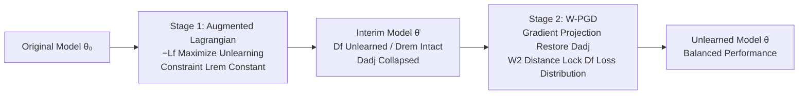

# Machine Unlearning under Retain–Forget Entanglement

**Conference**: ICLR 2026  
**OpenReview**: [https://openreview.net/forum?id=4WMBSHHJEr](https://openreview.net/forum?id=4WMBSHHJEr)  
**Code**: Open sourced (link provided in paper)  
**Area**: Machine Unlearning / AI Safety  
**Keywords**: machine unlearning, retain-forget entanglement, augmented Lagrangian, gradient projection, Wasserstein-2 distance  

## TL;DR
To address the "collateral damage" to related samples caused by semantic entanglement between the forget and retain sets, a two-stage optimization framework is proposed: the first stage uses an augmented Lagrangian method for aggressive unlearning and locking irrelevant retain samples, while the second stage employs gradient projection regularized by Wasserstein-2 distance to restore the accuracy of semantically adjacent retain samples while preventing unlearning rebound.

## Background & Motivation
**Background**: Machine unlearning requires precisely erasing the influence of specified data $D_f$ from a trained model while maintaining performance on the remaining data $D_r$. This is applied in scenarios such as privacy compliance (GDPR right to be forgotten), debiasing, and repairing poisoned data. Existing work covers random sample unlearning, class-level unlearning, and concept-level unlearning, developing efficient post-processing methods based on gradients, sparse pruning, and Fisher/influence functions.

**Limitations of Prior Work**: Existing methods almost exclusively measure retain set performance using "overall average accuracy," which masks a critical fact—unlearning is never isolated. Deleting a specific group of data often results in **collateral damage to another group that is strongly correlated with it**. For example, forgetting toxic speech from a minority group may inadvertently alter the model's behavior regarding non-toxic speech from the same group; forgetting a certain subclass can disrupt predictions for other adjacent subclasses within the same superclass. These sensitive, related subsets are the most vulnerable parts where performance drops lead to the most severe consequences, yet they are buried by average metrics.

**Key Challenge**: The forget set $D_f$ and the "adjacent retain set" $D_r^{adj}$ share highly overlapping feature distributions—lowering the loss of $D_f$ inadvertently harms $D_r^{adj}$, while restoring the accuracy of $D_r^{adj}$ conversely weakens the unlearning effect (gradient direction conflict). Directly performing joint optimization on both leads to a zero-sum tug-of-war.

**Goal**: Under the "retain–forget entanglement" setting, which is closer to real-world requirements, this paper explicitly splits the retain set into an adjacent subset $D_r^{adj}$ (highly correlated with $D_f$, susceptible to damage) and a remote subset $D_r^{rem}$ (weakly correlated). The goal is to thoroughly unlearn $D_f$ while specifically safeguarding the sensitive $D_r^{adj}$.

**Key Insight**: **Decoupling + Two-stage (divide-and-conquer)**—first process the "easy part" (unlearning + locking remote samples), then separately repair the "hard part" (adjacent subset), using **Wasserstein-2 distribution constraints** instead of traditional mean loss constraints to fundamentally plug the loophole where "mean loss remains constant but accuracy rebounds."

## Method

### Overall Architecture
The method decomposes unlearning in entanglement scenarios into two serial stages. The first stage (Augmented Lagrangian) focuses solely on "aggressive unlearning of $D_f$" and "locking the remote retain set $D_r^{rem}$," **deliberately avoiding** $D_r^{adj}$ to bypass gradient conflicts. After this stage, $D_f$ is unlearned and $D_r^{rem}$ is preserved, but $D_r^{adj}$ collapses due to entanglement. The second stage (W-PGD) uses gradient projection to restore the accuracy of $D_r^{adj}$, while using Wasserstein-2 distance to lock the loss **distribution** (rather than just the mean) of $D_f$, ensuring the unlearning effect does not rebound during the restoration of the adjacent set.

### Key Designs

**1. Augmented Lagrangian for Aggressive Unlearning: Adaptively balancing unlearning and remote retention.** The first stage is formulated as a constrained optimization problem: $\min_\theta -L_f(\theta)$ s.t. $L_r^{rem}(\theta)=L_r^{rem}(\theta_0)$—maximizing the forget set loss while forcing the remote retain set loss to remain at its original level. Instead of manual hyperparameter tuning for penalty weights, an augmented Lagrangian is used: $L_{aug}(\theta;\lambda,\mu)=-L_f(\theta)+\lambda(L_r^{rem}(\theta)-L_r^{rem}(\theta_0))+\frac{\mu}{2}(L_r^{rem}(\theta)-L_r^{rem}(\theta_0))^2$. The multiplier $\lambda$ starts at 0, updating parameters via $\theta\leftarrow\theta-\eta\nabla_\theta L_{aug}$ and then updating the multiplier based on constraint violation $\lambda\leftarrow\lambda+\mu(L_r^{rem}(\theta)-L_r^{rem}(\theta_0))$. This allows the penalty intensity to automatically tighten or loosen, ensuring training stability. $D_r^{adj}$ is **deliberately ignored** to avoid gradient conflicts with the unlearning objective.

**2. Revealing the Failure of Classic PGD: The fatal loophole of mean constraints.** A natural approach for the second stage would be linearized Projected Gradient Descent (PGD), projecting the components of $\nabla_\theta L_r^{adj}$ that align with the space spanned by $\{\nabla_\theta L_f, \nabla_\theta L_r^{rem}\}$: $\theta\leftarrow\theta-\eta(\nabla_\theta L_r^{adj}-\text{Proj}_V\nabla_\theta L_r^{adj})$. However, experiments reveal a counter-intuitive failure—while the **average loss on $D_f$ remains stable, the accuracy significantly recovers**. The root cause is the strong entanglement: restoring $D_r^{adj}$ lowers the loss of similar samples in $D_f$. To maintain a constant mean, the model increases the loss for dissimilar samples, creating a polarized loss distribution where some samples have losses near zero (re-learned). This proves that constraining the mean loss provides no guarantee against unlearning failure.

**3. Wasserstein-2 Regularized W-PGD: Locking the entire loss distribution.** To achieve fine-grained control over unlearning behavior, the authors use the W2 distance to constrain the drift of the $D_f$ loss distribution relative to the interim model $\bar\theta$. For one-dimensional empirical distributions, W2 has a sorted closed-form solution: $W_2(P,Q)=(\frac1N\sum_i(\bar a_i-\bar b_i)^2)^{1/2}$, which is computationally cheaper than KL divergence. A modified forget loss is defined: $\tilde L_f(\theta)=(1-\alpha)L_f(\theta)+\alpha W_2^2(P_{\bar\theta}^{forget},P_\theta^{forget})$, and the projection space is updated to $V=\text{span}\{\nabla_\theta\tilde L_f, \nabla_\theta L_r^{rem}\}$. Proposition 4.1 guarantees that updates result in $O(\eta^2)$ changes for $\tilde L_f$ and $L_r^{rem}$, while $L_r^{adj}$ achieves first-order descent. Proposition 4.2 provides an upper bound for the forget set accuracy: $\text{Acc}_f(\theta)\le\frac{1}{(m-\log n)^2}(\frac{1-\alpha}{\alpha}+\sqrt{\frac{\varepsilon}{\alpha}})^2$, ensuring it remains low if $\alpha > 0$. In practice, $\alpha=0.5$ is used to keep the $D_f$ loss distribution uniform and accuracy near zero.

## Key Experimental Results

### Main Results (CIFAR-100 / ResNet-18, forgetting "aquarium fish" subclass, Test Acc)

| Method | $D_f$↓ | $D_r^{adj}$↑ | $D_r^{rem}$↑ |
|------|--------|--------------|--------------|
| Original | 90.00 | 80.00 | 85.33 |
| FT | 62.33 | 77.83 | 83.89 |
| Munba | 31.67 | 69.75 | 75.32 |
| SCRUB | 7.00 | 54.75 | 75.42 |
| SalUn | 3.00 | 34.90 | 71.78 |
| DELETE | 0.67 | **2.83** | 82.09 |
| GDR | 8.67 | 22.33 | 79.93 |
| **Ours** | **2.33** | **78.17** | 81.10 |

**Comparison**: While methods like DELETE/GDR/SalUn suppress the forget set effectively, the adjacent retain set ($D_r^{adj}$) accuracy collapses to 2~35%. Ours achieves 2.33% unlearning while maintaining $D_r^{adj}$ at 78.17% (close to the original 80%), uniquely balancing unlearning and adjacent retention.

### Other Datasets (Test Acc, selected)

| Setting | Method | $D_f$↓ | $D_r^{adj}$↑ | $D_r^{rem}$↑ |
|------|------|--------|--------------|--------------|
| ToxiGen / RoBERTa (Debiasing) | GDR | 19.83 | 83.92 | 85.52 |
| ToxiGen / RoBERTa | **Ours** | **14.29** | **85.86** | 85.23 |
| CelebA / ViT-B | GA/DELETE | 0.00 | 0.00 (Collapse) | ~92 |
| CelebA / ViT-B | **Ours** | 25.48 | **75.05** | 92.38 |
| TinyImageNet / ViT (Forget "dog") | **Ours** | 3.11 | **91.27** | 88.88 |

### Ablation Study (W2 Regularization, CIFAR-100/ResNet18, Test Acc)

| Configuration | $D_f$↓ | $D_r^{adj}$↑ | $D_r^{rem}$↑ |
|------|--------|--------------|--------------|
| w/o W2 Reg | 14.33 | 87.00 | 80.55 |
| w/ W2 Reg | **2.33** | 78.17 | 81.10 |

### Key Findings
- **W2 regularization is critical for preventing unlearning "rebound"**: Removing it causes $D_f$ accuracy to jump from 2.33% to 14.33%, confirming that mean-only constraints can be bypassed.
- **Stronger entanglement leads to baseline collapse**: On CelebA, where attributes are highly similar, methods like DELETE destroy $D_r^{adj}$ (0%), whereas Ours maintains it at 75%.
- **Consistency across architectures/tasks**: The framework performs stably from ResNet to ViT and from image classification to ToxiGen NLP debiasing.

## Highlights & Insights
- **Precise Problem Framing**: It explicitly addresses the long-ignored blind spot where "average retention accuracy masks adjacent subset collapse," systematizing the division of adjacent/remote sets.
- **Diagnostic Failure Analysis**: Figure 1 provides a clear visualization of loss distribution polarization, explaining the mechanism behind why mean constraints fail—providing a strong motivation for distribution-level constraints.
- **Theory-Practice Synergy**: Two propositions guarantee adjacent set improvement and bounded forget set accuracy. The one-dimensional closed-form solution for W2 makes distribution constraints practically cost-free.

## Limitations & Future Work
- **Reliance on Prior Knowledge for Partitioning**: The method assumes an available prior split for $D_r$ into $D_r^{adj}$ and $D_r^{rem}$ (via superclass or semantic tags). In real-world scenarios, identifying entangled samples is not always straightforward.
- **Two-stage Serial Cost**: Compared to one-step post-processing (like SSD), the two-stage optimization plus W2 sorting adds computational overhead that needs evaluation on larger scales.
- **Unlearning Semantics as "Suppression"**: The paper adopts a "performance maximization reduction" view, suitable for debiasing/toxic content, but does not directly address strict "equivalence to retraining" for privacy.
- **Residual Accuracy on CelebA**: Under extreme entanglement, a 25% residue remains on the forget set, showing that the trade-off is not entirely eliminated.

## Related Work & Insights
- **Constraint Optimization Lineage**: The migration of Augmented Lagrangian and primal-dual ideas from fair/safe learning into unlearning highlights that unlearning is fundamentally a constrained multi-objective problem.
- **Comparison with Gradient Conflict Methods**: While GDR, Munba (Nash bargaining), and PGD attempt to reconcile conflicts, this paper differs by **avoiding conflicts via staging + distribution-level constraints**.
- **Inspiration for Distribution Constraints**: Using W2 instead of KL to constrain loss distributions is highly efficient due to the 1D closed-form solution; this technique can be generalized to any continual learning or debiasing task requiring the "locking" of a specific subset's output distribution.

## Rating
- **Novelty**: ⭐⭐⭐⭐ Explicitly modeling "retain-forget entanglement" and solving mean constraint loopholes with W2 distribution constraints is highly novel.
- **Experimental Thoroughness**: ⭐⭐⭐⭐ Covers 4 datasets, 3 architectures, 9 baselines, and includes W2 ablations; however, it lacks privacy-centric metrics (MIA).
- **Writing Quality**: ⭐⭐⭐⭐ Clear linkage between failure analysis (Figure 1) and theoretical propositions. The progression of motivation is logical and readable.
- **Value**: ⭐⭐⭐⭐ Directly addresses a major blind spot in current unlearning evaluations, providing high value for real-world safety scenarios like debiasing.

<!-- RELATED:START -->

## Related Papers

- [\[AAAI 2026\] Easy to Learn, Yet Hard to Forget: Towards Robust Unlearning Under Bias](../../AAAI2026/ai_safety/easy_to_learn_yet_hard_to_forget_towards_robust_unlearning_under_bias.md)
- [\[ICLR 2026\] Label Smoothing Improves Machine Unlearning](label_smoothing_improves_machine_unlearning.md)
- [\[ICLR 2026\] Distributional Machine Unlearning via Selective Data Removal](distributional_machine_unlearning_via_selective_data_removal.md)
- [\[ICLR 2026\] ReTrace: Reinforcement Learning-Guided Reconstruction Attacks on Machine Unlearning](retrace_reinforcement_learning-guided_reconstruction_attacks_on_machine_unlearni.md)
- [\[ICLR 2026\] Remaining-data-free Machine Unlearning by Suppressing Sample Contribution](remaining-data-free_machine_unlearning_by_suppressing_sample_contribution.md)

<!-- RELATED:END -->
