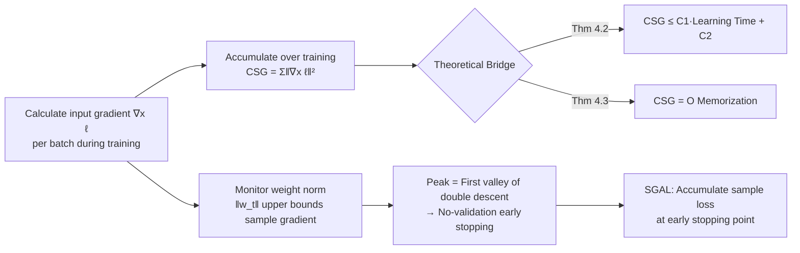

# Memorization Through the Lens of Sample Gradients

**Conference**: ICLR 2026  
**OpenReview**: [https://openreview.net/forum?id=jeTiBeW3iZ](https://openreview.net/forum?id=jeTiBeW3iZ)  
**Code**: [https://github.com/DeepakTatachar/Sample-Gradient-Memorization](https://github.com/DeepakTatachar/Sample-Gradient-Memorization)  
**Area**: AI Security / Memorization and Privacy / Training Dynamics  
**Keywords**: memorization, sample gradient, generalization, privacy, double descent, early stopping  

## TL;DR
This paper proposes **Cumulative Sample Gradient (CSG)**—the accumulation of the "loss gradient with respect to the input" throughout the training process—as an efficient proxy for Feldman's memorization score. Theoretically, it proves that CSG is linearly bounded by both the degree of memorization and the learning time. This leads to the discovery of an early stopping criterion at the peak of the weight norm, which requires no validation set and accelerates memorization estimation by up to 5 orders of magnitude.

## Background & Motivation
- **Background**: Understanding the "memorization" of training samples by deep networks is crucial for generalization, privacy, unlearning, and mislabeled sample detection. Feldman & Zhang (2020) provided the most principled definition—the memorization score $\mathrm{mem}(S,\vec{z}_i)=\Pr[g^p_S(\vec{x}_i)=y_i]-\Pr[g^p_{S\setminus i}(\vec{x}_i)=y_i]$, representing the drop in prediction probability for a sample when it is excluded from training.
- **Limitations of Prior Work**: This definition requires training $O(\text{dataset size})$ leave-one-out models, making the computational cost prohibitive for scaling. Subsequent proxies (learning time, forgetting frequency, C-score, input Curvature, Cumulative Sample Loss (CSL), etc.) are cheaper but are either **ad-hoc metrics lacking theoretical support** (e.g., VoG based on gradient variance misidentifies "consistently difficult" samples), remain expensive (influence functions, k-fold), or fail to capture key properties of memorization (e.g., unimodality).
- **Key Challenge**: There is a need for a proxy that is both **computationally efficient** (ideally calculated during training) and has a **formal theoretical connection** to the memorization score. Existing proxies struggle to achieve both.
- **Goal**: To find a proxy metric with nearly zero additional overhead during training that is strictly provable to be linked to memorization.
- **Core Idea**: The key observation is that **less memorized samples are learned early, while highly memorized samples are learned late** (Fig. 2). **[Core Insight]** Since "learning speed" encodes memorization information, the **loss gradient with respect to the input** precisely characterizes how well the model fits that sample: gradients for easy samples drop rapidly, while those for difficult samples remain high for a long time. Accumulating them over training (**[Mechanism] CSG**) smooths single-epoch noise and establishes a formal bridge to memorization.

## Method

### Overall Architecture
The method progresses through three layers: first, defining CSG using the "accumulation of loss gradients with respect to input over training" (a scalar that is almost free during training); second, using SGD convergence theory and uniform stability to prove that CSG is linearly bounded by learning time and memorization score; finally, utilizing the synchronization of "peak sample gradient = peak weight norm = first validation loss valley in double descent" to derive an early stopping criterion without a validation set, designing a more efficient variant, SGAL.

### Key Designs

**1. Cumulative Sample Gradient (CSG): Transforming "learning speed" into a free training scalar.** Unlike calculating gradients in the parameter space (influence function style, which requires traversing all parameters per sample), CSG takes the loss gradient **with respect to the input** $\vec{x}_i$ and accumulates it over the training process: $\mathrm{CSG}(\vec{z}_i)=T_{\max}\cdot\mathbb{E}_R[\|\nabla_{x_i}\ell(\vec{w}_R)\|_2^2]\approx\sum_{t=0}^{T_{\max}}\|\nabla_{x_i}\ell(\vec{w}_t)\|_2^2$. This choice has two main benefits: per-sample input gradients can be obtained as a byproduct of backpropagation with almost zero overhead; "accumulation" is more robust than threshold-based metrics like "learning/forgetting time"—a sample might be "learned → forgotten → re-learned," where single-point thresholds oscillate, but accumulation smooths these fluctuations. Based on this, the "learned" state is formalized as the learning time $T_{z_i}=\min_T\{T:\mathbb{E}_R[\|\nabla_{x_i}\ell(\vec{w}_R)\|_2^2]\le\tau\}$ when the expected input gradient falls below a threshold $\tau$.

**2. Two-way Theoretical Bounding: Upgrading heuristic proxies to proven proxies.** This is the theoretical core. Lemma 4.1 shows that without first-layer residual connections, the Frobenius norm of the input gradient is bounded by the **weight norm**: $\|\nabla_{x_i}\ell\|_F\le\|\vec{w}_t\|_F\,\|\nabla_{w_t}\ell\|_F/\|\vec{x}_i\|_F$. Since the weight gradient norm converges and the input norm is fixed, the weight norm acts as a "cap" for sample gradients. Based on this, Theorem 4.2 proves $\mathbb{E}[\mathrm{CSG}(\vec{z}_i)]\le C_1\,\mathbb{E}[T_{z_i}]+C_2$ (CSG is linearly bounded by learning time), and Theorem 4.3 further provides $\mathbb{E}[\mathrm{CSG}(\vec{z}_i)]=O(\mathbb{E}[\mathrm{mem}(\vec{z}_i)])$ (CSG is linearly bounded by the memorization score). The proof leverages stochastic SGD convergence results from Ghadimi & Lan (2013) shifted to the input space, combined with leave-one-out analysis and $\beta$-uniform stability of SGD to isolate the memorization term.

**3. Peak Weight Norm = Double Descent Valley: No-validation early stopping criterion.** The authors observe that the average sample gradient follows an "ascent-peak-descent" trajectory, synchronized with the weight norm (which upper bounds the sample gradient per Lemma 4.1). This trajectory stems from two opposing forces: performance loss pushes the weight norm up to fit the data, while $\ell_2$ weight decay and the bias of SGD toward minimum-norm solutions pull it down. A key discovery is that **this peak exactly corresponds to the first validation loss minimum on the double descent curve** (the boundary between the interpolation and generalization zones), and alignment between sample gradients and memorization scores is highest at this peak. This yields a simple, validation-free criterion: **early stop at the peak of the weight norm**.

**4. SGAL: Efficiency through early stopping.** Since the similarity between CSG and memorization "saturates" near the first descent point (Fig. 3c), training for the full duration is unnecessary. SGAL (Sample Gradient-Assisted early stopping with accumulated Loss) **accumulates sample losses** before the optimal stopping point indicated by sample gradients, requiring only 10–30% of epochs, achieving 3–10× acceleration, and further improving alignment with memorization.

## Key Experimental Results

### Main Results: Similarity to Memorization Score + Computational Cost
Results on Inception/CIFAR-100 and ResNet50/ImageNet, comparing against precomputed memorization scores from Feldman & Zhang (2020) (Cosine Similarity CS / Pearson Correlation Corr.); lower normalized compute cost is better:

| Method | Compute | CIFAR-100 CS | CIFAR-100 Corr. | ImageNet CS | ImageNet Corr. |
|---|---|---|---|---|---|
| CSL (Ravikumar 2025a) | 1× | 0.87 | 0.79 | 0.79 | 0.64 |
| Curvature (Garg 2024) | 14× | 0.69 | 0.49 | 0.62 | 0.33 |
| TracIn (Pruthi 2020) | 26× | 0.83 | 0.71 | † | † |
| **SGAL (Ours)** | **0.1–0.3×** | 0.86 | 0.77 | 0.78 | 0.62 |
| **CSG (Ours)** | **0.1–0.3×** | 0.84 | 0.72 | 0.71 | 0.52 |

> †: Could not scale to ImageNet. SGAL achieves 97–99% of CSL's correlation with only 10–30% of the compute; it is roughly 140× faster than Curvature, up to 10× faster than CSL, and approximately 5 orders of magnitude faster than full memorization scores.

### Mislabeled Sample Detection (AUROC, CIFAR-100)

| Method | 5% Noise | 10% | 20% | 25% | 30% |
|---|---|---|---|---|---|
| Curvature | 0.9876 | 0.9892 | 0.9931 | 0.9931 | 0.9932 |
| CSL | 0.9891 | 0.9895 | 0.9902 | 0.9904 | 0.9903 |
| **CSG (Ours)** | **0.9896** | **0.9904** | **0.9934** | **0.9936** | **0.9936** |

CSG achieves optimal or joint-optimal performance across all noise levels, validating the theoretical prediction that "high CSG ⇒ mislabeled."

### Impact of Early Stopping on Calibration and Privacy (ResNet18/CIFAR-100)
- **Privacy (MIA AUROC, lower is better)**: Using LiRA as an example, the early stopping point scores 55.98 vs. 85.48 at the final epoch; Curvature attacks score 59.42 vs. 85.52—early stopping significantly reduces Member Inference Attack (MIA) leakage risk.
- **Calibration**: The early stopping point outperforms the final checkpoint on metrics like MCE/UCE, which are "fairer to the long-tail" (MCE 0.272 vs. 0.279, UCE 2.08 vs. 2.18), at the cost of overall accuracy dropping from 0.749 to 0.631.

### Key Findings
- Binned scatter plots (Fig. 4) empirically confirm the predicted linear relationships between CSG–Learning Time and CSG–Memorization, with slight deviations only at extremely high memorization levels due to the unbounded nature of cross-entropy.
- The synchronization of "Peak Sample Gradient = Peak Weight Norm = First Valley of Validation Loss" is reproducible across various optimizers and architectures.

## Highlights & Insights
- **Using input gradients instead of parameter gradients** is the key to efficiency—per-sample input gradients are naturally obtained during backpropagation, completely bypassing the overhead of influence functions that traverse all parameters.
- **Upgrading heuristic proxies to proven proxies**: CSG is not just another correlated metric; it is theoretically sandwiched between memorization and learning time, providing a solid explanation for "why it works."
- **No-validation early stopping** is a practical byproduct: the weight norm peak, which can be monitored during training, directly corresponds to the first valley of double descent, saving the effort of splitting a validation set while improving privacy and calibration.

## Limitations & Future Work
- The theory relies on strong assumptions: **L-bounded loss** (cross-entropy is actually unbounded), $\rho$-Lipschitzness, SGD $\beta$-stability, and **no residual connections in the first layer** (satisfied by ViTs/ResNets/VGGs, but limits architectural applicability).
- Early stopping introduces a clear **accuracy–privacy trade-off** (accuracy drops from 0.749 to 0.631); whether this is acceptable depends on the specific demand for privacy or calibration.
- SGAL is significantly weaker than CSG in mislabeled sample detection at high noise (0.847 vs. 0.994 at 30% noise), indicating that efficiency gains are not "free" in all scenarios.

## Related Work & Insights
- **Memorization Definitions**: Builds on the counterfactual/stability-based memorization of Feldman (2020) and Feldman & Zhang (2020), replacing expensive leave-one-out estimation with a provable, cheap proxy.
- **Proxy Taxonomy**: Belongs to the family of "training dynamics proxies" along with CSL (Ravikumar 2025a), input Curvature (Garg 2024), C-score/learning time (Jiang 2021), forgetting frequency (Toneva 2019), and VoG (Agarwal 2022). The distinction is the formal theoretical bridge established between input gradient dynamics and memorization.
- **Theoretical Tools**: SGD uniform stability (Hardt 2016) and stochastic SGD convergence (Ghadimi & Lan 2013) serve as the pillars of proof.

## Rating
- **Novelty**: ⭐⭐⭐⭐ — The specific form of input gradient accumulation combined with two-way theoretical bounding and the weight norm peak criterion is novel.
- **Experimental Thoroughness**: ⭐⭐⭐⭐ — Covers CIFAR/ImageNet, multiple optimizers/architectures, and four task types; theoretical predictions are supported by empirical evidence.
- **Writing Quality**: ⭐⭐⭐⭐ — Clear progression from observation to definition to theory to application.
- **Value**: ⭐⭐⭐⭐ — Accelerating memorization estimation by 5 orders of magnitude while maintaining high correlation offers direct utility for privacy auditing and data diagnostics.

<!-- RELATED:START -->

## Related Papers

- [\[CVPR 2025\] Detecting Out-of-Distribution through the Lens of Neural Collapse](../../CVPR2025/ai_safety/detecting_out-of-distribution_through_the_lens_of_neural_collapse.md)
- [\[ICLR 2026\] Remaining-data-free Machine Unlearning by Suppressing Sample Contribution](remaining-data-free_machine_unlearning_by_suppressing_sample_contribution.md)
- [\[ICLR 2026\] MUSE: Model-Agnostic Tabular Watermarking via Multi-Sample Selection](muse_model-agnostic_tabular_watermarking_via_multi-sample_selection.md)
- [\[ICLR 2026\] Robust Adversarial Attacks Against Unknown Disturbances via Inverse Gradient Sample](robust_adversarial_attacks_against_unknown_disturbance_via_inverse_gradient_samp.md)
- [\[ICLR 2026\] Sample-Efficient Distributionally Robust Multi-Agent Reinforcement Learning via Online Interaction](sample-efficient_distributionally_robust_multi-agent_reinforcement_learning_via_.md)

<!-- RELATED:END -->
