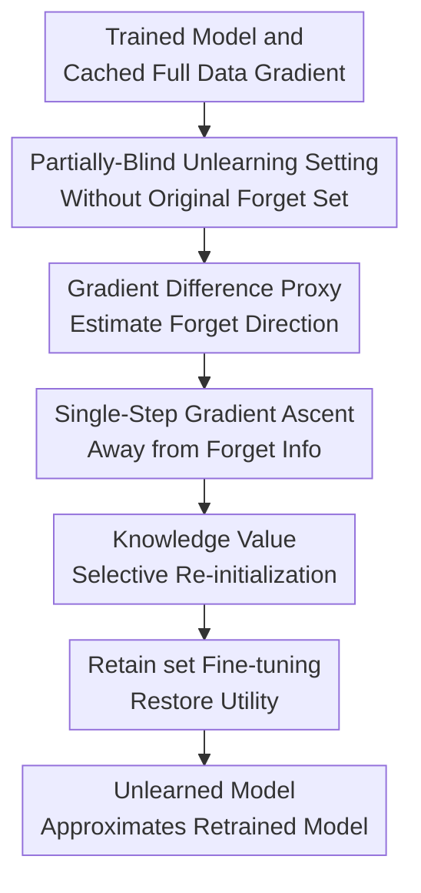

# Mitigating Privacy Risk via Forget Set-Free Unlearning

**Conference**: ICLR 2026  
**OpenReview**: [https://openreview.net/forum?id=d3R0TF7w5f](https://openreview.net/forum?id=d3R0TF7w5f)  
**Code**: Yes (The paper states implementation is provided on the project page; specific URL not given in the cache)  
**Area**: AI Safety / Machine Unlearning / Privacy Protection  
**Keywords**: Machine Unlearning, Partially-Blind Unlearning, Forget Set-Free Unlearning, Privacy Risk, RELOAD

## TL;DR
This paper introduces the partially-blind unlearning setting and the RELOAD method, which replaces the original forget set with cached full-data gradients from the end of training. By utilizing a single-step reverse forget gradient, selective weight re-initialization, and fine-tuning on the retain set, it approximates a from-scratch retrained model without retaining the samples to be deleted. The method achieves strong results across general sample unlearning, LLM entity unlearning, and error correction.

## Background & Motivation
**Background**: Machine unlearning addresses the problem where a model has been trained on certain user data, and the user subsequently requests its removal; the model must then behave as if it had never seen that data. The ideal approach is to retrain a model $M_{\theta^\sim}$ from scratch on the retain set $D_{retain}$. However, this is too costly for large models and frequent deletion requests, so approximate unlearning methods attempt to quickly transform the original model $M_{\theta^*}$ into an approximated retrained model $M_{\tilde{\theta}}$.

**Limitations of Prior Work**: While many unlearning algorithms can technically remove information from a model, they create a privacy paradox in their workflow: they require direct access to the forget set $D_{forget}$. If an organization must wait until a batch unlearning cycle to truly delete user data, the user remains exposed to "dataset risks" such as database leaks or internal unauthorized access during this waiting period. In other words, traditional unlearning methods require the continued retention of the very data that should be deleted in order to reduce model risk.

**Key Challenge**: It is impossible to perform unlearning without any information about the forget set, as the algorithm would not know what to delete. However, retaining the original forget set continuously increases privacy risks. This paper decomposes this contradiction into a more realistic problem: Is it possible to complete unlearning without storing original samples, by instead saving auxiliary information generated during training that is relatively harder to reverse-engineer into individual samples, using it as a proxy signal for the forget set?

**Goal**: The authors aim to define a new setting called "partially-blind unlearning," which is more feasible than "completely blind unlearning" and more privacy-preserving than "unlearning with the forget set." In this setting, the algorithm can access the original model, the retain set, and auxiliary training information $I_D$, but cannot access the original forget set. The goal remains to output a model close to $M_{\theta^\sim}$ while allowing the organization to delete the original user data immediately upon receiving a deletion request.

**Key Insight**: The key observation comes from the additivity of the loss function. If the gradient of the full training set $\nabla_\theta L(D)$ at the final training step is cached, and $\nabla_\theta L(D_{retain})$ can still be calculated on $D_{retain}$, then the difference between the two can serve as a proxy for the gradient of $D_{forget}$: $\nabla_\theta L(D_{forget})=\nabla_\theta L(D)-\nabla_\theta L(D_{retain})$. This provides a starting point for an algorithm to estimate "which direction to move away from" without looking at the original forget set.

**Core Idea**: Construct a forget set gradient proxy by subtracting the retain set gradient from the cached full-data gradient. Then, string together a sequence of "global gradient ascent + forget-sensitive weight re-initialization + retain set fine-tuning" into an approximate unlearning pipeline that does not rely on the original forget set.

## Method
### Overall Architecture
The paper first defines the Partially-Blind Unlearning (PBU) setting: the algorithm inputs are the original trained model $M_{\theta^*}$, the retain set $D_{retain}$, and auxiliary training information $I_D$, but not the original forget set $D_{forget}$. RELOAD selects the full-data gradient $\nabla_\theta L(D)$ cached at the end of training as $I_D$. It then uses the gradient difference with the retain set to estimate the forget set's proxy direction and performs three model updates: a single gradient ascent step to push the model away from the forget set, a search for weights that most represent forget set memory based on Knowledge Value for re-initialization, and finally fine-tuning on the retain set to restore performance on retained data.

The standard machine unlearning version of RELOAD only requires caching a summed gradient during training; it does not need to retain $D_{forget}$ or re-access original user samples after a deletion request. For LLM entity unlearning, the authors provide an adapted version: using target entity prompts, model outputs, a contextual fine-tuning prompt, and a small-scale repair set to construct a more practical unlearning gradient, updating only selected layers to scale the method to models like Llama-2-7B.

### Key Designs
**1. Partially-Blind Unlearning Setting: Integrating "No Original Samples" and "No Information-less Unlearning" into the Problem Definition**

Traditional unlearning inputs are typically $AMU(M_{\theta^*}, D_{retain}, D_{forget})$, which is convenient for algorithm evaluation but inconsistent with strong-privacy deletion workflows. The proposed partially-blind unlearning changes the input to $APBU(M_{\theta^*}, D_{retain}, I_D)$: $I_D$ can be auxiliary objects like aggregated gradients or feature statistics generated during training, but should not be original individual samples and should ideally be difficult to reverse-engineer into individual user data. Under this definition, the privacy goal is not just "prevent the model from remembering users," but also "prevent the organization from continuing to store user data for the sake of unlearning."

The value of this setting lies in acknowledging the information-theoretic floor: without any information about the data to be deleted, an algorithm naturally cannot know what to remove. Therefore, the authors do not promise "zero-information unlearning" but rather position the problem in a more actionable space: retaining low-leakage-risk training byproducts so that original data can be deleted upon request, while the byproduct is used for subsequent model updates. The paper explains this using a cumulative risk graph of dataset risk and model risk: RELOAD cannot eliminate model risk immediately, but it eliminates the database risk incurred by continuing to retain the original forget set after a deletion request.

**2. Gradient Difference Proxy: Recovering the Unlearning Direction via $\nabla_\theta L(D)-\nabla_\theta L(D_{retain})$**

The first step of RELOAD is simple but critical. Since the empirical risk is additive across samples and $D_{retain}=D\setminus D_{forget}$, it follows that:

$$
\nabla_\theta L(D_{forget})=\nabla_\theta L(D)-\nabla_\theta L(D_{retain}).
$$

If $\nabla_\theta L(D)$ is cached at the end of training and gradients can be computed on the remaining data $D_{retain}$ after a deletion request, the algorithm can obtain a proxy gradient pointing toward the loss reduction direction of the forget set without viewing $D_{forget}$ itself. As the goal of unlearning is to move away from $D_{forget}$ rather than continue fitting it, RELOAD performs a single step of gradient ascent: $\theta'\leftarrow \theta^*+\eta_p(\nabla_\theta L(D)-\nabla_\theta L(D_{retain}))$.

The "single step" is important here. Without the original forget set, the algorithm cannot iteratively compute gradients on $D_{forget}$ like standard gradient ascent unlearning; the cached gradient only provides one usable signal near the end-of-training position. The authors thus position this step as a "priming step": it performs a coarse-grained un-memorization across the whole model, pushing weights away from directions overfitted to the forget set, without expecting it to completely clear all local memories on its own.

**3. Knowledge Value Selective Re-initialization: Handling Weight Subsets That a Single Gradient Step Cannot Clear**

A single gradient ascent step affects all parameters, but neural network memory is not uniformly distributed. Borrowing from weight saliency and network modularity perspectives, the authors argue that a small number of parameters may hold primary responsibility for representing the forget set. If these parameters have already deeply encoded the samples to be deleted, a single-step ascent might only be a slight perturbation. Thus, RELOAD defines a Knowledge Value for each weight:

$$
KV_{\theta_k}=\frac{|\nabla_{\theta_k}L(D)-\nabla_{\theta_k}L(D_{retain})|+\epsilon}{|\nabla_{\theta_k}L(D)|+\epsilon}.
$$

The numerator is the magnitude of the proxy forget gradient for that weight, and the denominator is the magnitude of the full-data gradient, with $\epsilon$ for smoothing. The interpretation is that a lower $KV$ indicates the weight relatively more strongly characterizes $D_{forget}$, making it a prime candidate for reset. RELOAD selects weights where $KV_{\theta_k}\le Quantile_\alpha(KV)$ based on a quantile hyperparameter $\alpha$ and re-initializes them to obtain $\theta^\dagger$. This step complements the global ascent: the ascent step provides a small-to-medium unlearning direction for all weights, while re-initialization performs a more aggressive removal of forget-sensitive local weights.

This is the core difference between RELOAD and standalone GA or FT. GA only "pushes away," which can damage overall behavior or fail to clean thoroughly; FT only continues training on the retain set, which often just repairs retain performance without necessarily matching the retrained model's behavior on the forget set. RELOAD ties the proxy gradient to weight saliency, ensuring both "where to push" and "where to reset" come from the same partially-blind signal.

**4. Retain set Fine-tuning and LLM Version: Pulling the Unlearned Model Back to the Utility Zone**

Re-initialization destroys some parameters, and single-step gradient ascent can disrupt the original model; therefore, a final fine-tuning on $D_{retain}$ until convergence is necessary to obtain $\tilde{\theta}$. This step is not just "continued training" in a general sense, but rather re-aligning model behavior to the retain data distribution after the influence of the forget set has been removed. Experiments support that all three steps are indispensable: in method analysis, ResNet representations for the SVHN digit "8" did not fully disappear after a single-step ascent, but representations in early layers changed significantly after re-initialization, with the final fine-tuning restoring the class clustering structure.

For language models, caching and processing full-model gradients is impractical, so the authors adapt RELOAD into an entity unlearning version. It no longer requires $D_{forget}$, but instead requires prompts $D_{prompts}$ querying the target entity and a very small repair set $D_{repair}\subseteq D_{retain}$. The process involves: letting the model answer these prompts, using a contextual fine-tuning prompt to further "extract" the model's knowledge of the target entity, performing an ascent step using these outputs on selected layers, calculating $KV$ based on the gradient ratio between $D_{embedded\_outputs}$ and $D_{repair}$, re-initializing selected parameters, and fine-tuning on $D_{repair}$. This version has a weaker privacy promise because it requires knowing which entity or concept to forget, but it enables operationality for models like Llama-2-7B.

### Mechanism Example
Consider a hospital that trains a diagnostic model on patient data, and a batch of patients subsequently requests their records be deleted. Traditional unlearning methods might require temporarily storing these patient samples until a quarterly batch process runs GA, SCRUB, or SalUn; during these months, the database still holds the most sensitive samples. RELOAD operates differently: the hospital already cached the final-step gradient $\nabla_\theta L(D)$ when training was completed. When the deletion request arrives, the original patient data is immediately deleted from the database, and the system retains only the remaining patient data $D_{retain}$ and the cached gradient.

Subsequently, the system calculates the current gradient $\nabla_\theta L(D_{retain})$ on $D_{retain}$. Subtracting the two yields the proxy gradient for the patients to be deleted. The model first performs a single ascent step along this proxy direction to move away from the fit to these patient samples; it then calculates the $KV$ for each parameter and re-initializes the weights in the lowest quantile. Finally, it fine-tunes using only the remaining patient data. The final deployed model is not an exact retrained model, but the objective is to be as close as possible to a model trained from scratch on $D_{retain}$ across metrics like forget accuracy, membership inference attack success rate, and forget KL.

### Loss & Training
The training strategy for standard RELOAD can be summarized by three types of hyperparameters: the gradient ascent learning rate $\eta_p$, the knowledge value smoothing term $\epsilon$, and the re-initialization ratio $\alpha$. The algorithm takes $M_{\theta^*}$, the cached gradient $\nabla_\theta L(D)$, and $D_{retain}$ as input, and outputs the fine-tuned $M_{\tilde{\theta}}$. The core update is:

$$
\theta'\leftarrow \theta^*+\eta_p(\nabla_\theta L(D)-\nabla_\theta L(D_{retain})),
$$

followed by weight re-initialization based on $KV$, and finally minimizing $L(D_{retain})$ on $D_{retain}$ until convergence. Evaluation compares the unlearned model to a from-scratch retrained model, focusing on retain accuracy (RA), forget accuracy difference ($\Delta FA$), forget error difference ($\Delta FE$), membership inference attack difference ($\Delta FMIA$), retain/forget symmetric KL (RSKL/FSKL), and relative retraining cost.

The LLM version uses $D_{prompts}$, $D_{repair}$, and selected layers $\theta_{selected}$. It performs ascent on the contextual outputs generated by target entity prompts, calculates retain gradients on the repair set, selects parameters to reset based on the gradient ratio, and finally fine-tunes only the selected layers or relevant parameters. The paper highlights that the Llama-2-7B-Chat experiment uses less than $0.025\%$ of retain data and less than $7\%$ of model weights, completing in about 8 minutes on a single RTX6000.

## Key Experimental Results

### Main Results
The main experiments cover three types of problems: standard machine unlearning, LLM entity unlearning, and error correction unlearning. For standard unlearning, the authors test random sample unlearning and related-sample (same class) unlearning on CIFAR-10, CIFAR-100, and SVHN using ResNet-18/VGG16-BN. LLM entity unlearning uses the TOFU synthetic author biography dataset, and error correction tests poisoning and interclass confusion to see if the model can fix contaminated behavior when only a portion of bad samples are identified.

| Scenario | Metric | RELOAD | Representative Baseline | Conclusion |
|------|------|--------|------------|------|
| CIFAR-100 ResNet-18, Random 10% Unlearning | RA / $\Delta FA$ / $\Delta FMIA$ | 99.56 / 0.30 / 0.01 | SalUn: 99.06 / 13.14 / 7.39; FT: 96.00 / 16.46 / 0.19 | RELOAD is significantly better in retain accuracy and matching retrained forget behavior. |
| CIFAR-100 ResNet-18, 100 same-class samples | RA / $\Delta FA$ / $\Delta FMIA$ | 99.47 / 3.44 / 0.02 | Fisher: 97.50 / 10.72 / 0.03; SalUn: 99.57 / 12.08 / 0.02 | RELOAD has lower $\Delta FA$ in related sample unlearning and is cheaper than Fisher. |
| TOFU Llama-2-7B, 1% Entity Unlearning | Forget Quality / Model Utility Delta | 0.4046 / +0.0748 | NPO-RT: 0.5786 / -0.1361; ECO Zero-Out: 0.9900 / +0.0000 | RELOAD unlearns small-scale entities and improves utility, though forget quality is not the highest. |
| Llama-2-7B Entity Unlearning Efficiency | Data / Weights / Time | $<0.025\%$ retain set / $<7\%$ weights / $<8$ mins | Methods requiring large retain sets or full-model updates | Computational overhead for small-scale entity unlearning is very low. |

The strong results in standard unlearning provide the best support for the paper's claims: RELOAD often outperforms GA, SCRUB, SalUn, and SSD—methods that require the forget set—even without accessing $D_{forget}$. Especially in the CIFAR-100 random 10% unlearning, its $\Delta FA=0.30$ and $\Delta FMIA=0.01$ indicate the unlearned model is very close to the retrained model on the forget set.

### Ablation Study
Component analysis in the main text and ablation studies in the appendix emphasize three points: first, the single-step ascent, re-initialization, and fine-tuning are not just simple stacking but each perform distinct roles; second, RELOAD is tested across different architectures, random/related unlearning, and error correction scenarios; third, the method has clear costs, especially gradient storage and some loss in retain accuracy in certain error correction scenarios.

| Ablation / Analysis Point | Observation | Description |
|---------------|------|------|
| SVHN digit “8” Introspection | Logits are more uniform after single-step ascent, but feature maps remain; prediction no longer clusters on “8” after re-init; class clustering is restored after fine-tuning. | Ascent handles global push-away, re-init removes critical weights, fine-tuning restores task structure. |
| 10% Random Unlearning, SVHN ResNet-18 | RELOAD: RA 99.76, $\Delta FA=0.08$, $\Delta FMIA=0.00$, Cost 0.12 | In this setting, almost all key unlearning metrics are close to retraining, with costs lower than FT/CF-k/EU-k. |
| 30% Random Unlearning, CIFAR-100 VGG16-BN | RELOAD: RA 88.95, $\Delta FA=8.94$, $\Delta FMIA=0.00$ | Unlearning metrics remain strong, but retain accuracy fluctuates significantly, showing 30% unlearning is harder to maintain utility. |
| Error Correction Cost | Cost for CIFAR-10 poisoning: approx. 0.29-0.37; CIFAR-100 poisoning: approx. 0.24-0.25 | Cheaper than from-scratch training and usually lower than BadT, but more expensive than simpler methods like SSD. |
| Error Correction Retain Accuracy | Accretain can drop by ~7.55-8.14 in CIFAR-10 poisoning; ~13.20-13.63 in CIFAR-100 poisoning | RELOAD can improve corrected accuracy on corrupted data but may sacrifice performance on the retain distribution. |

### Key Findings
- The strongest evidence for RELOAD comes from standard sample unlearning: despite not accessing the forget set, it often outperforms methods that do across $\Delta FA$, $\Delta FE$, $\Delta FMIA$, and FSKL, proving that the gradient difference proxy provides an effective unlearning direction.
- LLM entity unlearning results serve more as a proof-of-feasibility. In 1% TOFU entity unlearning, RELOAD's model utility actually increased by $+0.0748$, but forget quality was lower than ECO Zero-Out; in 5% and 10% cases, it could forget some entities but struggled to simultaneously maintain utility, which the authors attribute to the repair set being too small relative to $|D_{prompts}|$.
- Error correction experiments show RELOAD has an advantage at low identification ratios $\gamma$, working even when only $10\%$ of corrupted data is identified; however, it is not a free lunch, as the drop in Accretain indicates a tension between "correcting bad sample behavior" and "maintaining overall distribution performance."
- BatchNorm models have an approximation error because removing the forget set changes batch statistics; the authors argue the practical impact is small, but it remains a technical detail to note when using linear gradient decomposition on real networks.

## Highlights & Insights
- The most significant highlight is the problem setting itself. Instead of just pursuing "more accurate unlearning algorithms," the paper incorporates database-side privacy risks into the unlearning workflow, pointing out that many methods satisfy deletion in a legal sense but delay the actual deletion of original data in an engineering sense.
- The gradient difference logic in RELOAD is elegant: if the training loss is additive, then caching the full-data gradient acts like a "forgetting credential" for future deletion requests that is not in the form of the original sample. This idea is insightful for sectors like healthcare, government, or finance that cannot retain original personal data for long periods.
- The design of Knowledge Value integrates the gradient direction with weight selection, rather than doing pruning or GA separately. It provides a transferable paradigm: first use compliant, retainable training byproducts to estimate the impact of target data, then apply structured processing to the local parameters that are most affected.
- The LLM version, while offering weaker privacy guarantees, is very practical. Many deployment scenarios naturally know which entity, person, or concept needs to be deleted, rather than an enumerable set of original texts; using prompts and small repair sets for approximate unlearning is much closer to real-world operations than requiring a complete forget corpus.

## Limitations & Future Work
- RELOAD depends on caching full-data gradients at the end of training, which incurs non-trivial storage overhead. For extremely large models, caching the full gradient in the standard version could be very heavy; the LLM version bypasses part of this but changes the setting and privacy strength.
- Caching gradients is not entirely free of privacy risks. The paper discusses that gradient inversion typically requires additional conditions and has limited reconstruction quality, but this is not a formal privacy guarantee; in highly regulated scenarios, it may still need to be combined with differential privacy, quantization, aggregation, or secure storage strategies.
- The method is an approximate unlearning technique without a strict deletion proof. Evaluation relies on behavior metrics approaching the retrained model, MIA differences, and KL differences, which cannot prove that the model's interior is entirely devoid of forget set information.
- In 5% and 10% TOFU settings for LLM entity unlearning, utility drops significantly; the authors note that the effect is limited when the number of prompts exceeds the size of the repair set. This suggests the method is better suited for small-scale entity deletion rather than large batches of concepts or massive text unlearning.
- The cost in retain accuracy in error correction experiments is a point of concern. While RELOAD can achieve higher corrected accuracy on corrupted data, the drop in retain distribution accuracy in some CIFAR-100 poisoning settings is substantial; actual deployment would require multi-objective validation rather than just looking at Acccorr.
- Future work could explore partially-blind unlearning on contrastive or self-supervised models, as their training objectives may not decompose into clear per-sample losses like cross-entropy; representation-level metrics like CKA could also be studied to measure whether the representation space after unlearning truly approximates that of a retrained model.

## Related Work & Insights
- **vs Gradient Ascent / SCRUB / SalUn**: These methods typically use $D_{forget}$ directly to maximize forget loss, perform teacher-student distillation, or identify forget-sensitive weights. RELOAD differs by using gradient differencing with cached gradients as a substitute for the original forget set, thereby aligning better with immediate data deletion workflows.
- **vs FT / CF-k / EU-k / Fisher**: Some of these are partially-blind, but FT and CF-k lack a clear unlearning direction and rely more on catastrophic forgetting. Fisher can be strong but is often expensive. RELOAD uses proxy forget gradients to explicitly indicate "where to forget" and handles local memories through re-initialization.
- **vs Zero-Shot Unlearning**: Zero-shot unlearning emphasizes that unlearning can occur without target data, often restricted to class unlearning settings. This paper's "partially-blind" approach is more pragmatic, admitting that auxiliary information is necessary and discussing the privacy risks and operationality of such information.
- **Insights for Privacy Engineering**: Training systems can be designed with "future deletion requests" as a first-class citizen, saving auditable, low-leakage aggregated statistics at the end of training, rather than waiting for a deletion request to arrive and discovering that original samples must be retained to run an unlearning algorithm.

## Rating
- Novelty: ⭐⭐⭐⭐⭐ Proposes the forget set-free partially-blind unlearning setting and extends privacy risks from the model side to the data retention process side; the problem identification is very accurate.
- Experimental Thoroughness: ⭐⭐⭐⭐ Covers general unlearning, LLM entity unlearning, error correction unlearning, and extensive appendix ablations; however, the LLM section relies heavily on prior work results, and large-scale entity unlearning is still insufficient.
- Writing Quality: ⭐⭐⭐⭐ Method motivation and the risk narrative are very clear, and the three steps of RELOAD are easy to understand; however, there are many appendix tables, and some LLM table captions and main-text references are slightly unrefined.
- Value: ⭐⭐⭐⭐⭐ Highly relevant for privacy compliance scenarios, particularly the engineering paradigm of "deleting original data immediately upon request and asynchronously unlearning the model."

<!-- RELATED:START -->

## Related Papers

- [\[ICLR 2026\] Machine Unlearning under Retain–Forget Entanglement](machine_unlearning_under_retainforget_entanglement.md)
- [\[ICLR 2026\] Remaining-data-free Machine Unlearning by Suppressing Sample Contribution](remaining-data-free_machine_unlearning_by_suppressing_sample_contribution.md)
- [\[AAAI 2026\] Easy to Learn, Yet Hard to Forget: Towards Robust Unlearning Under Bias](../../AAAI2026/ai_safety/easy_to_learn_yet_hard_to_forget_towards_robust_unlearning_under_bias.md)
- [\[CVPR 2025\] Towards Source-Free Machine Unlearning](../../CVPR2025/ai_safety/towards_source-free_machine_unlearning.md)
- [\[ICLR 2026\] Risk-Sensitive Agent Compositions](risk-sensitive_agent_compositions.md)

<!-- RELATED:END -->
