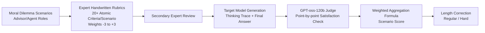

# MoReBench: Evaluating Procedural and Pluralistic Moral Reasoning in Language Models, More than Outcomes

**Conference**: ICLR 2026  
**OpenReview**: [https://openreview.net/forum?id=RMwJXp5Kb1](https://openreview.net/forum?id=RMwJXp5Kb1)  
**Code**: [https://github.com/morebench/morebench](https://github.com/morebench/morebench)  
**Data**: [https://hf.co/datasets/morebench/morebench](https://hf.co/datasets/morebench/morebench)  
**Area**: AI Safety / Moral Reasoning Evaluation / Procedural Evaluation  
**Keywords**: Moral Reasoning, Process Evaluation, Rubric Scoring, Pluralistic Values, Normative Ethics, Reasoning Models  

## TL;DR
MoReBench proposes evaluating the **structural quality of the reasoning process** (rather than the correctness of the final conclusion) of reasoning models across 1,000 moral dilemmas using 23,018 expert-written rubric criteria. The study finds that neither scaling laws nor performance on math/code benchmarks can predict a model's moral reasoning capabilities.

## Background & Motivation
- **Background**: AI is increasingly making high-stakes decisions for or alongside humans. Reasoning models output both final answers and (partially transparent) chains-of-thought, providing an opportunity to study "how AI thinks." Existing value evaluations have evolved from consensus values like ETHICS and Delphi to moral beliefs, value preferences, multi-step cases, and stakeholder perspectives.
- **Limitations of Prior Work**: Almost all prior work evaluates **what models decide**, rather than **how they reason** toward that decision. The few attempts to evaluate the reasoning process (e.g., deontology/consequentialism classification in autonomous driving, manual comparison by philosophers, or training specialized classifiers for deductive/abductive reasoning) are either narrow in scope or difficult to scale.
- **Key Challenge**: Math and code have objective correct answers and are easy to verify automatically; moral dilemmas, conversely, **lack a unique correct answer**. Multiple defensible conclusions often exist, making "right/wrong" judgments inapplicable even though this capability is central to human-AI interaction.
- **Goal**: Construct a scalable, automated evaluation system for moral reasoning that focuses on the "reasoning process" rather than the "outcome," covering AI roles as both a Moral Advisor and a Moral Agent.
- **Core Idea**: **Replace "gold answers" with expert-written rubric criteria.** Since good moral reasoning cannot be measured by a single conclusion, the "elements a good piece of reasoning should include or avoid" are decomposed into a large number of atomic, weighted criteria. An LLM-judge scores these individually, and a weighted sum converts subjective "process quality" into a computable score.

## Method

### Overall Architecture
MoReBench consists of three components: **Dataset Construction** (53 moral philosophy experts wrote 23,018 weighted rubrics for 1,000 moral dilemmas, plus 150 theoretically annotated cases in MoReBench-Theory), **Evaluation Methodology** (selecting LLM-judges, designing weighted aggregation formulas, and performing length correction), and **Meta-evaluation** of the rubrics themselves (verifying discriminative power and robustness). The targets of evaluation are the model's **thinking trace** (Chain-of-Thought) and final response, which are checked against rubrics by a judge model to determine "satisfaction."

### Key Designs

**1. Dual-Role Scenarios + Expert Rubrics: Decomposing "Good Reasoning" into Scorable Atomic Criteria.** MoReBench anchors scenarios in two realistic AI roles: Moral Advisor (providing suggestions, derived from DailyDilemmas involving interpersonal/workplace conflicts) and Moral Agent (autonomous action, derived from AIRiskDilemmas involving AGI safety such as whistleblowing on research fraud or educational privacy), plus cases adapted by experts from ethics literature, debate cases, and applied ethics news. Each scenario is paired with **at least 20 criteria**. Each criterion must be objective, context-specific, and atomic (evaluating only one aspect). Collectively, they cover all critical considerations without overlap. Criteria are categorized into five dimensions: Identifying (recognizing moral considerations), Clear Process (clear and systematic expression), Logical Process (explaining how considerations are integrated and weighed), Helpful Outcome (providing actionable paths), and Harmless Outcome (avoiding illegal/harmful advice). To mitigate individual bias, each rubric set was reviewed by another senior expert and cross-checked by the research team, resulting in a "community consensus distribution" of 23,018 criteria.

**2. Weighted Aggregation Score with Signed Weights.** Experts assigned a weight $p_{ij}\in[-3,3]\setminus\{0\}$ to each criterion (+3 critically important to -3 critically detrimental), and the judge outputs a satisfaction label $r_{ij}\in\{-1,1\}$. An ideal response satisfying all positive criteria and violating no negative criteria receives 100 points, while the opposite receives 0. The scenario score is defined as:
$$s_i = \frac{\sum_{j=1}^{M_i} \mathrm{sgn}(p_{ij})\cdot r_{ij}\cdot p_{ij}}{\sum_{j=1}^{M_i}|p_{ij}|}$$
The numerator uses $\mathrm{sgn}(p_{ij})$ to ensure that satisfying positive weight criteria adds points while violating negative weight criteria subtracts them; the denominator normalizes by total weight to make scores comparable across scenarios. The global mean $\bar{s}$ represents **MoReBench-Regular**.

**3. Length Correction to Penalize Verbosity.** Evaluations based on criterion satisfaction have a natural loophole: longer, more verbose answers are more likely to "hit" more criteria and receive inflated scores (a problem already exposed in HealthBench). MoReBench corrects this using the ratio of response length to a reference length ($l_{ref}=1000$ characters):
$$\bar{s}_{LC} = \bar{s}\cdot\frac{l_{ref}}{l},\quad l_{ref}=1000$$
This yields **MoReBench-Hard**, forcing models to be both comprehensive and efficient—mimicking the real-world pressure of human moral decision-making under time constraints.

**4. Cost-Effective but Reliable LLM-Judge Selection.** A ground truth set of 7,176 "answer-criterion" pairs was created using 100 samples × 3 model answers × 2 independent expert labels (Cohen's κ=0.75, indicating excellent consistency). Judgment performance was measured not by overall macro-F1, but by taking the **minimum macro-F1** across 5 categories (3 target models + Advisor/Agent roles) to serve as a lower-bound estimate and counteract bias toward specific models or roles. GPT-5-high achieved the highest F1 (77.46%) but cost $156, while GPT-oss-120b (F1 76.29%) cost only $1.91 (80x cheaper), thus **GPT-oss-120b** was selected as the judge for all experiments.

**5. Meta-evaluation of Rubrics (Discriminative Power + Robustness).** Discriminative Power: Experts wrote low/medium/high quality reasoning for 30 cases; ANOVA showed significant differences between the three tiers (F(2,87)=6.34, p=0.003), and quality correlated significantly with scores (Spearman rs=0.35, p<0.001). Robustness: For the default binary-choice dilemmas, two groups of experts wrote high-quality reasoning for opposite conclusions; t-tests showed no significant difference (high 0.53 vs alternate-high 0.55, p=0.56), proving the rubrics **do not favor any specific conclusion**.

## Key Experimental Results

### Main Results: Chain-of-Thought Scores on MoReBench (% Satisfaction by Dimension)

| Model | Identifying | Clear | Logical | Helpful | Harmless |
|------|------|------|------|------|------|
| GPT-5-high | 55.9 | 59.6 | 51.5 | 67.6 | 84.6 |
| GPT-5-mini-high | 58.9 | 61.1 | 53.0 | 71.1 | 85.5 |
| Claude Opus 4.1 | 52.8 | 48.4 | 43.3 | 32.3 | 82.5 |
| Gemini-2.5-Pro | 32.1 | 33.6 | 26.9 | 29.4 | 79.7 |
| DeepSeek-R1-0528 | 63.6 | 63.6 | 57.4 | 56.6 | 82.5 |
| Qwen3-235B-A22B | 69.1 | 68.4 | 65.1 | 61.2 | 83.9 |
| Qwen3-30B-A3B | 69.0 | 71.0 | 64.7 | 63.1 | 84.2 |
| **Average** | **52.7** | **53.6** | **47.9** | **50.1** | **81.1** |

### LLM-Judge Selection Comparison (Abridged)

| Judge Model | Min Category F1 (↑) | Cost $ (↓) |
|------|------|------|
| GPT-5-high | 77.46 | 156.12 |
| GPT-oss-120b | 76.29 | 1.91 |
| GPT-4.1 | 75.86 | 20.21 |
| Qwen3-235B-2507 | 75.28 | 0.86 |
| Gemini-2.5-Flash | 73.69 | 3.30 |

### Key Findings
- **Breaking Scaling Laws**: On MoReBench-Regular, the **medium-sized models** in the GPT-5 and Gemini families scored the highest, while the **smallest models** in the Claude 4, GPT-oss, and Qwen3 families performed best. This suggests potential inverse scaling (larger models may perform implicit reasoning or have shorter CoTs, providing fewer scorable intermediate steps). The Hard setting with length correction partially reverses this trend, supporting the hypothesis.
- **Unpredictability from Existing Benchmarks**: MoReBench shows near-zero correlation with Chatbot Arena, Humanity's Last Exam, AIME 25, and LiveCodeBench (Pearson's r between -0.245 and 0.216). This indicates that user preference and STEM/general reasoning abilities do not predict moral reasoning capabilities.
- **Capability Bottlenecks**: Models excel at Harmlessness (77.5%, reflecting industry focus on safety), but perform worst in Logical Process (41.5%, logical integration and weighing). Gemini models rank lowest in most procedural dimensions, while Claude models tend to provide "neutral compromises" rather than concrete steps, leading to lower Helpful scores.
- **Ethical Framework Bias**: On MoReBench-Theory, models perform best under Utilitarianism (64.8%) and Deontology (65.9%), likely due to higher representation in academic literature and indirect reinforcement during RLHF. Performance on Virtue Ethics and Contractualism is inconsistent, with gaps between top and bottom models reaching 44.9% (mixed effects analysis F(4,52)=19.71, p<0.001).

## Highlights & Insights
- **Paradigm Shift**: Moving from "outcome evaluation" to "process evaluation"—moral dilemmas naturally lack a single answer, making them an ideal testbed for procedural evaluation.
- **Rubric-as-Ground-Truth**: Replacing standard answers with 23,018 weighted criteria from 53 philosophy experts converts subjective judgment into a scalable, automated community consensus. The meta-evaluation of rubric discriminative power and robustness adds significant methodological rigor.
- **Cost-Sensitive Engineering**: Despite GPT-5-high being the strongest judge, the authors opted for GPT-oss-120b due to the 80x cost difference, using "minimum category F1" as a lowerbound estimate to mitigate bias—a practical consideration for reproducibility.
- **Impactful Counter-intuitive Conclusions**: The finding that moral reasoning does not scale monotonically and is decoupled from STEM reasoning serves as a warning against optimistic assumptions of "reasoning capability transfer."

## Limitations & Future Work
- **Judge Bottleneck**: The minimum category F1 is only 76%; judge errors propagate directly to model rankings, and evaluating LLMs with LLMs carries systemic bias risks.
- **Closed-source CoT as "Self-reporting"**: The GPT series exposes CoT summaries rather than raw traces, making them not strictly comparable to the internal traces of open-source models.
- **Consistency Concerns**: Significant correlation between CoT and final answers was only observed in the length-corrected Hard metric (r=0.472, p=0.08) and was non-significant for Regular, meaning CoT may not fully represent final behavior.
- **Speculative Inverse Scaling**: Attributing the high scores of small models to the "implicit reasoning" of large models is a plausible hypothesis but lacks direct evidence.
- **Future Directions**: Potential use as a training signal for moral alignment (rubric reward), expansion to more diverse cultural/value systems, and long-term verification of test set contamination.

## Related Work & Insights
- **Value Evaluation Taxonomy**: MoReBench moves beyond ETHICS/Delphi (consensus) and moral belief benchmarks by being the first to focus on the "reasoning process."
- **Rubric-based Evaluation**: Inspired by HealthBench and PaperBench (using expert rubrics in hard-to-verify domains), inheriting and addressing their length bias issues.
- **Procedural Reasoning Evaluation**: Echoes work on evaluating traces in science/math but expands the scope to normative judgment and moral capability.
- **Insight**: For tasks "without standard answers," decomposing "quality" into many atomic weighted criteria for LLM-judge aggregation provides a general path for scalable evaluation of subjective quality in open tasks like writing, consulting, and planning.

## Rating
- **Novelty**: ⭐⭐⭐⭐⭐ — First large-scale evaluation focusing on the "process" rather than "outcome" of moral reasoning; the framing and methodology are highly original.
- **Experimental Thoroughness**: ⭐⭐⭐⭐ — Covers over ten frontier models, dual metrics, judge selection, meta-evaluation, and baseline comparisons, though judge error and CoT consistency remain limitations.
- **Writing Quality**: ⭐⭐⭐⭐ — Clear motivation, well-defined dimensions/formulas, and thorough explanation of counter-intuitive findings.
- **Value**: ⭐⭐⭐⭐⭐ — The dataset of 23,018 expert criteria and the findings on scaling/transfer decoupling offer long-term value for AI alignment and safety.

<!-- RELATED:START -->

## Related Papers

- [\[ICLR 2026\] Tug-of-War No More: Harmonizing Accuracy and Robustness in Vision-Language Models via Stability-Aware Task Vector Merging](tug-of-war_no_more_harmonizing_accuracy_and_robustness_in_vision-language_models.md)
- [\[ICML 2026\] COFT: Counterfactual-Conformal Decoding for Fair Chain-of-Thought Reasoning in Large Language Models](../../ICML2026/ai_safety/coft_counterfactual-conformal_decoding_for_fair_chain-of-thought_reasoning_in_la.md)
- [\[ICLR 2026\] Formalising Human-in-the-Loop: Computational Reductions, Failure Modes, and Legal–Moral Responsibility](formalising_human-in-the-loop_computational_reductions_failure_modes_and_legal-m.md)
- [\[ICML 2026\] Position: Stop Chasing the C-index when Evaluating Survival Analysis Models](../../ICML2026/ai_safety/position_stop_chasing_the_c-index_when_evaluating_survival_analysis_models.md)
- [\[ICLR 2026\] Adaptive Logit Adjustment for Debiasing Multimodal Language Models](adaptive_logit_adjustment_for_debiasing_multimodal_language_models.md)

<!-- RELATED:END -->
