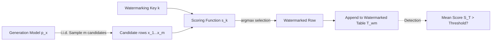

# MUSE: Model-Agnostic Tabular Watermarking via Multi-Sample Selection

**Conference**: ICLR 2026  
**OpenReview**: [https://openreview.net/forum?id=R1QuNKyVOw](https://openreview.net/forum?id=R1QuNKyVOw)  
**Code**: Open-sourced (link provided in the paper)  
**Area**: AI Safety / Synthetic Data Watermarking / Tabular Generation Models  
**Keywords**: Tabular Data Watermarking, Generative Watermarking, Multi-Sample Selection, Distribution-Preserving, Model-Agnostic  

## TL;DR
MUSE proposes a "multi-sample selection" paradigm for tabular data watermarking: generating multiple candidate samples for each row and selecting the one with the highest score via a keyed scoring function. This bypasses the unreliability of DDIM inversion in diffusion models, achieving a model-agnostic, calibratable, and low-distortion solution.

## Background & Motivation
**Background**: Tabular generation models (e.g., TabSyn, TabDDPM) can synthesize high-quality structured data for privacy protection, data augmentation, and missing value imputation. However, the risk of synthetic data misuse (data poisoning, financial fraud) is rising, necessitating watermarking for traceability, attribution verification, and misuse detection.

**Limitations of Prior Work**: Early tabular watermarking followed an "editing-based" approach by directly modifying values. However, altering discrete or categorical columns easily creates non-existent categories or pushes values across decision boundaries, violating data integrity. Recent mainstream methods have shifted to "generative watermarking," borrowing from the DDIM reversibility in image/video diffusion: initializing generation with patterned Gaussian noise and performing inversion during detection to check correlation (e.g., TabWak).

**Key Challenge**: The precision of DDIM inversion for tabular diffusion models is significantly lower than for images/videos (Figure 1, left). This is because tabular pipelines contain components that are difficult to invert—such as quantile normalization (non-injective, irreversible) and VAE decoders (inversion relies on optimization without perfect guarantees). Detection requires step-by-step inversion of the entire pipeline, causing error accumulation and making watermark detection highly dependent on specific model implementations, which severely limits applicability.

**Goal**: Design a tabular watermarking paradigm that does **not rely on any inversion**, ensuring detectability and robustness while minimizing perturbation to the original data distribution.

**Core Idea**: The authors observe a neglected fact—the computational cost for tabular generation is much lower than for images/videos (Figure 1, right), making it feasible and inexpensive to "sample multiple times and pick one" per row. **Thus, watermarking is transformed from "modification/inversion" to "selection"**: generate $m$ candidate rows and use a keyed scoring function to select the one with the highest score as the watermarked row. Detection only requires calculating whether the average score of the table is significantly higher than expected, requiring no inversion.

## Method

### Overall Architecture
MUSE splits the watermarking of each row into two steps: first, independently draw $m$ candidates from the model distribution $p(x)$; second, use a keyed scoring function $s_k(\cdot)$ to select the highest-scoring candidate (breaking ties randomly). This is repeated $N$ times to form the table, with the $N$ groups being fully parallelizable. On the detection side, the average score of the entire table $S(T)=\frac{1}{N}\sum_i s_k(x_i)$ is calculated; if it exceeds a threshold, the table is identified as watermarked. The scoring function consists of "how to score the selected column values" (Scoring Design) and "which columns to select for scoring" (Column Selection Strategy). Different combinations allow MUSE to balance fidelity, detectability, and robustness.

### Key Designs

**1. Multi-Sample Selection Paradigm: Replacing "Modification" with "Selection" to Eliminate Inversion.** The fundamental shift in MUSE is changing watermarking from tampering with data values to selecting from multiple valid candidates. Since each candidate is a real sample drawn from the model itself, selecting any of them will not introduce illegal categories or out-of-bounds values, inherently avoiding the data validity issues of editing-based watermarks. Furthermore, because detection relies on the statistical shift of scores rather than noise inversion, it is agnostic to the internal structure of the underlying model (VAE, quantile normalization, etc.), achieving true "model-agnosticism"—any tabular generator supporting repeated sampling can apply it directly.

**2. Two Scoring Designs: Trade-off Between Distortion and Robustness.** Given a subset of columns $J$ selected by the column selection function $\pi(x)$, the authors provide two ways to map values to scores. Joint-Vector (JV) concatenates all selected columns into a single vector for hashing: $h=H(\pi(x),k)$, $s^{JV}_k(x)=f(h)$. Operating in a vast joint input space, hash collisions are rare, thus barely changing the statistical properties of the data with minimal distortion. However, it is "all-or-nothing"—modifying any column changes the hash, making the signal fragile. Per-Column (PC) performs independent hashing for each column and takes the average: $h_i=H(x_i,k)$, $s^{PC}_k(x)=\frac{1}{|J|}\sum_{i\in J}f(h_i)$. This spreads the signal across multiple columns, allowing it to survive partial deletions or modifications, offering strong robustness at the cost of higher distortion due to more frequent collisions in smaller input spaces. The function $f$ is a pseudo-random function following a Bernoulli(0.5) distribution—concentrating probability mass at the extremes (0 or 1) to maximize the separation of binary signals between "watermarked vs. non-watermarked" (Theorem 4.1 proves this distribution is optimal).

**3. Column Selection Strategy: JV Adaptive Sparse vs. PC All-Columns.** Because JV is fragile, it must select sparse columns to reduce the attack surface. However, a fixed set of sparse columns could be guessed and erased by an adversary. The authors resolve this by using "quantile ranks": for each column in a row, the normalized rank relative to the training distribution is computed as $r_j=\frac{v_j-v_{\min,j}}{v_{\max,j}-v_{\min,j}}$ (categorical columns use indices). Columns are sorted by rank, and those falling into a fixed quantile set $Q$ are selected—ensuring the physical columns selected vary dynamically with row content. Conversely, PC uses all $M$ columns ($\pi(x):=x$) since more columns lead to a stronger and more robust signal. The paper notes that if the quantile set $Q$ is leaked, a keyed pseudo-random permutation $\pi_k$ can be used to shuffle column order, making identifying watermark columns equivalent to breaking the PRP.

**4. Theoretical Guarantees for Calibratability and Distribution Preservation.** The False Positive Rate (FPR) of detection is upper-bounded by $\Pr(S(T_{\text{no-wm}})>S(T_{\text{wm}}))\le\exp\!\big(-\frac{N(\mu^m_{\text{wm}}-\mu_{\text{no-wm}})^2}{2}\big)$. From this, the number of required candidate samples can be derived given a target FPR $\alpha$: $m\approx\max\big(2,\lceil\log_{0.5}(0.5-\sqrt{\frac{\log(1/\alpha)}{2N}})\rceil\big)$. This implies that $m$ saturates quickly as table size $N$ increases—for instance, with $N\ge300$ and $0.01\%$ FPR, $m=2$ is sufficient. This "embedding just enough signal for detection" minimizes generation quality degradation. To further achieve strict distribution preservation, the authors introduce **Repeated Column Masking**: caching previously used column values and skipping embedding if a new candidate's values have appeared before, avoiding systematic bias from value reuse. Theorem 4.3 proves that $m=2$ with this mechanism satisfies multi-sample distribution preservation (at the cost of slightly reduced detectability).

## Key Experimental Results

### Main Results Table (Generation Quality + Detectability, Selected Datasets)

| Dataset | Method | Marg.↑ | Corr.↑ | C2ST↑ | MLE Gap↓ | AUC | T@0.1%F |
|--------|------|--------|--------|--------|----------|-----|---------|
| Adult | TabWak* | 0.933 | 0.879 | 0.713 | 0.085 | 0.999 | 0.942 |
| Adult | GS | 0.751 | 0.619 | 0.058 | 0.084 | 1.000 | 1.000 |
| Adult | **MUSE-JV** | **0.979** | **0.963** | **0.883** | **0.017** | 1.000 | 1.000 |
| Adult | MUSE-PC | 0.953 | 0.925 | 0.790 | 0.018 | 1.000 | 1.000 |
| Default | **MUSE-JV** | **0.983** | 0.925 | **0.963** | **0.002** | 1.000 | 1.000 |
| Default | TabWak* | 0.906 | 0.894 | 0.550 | 0.176 | 0.965 | 0.218 |
| Shoppers| **MUSE-JV** | **0.982** | **0.974** | **0.950** | 0.015 | 1.000 | 1.000 |

("w/o WM" represents the upper bound without watermarking; performance gains are determined relative to the strongest baseline.)

### Key Findings
- **Significant Lead in Fidelity**: Compared to the strongest baseline, MUSE reduces distortion in fidelity metrics by **84–88%** while maintaining a **1.0 TPR@0.1%FPR** detection rate.
- **Empirical Validation of JV vs. PC**: MUSE-JV is superior in generation quality (lowest distortion), while MUSE-PC sacrifices some quality for enhanced robustness against row/column deletion and perturbation attacks.
- **GS (Gaussian Shading) Comparison**: GS achieves perfect detection but suffers from collapsed generation quality (e.g., C2ST of 0.058 on Adult), demonstrating that crude noise injection sacrifices utility, a pitfall MUSE avoids via "selection."
- **Rapid Saturation of $m$**: Theory and Figure 3 show that with looser target FPR or larger tables, the required number of candidates decreases, with $m=2\sim4$ being sufficient for most scenarios, ensuring low overhead.

## Highlights & Insights
- **Leveraging Low Computational Cost**: While image/video watermarking relies on inversion because resampling is expensive, tabular generation's low cost makes "multi-sample selection" feasible—an intuitive yet precise tactical pivot.
- **Paradigm over Point Solution**: MUSE decouples "Scoring Design × Column Selection" into pluggable layers, where JV/PC are just two instances, allowing flexibility across the quality-robustness spectrum.
- **Theoretical Closure**: From FPR upper bounds to analytical calibration of $m$ and the distribution preservation proof for masking, the method is theoretically guaranteed rather than purely empirical.

## Limitations & Future Work
- **Dependence on Resampling**: The model must support inexpensive repeated sampling; this is unsuitable for models with expensive sampling or one-shot generation.
- **Trade-off between Preservation and Detectability**: Repeated Column Masking ensures unbiased distributions but weakens detectability by skipping some embeddings.
- **JV Security via Secret Key**: If quantile sets are leaked, targeted erasure is possible, requiring PRP permutations for protection; full-column micro-perturbations on numerical data still require quantization preprocessing.
- **Evaluation Scope**: Experiments were concentrated on 4–6 classic tabular datasets; performance in ultra-high-dimensional, strongly correlated, or extremely imbalanced real-world scenarios remains to be validated.

## Related Work & Insights
- **Generative Watermarking (Images/Videos)**: Tree-Ring and Gaussian Shading rely on DDIM inversion; MUSE identifies the failure of this path for tabular data and finds an alternative.
- **TabWak**: The first to use DDIM inversion for tabular diffusion watermarking; it serves as the direct baseline for improvement.
- **LLM Watermarking (Repeated Key Masking)**: MUSE's "Repeated Column Masking" for distribution preservation is inspired by zero-bit unbiased watermarking in language models, demonstrating cross-modal migration of unbiased watermarking concepts.
- **Insight**: When a mainstream technique (inversion) fails in a new modality, returning to the task's inherent properties (computational cost/statistical traits) to find "alternative invariants" (statistical shift via selection) is often more effective than forcing the old paradigm.

## Rating
- **Novelty**: ⭐⭐⭐⭐⭐ — "Multi-sample selection" completely shifts tabular watermarking from inversion to a selection paradigm with precise insight.
- **Experimental Thoroughness**: ⭐⭐⭐⭐ — Covers multiple datasets and compares quality/detection/robustness with ablation, though dataset scale remains limited.
- **Writing Quality**: ⭐⭐⭐⭐ — Clear motivation, smooth transition from theory to method, and well-supported by figures.
- **Value**: ⭐⭐⭐⭐ — Model-agnostic, low-distortion, and calibratable, offering high practical value for synthetic tabular data traceability and copyright protection.

<!-- RELATED:START -->

## Related Papers

- [\[ICLR 2026\] LiteGuard: Efficient Task-Agnostic Model Fingerprinting with Enhanced Generalization](liteguard_efficient_task-agnostic_model_fingerprinting_with_enhanced_generalizat.md)
- [\[ICLR 2026\] Sample-Efficient Distributionally Robust Multi-Agent Reinforcement Learning via Online Interaction](sample-efficient_distributionally_robust_multi-agent_reinforcement_learning_via_.md)
- [\[ICLR 2026\] A Bayesian Nonparametric Framework for Private, Fair, and Balanced Tabular Data Synthesis](a_bayesian_nonparametric_framework_for_private_fair_and_balanced_tabular_data_sy.md)
- [\[ICLR 2026\] Co-LoRA: Collaborative Model Personalization on Heterogeneous Multi-Modal Clients](co-lora_collaborative_model_personalization_on_heterogeneous_multi-modal_clients.md)
- [\[ICLR 2026\] Memorization Through the Lens of Sample Gradients](memorization_through_the_lens_of_sample_gradients.md)

<!-- RELATED:END -->
