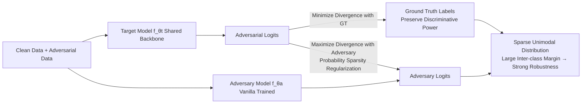

# Nasty Adversarial Training: A Probability Sparsity Perspective for Robustness Enhancement

**Conference**: ICLR 2026  
**OpenReview**: [https://openreview.net/forum?id=eCXpA14KHd](https://openreview.net/forum?id=eCXpA14KHd)  
**Code**: TBD  
**Area**: Adversarial Robustness / AI Security  
**Keywords**: Adversarial Training, Robustness, Probability Sparsity, Nasty Training, Intellectual Property Protection, Inter-class Margin  

## TL;DR
This paper leverages Nasty Training, originally designed to "prevent model distillation," to enhance adversarial robustness. By utilizing a vanilla-trained "adversary model" for divergence regularization, the target model is forced to output a **sparse probability distribution**. This widens inter-class margins and increases decision boundary margins, achieving SOTA robustness on CIFAR / ImageNet with minimal overhead, while providing an interpretable spatial metric perspective.

## Background & Motivation
- **Background**: The vulnerability of DNNs to adversarial examples threatens secure deployment. Early defenses relied on "gradient masking" and were broken by adaptive attacks. Currently, the most reliable empirical defenses are Adversarial Training (AT) and Robust Distillation (RD). While numerous AT variants exist (PGD-AT, TRADES, AWP, LAS-AT, etc.), few attribute robustness to the **output probability distribution**.
- **Limitations of Prior Work**: Mainstream AT focuses on generating stronger inner-loop adversarial samples or adding weight perturbations, with little explanation of how the shape of the output probability affects robustness. There is a lack of an interpretable mechanism that maps robustness gains to **geometric/spatial metrics**.
- **Key Challenge**: A seemingly unrelated line of work—Nasty Training (NT, originally created to prevent a teacher from being distilled by a student)—induces **probability sparsity**. Subsequent theoretical work proved that sparse distributions hinder distillation, but NT has never linked this sparsity to adversarial robustness, leaving this potential entirely ignored.
- **Goal**: Transfer "probability sparsity" from intellectual property protection to adversarial defense, demonstrating and implementing "sparsity ⇒ larger inter-class margin ⇒ stronger robustness" while maintaining simplicity and low overhead.
- **Core Idea** (**Leveraging External Force**): Introduce a vanilla-trained **adversary model** on top of standard AT for nasty regularization. The target model gains probability sparsity by **maximizing divergence from the adversary's output distribution**, while **minimizing divergence from ground-truth labels** to preserve discriminative power. Sparsity is embedded as a regularization term in the adversarial training.

## Method

### Overall Architecture
NAT = Standard Adversarial Training + Nasty Regularization. In addition to the primary classification loss (cross-entropy), a **adversary model** $f_{\theta_a}$ with the same architecture as the target model is introduced after vanilla training. During min-max adversarial training, the target model fits the ground truth for clean/adversarial data via cross-entropy while **maximizing the KL divergence between its output and the adversary's output distribution**. This compresses probability mass from being "uniformly spread across all non-target classes" into a few semantically similar classes, resulting in a sparse distribution. The overall objective is:

$$\min_{\theta_t}\sum_{(x_i,y_i)\in X\cup X'} \mathrm{XE}\big(\sigma(f_{\theta_t}(x_i)),y_i\big) - \omega_a \mathrm{KL}\big(\sigma_{\tau_a}(f_{\theta_t}(x_i)),\sigma_{\tau_a}(f_{\theta_a}(x_i))\big),$$

where $X'$ denotes the set of adversarial samples generated by inner-loop maximization of cross-entropy, and $\omega_a$ balances classification and nasty regularization.

### Key Designs

**1. Nasty Regularization as a Sparsifier for AT: Forcing Unimodal Distribution through "Differentiation"**. The core of NAT is moving the adversary divergence term from NT into AT. The adversary model, trained normally with one-hot labels, naturally exhibits a "unimodal + uniform" prediction pattern. The target model is required to maximize KL divergence from it, thus it cannot replicate the adversary's uniform distribution on non-target classes. It must redistribute the uniform probability mass to a **few classes semantically close to the target class and more "compressible,"** making the output sparse. Cross-entropy pushes mass toward the target class, while the nasty term prevents it from mimicking the adversary's uniform tail. The authors also observed that the secondary peaks of the sparse output fall on semantically related classes (e.g., cat and dog), indicating the model captures generalizable semantics rather than overfitting.

**2. High-order Power Expansion Explaining the Source of Sparsity: Second-order Term Magnifies Penalty on Non-target Classes**. To answer why NT induces sparsity, the authors apply a Taylor expansion to the nasty term. Expanding $\log(q^a_{i,c})$ at $q^t_{i,c}$, the nasty loss is approximated by a series of high-order terms:

$$L_{\text{Nasty}} \approx \frac{1}{N}\sum_{i,c}(q^a_{i,c}-q^t_{i,c}) - \frac{1}{2N}\sum_{i,c}\frac{(q^a_{i,c}-q^t_{i,c})^2}{q^t_{i,c}} + \frac{1}{3N}\sum_{i,c}\frac{(q^a_{i,c}-q^t_{i,c})^3}{(q^t_{i,c})^2}-\cdots$$

The first-order term is negligible as probabilities sum to 1. **The second-order term is crucial**: the smaller the denominator $q^t_{i,c}$ (lower probability for non-target classes), the larger the regularization weight. Thus, the penalty for differentiation on non-target classes is significantly magnified, pushing them further toward 0 to form sparsity. Although high-order odd terms might have opposing effects, they are suppressed by the even terms with larger coefficients. This expansion anchors "empirically observed sparsity" to a "high-order power optimization" mechanism.

**3. Spatial Metric Explanation of Robustness Gain: Sparsity ⇒ Large Boundary Margin + Large Inter-class Margin**. The authors link sparsity to geometry. Probability sparsity implies that the target class logit is much larger than non-target classes $w_i x + b_i \gg w_j x + b_j$ (using $\gg$ to emphasize the large margin brought by Softmax/Sigmoid saturation). This directly corresponds to two spatial metrics: first, the **distance from data points to the decision boundary** $D = \frac{|w_c\cdot x_i + b_c|}{\|w_c\|_2}$—since weight norms are constrained by L2 regularization, large changes in logits dominate the distance, so sparsity yields larger point-boundary distances; second, the **shortest distance between classification boundaries**, approximated via projection geometry $D^{i,j}_{\text{shortest}}=\|\gamma-(\gamma\cdot d_i)d_i\|_2$ ($\gamma=w_j-w_i$, $d_i$ is a unit direction). Both indicate that sparsity pushes samples further from boundaries and increases the separation between class hyperplanes, requiring attackers to apply larger perturbations to cross classes. This provides an interpretable chain for NAT's robustness gains, which is quantitatively verified via sample-to-boundary distances in experiments.

## Key Experimental Results

### Main Results (WRN-34-10, CIFAR, Avg. is the average robustness across various attacks)

| Method | CIFAR10 Clean | CIFAR10 AA | CIFAR10 Avg. | CIFAR100 Clean | CIFAR100 AA | CIFAR100 Avg. |
|---|---|---|---|---|---|---|
| PGD-AT | 85.17 | 51.67 | 59.46 | 60.89 | 27.86 | 35.69 |
| TRADES | 85.72 | 53.40 | 60.28 | 58.61 | 25.94 | 33.00 |
| AWP | 85.57 | 53.90 | 61.74 | 60.38 | 28.86 | 37.00 |
| LAS-AWP | 87.74 | 55.52 | 58.80 | 64.89 | 30.77 | 39.86 |
| **NAT (best)** | **89.15** | 52.95 | **65.88** | **62.87** | **30.85** | 39.22 |
| **NAT (last)** | 87.33 | 50.23 | 65.44 | 61.18 | 29.14 | 37.88 |

- On ResNet-18, NAT (best) achieves Clean **90.86** / Avg. **63.85** on CIFAR10, and Avg. **39.26** on CIFAR100, outperforming SOTAs like AGAIN-AWP and LAS-AT.
- Results are consistent on ViT-Small + ImageNet100 (Appendix) and under black-box attacks: NAT leads in robustness regardless of CNN/ViT architecture or resolution; it is also compatible with EDM diffusion data augmentation for further improvements.

### Ablation Study (CIFAR-10)

| Ablation Dimension | Setting | Conclusion |
|---|---|---|
| Nasty Coefficient $\lambda$ | 0 → 0.12, step 0.02 | Increases then decreases, **peaking at $\lambda=0.06$**; $\lambda=0$ (no nasty) is significantly worse, proving sparsity regularization is effective. |
| Adversary Architecture | Different adversary structures | Various architectures provide robustness gains, offering flexible choices (Appendix F). |
| Adversary State | Random / Vanilla / AT / SAM | All states offer gains, but some do not exhibit the "unimodal+uniform" pattern (Appendix G). |

### Key Findings
- Introducing nasty regularization is superior to $\lambda=0$ for **all** tested values of $\lambda>0$, indicating gains stem from the sparsity mechanism itself rather than hyperparameter tuning.
- Robust models provide positive logits for semantically similar classes (dog/cat) and negative logits for unrelated classes (automobile/ship), quantitatively verifying the spatial metric hypothesis that "sparsity ⇒ larger boundary distance + capture of invariant semantics."
- Extremely low overhead: Only requires an additional forward pass of a fixed vanilla adversary model; the main process remains standard AT.

## Highlights & Insights
- **Creative Cross-domain Transfer**: Creatively repurposing Nasty Training, originally for "anti-distillation," as an adversarial defense regularizer is a brilliant conceptual transfer.
- **Closed-loop Interpretability**: From Taylor expansion (where sparsity comes from) to spatial metrics (how sparsity improves robustness) and quantitative verification, the paper provides a rare "Mechanism—Geometry—Evidence" chain.
- **Simple and Plug-and-play**: Does not modify attack generation or introduce complex losses; adding a single adversary divergence term makes it easy to stack with existing AT and data augmentation methods.

## Limitations & Future Work
- Selecting a vanilla same-architecture model as the adversary is empirically optimal, but there is a lack of deep theoretical characterization of "why unimodal+uniform adversaries are best"; mechanisms for different adversary states lack a unified explanation.
- Spatial metric analysis relies on approximate assumptions like linear classification layers and constrained weight norms; applicability to complex heads or non-linear boundaries needs further verification.
- Main results are concentrated on CIFAR and ImageNet100; stability under larger-scale datasets and stronger adaptive/ensemble attacks remains to be explored.
- While the overhead is small, the extra forward pass and memory consumption of an additional model may require balancing for ultra-large models.

## Related Work & Insights
- **Adversarial Training Lineage**: PGD-AT, TRADES, MART, AWP, LAS-AT, AGAIN, etc. NAT is orthogonal—it focuses on output distribution shape rather than modifying the inner-loop attack, allowing combination with these methods and EDM/diffusion augmentation.
- **Nasty Training / Robust Distillation**: Originating from model IP protection (Ma et al. 2021/2022), this work reveals that the probability sparsity side-effect is valuable for robustness, inspiring a research paradigm of "repurposing side-effects from non-defense scenarios."
- **Insight**: The "shape" of output probabilities (sparsity, peak structure) may be an undervalued controllable knob for robustness; using Taylor expansion to decompose regularization terms into high-order powers is a universal tool for analyzing divergence-based losses.

## Rating
- Novelty: ⭐⭐⭐⭐ Transferring probability sparsity from anti-distillation to adversarial robustness with a spatial metric explanation is novel.
- Experimental Thoroughness: ⭐⭐⭐⭐ Covers CIFAR10/100, ImageNet100, CNN/ViT, white-box/black-box, and multiple ablations; main results are SOTA, though some depth depends on the appendix.
- Writing Quality: ⭐⭐⭐⭐ Clear mechanism-geometry-verification chain, complete formula derivations, and standard charts/tables.
- Value: ⭐⭐⭐⭐ Low-overhead, plug-and-play, and interpretable; holds both practical and heuristic value for the AT community.

<!-- RELATED:START -->

## Related Papers

- [\[ICLR 2026\] Concept-based Adversarial Attack: a Probabilistic Perspective](concept-based_adversarial_attack_a_probabilistic_perspective.md)
- [\[ICLR 2026\] On the Interaction of Compressibility and Adversarial Robustness](on_the_interaction_of_compressibility_and_adversarial_robustness.md)
- [\[CVPR 2026\] Robustness Under Data Scarcity: Few-Shot Continual Adversarial Training for Evolving Threats](../../CVPR2026/ai_safety/robustness_under_data_scarcity_few-shot_continual_adversarial_training_for_evolv.md)
- [\[ICLR 2026\] FERD: Fairness-Enhanced Data-Free Adversarial Robustness Distillation](ferd_fairness-enhanced_data-free_adversarial_robustness_distillation.md)
- [\[CVPR 2026\] Taming the Long Tail: Rebalancing Adversarial Training via Adaptive Perturbation](../../CVPR2026/ai_safety/taming_the_long_tail_rebalancing_adversarial_training_via_adaptive_perturbation.md)

<!-- RELATED:END -->
