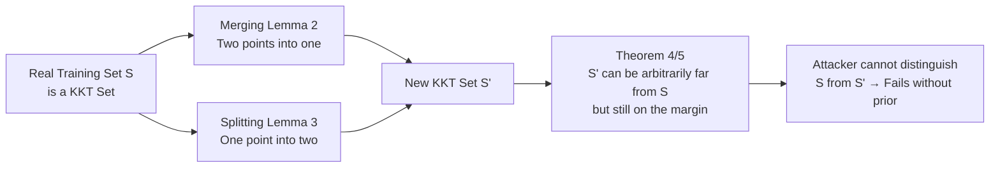

# No Prior, No Leakage: Revisiting Reconstruction Attacks in Trained Neural Networks

**Conference**: ICLR 2026  
**OpenReview**: [https://openreview.net/forum?id=7wjFjOzCtB](https://openreview.net/forum?id=7wjFjOzCtB)  
**Code**: To be confirmed  
**Area**: AI Safety / Privacy (Theoretical Analysis of Training Data Reconstruction Attacks)  
**Keywords**: Reconstruction Attacks, Privacy Leakage, Implicit Bias, Max-margin, KKT Conditions, Homogeneous ReLU Networks  

## TL;DR
This paper revisits training data reconstruction attacks based on implicit bias from a "defensive" perspective, **strictly proving that in the absence of data prior knowledge, the attack objective function possesses infinite indistinguishable global optima that can be arbitrarily far from the real training set**, thereby demonstrating that the "success" of such attacks fundamentally relies on external priors rather than the information leaked by the implicit bias itself.

## Background & Motivation
- **Background**: Neural networks memorize training data. Recent works like Haim et al. (2022) and Buzaglo et al. (2023) demonstrated alarming attacks that reconstruct training samples from homogeneous ReLU networks using only model parameters. These rely on the **implicit bias** of gradient flow under logistic/exponential loss: networks converge to KKT points of the max-margin problem, which attackers use to construct and optimize a reconstruction objective.
- **Limitations of Prior Work**: Despite impressive empirical results, these attacks **lack a rigorous theoretical foundation**. Haim et al. noted it was "unclear why the optimization converges to real training samples, given the non-uniqueness of solutions without priors." Guarantees by Smorodinsky et al. (2025) rely on overly strong assumptions like univariate distributions.
- **Key Challenge**: A common belief is that "more thorough training leads to better fulfillment of implicit bias, increasing privacy risks." However, the extent to which KKT constraints imposed by implicit bias actually leak training data has never been strictly characterized.
- **Goal**: Instead of designing stronger attacks, this work analyzes the **inherent flaws and failure conditions** of existing methods to clarify "when training set leakage truly becomes possible."
- **Core Idea**: **[Non-uniqueness after removing priors]** Once the prior term $L_{\text{prior}}$ is stripped from the attack objective (Eq.5), the remaining KKT loss has **infinite global optima**. These can be explicitly constructed via "merging/splitting" operations to create candidate sets arbitrarily far from the real data. Attackers cannot distinguish between them—**prior knowledge is the key to success, while implicit bias itself does not leak the data**.

## Method

### Overall Architecture
The paper characterizes the **solution space geometry** of the KKT loss $L_{\text{KKT}} = \gamma_1 L_{\text{stationary}} + \gamma_2 L_\lambda$ (from Haim et al. 2022) without the prior term. The argument proceeds in two stages: first proving that global optima are ubiquitous and can be far from the truth in an ideal setting where the network exactly reaches KKT points (§3.1), then extending this to realistic "approximate KKT points" (§3.2). Finally, it validates that "weaker priors lead to worse reconstruction" via synthetic and CIFAR experiments (§4).

### Key Designs
**1. Merging and Splitting: Constructive enumeration of equivalent global solutions.** The technical core involves two lemmas showing that KKT sets (sets where $L_{\text{KKT}}=0$) can be "rewritten" without breaking optimality. **Merging** (Lemma 2) states that if two points $x_1, x_2$ share the same label and activation pattern with multipliers $\lambda_1, \lambda_2 > 0$, a convex combination $x_{1.5}=\alpha x_1+(1-\alpha)x_2$ forms a new KKT set. **Splitting** (Lemma 4) allows a point $x_1$ to split into $z_1=x_1+\alpha\nu$ and $z_2=x_1-\beta\nu$ along any direction $\nu$ as long as they maintain the same pattern. This answers Haim et al.'s question—**solutions are not unique but ubiquitous**; reconstructed points may simply be interpolations of real samples.

**2. Unbounded Distance Theorem: Solutions can be arbitrarily far from the truth.** **Theorem 4** proves that if training samples do not span the entire domain ($\mathrm{span}\{x_1,\dots,x_n\}\subsetneq\mathbb{R}^d$, which holds for data like MNIST with black borders), there exists a KKT set $S_r$ such that $d(S, S_r) > r$ for any $r > 0$, and all points in $S_r$ sit exactly on the margin ($|\Phi(\theta;x_r)|=p$). **Theorem 5** relaxes this to data approximately in a linear subspace, quantifying the splitting degree via a lower bound controlled by the smallest singular value $\sigma_d$. The "flatter" the data cloud, the larger the space for rewriting.

**3. Approximate KKT Generalization: Failure in realistic networks.** Real networks only approximate KKT points. The authors introduce $(\varepsilon,\delta)$-KKT relaxations (stationary residual $\le\varepsilon$, complementary slackness residual $\le\delta$) and extend merging/splitting (Lemma 6/7). **Theorem 8/9** quantify that as $\gamma \to 0$ and the network approaches KKT points (more training), the splitting degrees of freedom increase, making the attack less reliable—**contrary to intuition, well-trained networks on structured data are safer**.

**4. Operationalizing "Prior" via Initialization Distribution.** The "prior" is modeled as "knowledge of the data domain boundaries" and injected via the **initialization distribution** of attack candidates. For example, a natural image prior is defined as knowing pixels fall in $[0,1]^d$. By shifting the initialization sphere or adding a secret offset to the CIFAR training set, the "prior strength" is adjusted to decouple mathematical constraints from external priors.

## Key Experimental Results

### Main Results (Synthetic Data: Weaker prior, worse reconstruction)

| Setting | Configuration | Observation |
|------|------|------|
| Data | 500 samples in $S^{783}\subset\mathbb{R}^{784}$, labeled by first coordinate | — |
| Network | 2-layer, 1000-width ReLU; 500K epochs; loss $10^{-7}$ | Strongly satisfies implicit bias |
| Attack | Candidates initialized on spheres of varying radii | $L_{\text{KKT}}$ remains ~330–332 (**nearly identical**) |
| Result | Average distance of top 5 reconstructions to real set | **Higher error as radius deviates from real domain** |

### CIFAR Experiments (Realistic Architecture)

| Observation |
|------|
| As the attack prior weakens (via secret offsets), reconstruction quality **deteriorates rapidly**. |
| Reconstructions clearly appear as "averages/interpolations of multiple training samples," confirming the split/merge theory. |

### Key Findings
- **Identical optimality, different quality**: $L_{\text{KKT}}$ values were nearly equal across runs, but reconstruction quality varied drastically with initialization, proving that "approaching global optima" $\neq$ "recovering samples" without priors.
- **Reconstruction ≈ Interpolation**: CIFAR attacks converged to averages of instances, empirical evidence of the splitting/merging theory.
- **Training more can be safer**: As $\gamma \to 0$, structural freedom increases, making attacks less reliable. This alleviates the tension between privacy and generalization.
- **Defense via Secret Offset**: Privacy risk is significantly reduced if the training set is shifted by a secret bias, even if the attacker knows the general domain.

## Highlights & Insights
- **Perspective**: Provides a "defensive theory" in a field dominated by an "arms race" for stronger attacks.
- **Direct Answers**: Explains why Haim et al. (2022) observed success—it was likely due to implicit image priors in the optimization rather than the model's KKT conditions alone.
- **Counter-intuitive Conclusion**: Corrects "better training = more danger" to "better training on structured data = more safety."
- **Empirical Decoupling**: Successfully decouples "mathematical leakage" from "prior-driven recovery" using initialization control.

## Limitations & Future Work
- **Constrained Settings**: Theorems focus on 2-layer (some 3-layer) homogeneous ReLU networks and binary classification. Gap remains for deep, non-homogeneous, multi-class architectures.
- **"Non-spanning" Assumption**: Theorem 4 relies on data not spanning the domain. While often true (e.g., MNIST), it is not universal.
- **Adaptive Attackers**: The work does not fully cover attackers who might **estimate the prior**; characterizing defenses against such adaptive adversaries is future work.
- **Heuristic Defense**: "Secret offsets" lack formal privacy guarantees (unlike Differential Privacy), serving more as a mitigation strategy.

## Related Work & Insights
- **Implicit Bias Attacks**: Complements Haim et al. (2022) and Buzaglo et al. (2023) by providing a "demystification" of their objective function's solution space.
- **Reliability Doubts**: Supports findings by Runkel et al. (2024) regarding initialization sensitivity and hallucinated samples.
- **Inspiration**: When evaluating privacy, one must strictly distinguish between "information in the model" and "information provided by the attacker’s prior." Much apparent leakage stems from the latter.

## Rating
- **Novelty**: ⭐⭐⭐⭐⭐ — Answers open questions with a counter-intuitive "better training is safer" conclusion.
- **Experimental Thoroughness**: ⭐⭐⭐ — Elegant verification on synthetic and CIFAR data, though lacks large-scale model testing.
- **Writing Quality**: ⭐⭐⭐⭐ — Logical progression from ideal KKT to approximate KKT with clear visualizations.
- **Value**: ⭐⭐⭐⭐ — Provides a solid theoretical foundation for questioning reconstruction reliability and suggests lightweight mitigations.

<!-- RELATED:START -->

## Related Papers

- [\[ICLR 2026\] ReTrace: Reinforcement Learning-Guided Reconstruction Attacks on Machine Unlearning](retrace_reinforcement_learning-guided_reconstruction_attacks_on_machine_unlearni.md)
- [\[CVPR 2026\] PGA: Prior-free Generative Attack for Practical No-box Scenario](../../CVPR2026/ai_safety/pga_prior-free_generative_attack_for_practical_no-box_scenario.md)
- [\[ICLR 2026\] Robust Spiking Neural Networks Against Adversarial Attacks](robust_spiking_neural_networks_against_adversarial_attacks.md)
- [\[ICLR 2026\] Time Is All It Takes: Spike-Retiming Attacks on Event-Driven Spiking Neural Networks](time_is_all_it_takes_spike-retiming_attacks_on_event-driven_spiking_neural_netwo.md)
- [\[ICLR 2026\] Tug-of-War No More: Harmonizing Accuracy and Robustness in Vision-Language Models via Stability-Aware Task Vector Merging](tug-of-war_no_more_harmonizing_accuracy_and_robustness_in_vision-language_models.md)

<!-- RELATED:END -->
