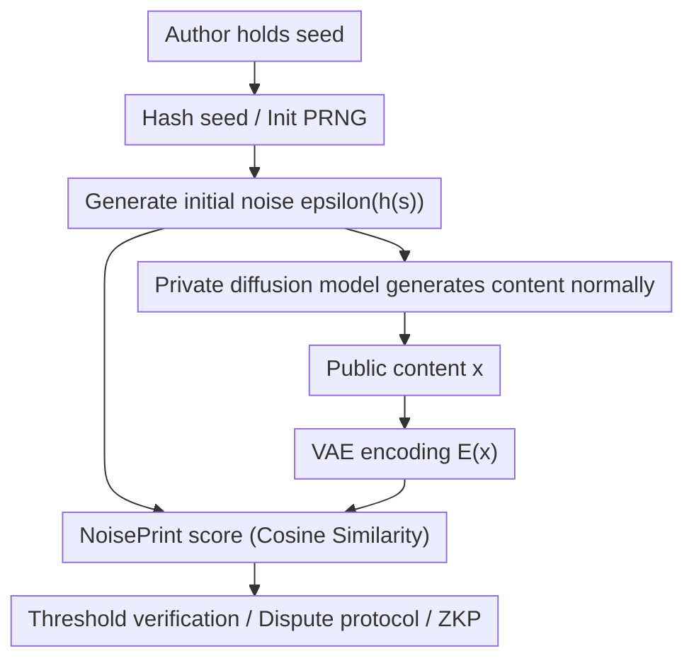

# NoisePrints: Distortion-Free Watermarks for Authorship in Private Diffusion Models

**Conference**: ICLR2026  
**OpenReview**: [https://openreview.net/forum?id=gwHCXvPDBd](https://openreview.net/forum?id=gwHCXvPDBd)  
**Code**: TBD  
**Area**: AI Safety / Generative Watermarking / Copyright Protection  
**Keywords**: Diffusion model watermarking, authorship verification, random seeds, zero-knowledge proofs, copyright protection

## TL;DR
NoisePrints treats the random seed used during diffusion model generation as a natural authorship fingerprint. By generating initial noise via a hashed seed and performing correlation verification with the VAE latent of the generated content, it achieves lightweight authorship verification for images and videos without model modification, sampling changes, or inversion.

## Background & Motivation
**Background**: Image and video diffusion models have become core tools for visual content production, making issues of authorship, copyright ownership, and generative source verification increasingly prominent. Existing watermarking methods generally fall into post-generation embedding, modifying the sampling process or model, or planting specific patterns in the noise/latent space. These usually explicitly embed verifiable signals into the image or reverse-engineer them back to the initial noise.

**Limitations of Prior Work**: These methods are sub-optimal for private diffusion models. Many required access to model weights, inference code, or inversion processes, which private model owners may be reluctant to disclose. Furthermore, model owners may not always be trusted arbiters in copyright disputes. Other methods, while deployable, alter the generative distribution, affect image quality, or require expensive verification processes like DDIM inversion; these costs are further magnified for high-dimensional outputs in video models.

**Key Challenge**: Authorship verification seeks strong watermarks, fast verification, and no disruption to the output distribution; however, traditional approaches typically sacrifice one of these three. Writing extra patterns into an image carries risks of distortion or erasure by regeneration attacks; relying on inversion requires the model and significant compute; relying solely on service provider logs is unsuitable for third-party dispute arbitration.

**Goal**: The paper aims to construct an authorship proof mechanism suitable for private diffusion models: no extra perturbations are inserted during generation, no model weights are needed for verification, and ownership ("was this generated by this seed?") can be determined using only a public encoder, the generated result, and a secret seed held by the author. Furthermore, the goal is to avoid exposing the seed to the verifier to reduce risks of watermark removal or misappropriation.

**Key Insight**: A key observation in this paper is that the initial Gaussian noise of diffusion/flow models does not completely disappear during denoising; instead, it leaves measurable correlation in the final image or video latent. Thus, the random seed itself acts as a natural "noise fingerprint." If this fingerprint is sufficiently stable, the author does not need to embed an additional watermark, but only needs to prove knowledge of the corresponding seed.

**Core Idea**: NoisePrints uses a cryptographically hashed seed to generate initial noise. It uses the cosine similarity between the initial noise and the VAE representation of the generated content as an ownership score. If the score exceeds a threshold calibrated for extremely low false-positive rates, the authorship claim is accepted.

## Method
### Overall Architecture
The generation phase of NoisePrints remains virtually unchanged: the author selects a secret seed, which is first passed through a one-way hash to initialize a PRNG for sampling Gaussian noise. A private diffusion/flow model then generates the image or video normally. The verification phase completely bypasses the private model, sending the candidate content to a public or black-box VAE encoder to obtain a latent representation, which is then correlated with the initial noise regenerated from the seed.

The focus of this workflow is not on writing a watermark into the image, but on turning the "naturally residual correlation between seed and output" into verifiable evidence. A hash function prevents attackers from directly deriving a usable seed from the content; threshold calibration controls the probability of random collisions; a dispute protocol handles geometric transformations and injection-based forgeries; and Zero-Knowledge Proofs (ZKP) are used to prove knowledge of a verified seed without revealing the seed itself.

### Key Designs
**1. Seed-as-watermark: Using initial noise as a distortion-free authorship fingerprint**

Traditional watermarks often require modifying the generative trajectory or output pixels, thereby introducing distribution shifts or needing post-processing embedding. NoisePrints instead exploits existing randomness: the seed undergoes hashing $h(s)$ to initialize a PRNG, yielding initial noise $\epsilon(h(s)) \sim \mathcal{N}(0, I)$, followed by standard denoising by the private model to produce output $x$. Since no extra patterns are inserted and no model weights or sampling steps are changed, the output distribution is theoretically identical to the original model.

The empirical basis for this design is that the similarity between the final content's VAE latent $E(x)$ and the true initial noise is significantly higher than that of random noise. The authors refer to this persistent correlation as a NoisePrint. Crucially for private models, the verifier does not need the diffusion model weights, only the ability to encode the image into a shared latent space and knowledge of the PRNG and hashing rules.

**2. Hashed Seed & Threshold Calibration: Reducing random collision probability to cryptographic levels**

Using raw seeds directly might allow an attacker to search for or construct a seed correlated with target content. The paper thus processes the seed with a cryptographic hash $h(s)$ before initializing the PRNG. The hash must be deterministic, efficient, collision-resistant, preimage-resistant, and produce approximately uniform output, making it difficult for an attacker to back-calculate a valid seed from image content.

The verification score is defined as the cosine similarity between the content latent and the initial noise:

$$
\phi(x, s) = \frac{\langle E(x), \epsilon(h(s)) \rangle}{\|E(x)\|_2 \|\epsilon(h(s))\|_2}.
$$

If $\phi(x, s) \ge \tau$, the verifier accepts the claim. The threshold $\tau$ is not arbitrary but calibrated based on the probability of random high-dimensional vectors falling into a spherical cap. Under independent random seeds, the probability of the inner product exceeding a threshold decreases exponentially with dimensionality; the paper provides an upper bound:

$$
\Pr[\phi \ge \tau] \le \exp\left(-\frac{d-1}{2}\tau^2\right).
$$

In experiments, the threshold is set for a target false-positive rate of $\delta=2^{-128}$, meaning a random seed hit by an attacker is cryptographically infeasible.

**3. Dispute Protocol: Handling geometric transformations and injection forgeries**

Verifying $(x, s)$ alone still faces two edge cases: geometric transformations can disrupt the alignment between content and initial noise, and a watermark injector might find a "pseudo-seed" that passes verification for a modified image. To address this, the paper proposes a dispute protocol: each claimant submits a triplet $(x_i, s_i, g_i)$, where $g_i$ is an optional transformation from a public family (e.g., inverse rotation or cropping).

The extended score is written as:

$$
\phi(x, s; g) = \frac{\langle E(g\cdot x), \epsilon(h(s)) \rangle}{\|E(g\cdot x)\|_2 \|\epsilon(h(s))\|_2}.
$$

The verifier performs both a self-check and a cross-check: the claimant's own content and seed must pass the threshold, and the claimant's seed must also pass the threshold for the opponent's content after applying the submitted transformation. A true author can recover correlation via inverse alignment when facing geometric transformations; an injector, even if able to correlate a modified image with a pseudo-seed, will find it difficult to correlate the original image with that same pseudo-seed.

**4. Zero-Knowledge Proofs: Proving seed ownership without disclosure**

If an author directly hands the seed to a verifier, a leak could allow others to re-claim ownership or remove the watermark more precisely. The paper therefore implements NoisePrint verification as a ZKP circuit: the private witness is the seed, the public inputs are the image and threshold, and the circuit derives the noise from the seed, calculates cosine similarity, and outputs whether it exceeds the threshold.

Furthermore, the authors suggest splitting the seed into a public description string and a private random value. The public string can describe the image and ownership (e.g., "A cat image generated by Company X"), while the private value ensures unguessability. The ZKP thus proves "I know a seed" and binds the proof to specific user or semantic claims.

## Key Experimental Results

### Main Results
The paper first tests verification reliability without attacks. Models include SD2.0, SDXL, Flux.1-schnell, Flux.1-dev, and the video model Wan2.1. All models maintain pass rates of approximately 0.99 to 1.00 at an extremely low false-positive rate of $2^{-128}$.

| Model | Latent Dimension | Mean NoisePrint Score | Threshold $\tau$ | Pass Rate |
|------|-------------|----------------------|-------------|--------|
| SD2.0 | 16,384 | 0.482 ± 0.088 | 0.101739 | 1.00 |
| SDXL | 65,536 | 0.431 ± 0.070 | 0.051000 | 0.99 |
| Flux.1-schnell | 262,144 | 0.197 ± 0.056 | 0.025500 | 0.99 |
| Flux.1-dev | 262,144 | 0.202 ± 0.055 | 0.025500 | 0.99 |
| Wan2.1 | 1,297,920 | 0.0678 ± 0.0247 | 0.011460 | 1.00 |

The second key result is verification speed. Traditional baselines like WIND, PRC, and Gaussian Shading require DDIM inversion; NoisePrints requires only one VAE encoding and one cosine similarity calculation. The cosine similarity itself is on the order of 0.1 ms, avoiding inversion overheads that range from seconds to dozens of seconds.

| Model | VAE Encoding Time | Inversion Time (WIND/PRC/GS) | NoisePrint Cosine Similarity |
|------|--------------|--------------------------|-------------------------|
| SD2.0 50 steps | 0.037 ± 0.004 s | 3.234 ± 0.075 s | 0.182 ± 0.045 ms |
| SDXL 50 steps | 0.152 ± 0.007 s | 12.704 ± 0.303 s | 0.090 ± 0.018 ms |
| Flux-dev 20 steps | 0.158 ± 0.007 s | 33.594 ± 0.245 s | 0.098 ± 0.005 ms |
| Flux-schnell 4 steps | 0.155 ± 0.006 s | 6.673 ± 0.055 s | 0.100 ± 0.011 ms |
| Wan2.1 25 steps | 6.463 ± 0.102 s | 91.473 ± 0.164 s | 0.097 ± 0.010 ms |

### Ablation Study
Rather than a traditional component-removal table, the paper compares the effectiveness of mechanisms against various attack types: basic post-processing, regeneration attacks, targeted inversion attacks, and geometric transformations.

| Scenario / Mechanism | Key Metric | Description |
|-------------|----------|------|
| Verification (No Attack) | Pass Rate 0.99-1.00 | Correlation between true seed and latent is significantly higher than $2^{-128}$ FPR threshold. |
| Basic Image Processing | TPR > 0.9 under most | Brightness, blur, compression, resize, etc., do not completely erase seed correlation. |
| SDEdit Regeneration | Outperforms inversion baselines | Even when regenerating with different base models, NoisePrint maintains a strong verification signal. |
| Geometric + Dispute | 100% Pass after alignment | Rotation, crop & scale attacks are resolved by submitting inverse transforms to restore alignment. |
| Targeted DDIM Attack | Better than baselines, but threatening | Attacks directly minimizing correlation with initial noise serve as a stronger boundary condition. |

### Key Findings
- Correlation between seeds and output latents is stable across various diffusion/flow models; even with the lower average scores of Wan2.1, the massive latent dimensionality allows for lower thresholds while maintaining a 1.00 pass rate.
- Verification speed is the most practical advantage: baselines are bottlenecked by inversion (up to 91 seconds for video); NoisePrints shifts the cost to a single encoding, with the similarity check itself being negligible.
- NoisePrints maintains good TPR under basic post-processing and SDEdit attacks; however, targeted DDIM inversion optimizations suggest that if an attacker specifically optimizes for the correlation score, the signal can be significantly weakened.
- Geometric transformations are handled via explicit alignment in the dispute protocol rather than through raw score robustness, clarifying method boundaries and avoiding over-reliance on a single threshold.

## Highlights & Insights
- **Turning Randomness into Credentials**: The most ingenious aspect is the lack of "embedding"; the paper discovers that the initial noise already leaves a fingerprint in the output. This naturally avoids distribution shifts and controversies over image quality loss.
- **Verification Protocol for Private Models**: By requiring only the seed, output, VAE encoder, and PRNG rules, it does not require third parties to hold private diffusion weights. This is far more realistic for small teams and individual owners than relying on platform logs or open weights.
- **Tight Coupling of Security Analysis and Experiments**: Random seed forgery probabilities are controlled via high-dimensional spherical cap probabilities, while true seed pass rates are verified across models. Together, they justify setting thresholds at $2^{-128}$ FPR.
- **Acting as a First-Stage Filter**: Even if some dispute scenarios require heavier verification, NoisePrints serves as a fast pre-filter to eliminate numerous invalid claims before resorting to expensive inversion or manual audits.

## Limitations & Future Work
- The method depends on verifier access to a suitable VAE encoder. If the VAE is private and the provider is uncooperative, third-party verification is restricted; also, inconsistency across VAE spaces could destabilize scores.
- It is not a general real/fake detector. Real images could be injected with patterns correlated with a specific seed, so NoisePrints is better suited for "proving I generated this" rather than "judging if this was AI-generated."
- The dispute protocol only covers predefined geometric transformation families. Complex quality-preserving edits, local in-painting, or semantic-level recreations might preserve appearance while destroying the original NoisePrint, which remains an open problem.
- There is a gap between authorship and semantic variants. If a video or image is only semantically similar but significantly different in pixels/latent, NoisePrints is unsuitable for tracing ownership of such "inspirations" or "derivative works."

## Related Work & Insights
- **vs WIND / PRC / Gaussian Shading**: These rely on noise or latent watermarks verified via inversion, which is robust but expensive and requires model access. NoisePrints avoids inversion for lightweight verification but relies more on natural seed-latent correlation.
- **vs Post-hoc Image Watermarking**: Post-processing watermarks are easy to deploy but vulnerable to regeneration, compression, or steganalysis. NoisePrints binds to the initial randomness of the generative process without hiding patterns in pixels, making it harder to remove via simple averaging or template extraction.
- **vs Platform Logs / API-side Auditing**: Platform logs can prove an API call, but require the provider to be trusted and constantly available. NoisePrints places the proof materials in the hands of the creator, making it more suitable for private models and third-party dispute resolution.

## Rating
- Novelty: ⭐⭐⭐⭐⭐ Transforming the natural correlation between diffusion seeds and output latents into a watermark signal is a concise and distinctive approach.
- Experimental Thoroughness: ⭐⭐⭐⭐ Broad coverage across models, image/video, post-processing, regeneration, and targeted attacks; however, semantic editing and cross-VAE scenarios could be expanded.
- Writing Quality: ⭐⭐⭐⭐ Threat models, protocols, security analysis, and experimental logic are clear, though some details depend on the appendix.
- Value: ⭐⭐⭐⭐⭐ Authorship proof for private models is a high-demand scenario; the lightweight, distortion-free, and complementary nature of the method offers high practical potential.

<!-- RELATED:START -->

## Related Papers

- [\[ICLR 2026\] EigenScore: OOD Detection using Posterior Covariance in Diffusion Models](eigenscore_ood_detection_using_posterior_covariance_in_diffusion_models.md)
- [\[ICLR 2026\] Traceable Black-box Watermarks for Federated Learning](traceable_black-box_watermarks_for_federated_learning.md)
- [\[CVPR 2026\] GROW: Watermark Generation with Progressive Guidance for Diffusion Models](../../CVPR2026/ai_safety/grow_watermark_generation_with_progressive_guidance_for_diffusion_models.md)
- [\[CVPR 2026\] Towards Human-Imperceptible Backdoor Attacks on Text-to-Image Diffusion Models](../../CVPR2026/ai_safety/towards_human-imperceptible_backdoor_attacks_on_text-to-image_diffusion_models.md)
- [\[ACL 2025\] Quantifying Misattribution Unfairness in Authorship Attribution](../../ACL2025/ai_safety/quantifying_misattribution_unfairness_in_authorship_attribution.md)

<!-- RELATED:END -->
