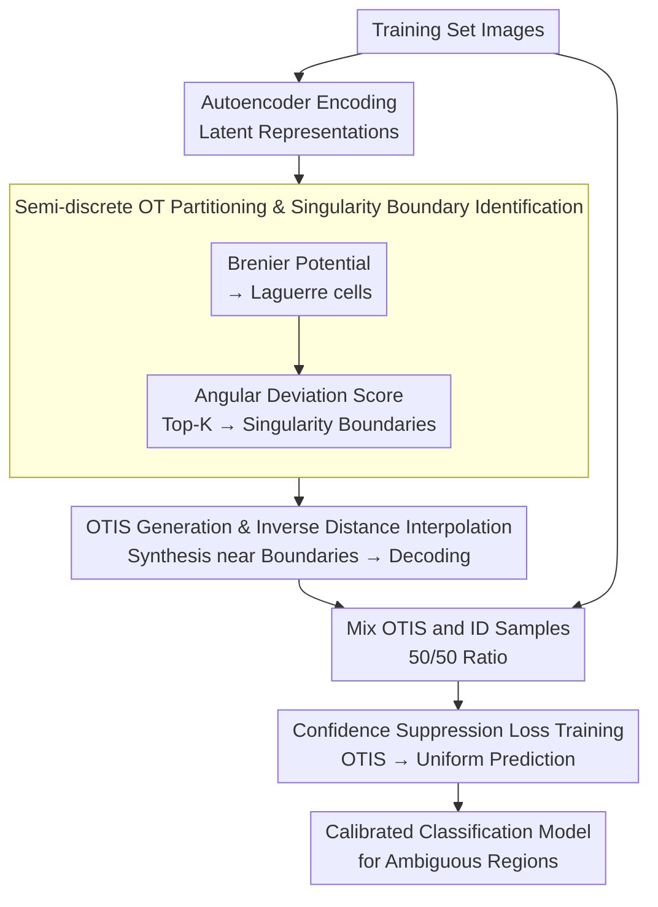

# Optimal Transport-Induced Samples against Out-of-Distribution Overconfidence

**Conference**: ICLR 2026  
**arXiv**: [2601.21320](https://arxiv.org/abs/2601.21320)  
**Code**: None  
**Area**: LLM Evaluation  
**Keywords**: optimal transport, OOD overconfidence, singularity boundaries, confidence calibration, OTIS

## TL;DR

This work leverages the geometric singularity boundaries of semi-discrete Optimal Transport (OT) to locate semantically ambiguous regions and generates proxy OOD samples (OTIS) near these boundaries. By employing a confidence suppression loss during training, the model is forced to produce uniform predictions in structurally uncertain areas, systematically mitigating the OOD overconfidence issue in DNNs.

## Background & Motivation

**Background**: Deep Neural Networks (DNNs) have achieved significant success in closed-set classification tasks but often produce high-confidence erroneous predictions when encountering out-of-distribution (OOD) inputs in open-world deployments. Existing mitigation strategies mainly fall into two categories: test-time OOD detection (e.g., filtering based on confidence scores like MSP or ODIN) and training-time exposure to proxy OOD samples to suppress overconfidence.

**Limitations of Prior Work**: Test-time detection methods only treat the "symptoms" by filtering high-confidence errors without addressing the model's underlying tendency to generate such overconfident predictions. While training-time methods are more proactive, the construction of proxy OOD samples typically relies on heuristic rules (e.g., external datasets, input corruption, manifold mixup, latent space outlier synthesis). These lack a theoretical foundation and struggle to precisely cover semantically ambiguous regions—precisely where overconfidence is most likely to occur.

**Key Challenge**: There is a disconnect between the generation of existing proxy OOD samples and the decision boundary regions where models are genuinely prone to errors. Heuristically generated samples may be scattered throughout the feature space rather than focusing on structurally unstable regions where classifier behavior is most unreliable.

**Goal**: (1) How to theoretically identify regions where classifiers are most prone to overconfidence? (2) How to generate proxy OOD samples precisely located near semantic boundaries based on theoretical guidance? (3) How to effectively utilize these samples for training regularization?

**Key Insight**: Starting from the geometric theory of semi-discrete Optimal Transport (OT), the authors discover that the singularity boundaries of OT mappings—points where the transport direction changes abruptly—naturally correspond to semantically ambiguous regions. Near these boundaries, the classifier's decision behavior is most unstable, and overconfidence is most likely to arise.

**Core Idea**: By solving a semi-discrete OT problem to obtain a Laguerre partition of the latent space, semantically ambiguous samples (OTIS) are generated via interpolation near the singularity boundaries where transport directions shift most drastically. These samples are then used for confidence suppression during training.

## Method

### Overall Architecture

The goal is to address the issue of classifiers providing high-confidence wrong predictions on semantically ambiguous inputs. While previous proxy OOD sample generation relied on heuristic rules that fail to pinpoint error-prone boundary regions, the authors transform the problem of "where overconfidence is most likely" into a geometric singularity localization problem within semi-discrete OT.

The pipeline follows three steps: first, an autoencoder compresses training samples into a compact latent space; second, semi-discrete OT is solved in the latent space to identify singularity boundaries with high transport direction variance, where proxy OOD samples (OTIS) are synthesized via interpolation; finally, OTIS are mixed with ID training data to train the classifier using a confidence suppression loss. The input consists of training set images, and the output is a calibrated classification model.

### Key Designs

**1. Latent Representations: Moving OT Computation to Low Dimensions**

Directly solving OT in the high-dimensional raw input space is computationally intractable and irregular. The first step uses an autoencoder for dimensionality reduction. The encoder $y = Enc(x)$ maps each training sample to a latent vector, while the decoder $x' = Dec(y)$ reconstructs points from the latent space. The set of latent vectors $\{y_i\}$ forms the support points of the discrete target measure in the subsequent OT problem. The compact and regular structure of the latent space makes OT feasible and provides a smooth geometric basis for interpolation.

**2. Semi-discrete OT Partitioning and Singularity Identification: Using Angular Deviation to Find Transport Direction Shifts**

This step is the theoretical core. Given a continuous source distribution $\mu$ (e.g., Gaussian) and discrete targets $\{y_i\}$, the Brenier potential function is solved:

$$u_{\mathbf{h}}(z) = \max_i \{\langle y_i, z \rangle + h_i\}$$

Its gradient serves as the optimal transport mapping, "moving" the source distribution to the target points. This potential function partitions the latent space into a set of convex regions called Laguerre cells, where each cell corresponds to a target point $y_i$. During computation, Monte Carlo sampling estimates the volume of each cell, and gradient descent optimizes the offsets $\mathbf{h}$ to match cell volumes with target weights.

The key is identifying "singular" boundaries. For each boundary $\mathcal{S}_{ij}$ between adjacent cells, an angular deviation score is calculated between the target vectors on both sides:

$$\text{score}(\mathcal{S}_{ij}) = \arccos\left(\frac{\langle y_i, y_j \rangle}{\|y_i\| \|y_j\|}\right)$$

Only the boundaries with the highest scores are retained in the singularity boundary set $\mathcal{S}'$. A large angular deviation indicates a sharp turn in transport direction, corresponding to a discontinuity (singularity) in the OT mapping. Geometrically, these unstable regions correspond to semantic ambiguity—inputs falling here possess features from multiple classes, making them prime locations for overconfidence.

**3. OTIS Generation and Inverse Distance Interpolation: Smooth Sample Synthesis Near Singularity Boundaries**

Once singularity boundaries are fixed, proxy OOD samples are synthesized nearby. For each selected boundary $\mathcal{S}_{ij}$, the centroids $\hat{c}_i, \hat{c}_j$ of the adjacent Laguerre cells are estimated via Monte Carlo. A latent point $z \sim \mu$ is sampled from the source distribution, and weight calculation follows inverse distance interpolation:

$$\lambda_i = \frac{1/\|z - \hat{c}_i\|}{1/\|z - \hat{c}_i\| + 1/\|z - \hat{c}_j\|}$$

The interpolated latent vector is $\hat{y} = \lambda_i T(\hat{c}_i) + \lambda_j T(\hat{c}_j)$, which is finally decoded into the input space $\hat{x} = Dec(\hat{y})$. Inverse distance interpolation provides a smooth extension of the OT mapping near the singularity boundaries, avoiding artifacts from discrete jumps and ensuring samples are semantically coherent yet naturally positioned transition zones between classes.

### Loss & Training

Each training batch consists of 50% ID samples and 50% OTIS. ID samples follow the standard cross-entropy loss, while OTIS utilize a confidence suppression loss:

$$\mathcal{L}_{\text{sup}}(\hat{x}) = \sum_{i=1}^{K} \frac{1}{K} \log V_i(\hat{x})$$

where $V_i(\hat{x})$ is the softmax probability for class $i$. This loss encourages the model to output predictions close to a uniform distribution on OTIS, effectively communicating "uncertainty" and suppressing overconfidence in structurally ambiguous regions during training rather than relying on test-time filtering.

## Key Experimental Results

### Main Results

Evaluations were conducted using CIFAR-10/100, SVHN, MNIST, and FMNIST as ID datasets, with various natural, adversarial, and noise datasets as OOD inputs. Critical metrics include OOD Max Mean Confidence (OOD MMC↓) and ID Max Mean Confidence (ID MMC↑).

| ID Dataset | OOD Dataset | Ours | CEDA | ACET | CCUs | CODES | VOS |
|------------|-------------|-----------|------|------|------|-------|-----|
| CIFAR-10 | SVHN | **13.18%** | 71.62% | 82.16% | 72.48% | 72.35% | 73.16% |
| CIFAR-10 | CIFAR-100 | **64.79%** | 80.18% | 82.36% | 75.95% | 74.69% | 81.04% |
| CIFAR-10 | Uniform | **10.00%** | 10.04% | 10.00% | 10.00% | 11.13% | 80.65% |
| CIFAR-10 | Adv. Noise | **26.42%** | 43.04% | 10.00% | 10.00% | 37.66% | 95.56% |
| CIFAR-100 | SVHN | **9.30%** | 63.03% | 62.85% | 65.49% | 66.11% | 58.76% |
| SVHN | CIFAR-10 | **61.37%** | 73.70% | 62.54% | 46.92% | 61.09% | 71.39% |

The proposed method significantly reduces OOD MMC across most ID/OOD combinations while maintaining ID accuracy and ID MMC comparable to baselines.

### Ablation Study

| Configuration | CIFAR-10 TE | CIFAR-10 OOD MMC (SVHN) | Description |
|---------------|-------------|-------------------------|-------------|
| No Regularization (Baseline) | 5.79% | 84.22% | No OOD exposure |
| OE (External Data) | 6.80% | 55.82% | Requires additional OOD data |
| CCUd (External Data) | 5.55% | 76.52% | Requires additional OOD data |
| **Ours (No External Data)** | **7.52%** | **13.18%** | No external data required |

### Key Findings

- **OTIS leads among methods without external data**: In classic settings like SVHN→CIFAR-10, OOD MMC dropped from 84% to 13%, a reduction of over 70 percentage points.
- **Effective against adversarial samples**: In Adversarial Noise and Adversarial Samples benchmarks, the proposed method's OOD MMC is significantly lower than most competitors.
- **Controllable ID accuracy loss**: Test error increased only slightly (e.g., from 5.79% to 7.52% on CIFAR-10), indicating that OT-guided regularization does not excessively interfere with ID learning.
- **Good generalization across datasets**: Consistent advantages were demonstrated on distinct datasets such as MNIST and FMNIST.

## Highlights & Insights

- **Theoretical correspondence between OT singularity and semantic ambiguity**: This is the core insight—establishing a theoretical link between geometric singularities in semi-discrete OT and overconfidence regions in classifiers, providing a principled alternative to heuristic OOD sample generation.
- **High-quality proxy OOD generation without external data**: Unlike methods like OE that depend on extra datasets, OTIS is derived entirely from the geometric structure of the training data, making it suitable for data-constrained scenarios.
- **Smooth transport extension via inverse distance interpolation**: This elegantly addresses the discontinuity of OT mappings at singularity boundaries while maintaining the semantic coherence of generated samples.

## Limitations & Future Work

- **Computational Overhead**: The pipeline requiring autoencoder training, OT solving, and OTIS generation is complex; scalability for large-scale datasets remains to be verified.
- **Impact of Latent Dimensionality**: The quality of OT partitioning is directly affected by autoencoder latent space quality, but the paper lacks an extensive sensitivity analysis on this.
- **Limited to Classification**: The current framework is designed for multi-class problems; extension to regression or segmentation tasks is unclear.
- **Hyperparameter for Singularity Boundary Selection**: The proportion of high-score boundaries to retain is a hyperparameter requiring tuning; improper selection may affect sample quality.

## Related Work & Insights

- **vs OE (Outlier Exposure)**: OE relies on external OOD datasets with unprincipled sample selection; Ours derives proxy OOD from the training data's OT geometry, requiring no external data and offering stronger theoretical grounding.
- **vs VOS (Virtual Outlier Synthesis)**: VOS samples outliers in latent space without considering relationship to decision boundaries; OTIS precisely targets singularity boundaries where ambiguity resides.
- **vs CEDA/ACET**: These methods construct proxy OOD via input corruption, which may result in samples far from actual semantic boundaries; OTIS uses OT geometry to generate samples directly in class transition zones.

## Rating

- Novelty: ⭐⭐⭐⭐⭐ Introduces OT singularity boundaries to OOD overconfidence mitigation with a unique perspective and rigorous theoretical support.
- Experimental Thoroughness: ⭐⭐⭐⭐ Covers 6 ID datasets and diverse OOD types, though validation on large-scale datasets (e.g., ImageNet) is missing.
- Writing Quality: ⭐⭐⭐⭐ Mathematical derivations are clear and rigorous, though the pipeline description is complex and requires OT background.
- Value: ⭐⭐⭐⭐ Provides a principled approach to overconfidence, though computational complexity may limit practical application.

<!-- RELATED:START -->

## Related Papers

- [\[CVPR 2026\] Bypassing the Transport Plan: Dynamic Reweighting for Out-of-Distribution Detection with Optimal Transport](../../CVPR2026/ai_safety/bypassing_the_transport_plan_dynamic_reweighting_for_out-of-distribution_detecti.md)
- [\[ICLR 2026\] AP-OOD: Attention Pooling for Out-of-Distribution Detection](ap-ood_attention_pooling_for_out-of-distribution_detection.md)
- [\[ICLR 2026\] GradPCA: Leveraging NTK Alignment for Reliable Out-of-Distribution Detection](gradpca_leveraging_ntk_alignment_for_reliable_out-of-distribution_detection.md)
- [\[ICLR 2026\] SCOPED: Score–Curvature Out-of-Distribution Proximity Evaluator for Diffusion](scoped_scorecurvature_out-of-distribution_proximity_evaluator_for_diffusion.md)
- [\[ICML 2026\] Optimal Transport under Group Fairness Constraints](../../ICML2026/ai_safety/optimal_transport_under_group_fairness_constraints.md)

<!-- RELATED:END -->
