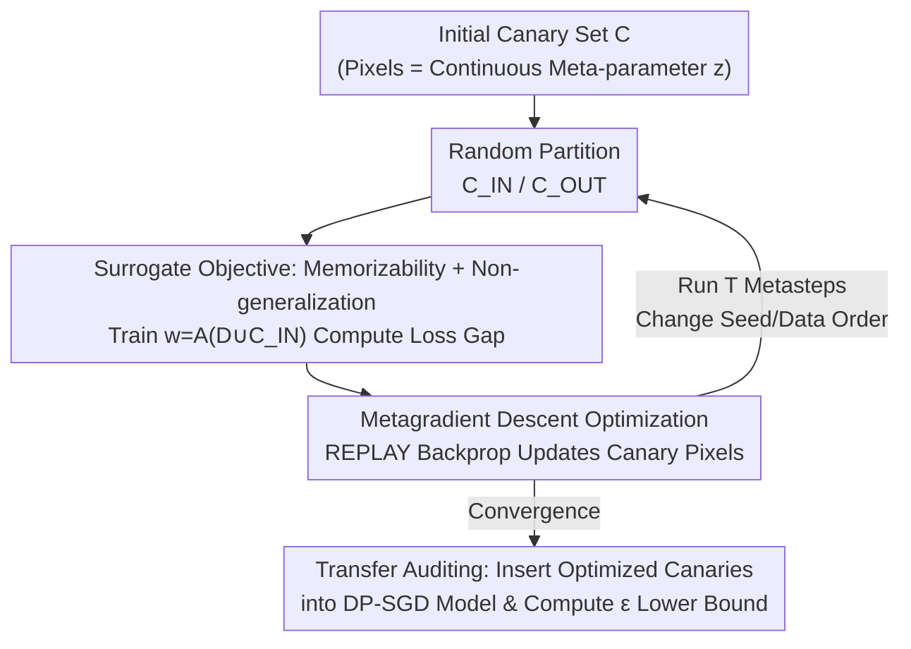

# Optimizing Canaries for Privacy Auditing with Metagradient Descent

**Conference**: ICLR 2026  
**OpenReview**: [https://openreview.net/forum?id=3xkYXuHDA6](https://openreview.net/forum?id=3xkYXuHDA6)  
**Code**: To be confirmed (Paper promises a public repository for the final version)  
**Area**: AI Security / Differential Privacy / Privacy Auditing  
**Keywords**: Differential Privacy, DP-SGD, Privacy Auditing, Canary Optimization, Metagradient

## TL;DR
This paper employs metagradient descent to directly optimize the set of canaries (probe samples) used in privacy auditing. In black-box, single-training differential privacy (DP) auditing scenarios, this approach improves the empirical privacy lower bound $\varepsilon$ by several times compared to existing random or mislabeled canaries, relying solely on the final model output.

## Background & Motivation
**Background**: Differential Privacy (DP) provides rigorous privacy guarantees for machine learning, with DP-SGD serving as the de facto standard for training private deep models. It applies norm clipping and Gaussian noise to per-sample gradients at each step to obtain theoretical $(\varepsilon, \delta)$ upper bounds. However, theoretical bounds are often conservative and overestimate actual leakage. Consequently, researchers use "privacy auditing" to provide empirical lower bounds: an auditor inserts specially crafted samples (canaries) into the training set, performs Membership Inference Attacks (MIA) after training to guess which canaries were used, and derives a lower bound for $\varepsilon$ based on the success rate.

**Limitations of Prior Work**: Early auditing required running DP-SGD hundreds or thousands of times, which is prohibitively expensive. Subsequent "single-training auditing" (Steinke et al., Mahloujifar et al.) reduced the cost to a single training run, but **the strength of the audit depends heavily on the quality of the canary set**. Historically, almost all work simply used random samples from the training set or randomly mislabeled images as canaries, without investigating whether these canaries were near-optimal. This is especially true in the realistic **black-box, last-iterate setting**, where auditors cannot see intermediate training states or modify gradients and can only observe the final model.

**Key Challenge**: Auditing effectiveness depends on the model's ability to "memorize without generalizing" the canaries. However, canary selection is a high-dimensional ($C\in\mathbb{R}^{m\times 32\times 32\times 3}$ for CIFAR-10) discrete design space that eludes exhaustive search. Furthermore, the auditing objective function contains non-differentiable components like thresholding, making standard gradients inapplicable.

**Goal**: To transform "canary selection" from heuristic sampling into an optimization problem—finding a set of canaries that maximizes the empirical lower bound under a fixed auditing algorithm.

**Key Insight**: The authors noted that the properties of a "good canary"—namely, having low loss if included in training (memorizability) and high loss if not (non-generalization)—can be formulated as a **differentiable surrogate objective**. By utilizing the REPLAY scalable metagradient method proposed by Engstrom et al. (2025), one can directly compute gradients with respect to the canary pixels.

**Core Idea**: Use metagradient descent to "train" canaries directly in pixel space based on a surrogate objective tailored for privacy auditing. Optimization is performed on a **small non-private model**, and the resulting canaries are then transferred to larger models trained with DP-SGD.

## Method

### Overall Architecture
The method addresses how to optimize the canary set $C$ to maximize the auditing lower bound. Since directly taking gradients of the auditing algorithm $\text{BBaudit}(\tau, \delta, A, D, C) \to \tilde\varepsilon$ is unfeasible (due to non-differentiable thresholds and the need for fine-grained training access), the authors decompose the pipeline: first, approximate the auditing goal with a differentiable **surrogate objective**, and then use **metagradients** to derive gradients for canary pixels to update them iteratively.

Specifically, each canary is embedded as a continuous meta-parameter $z$. Other elements like training data and optimizer hyperparameters are "baked" into the learning algorithm $A$. Thus, the trained model is $w = A(z)$. A scalar metric $\phi(w)$ is computed, and the metagradient $\nabla_z \phi(A(z))$ provides the gradient for the canary pixels. The optimization loops over $T$ metasteps: each step randomly partitions the current canaries into $C_{\text{IN}}$ and $C_{\text{OUT}}$, adds $C_{\text{IN}}$ to the training set to train a (non-private) model, calculates the loss gap of the surrogate objective, and uses REPLAY to backpropagate and update the canaries. The optimization is conducted on a lightweight ResNet-9, and the converged canaries are **transferred** to audit a large model (Wide ResNet) trained with DP-SGD.

### Key Designs

**1. Privacy Auditing Surrogate Objective: Formulating "Memorizability + Non-generalization" as a Differentiable Loss Gap**

The true auditing objective $\text{BBaudit}$ is non-differentiable. The authors leverage the intrinsic link between black-box auditing and MIA: auditing involves randomly splitting canaries into $C_{\text{IN}}$ and $C_{\text{OUT}}$, training a model with $C_{\text{IN}}$, and using MIA to distinguish them. For this to succeed, a good canary should satisfy **memorizability** (low loss when $z_i \in C_{\text{IN}}$) and **non-generalizability** (high loss when $z_i \in C_{\text{OUT}}$). These are combined into a surrogate objective:

$$\phi(w)=\sum_{i=1}^{m}\big(\mathbb{1}\{z_i\in C_{\text{IN}}\}-\mathbb{1}\{z_i\in C_{\text{OUT}}\}\big)\cdot L(w,z_i),$$

where $L$ is the cross-entropy loss. Maximizing $\phi$ simultaneously minimizes the loss of included samples and maximizes the loss of excluded samples, widening the loss gap—the exact signal exploited by black-box scoring functions. This replaces a non-differentiable target with a differentiable scalar aligned with MIA.

**2. Metagradient Descent for Canary Pixels: Differentiating Through the Training Process**

Since $\phi$ depends on the **trained** model $w=A(z)$, taking a gradient with respect to $z$ requires backpropagating through the entire training process. The authors utilize **REPLAY** (Engstrom et al., 2025), which provides memory-efficient, large-scale metagradients via explicit automatic differentiation. Optimization follows Algorithm 4: initialize $m$ canaries, loop for $N$ steps, randomly partition $C_{\text{IN},t}/C_{\text{OUT},t}$ and sample model initialization/data order to define $A$, train $w_t$, compute $\phi(w_t)$, and update canaries via $\nabla_{C_t}$. The chain rule is used to correctly combine the direct and indirect dependence of $\phi$ on $z$.

**3. Cross-Algorithm and Cross-Scale Transferability**

Computing metagradients directly on the audited DP-SGD process is difficult due to gradient clipping/noise and high computational costs. The authors **decouple optimization and auditing**: they produce canaries using a "standard, non-private" lightweight algorithm (SGD on ResNet-9) and then use these canaries to audit the target DP-SGD Wide ResNet. This works because "memorizability and non-generalizability" are intrinsic properties of the samples, independent of the specific training algorithm or model size. This makes the method **DP-SGD agnostic and computationally efficient**.

### Loss & Training
The optimization target is the surrogate function $\phi$ (loss gap). Auditing uses either Steinke et al. 2023 (per-canary guessing) or Mahloujifar et al. 2024 (paired guessing with hypothesis testing). The scoring function is negative cross-entropy. Canary set size $m=1000$, $\delta=10^{-5}$.

## Key Experimental Results

### Main Results
Auditing Wide ResNet 16-4 on CIFAR-10/100, MNIST, and Fashion-MNIST using DP-SGD (from scratch) and DP Finetuning. Representative empirical $\tilde\varepsilon$ for $\varepsilon=8$ under the Mahloujifar protocol (Table 2):

| Dataset / Training | Ours (Metagradient) | Random | Random Mislabeled |
|---------------|-------------------|--------|-------------------|
| CIFAR-10 / DP Training | **0.732** | 0.405 | 0.225 |
| CIFAR-10 / DP Finetuning | **1.207** | 0.687 | 0.632 |
| CIFAR-100 / DP Finetuning | **1.286** | 0.354 | 0.187 |
| MNIST / DP Finetuning | **1.465** | 0.321 | 0.099 |
| Fashion-MNIST / DP Finetuning | **1.483** | 0.056 | 0.398 |

In high privacy budget regions, the optimized canaries generally improve the lower bound by over 2x.

### Ablation Study / Analysis

| Configuration | Observation |
|------|------|
| Low Privacy Budget ($\varepsilon=1$) | Gains become unstable or approach zero as noise masks memory signals. |
| ClipBKD (Comparison) | Ineffective for single-training auditing; originally designed for single canary construction in multiple-run audits. |
| Gradient Max (Comparison) | Strong performance, competing with ours; superior on CIFAR-10 but inferior on MNIST/Fashion-MNIST. |

### Key Findings
- **Transferability is a core advantage**: Canaries optimized on a small non-private ResNet-9 remain effective on large Wide ResNets trained with DP-SGD.
- **DP Finetuning scenarios see the largest gains**, pushing lower bounds to 1.2~1.5.
- **Tighter privacy budgets are harder to audit**: At $\varepsilon=1$, noise overwhelms the signal, representing a ceiling for current black-box methods.

## Highlights & Insights
- **Heuristic to Optimization**: Transforms the "random/mislabeled" default into a systematic optimization problem.
- **Elegant Surrogate Objective**: A simple loss gap formula captures the necessary membership inference properties.
- **Engineering Efficiency**: Decoupling allows for "small model probe generation, large model auditing," saving significant compute.
- **REPLAY Application**: Demonstrates the utility of metagradients for optimizing training data pixels rather than just hyperparameters.

## Limitations & Future Work
- **Ineffective at low $\varepsilon$**: The improvement is unstable for strict privacy regimes ($\varepsilon \le 1$).
- **Suboptimal Surrogate**: Competition with "Gradient Max" suggests the current objective can be improved by integrating gradient norm terms.
- **Modal Scope**: Evaluation is limited to image classification; discrete data like text tokens require different approaches.
- **Tightness Gap**: A significant gap remains between empirical $\tilde\varepsilon$ and theoretical $\varepsilon$ bounds.

## Related Work & Insights
- **vs. Steinke et al. / Mahloujifar et al.**: Ours does not change the "protocol" but serves as a plug-and-play enhancement for "what canaries to insert."
- **vs. Nasr et al.**: While white-box auditing provides higher bounds, ours adheres to the more realistic black-box last-iterate setting.
- **vs. Engstrom et al.**: Adapts the REPLAY metagradient tool specifically for the objective of privacy auditing.

## Rating
- Novelty: ⭐⭐⭐⭐
- Experimental Thoroughness: ⭐⭐⭐⭐
- Writing Quality: ⭐⭐⭐⭐
- Value: ⭐⭐⭐⭐

<!-- RELATED:START -->

## Related Papers

- [\[ICLR 2026\] Beyond Membership: Limitations of Add/Remove Adjacency in Differential Privacy](beyond_membership_limitations_of_addremove_adjacency_in_differential_privacy.md)
- [\[NeurIPS 2025\] Sequentially Auditing Differential Privacy](../../NeurIPS2025/ai_safety/sequentially_auditing_differential_privacy.md)
- [\[ICLR 2026\] Adaptive Methods Are Preferable in High Privacy Settings: An SDE Perspective](adaptive_methods_are_preferable_in_high_privacy_settings_an_sde_perspective.md)
- [\[ICLR 2026\] Differentially Private Two-Stage Gradient Descent for Instrumental Variable Regression](differentially_private_two-stage_gradient_descent_for_instrumental_variable_regr.md)
- [\[ICLR 2026\] Person-Centric Annotations of LAION-400M: Auditing Bias and Its Transfer to Models](person-centric_annotations_of_laion-400m_auditing_bias_and_its_transfer_to_model.md)

<!-- RELATED:END -->
