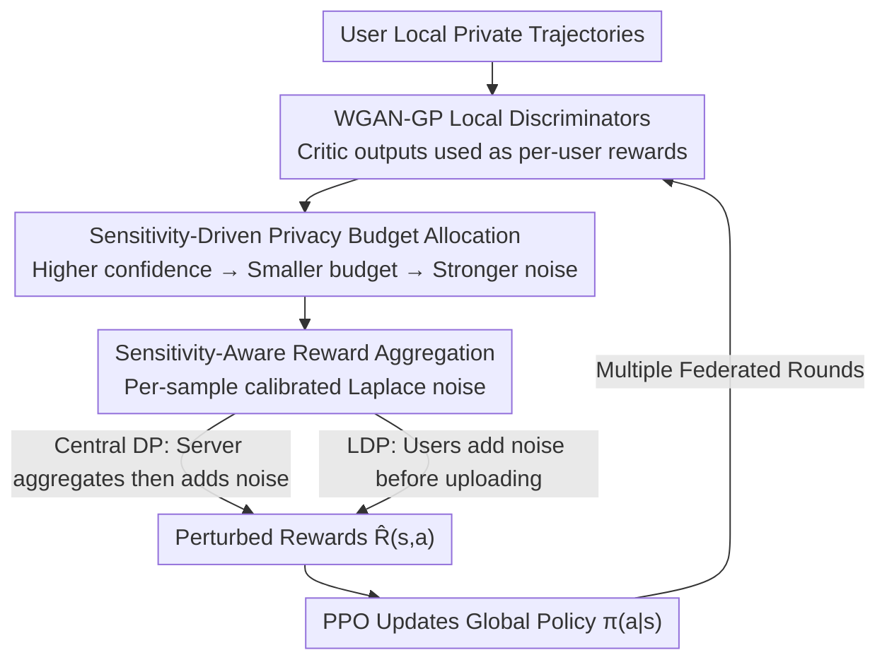

# PateGAIL++: Utility Optimized Private Trajectory Generation with Imitation Learning

**Conference**: ICLR 2026  
**OpenReview**: [https://openreview.net/forum?id=Oyfz6G0hmc](https://openreview.net/forum?id=Oyfz6G0hmc)  
**Code**: TBD  
**Area**: AI Safety / Differential Privacy / Imitation Learning  
**Keywords**: Differential Privacy, Trajectory Generation, Imitation Learning, Federated Learning, Membership Inference Attack  

## TL;DR
PateGAIL++ dynamically allocates the privacy budget based on "per-sample privacy sensitivity" within a federated differential privacy imitation learning framework, injects adaptive Laplace noise, and utilizes WGAN-GP to stabilize policy training under discrete trajectories. This significantly improves the "privacy-utility" tradeoff of synthetic mobility trajectories under the same privacy budget and renders membership inference attacks nearly equivalent to random guessing.

## Background & Motivation
**Background**: Human mobility trajectory data is valuable for urban planning, intelligent transportation, and public safety. However, raw GPS trajectories can expose home addresses, routines, and social relationships, making them difficult to release directly. A mainstream privacy-enhancing solution is to use deep generative models to synthesize realistic trajectories to replace real data, where Differential Privacy (DP) is regarded as the gold standard for provable privacy. Representative works include PATE-GAN, which integrates GAN with PATE teacher ensembles, and PATEGAIL, which introduces DP into Generative Adversarial Imitation Learning (GAIL) policy training and adopts federated deployment.

**Limitations of Prior Work**: Existing DP trajectory generation methods apply a "one-size-fits-all" approach by injecting noise of the same intensity to all data points, regardless of the sample's inherent privacy risk. However, trajectory risks are non-uniform—trajectory segments that are unique in behavior or have low overlap with others are more likely to lead to individual identification, while common trajectories that follow the crowd are inherently less sensitive. Uniform noise over-perturbs low-risk samples, causing unnecessary utility loss, while under-protecting high-risk samples, resulting in a poor overall tradeoff and difficulty in scaling to large-scale heterogeneous data.

**Key Challenge**: The privacy budget is a fixed and limited resource (total $\varepsilon$ is constant), while "per-sample risk" varies significantly. Spending the budget equally across samples regardless of risk is equivalent to allocating protection where it is not needed.

**Goal**: To learn a global trajectory generation policy $\pi(a|s)$ under federated and DP constraints, such that the synthetic trajectories are statistically realistic enough to support downstream prediction/recommendation (utility) while satisfying $(\varepsilon, \delta)$-DP (where the inclusion of any single user's trajectory does not significantly affect the output). This requires addressing three challenges: C1: How to allocate the budget according to data sensitivity; C2: How to provide formal DP proofs under non-uniform noise; C3: How to stabilize federated policy training under adaptive noise.

**Key Insight**: The authors notice that the "authenticity score" assigned by the local discriminator to generated samples is itself an endogenous sensitivity signal—the closer the score is to 1, the more the state-action pair resembles a user's unique real behavior, and thus the more dangerous it is. Using internal model signals rather than external semantic labels to measure sensitivity allows for per-sample budget allocation without breaking the DP account by introducing non-private information.

**Core Idea**: Use "per-sample sensitivity derived from discriminator confidence" to non-uniformly allocate the privacy budget and noise scale, concentrating protection on truly high-risk trajectory segments. This improves both privacy and utility under a fixed total budget.

## Method

### Overall Architecture
PateGAIL++ follows the federated data access model: each user device retains its private trajectory and trains a local discriminator $D_{\phi_u}$ to evaluate the credibility of synthetic trajectories. The server does not access raw trajectories; it only receives reward signals perturbed via differential privacy to update the global policy $\pi(a|s)$. The entire pipeline loops in every federated communication round: local discriminators score each state-action pair $(s,a) \rightarrow$ the sensitivity module calculates a privacy budget share for each sample based on these scores $\rightarrow$ the server aggregates rewards from users and adds noise using a "sensitivity-aware Laplace mechanism" $\rightarrow$ the global policy is updated via PPO using the perturbed rewards $\hat R(s,a)$ until convergence. The discriminator side uses a WGAN-GP critic instead of the original cross-entropy-based discriminator to ensure smoother gradients for discrete trajectories. The framework can also switch to LDP mode: users add noise to rewards locally before uploading, so the server never sees the raw rewards.

### Key Designs

**1. Sensitivity-Driven Privacy Budget Allocation: Less budget and more noise for high-risk samples**

This is the core of the paper, directly addressing the "uniform noise" issue. The authors measure the privacy risk of each sample using the local discriminator's output: if $D_{\phi_u}(s,a) \approx 1$, it indicates the generated sample is nearly indistinguishable from a user's real behavior, often corresponding to rare or unique patterns that are more easily targeted by inference attacks. Thus, sensitivity is defined as inversely proportional to the "confidence margin to 1": $\text{Sensitivity}(s,a) \propto \frac{1}{1-\hat R(s,a)+\delta'}$, where $\delta'>0$ prevents division by zero. A per-sample budget is then assigned: $\varepsilon(s,a)=\frac{\varepsilon\cdot w(s,a)}{\sum_{(s',a')} w(s',a')}$, with weights $w(s,a)=1-\hat R_p(s,a)+\delta'$. Key detail: $\hat R_p$ used here is a **differentially private pilot estimate** of $\hat R$ to avoid leaking information by using true rewards for budget allocation. The sum of all sample budgets is constrained to the total budget $\sum_{(s,a)}\varepsilon(s,a)=\varepsilon$, redistributing within a fixed ledger. High-confidence (more sensitive) samples receive a smaller $\varepsilon$ and stronger noise, while low-risk samples receive less noise to preserve utility. The authors emphasize that sensitivity depends only on internal model signals and does not introduce external semantics like location types or home/work labels, which would rely on non-private information and break the end-to-end DP accounting.

**2. Sensitivity-Aware Reward Aggregation and Formal DP Guarantees: Implementing per-sample budgets into noise scales**

Once per-sample budgets are determined, they must be implemented during aggregation with provable DP (Challenge C2). The server aggregates user rewards using a sensitivity-aware Laplace mechanism: $R(s,a)=\frac{1}{N}\sum_{u=1}^N R^{(u)}(s,a)+\mathrm{Lap}\!\left(\frac{\Delta f}{\varepsilon(s,a)}\right)$. The noise scale $\frac{\Delta f}{\varepsilon(s,a)}$ adapts to the sample budget—smaller budget leads to larger noise. When the budget is uniformly allocated, it degrades to the fixed $\lambda$ of the original PATEGAIL. To handle variance across user rewards, the dynamic compensation term from PATEGAIL is retained: $\hat R(s,a)=R(s,a)-\beta\cdot\xi(s,a)$, where $\xi(s,a)=\sqrt{\mathrm{Var}(R^{(u)}(s,a))+\mathrm{Lap}(0,\frac{\Delta f}{\varepsilon(s,a)})}$, allowing the global policy to maximize a high-probability lower bound of expected cumulative rewards. The DP guarantee relies on the Laplace mechanism, sequential composition, and post-processing properties, utilizing zCDP for tighter privacy accounting in iterative algorithms (⚠️ refer to the original paper for specific constants and bounds).

**3. WGAN-GP to Stabilize Policy Learning on Discrete Trajectories: Replacing vanishing-gradient cross-entropy discriminators**

The original PATEGAIL uses a cross-entropy-based discriminator, which often suffers from vanishing gradients and unstable updates on discrete trajectories, exacerbated by DP perturbations (Challenge C3). PateGAIL++ replaces this with a Wasserstein GAN with Gradient Penalty, minimizing the Wasserstein-1 distance between expert and generated distributions: $\min_{\pi_\theta}\max_{D_\phi}\mathbb{E}_{\pi_E}[D_\phi]-\mathbb{E}_{\pi_\theta}[D_\phi]-\lambda_{GP}\mathbb{E}_{\hat x}[(\|\nabla_{\hat x}D_\phi(\hat x)\|_2-1)^2]$, where $\hat x$ is the interpolation between expert and generated state-action pairs. The critic output of each local discriminator is then used directly as the per-user reward $R^{(u)}(s,a)=D^{(u)}_\phi(s,a)$ for sensitivity-aware aggregation. Compared to the log-form rewards in GAIL, Wasserstein critic gradients are smoother and do not saturate, making aggregation and policy updates more stable under adaptive noise. The authors also optionally apply spectral normalization to enforce Lipschitz continuity and further enhance discriminator robustness.

**4. Extension to Local Differential Privacy (LDP): Removing reliance on a trusted server**

The centralized DP assumes a trusted server that can see raw rewards. To relax this, the authors extend the framework to LDP: each user injects noise to their reward before uploading, so the server never sees the raw output of any single discriminator. Aggregation is defined as $R(s,a)=\frac{1}{N}\sum_u\big(R^{(u)}(s,a)+\mathrm{Lap}(\frac{\Delta f}{\varepsilon^{(u)}(s,a)})\big)$, introducing per-user budgets $\varepsilon^{(u)}(s,a)=\varepsilon(s,a)\cdot\frac{w^{(u)}(s,a)}{\sum_u w^{(u)}(s,a)}$ such that the sum across users equals the per-sample budget $\varepsilon(s,a)$. Weights can be safely computed among users using homomorphic encryption to protect individual privacy. This refines protection from the sample level to a dual "sample + individual user" level, maintaining theoretical guarantees under the more realistic "no trusted server" assumption.

## Key Experimental Results

Datasets: Geolife (83 users, 2007–2011, same as PATEGAIL) and Telecom Shanghai (9481 phones, 3233 base stations, 6 months, 7.2 million records). Metrics use Jensen-Shannon Divergence (JSD, lower is better) across 5 statistics: Trajectory-level Radius (radius of gyration), DailyLoc (number of locations visited daily); Record-level Distance (distance between adjacent points), G-rank (global popular location frequency), I-rank (individual preferred location frequency). Policy training uses PPO.

### Main Results
Baselines (GAN / SeqGAN / Time-Geo / MoveSim / DiffTraj) are trained in centralized, non-federated, non-DP settings, while PATEGAIL/PATEGAIL++ are trained under federated + DP perturbations. Thus, this is not a strictly apples-to-apples comparison, but rather an illustration that Ours remains competitive under much stronger constraints.

| Method | Radius | DailyLoc | Distance | G-rank | I-rank |
|------|--------|----------|----------|--------|--------|
| PATEGAIL(++) (noise=0) | 0.0699 | 0.1046 | 0.0130 | **0.0256** | 0.0176 |
| GAN | 0.6931 | 0.5795 | 0.3191 | 1.0000 | 1.0000 |
| SeqGAN | 0.0757 | 0.0881 | 0.0115 | 0.0752 | 0.0329 |
| Time-Geo | 0.0544 | 0.4955 | 0.4116 | 0.1515 | 0.1461 |
| MoveSim | 0.0311 | 0.0293 | 0.0058 | 0.0387 | 0.0173 |
| DiffTraj | 0.0105 | 0.3792 | 0.0087 | 0.0501 | 0.0576 |

PATEGAIL++'s G-rank (0.0256) outperforms MoveSim (0.0387), and its I-rank (0.0176) is comparable to MoveSim (0.0173)—demonstrating superior preservation of high-level trajectory realism in ranking semantics, while baselines like GAN show significant errors in these metrics.

### Noise Robustness (Matched Total Budget Protocol)

| Dataset | Metric | noise=0.10 PATEGAIL | noise=0.10 PATEGAIL++ |
|--------|------|---------------------|------------------------|
| Geolife | DailyLoc | 0.6915 | **0.4914** (↓≈29%) |
| Geolife | G-rank | 0.0512 | **0.0278** |
| Geolife | I-rank | 0.2698 | **0.0607** |

At low noise (0.01), both are nearly identical. Starting from medium noise (0.10), PATEGAIL++ leads significantly in high-level semantics like DailyLoc / G-rank / I-rank, while Radius/Distance remain comparable. The advantage is more stable under high noise (1.00). This indicates it is "compatible with low noise and more robust under strong privacy perturbations."

### Privacy Leakage (Membership Inference Attack, Geolife White-box)

| Noise | PATEGAIL Acc | PATEGAIL AUC | PATEGAIL++ Acc | PATEGAIL++ AUC |
|-------|--------------|--------------|----------------|----------------|
| 0.01 | 0.6645 | 0.7208 | **0.5115** | **0.4962** |
| 0.10 | 0.6650 | 0.7273 | **0.4880** | **0.4846** |
| 1.00 | 0.5000 | 0.4972 | 0.4890 | 0.4921 |

PATEGAIL shows significant leakage at low noise (AUC 0.72), allowing attackers to reliably infer membership. PATEGAIL++ reduces the AUC to ≈0.5 (near-random) across all noise levels without sacrificing utility. Similar trends were observed under black-box LiRA attacks, where PATEGAIL++ reduced attack accuracy by approximately 10%.

### Ablation Study

| Configuration | Key Finding | Description |
|------|---------|------|
| Gradient Penalty $\lambda_{GP}\in\{1,5,10,15,20\}$ vs w/o | Adding WGAN-GP outperforms PATEGAIL across nearly all metrics | Validates the stabilization effect of Design 3 |
| User Subset Ratio (all/80%/40%, $\lambda_{GP}=20$) | User count affects per-user discriminator training | Due to the one-discriminator-per-user setup |
| LDP: PATEGAIL+++ (with sensitivity) vs PATEGAIL++− (without) | Sensitivity aggregation is comparable or superior in most settings | Validates Design 4 remains effective under local privacy |

### Key Findings
- Changing protection from "uniform" to "sensitivity-based allocation" improves utility (DailyLoc ≈ −29%) and privacy (MIA AUC 0.72 → 0.50) simultaneously under the same total budget.
- Deriving sensitivity solely from the discriminator's internal confidence signal is the key tradeoff for maintaining utility without breaking the DP ledger.
- The smooth gradients of WGAN-GP are crucial for stable convergence under adaptive noise; removing it degraded most metrics.

## Highlights & Insights
- **Discriminator Confidence as Privacy Sensitivity**: This is the most clever part—discriminator scores are a "free," endogenous measure of "uniqueness." Samples looking most like real users are the most dangerous and naturally require more noise, avoiding external labels and preserving DP.
- **Budget as a Conserved Resource for Redistribution**: Treating the total $\varepsilon$ as a budget to be redistributed based on risk, rather than divided equally, is a perspective transferable to other DP training methods (e.g., per-sample or per-step budget allocation in DP-SGD).
- **Pilot Estimate to Prevent Leakage**: Using a DP-fied pilot reward for budget allocation instead of the true reward prevents the "allocation action itself" from becoming a leakage channel—a common pitfall when integrating adaptive mechanisms into DP frameworks.

## Limitations & Future Work
- Authors admit: Sensitivity only considers state-action level discriminator confidence and fails to capture semantic privacy risks, such as repeated visits to sensitive locations or long-term sequence patterns. Future work aims to introduce location semantics (e.g., hospitals as higher risk) and long-term risk signals.
- Observation: Not strictly comparable to all baselines (baselines lack federated/DP constraints). The main results table serves more as a "compatibility" demonstration rather than a strict SOTA proof. Conclusion varies slightly across datasets/noise levels.
- Formal DP proof constants and composition bounds are brief in the main text (relying on zCDP); reproducibility requires additional details (⚠️ refer to the original paper/appendix).

## Related Work & Insights
- **vs PATEGAIL**: Both are federated + DP GAIL for trajectory generation. PATEGAIL uses uniform budget/noise and cross-entropy discriminators. Ours uses sensitivity-driven per-sample budget + WGAN-GP critic and extends to LDP, primarily winning on privacy-utility tradeoff and MIA resistance.
- **vs PATE-GAN**: Both combine DP and GAN, but PATE-GAN is for tabular/generic data and has limited utility in complex spatiotemporal trajectories. Ours is customized for trajectory imitation learning.
- **vs MoveSim/DiffTraj etc. (centralized)**: These methods have strong utility but lack formal privacy guarantees and require centralized raw data. Ours achieves comparable high-level semantic fidelity under federated + DP constraints in exchange for provable privacy.

## Rating
- Novelty: ⭐⭐⭐⭐ The perspective of using discriminator confidence for per-sample privacy budget allocation is novel and self-consistently embedded in the DP framework.
- Experimental Thoroughness: ⭐⭐⭐ Two datasets + multiple noise levels + white/black-box MIA are quite comprehensive, though comparisons with baselines are not strictly apples-to-apples.
- Writing Quality: ⭐⭐⭐⭐ Motivations and challenges (C1/C2/C3) are clearly decomposed; methods correspond well to proofs.
- Value: ⭐⭐⭐⭐ Private trajectory generation is a high-demand area; the idea of budget allocation based on sensitivity has strong transferability.

<!-- RELATED:START -->

<!-- RELATED:END -->

## Related Papers

- [\[ICLR 2026\] On Optimal Hyperparameters for Differentially Private Deep Transfer Learning](on_optimal_hyperparameters_for_differentially_private_deep_transfer_learning.md)
- [\[ICLR 2026\] Private Rate-Constrained Optimization with Applications to Fair Learning](private_rate-constrained_optimization_with_applications_to_fair_learning.md)
- [\[ICLR 2026\] RESFL: An Uncertainty-Aware Framework for Responsible Federated Learning by Balancing Privacy, Fairness and Utility](resfl_an_uncertainty-aware_framework_for_responsible_federated_learning_by_balan.md)
- [\[ICML 2025\] Clients Collaborate: Flexible Differentially Private Federated Learning with Guaranteed Improvement of Utility-Privacy Trade-off](../../ICML2025/ai_safety/clients_collaborate_flexible_differentially_private_federated_learning_with_guar.md)
- [\[ICLR 2026\] PE-SGD: Differentially Private Deep Learning via Evolution of Gradient Subspace for Text](pe-sgd_differentially_private_deep_learning_via_evolution_of_gradient_subspace_f.md)

<!-- RELATED:END -->
