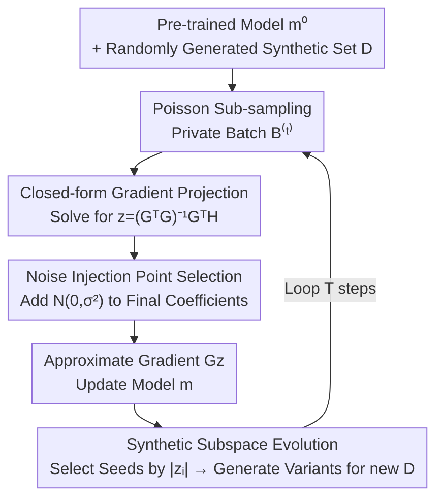

# PE-SGD: Differentially Private Deep Learning via Evolution of Gradient Subspace for Text

**Conference**: ICLR 2026  
**OpenReview**: [https://openreview.net/forum?id=713ywmTZHv](https://openreview.net/forum?id=713ywmTZHv)  
**Code**: https://github.com/LindaLydia/PE-SGD  
**Area**: AI Safety / Differential Privacy / LLM Fine-tuning  
**Keywords**: Differential Privacy, DP-SGD, Gradient Projection, Synthetic Data Evolution, Long-tail Samples

## TL;DR
PE-SGD combines "gradient projection + private evolving synthetic data" for differentially private fine-tuning: it uses a synthetic dataset that **evolves continuously** during training to span the gradient projection subspace and injects DP noise into the optimal projection coefficients. It significantly outperforms DP-SGD and various projection-based baselines in scenarios with extremely limited private data ($M < 500$) and tight privacy budgets ($\epsilon = 1$).

## Background & Motivation
**Background**: In training language models with differential privacy, the standard approach is DP-SGD—clipping per-sample gradients and injecting isotropic Gaussian noise to satisfy $(\epsilon, \delta)$-DP. While effective with sufficient private data, it has recently succeeded in LLM training as well.

**Limitations of Prior Work**: The noise dimension in DP-SGD equals the parameter count $p$, which is extremely high. When private samples number only in the hundreds, noise overwhelms the signal, leading to performance far inferior to non-private SGD. To mitigate this, gradient projection methods (e.g., PDP-SGD, GEP) leverage a non-private dataset to span a low-dimensional subspace and project noisy private gradients onto it, thereby reducing noise dimensionality. However, these methods suffer from two overlooked flaws: (1) **Fixed projection subspaces**—they rely on a fixed (public) dataset to construct the subspace, but as the model changes during training, the $\ell_2$ distance between the approximate DP gradient and the true private gradient grows, making fixed subspaces unable to keep up with dynamic training; furthermore, large public datasets themselves may be sensitive. (2) **Lack of justification for noise injection locations**—some methods add noise to private gradients, some to projection coefficients, and others to residuals, without clear reasoning, even though the location significantly impacts performance.

**Key Challenge**: The projection subspace must "match the current model's gradient distribution" for accurate approximation, which fixed datasets cannot natively achieve through dynamic adaptation. Simultaneously, the noise injection point determines how closely the "noisy approximate gradient" aligns with the true private gradient; the wrong choice leads to unnecessary information loss.

**Goal**: In scenarios with limited private data and small $\epsilon$, construct a projection subspace that **evolves** with training and identify the **noise injection point** with minimal information loss, ensuring the DP-protected approximate gradient aligns as closely as possible with the true private gradient.

**Key Insight**: The authors first provide a "principled gradient projection" via closed-form least squares analysis, proving that PDP-SGD/GEP are special cases on the top-k feature subspace (using the full subspace incurs no information loss). Then, borrowing from Private Evolution (PE) for synthetic data, they allow the synthetic sample set to update iteratively alongside the model.

**Core Idea**: Replace fixed public datasets with a **small synthetic dataset that evolves during training** to span the gradient projection subspace, and inject DP noise into the **final projection coefficients** to maximize alignment between the approximate and true private gradients.

## Method

### Overall Architecture
PE-SGD aims to fine-tune a pre-trained generative model $m^{(0)}$ to better fit a private dataset $B$ (size $M, M < 500$) while satisfying $(\epsilon, \delta)$-DP. Unlike DP-SGD, which updates the model directly with noisy private gradients, PE-SGD **projects** the private gradient into a subspace spanned by gradients of synthetic samples at each step. After updating the model, it **evolves** these synthetic samples to ensure the subspace consistently fits the current model.

The entire process is an iterative loop with feedback: prior to training, a batch of synthetic samples $D$ is randomly generated using the untrained $m^{(0)}$. In each step, a private batch $B^{(t)}$ is obtained via Poisson sub-sampling; the synthetic gradient matrix $G$ and private gradient matrix $H$ are computed to solve for projection coefficients via least squares with added noise. The model is updated using the approximate gradient $Gz$. Then, "high-scoring" seed samples are selected based on the coefficients $|z_i|$, and the updated model generates variants to evolve the $D$ for the next round. This repeats for $T$ steps.

### Key Designs

**1. Closed-form Principled Gradient Projection: Using the Full Synthetic Subspace instead of Top-k Feature Space**

To address the lack of unified principles in projection methods, the authors formulate the projection target as a least-squares problem: given private gradients $H=[h_1,\dots,h_M]\in\mathbb{R}^{p\times M}$ (with mean $h=\frac{1}{M}\sum_j h_j$) and synthetic gradients $G=[g_1,\dots,g_N]\in\mathbb{R}^{p\times N}$, find coefficients $z$ such that $Gz$ best approximates $h$:

$$\min_{z\in\mathbb{R}^N}\|Gz-h\|_2^2,\qquad z=(G^TG)^{-1}(G^Th)=\frac{1}{M}\sum_{j=1}^M(G^TG)^{-1}(G^Th_j).$$

Since the number of synthetic samples $N \ll p$, this is an under-parameterized regression (solved numerically via $(G^TG+\eta I)^{-1}$ where $\eta=10^{-6}$). The final projection function is $\hat g=Gz=\frac{1}{M}\sum_j[G(G^TG)^{-1}(G^TH)]_{:,j}$. The authors prove that PDP-SGD (using the top-k subspace $E$ of $GG^T$) and GEP (using left singular vectors of $G$ + residual correction) are special cases of this closed-form solution when the **subspace is truncated to top-k**. Intuitively, restricting projection to a low-dimensional feature subspace causes information loss; PE-SGD avoids this by using the **entire** subspace, which is feasible due to the small synthetic set ($N=200$ in experiments).

**2. Synthetic Gradient Subspace Evolution: Replacing Fixed Public Sets with Evolving Synthetic Data**

To address the limitation that fixed subspaces cannot adapt to dynamic training and large public sets are sensitive, the authors enable the synthetic dataset $D$ to evolve during fine-tuning. Borrowing from Private Evolution, initial synthetic samples are generated from the untrained $m^{(0)}$ via `RANDOM_API()`. Subsequently, each component $z_i$ of the projection coefficient $z\in\mathbb{R}^N$ is treated as a "score" for the synthetic sample $x_i$, measuring its contribution to approximating the private gradient. Since negative $z_i$ also carries gradient information, the top-K seed samples $D_{\text{seed}}$ are selected with probability proportional to $|z_i|$. The updated model then uses `VARIATIONAL_API()` to expand each seed into $L-1$ variants for the next $D$. This ensures the synthetic subspace stays aligned with the current model's gradient distribution, preventing the $\ell_2$ distance from diverging. The process only requires generative APIs and removes dependence on large public datasets. Note: For privacy, $\mathcal{N}(0,\sigma^2 I_N)$ noise is added to $z$ before seed selection (this is the same noise injection step described below).

**3. Systematic Selection of Noise Injection Points: Adding DP Noise to Final Projection Coefficients**

Addressing the lack of principled noise placement, the authors evaluate three natural injection points derived from $z=(G^TG)^{-1}(G^TH)$: (1) adding noise to the aggregated private gradient $\sum_j H_{:,j}$ ($ \mathbb{R}^p $); (2) adding noise to the inner product $\sum_j[G^TH]_{:,j}$ ($ \mathbb{R}^N $); (3) adding noise to the **final projection coefficients** $\sum_j[(G^TG)^{-1}(G^TH)]_{:,j}$ ($ \mathbb{R}^N $). Experiments (Fig. 8) show that option (3) is consistently superior, providing smaller $\ell_2$ approximation error and significantly higher cosine similarity to the true private gradient. The explanation provided is that normalization (or clipping) takes place before column aggregation; thus, more uniform column norms result in less information loss. They measured the STD-to-Mean and Min-to-Max ratios of column norms in the noisy matrices and found the final coefficient scheme has the smallest variation (lowest STD-to-Mean, highest Min-to-Max), while the "inner product noise" scheme performs worst due to extreme variance.

### Loss & Training
Training follows standard SGD updates: $\phi\leftarrow\phi+\eta\cdot Gz/\tilde M$, but the approximate gradient $Gz$ can be fed directly to optimizers like AdamW. Sensitivity is controlled via **normalization** instead of clipping—normalizing coefficient columns $Z_{:,j}=Z_{:,j}/\|Z_{:,j}\|_2$ removes the need for the hyperparameter $C$. The noise scale $\sigma$ is calculated via the PRV Accountant by Gopi et al. based on $(\epsilon,\delta,T,\beta)$. For feasibility, LoRA is used to keep $p$ small enough to materialize $G, H$ for matrix multiplication; for full fine-tuning, GhostSuite can compute all sample gradient dot products $G^TG$ and $G^TH$ in a single backward pass. Default hyperparameters are $M=400, \beta=0.2, T=10, N=200, L=2$, ensuring $(1.0, 10^{-5})$-DP.

## Key Experimental Results

### Main Results
Three pre-trained models (Qwen2.5-3B-Instruct / Llama-3.2-3B-Instruct / GPT2) were tested on three datasets from late 2024 to 2025 (PubMed / Congressional Speech / bioRxiv, ensuring dates post-date model release to avoid data leakage), evaluating next-token prediction Loss (↓) and Accuracy (↑). The table below shows results for Qwen2.5 at $\epsilon=1$:

| Dataset ($\epsilon=1$) | DP-SGD | PDP-SGD | GEP | Aug-PE | POPri | PE-SGD-FixSample | PE-SGD |
|------|------|------|------|------|------|------|------|
| PubMed | 2.3731 | 2.2502 | 2.4164 | 2.5817 | 2.9344 | 2.2497 | **2.1990** |
| Congressional Speech | 3.1080 | 2.8025 | 2.9103 | 3.0090 | 3.8656 | 2.8024 | **2.7532** |
| bioRxiv | 2.3768 | 2.3325 | 2.4300 | 2.4672 | 2.6178 | 2.3230 | **2.3178** |

PE-SGD achieves the lowest Loss and highest Accuracy across all three datasets at $\epsilon=1$. Its non-evolving variant, PE-SGD-FixSample, already outperforms most baselines, serving as a cost-effective alternative. POPri/Aug-PE perform poorly with small private data ($M=400$) as they struggle to obtain reliable positive/negative sample pairs. As expected, DP-SGD performs better when $\epsilon=\infty$ (no noise).

### Ablation Study

| Configuration | Key Result | Description |
|------|---------|------|
| PE-SGD (Full) | top 10% hard samples ΔLoss = **-3.49995** | Optimal |
| PE-SGD-FixSample | ΔLoss = -3.41537 | Removing evolution ($L=1$) still outperforms baselines |
| Noisy Inner Product | Significantly worst | Extreme variance in column norms, high information loss |
| Noisy Real Gradient | Second to full version | Higher Loss, slightly lower Acc |
| $L=1$ or $L=\infty$ | Both degrade | No evolution or full regeneration both underperform; intermediate values are best |

Table 2 shows that on the top 10% "long-tail" samples with the highest initial Loss, PE-SGD achieves the largest average Loss reduction (-3.49995). All PE-SGD variants exceed DP-SGD, validating the value of "full gradient subspace projection."

### Key Findings
- **Better Handling of Long-tail Issues**: On a per-sample basis, PE-SGD shows larger improvements over DP-SGD on difficult samples with higher initial loss, shifting the overall loss distribution to the left. This indicates it extracts more knowledge from valuable "long-tail" samples.
- **Superior Single-step Updates**: On the same SGD trajectory, PE-SGD reduces loss and increases accuracy more than DP-SGD at every step, even in later training phases near convergence.
- **Sample Efficiency**: Only about 200 synthetic samples per round are needed for good performance, confirming that training gradients reside in a low-dimensional space much smaller than $p$.
- **Noise Location Determinant**: The critical factor is the consistency of column norms in the noisy matrix—higher consistency leads to lower normalization loss, explaining why "final coefficients" perform best.
- **Scaling with $M$ and $\epsilon$**: PE-SGD improves as $M$ increases and remains competitive with (the strengthening) DP-SGD; it consistently outperforms DP-SGD across $\epsilon=1/2/4/8$.

## Highlights & Insights
- **Unifying the Projection Spectrum into a Closed-form Solution**: Proving that PDP-SGD/GEP are special cases of top-k truncation provides theoretical grounding while demonstrating that using the full small subspace results in no information loss.
- **Adapting Private Evolution from "Synthetic Data Generation" to "Subspace Generation"**: Synthetic samples act as bases for the gradient subspace rather than training data, using $|z_i|$ as an evolutionary score to form a closed loop.
- **Explaining Noise Points via Column Norm Consistency**: Transforming an empirical choice into a measurable metric (STD-to-Mean / Min-to-Max) makes the conclusion verifiable rather than heuristic.
- **Eliminating Public Data Dependence**: Relying solely on generative APIs to evolve the synthetic set avoids the potential sensitivity risks of using large public datasets, enhancing its value in privacy-critical scenarios.

## Limitations & Future Work
- The method defaults to LoRA to keep $p$ small for materializing $G, H$. Full fine-tuning requires GhostSuite for dot products, and efficiency on larger models needs further verification.
- Evolving synthetic sets requires calling generation/variation APIs every round, introducing additional computational costs compared to pure DP-SGD; the authors offer FixSample as a cost-saving alternative.
- The focus is on "few private samples ($M < 500$) + tight budget." When $M$ is large, DP-SGD is already a strong baseline, and PE-SGD's advantage narrows; the applicable boundaries need more definition.
- Evaluation focuses on next-token prediction Loss/Acc; downstream task performance (instruction following, generation quality) under the privacy-utility tradeoff is not fully explored.

## Related Work & Insights
- **vs DP-SGD**: DP-SGD adds noise to $\mathbb{R}^p$ private gradients; PE-SGD projects to a low-dimensional synthetic subspace and adds noise only to $\mathbb{R}^N$ coefficients, avoiding direct updates with private gradients, thus winning in small-data, tight-budget settings.
- **vs PDP-SGD / GEP**: These use fixed public data and truncated (top-k) subspaces. PE-SGD uses evolving, full subspaces that adapt to training without truncation loss.
- **vs Aug-PE / POPri**: These use DP synthetic data for non-DP SFT or DPO. PE-SGD projects private gradients during training, using synthetic data for approximation rather than as training samples, proving more robust when $M=400$.

## Rating
- Novelty: ⭐⭐⭐⭐⭐ Unifies closed-form projection, synthetic subspace evolution, and noise location selection into a cohesive framework.
- Experimental Thoroughness: ⭐⭐⭐⭐ Extensive ablations on three models/datasets + noise location/L/N/M/$\epsilon$, though downstream task evaluation is lighter.
- Writing Quality: ⭐⭐⭐⭐ Clear motivation driven by $\ell_2$ distance, logical flow, and complete algorithms.
- Value: ⭐⭐⭐⭐ Practical value for LLM fine-tuning in privacy-sensitive, data-scarce scenarios without requiring large public datasets.

<!-- RELATED:START -->

## Related Papers

- [\[ICLR 2026\] On Optimal Hyperparameters for Differentially Private Deep Transfer Learning](on_optimal_hyperparameters_for_differentially_private_deep_transfer_learning.md)
- [\[ICLR 2026\] Back to Square Roots: An Optimal Bound on the Matrix Factorization Error for Multi-Epoch Differentially Private SGD](back_to_square_roots_an_optimal_bound_on_the_matrix_factorization_error_for_mult.md)
- [\[ICLR 2026\] Differentially Private Two-Stage Gradient Descent for Instrumental Variable Regression](differentially_private_two-stage_gradient_descent_for_instrumental_variable_regr.md)
- [\[AAAI 2026\] An Improved Privacy and Utility Analysis of Differentially Private SGD with Bounded Domain and Smooth Losses](../../AAAI2026/ai_safety/an_improved_privacy_and_utility_analysis_of_differentially_p.md)
- [\[ICLR 2026\] Missing Mass for Differentially Private Domain Discovery](differentially_private_domain_discovery.md)

<!-- RELATED:END -->
