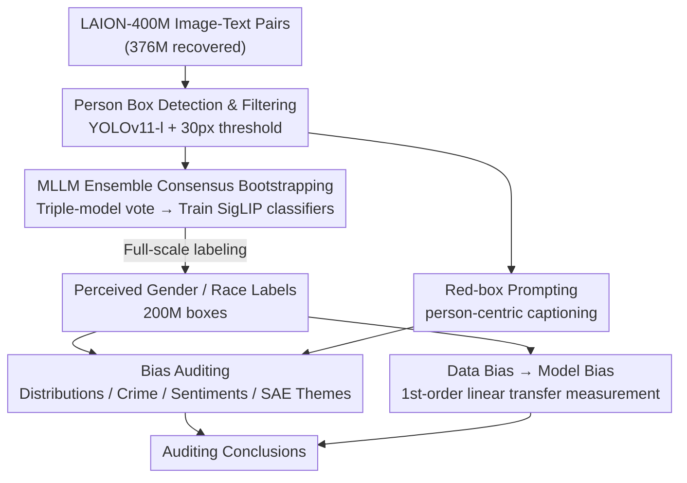

# Person-Centric Annotations of LAION-400M: Auditing Bias and Its Transfer to Models

**Conference**: ICLR 2026  
**OpenReview**: [https://openreview.net/forum?id=t3ZMiHhqXm](https://openreview.net/forum?id=t3ZMiHhqXm)  
**Code**: Available (The paper states Code is available here; access to data with demographic attributes requires an application)  
**Area**: AI Safety / Fairness / Dataset Auditing  
**Keywords**: Dataset Bias, LAION-400M, Demographic Annotation, Bias Transfer, Sparse Autoencoders

## TL;DR
The authors generated 276 million person bounding boxes with perceived gender/race labels and person-centric captions for the entire LAION-400M dataset. Using this first full-scale web data annotation, they audited systematic biases where "men, Black, and Middle Eastern individuals are over-associated with crime and negative content." Furthermore, they demonstrated that 60–70% of the gender bias in CLIP and Stable Diffusion can be directly predicted by a linear fit of the "gender-concept co-occurrence frequency" in the training data.

## Background & Motivation

**Background**: Vision-language foundation models like CLIP and Stable Diffusion are pretrained on massive, uncurated web multi-modal datasets (e.g., LAION-400M). These have been repeatedly shown to exhibit strong demographic biases. It is widely hypothesized that "model bias stems from training data imbalance," but this has remained a hypothesis rather than a measurable conclusion.

**Limitations of Prior Work**: To verify the causal chain from "data bias → model bias," one must know who is in the data and who co-occurs with whom. However, web-scale data like LAION-400M **entirely lacks demographic annotations**. Existing auditing efforts either rely on alt-text sub-samples (low information density, unreliable), focus only on faces, provide only a single image-level gender label, or cover narrow subsets like occupations. No work has performed fine-grained, person-level annotation on the full dataset.

**Key Challenge**: Without full-scale, person-level, and visually grounded annotations, researchers can neither characterize the true demographic composition of the data nor directly align "data statistics" to "downstream model behavior." Instead, they must rely on external proxies like U.S. Bureau of Labor Statistics data for indirect guesses.

**Goal**: (1) Create high-quality person annotations (boxes + perceived gender + perceived race/ethnicity + captions) for the entire LAION-400M; (2) Audit demographic distributions and harmful associations within the data; (3) Quantitatively answer for the first time at web scale "how much model bias can be directly explained by data co-occurrence."

**Key Insight**: Rather than trusting off-the-shelf MLLMs to annotate the full dataset directly (where noisy boxes, occlusions, and low-quality images contaminate results), it is better to bootstrap a clean training set using "multi-model ensembles + consensus only," then train specialized classifiers to process the full volume, reducing both cost and noise.

**Core Idea**: Build a "full-scale person annotation" set through an automated pipeline, and then establish the first measurable empirical link between dataset composition and model behavior using a first-order linear fit from "data co-occurrence → model bias."

## Method

### Overall Architecture

The paper performs two main tasks: first, it uses an **automated annotation pipeline** to provide bounding boxes, perceived gender, perceived race/ethnicity, and captions for every person in LAION-400M (effectively 376 million recovered image-text pairs, 90.7% of the original). Second, it uses these annotations for three levels of auditing: data distribution, harmful associations (crime words/sentiments/SAE themes), and the measurement of bias transfer from data to models.

The key to the annotation pipeline is not "direct MLLM labeling," but "**MLLM ensemble consensus bootstrapping → training specialized classifiers → full-scale classification**." First, YOLOv11-l detects ~200 million person boxes, filtered by size. On a sampled subset, three MLLMs (Phi-3.5-Vision, LLaVA-NeXT, InternVL3) vote; only samples with full consensus are used to fine-tune SigLIP gender/race classifiers. These classifiers label the full set. Simultaneously, InternVL3-8B generates person-centric captions using "red-box visual prompts." Finally, distribution statistics, crime/sentiment associations, SAE theme mining, and linear fitting for bias transfer are conducted.

### Key Designs

**1. Recall-prioritized Box Detection and Usability Filtering: Finding everyone first, then removing unlabelable small boxes**

The pipeline starts with bounding every person. The authors use YOLOv11-l with a default confidence threshold of 0.25—lower than similar auditing works (e.g., Phase)—because **recall is prioritized**: it is better to have false positives than to miss individuals, which would systematically distort distribution statistics. Manual inspection of 200 images showed 82.5% were perfectly correct, 10% misidentified objects as persons, and 7.5% missed persons. The authors argue that since an image can contain multiple boxes, the actual omission rate is lower.

Detection alone is insufficient; **filtering by size** is critical. Boxes with any side shorter than $30$ pixels are discarded. This $30\text{px}$ threshold was derived by testing when automated gender labeling becomes unreliable—below $30\text{px}$, the Cohen’s $\kappa$ between automated and human perceived gender labels drops below $0.8$ and accuracy below $90\%$, indicating insufficient visual cues. Filtering left $199,931,986$ person boxes across $107,545,236$ images. Most boxes are small (occupying $<10\%$ of image area) and most images contain one person, though extreme cases contain up to $55$ people.

**2. MLLM Consensus Bootstrapping for Specialized Classifiers: Turning noisy labels into clean training sets via "consensus only"**

Labeling 200 million boxes with gender and race directly using MLLMs is expensive and noisy (due to occlusions, noise, or multiple people). The authors use **bootstrapping**: they label a sampled subset with three different MLLMs (InternVL3-2B, Phi-3.5-Vision, LLaVA-1.6-7B) and **keep only samples where all three agree** as training signals to fine-tune a SigLIP classifier for the full dataset.

For gender, they selected $25,000$ triple-consensus images for each of four categories (female / male / mixed / unclear) from a $3$ million sample (mixed was relaxed to double-model consensus as it was rare). The resulting SigLIP achieved $97.2\%$ accuracy on the test set, generalizing to Phase ($95\%$) and FACET ($90\%$). Race/ethnicity was harder: lacking datasets for "noisy/clueless boxes," the authors used alt-text keywords to recall candidate images for each race (grounding labels in text), then used the same triple-model voting. They used seven categories (Black / East Asian / Hispanic / Middle Eastern / South Asian / Southeast Asian / White). SigLIP reached $87.4\%$ accuracy. Given that perceived race is highly subjective (human-human agreement $\kappa = 0.654$ vs. human-classifier agreement $\kappa = 0.638$), this is significant. This design ensures that **machine-human agreement approaches the upper limit of human-human agreement**, suggesting remaining errors stem from task subjectivity rather than classifier quality.

**3. Red-box Prompting for Person-Centric Captions and SAE Theme Mining: Forcing the model to describe only the "highlighted individual"**

Set-level alt-text describes the whole image and cannot localize target persons. The authors require **person-level** captions. They utilized the ability of recent MLLMs to perceive visual markers by drawing a **red box** around the target person and instructing the model to "describe the highlighted individual." Following pairwise win-rate comparisons by GPT-5.1 on $500$ boxes, InternVL3-8B was selected (winning $0.756$ against Qwen2.5-VL-3B) to generate full captions.

With ~200 million captions, the authors used Sparse Autoencoders (SAE) for **unsupervised theme mining**. They encoded captions using granite-embedding and trained an SAE to discover recurring themes. They then measured the association strength between identity $i$ and theme $t$ using Pointwise Mutual Information:

$$\text{PMI}(i, t) = \log \frac{P(i,t)}{P(i)\,P(t)}$$

$P(i,t)$ and $P(t)$ are estimated via SAE latent features. This revealed that men are associated with sports and women with culture; "firearms/weapons" and "military" associated with Middle Eastern individuals; "markets" and food with Southeast Asian individuals. White identity consistently associated with generic themes like "health," "aging," and "pregnancy," confirming White as the "default identity" in the data.

**4. Measurement of Bias Transfer: Quantifying how much model bias is directly explained by data co-occurrence**

The authors measured **first-order bias transfer**—how much model bias is linearly correlated with the co-occurrence frequency of target concepts and the bias variable (gender) in the data. For 2,617 social categories $c$ (appearing $\geq100$ times in LAION), they calculated:

- **Data Bias**: The proportion of female images among all images containing category $c$ in alt-text (filtering for single-gender images).
- **CLIP Model Bias**: Standardized cosine similarity difference between category $c$ and gender.

$$d(c) = \frac{\text{mean}_{x\in F}\cos(x, c) - \text{mean}_{y\in M}\cos(y, c)}{\text{stddev}_{w\in F\cup M}\cos(w, c)}$$

For Stable Diffusion, bias was measured by the proportion of females in 100 generated images per prompt.

By performing linear fitting between data bias and model bias, the $R^2$ represents the proportion of model bias variance explained by data co-occurrence. Results: For CLIP, $\rho \in \{0.75, 0.80, 0.84\}$ and $R^2 \in \{0.57, 0.64, 0.71\}$. For Stable Diffusion, $R^2 \in \{0.64, 0.63\}$. Collectively, **60–70% of gender bias can be directly predicted from data co-occurrence via linear fit**—the remaining 30–40% stems from higher-order effects or model amplification.

## Key Experimental Results

### Human Verification of Annotations

| Task | Test Acc | Cross-dataset Generalization | Human Agreement |
|------|------|------|------|
| Gender Classification (SigLIP) | 97.2% | Phase 95% / FACET 90% | High $\kappa$, zero male/female confusion |
| Race Classification (SigLIP) | 87.4% | — | Human-Machine $\kappa=0.638$, Human-Human $\kappa=0.654$ |
| Box Detection (200 images) | 82.5% Correct | — | 10% False Positive / 7.5% Missed |

### Dataset Composition and Harmful Associations

| Auditing Dimension | Key Findings |
|------|------|
| Gender Distribution | Male 42.3% > Female 35.3%; only 17% of images show both genders. |
| Race Distribution | White ≈28% (4x largest minority, Black); >50% boxes/45% images are unclear. |
| Crime Word Association ($\Delta$) | Male +57%; Middle Eastern +206%, Black +51%; White/East Asian both -22%. |
| Sentiment (Neg. Ratio / VADER) | Female 0.21/0.12 vs Male 0.33/0.06; Middle Eastern most negative at 0.40/0.03. |

### Bias Transfer Linear Fitting

| Model | Probe / Categories | Pearson $\rho$ | $R^2$ |
|------|------|------|------|
| CLIP ViT-B-32 | LAION-400M / Guilbeault | 0.84 | 0.71 |
| CLIP ViT-B-32 | Phase / Guilbeault | 0.80 | 0.64 |
| CLIP ViT-B-32 | CausalFace / Guilbeault | 0.75 | 0.57 |
| Stable Diffusion 1.1 | — | 0.80 | 0.64 |
| Stable Diffusion 1.4 | — | 0.80 | 0.63 |

### Key Findings
- **Data co-occurrence linearly explains 60–70% of model gender bias**, the first measurable conclusion on "data → model bias" transfer at web scale.
- **In-distribution probes are critical**: $R^2$ is highest ($0.71$) when using LAION images as probes, highlighting that the choice of probe images significantly impacts bias measurement.
- **Race subjectivity is the ceiling**: Human-human agreement ($\kappa=0.654$) is only slightly higher than human-machine agreement ($0.638$), suggesting remaining errors are primarily due to epistemological uncertainty.
- Non-linear predictors (e.g., Chebyshev polynomials) only improve $R^2$ by 1–3 points, indicating first-order co-occurrence captures most explainable bias.

## Highlights & Insights
- **"Consensus Bootstrapping" as a reusable paradigm**: Instead of trusting a single MLLM, using multi-model agreement to filter clean seeds for specialized classifiers effectively manages web-scale noise.
- **Red-Box Visual Prompting**: This zero-cost instance localization trick transforms "image-level" descriptions into "person-centric" ones without model fine-tuning.
- **Empirical Quantification via $R^2$**: Mapping "data bias vs model bias" into a linear fit transforms a qualitative hypothesis into a measurable, extrapolatable metric.
- **Honesty about Subjectivity**: Reporting human-human agreement as a benchmark for human-machine agreement avoids misinterpreting task difficulty as classifier failure.

## Limitations & Future Work
- Labels capture **perceived** (not ground truth) traits; gender is simplified to binary, and race to seven fixed categories.
- Race bias "data → model" transfer remains inconclusive due to sparse co-occurrence samples for non-white groups.
- Only **first-order** linear transfer was measured; higher-order propagation and optimizer effects remain for future work.
- Captioner bias: Captions generated by InternVL3-8B may introduce its own biases, though the authors found low crime-word frequency in the generated text.

## Related Work & Insights
- **vs. Birhane et al. (2023/2024)**: While they audit alt-text subsets to find stereotypes (e.g., labeling minorities as "criminal"), this work provides **full-scale** visual grounded annotations to trace bias to the source.
- **vs. Zheng et al. (2022)**: They detected 50 million faces for encoding; this work boxes the **whole person** and focuses on auditing.
- **vs. Luccioni/Cheong**: This work replaces external proxy statistics (like labor data) with direct measurements from the training set itself, representing a methodological generational shift.

## Rating
- Novelty: ⭐⭐⭐⭐⭐ 
- Experimental Thoroughness: ⭐⭐⭐⭐⭐ 
- Writing Quality: ⭐⭐⭐⭐⭐ 
- Value: ⭐⭐⭐⭐⭐ 

<!-- RELATED:START -->

## Related Papers

- [\[ICLR 2026\] Optimizing Canaries for Privacy Auditing with Metagradient Descent](optimizing_canaries_for_privacy_auditing_with_metagradient_descent.md)
- [\[ICLR 2026\] Robust Fine-Tuning from Non-Robust Pretrained Models: Mitigating Suboptimal Transfer with Epsilon-Scheduling](robust_fine-tuning_from_non-robust_pretrained_models_mitigating_suboptimal_trans.md)
- [\[ICLR 2026\] On Optimal Hyperparameters for Differentially Private Deep Transfer Learning](on_optimal_hyperparameters_for_differentially_private_deep_transfer_learning.md)
- [\[ICLR 2026\] Wring Out the Bias: A Rotation-Based Alternative to Projection Debiasing](wring_out_the_bias_a_rotation-based_alternative_to_projection_debiasing.md)
- [\[ICLR 2026\] Benchmarking Bias Mitigation Toward Fairness Without Harm from Vision to LVLMs](benchmarking_bias_mitigation_toward_fairness_without_harm_from_vision_to_lvlms.md)

<!-- RELATED:END -->
