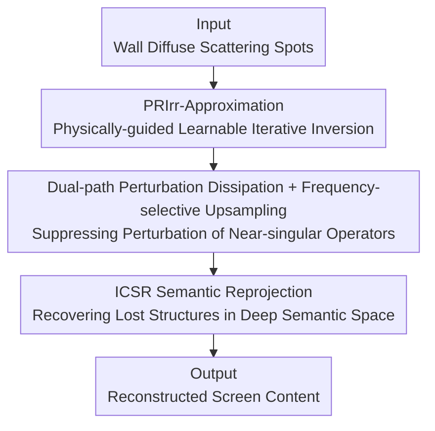

# Physically-Guided Optical Inversion Enable Non-Contact Side-Channel Attack on Isolated Screens

**Conference**: ICLR 2026  
**OpenReview**: [https://openreview.net/forum?id=evepIXBxL8](https://openreview.net/forum?id=evepIXBxL8)  
**Code**: To be confirmed  
**Area**: AI Security / Side-Channel Attack / Optical Inversion / Image Reconstruction  
**Keywords**: side-channel attack, optical projection, physically-guided inversion, screen content reconstruction, diffuse scattering

## TL;DR
This paper demonstrates for the first time that wall diffuse scattering can serve as an "optical projection side-channel." It proposes IR4Net, a physically-guided inversion network that reconstructs display content from air-gapped screens using only passively captured scattering spots, without line-of-sight, electromagnetic leakage, or network connectivity.

## Background & Motivation
**Background**: Traditional side-channel attacks primarily exploit electromagnetic radiation, acoustic reflections, cache timing, or network connections to steal device states. Although optical side-channels have been studied, they typically require sensors to be in the same room or have a direct view of the screen (e.g., ambient light sensors reading global illumination), essentially depending on "seeing the screen."

**Limitations of Prior Work**: Electromagnetic attacks are constrained by distance, shielding, and environmental noise, and can expose the attacker's location. Network attacks require connectivity and software vulnerabilities, making them ineffective against air-gapped systems while leaving audit logs. Active probing is easily detected upon signal emission. Consequently, "physical isolation" has long been regarded as the ultimate line of defense for information security.

**Key Challenge**: The authors identify an overlooked fact: light from self-luminous screens illuminates surrounding walls, and the diffuse scattering spots encode screen content. However, inverting these spots is extremely difficult: the mapping from screen to scattering spot is a severely ill-conditioned non-linear process. Its Jacobian matrix has singular values approaching zero in multiple directions, violating the Hadamard stability criterion. This causes tiny irradiance perturbations at the input to be violently amplified during inversion into edge misalignments, artifacts, and semantic drift. Furthermore, irreversible compression from diffuse reflection, diffraction, and occlusion discards significant global semantic structures, making reconstruction highly uncertain.

**Goal**: To stably invert scattering spots back to original screen images in a passive, non-contact, non-line-of-sight setting, suppressing perturbation amplification while recovering lost global semantics.

**Core Idea**: Reformulate the unstable optical inversion as a **physically-constrained learnable iterative trajectory** (using forward/inverse operators of the radiative transfer equation to constrain each step) and **re-project** in the deep semantic space to recover structures discarded by irreversible compression—using physical priors to stabilize numerical values and semantic priors to supplement information.

## Method

### Overall Architecture
IR4Net receives scattering spot images passively captured from walls and outputs the reconstructed screen content. The pipeline consists of two serial modules: **PRIrr-Approximation (Physically Regularized Irradiance Approximation)** transforms the ill-conditioned inversion into an iterative trajectory constrained by physical operators, specifically suppressing perturbation amplification via "dual-path perturbation dissipation + frequency-selective upsampling." Subsequently, **ICSR (Irreversible Constrained Semantic Reprojection)** establishes a stable mapping between structure and semantics in the deep semantic space to recover global structures lost in occluded and diffracted regions.

### Key Designs

**1. PRIrr-Approximation: Reformulating Unstable Optical Inversion as a Physically-constrained Learnable Iterative Trajectory**

Directly learning an end-to-end mapping from "spot to screen" encounters the aforementioned ill-conditioned problem where near-zero singular values exponentially amplify perturbations. The authors model the optical effect as a transmission operator $\Phi(\cdot)$ and derive its inverse approximation $\Psi(\cdot)$, allowing the network to converge toward the source irradiance along a path constrained by physical consistency. Each step uses **momentum initialization** to fuse local priors and multi-scale global feedback, providing a coherent update direction, while **momentum-guided gradient updates** suppress noise and error accumulation to reach a convergent feature estimate $\hat{I}^{(k)}$. Intuitively, physical operators and momentum "lock" the solution trajectory within a physically feasible region, preventing divergence in near-singular directions.

**2. Dual-path Perturbation Dissipation + Frequency-selective Upsampling: Structurally Dissipating and Suppressing Perturbation Energy Within Iterations**

Even with trajectory constraints, minute perturbations can amplify along multi-scale diffraction. The authors apply two parallel dissipation paths to iterative features $I^{(k)}$: a **spatial diffusion path** employing second-order differential kernels (Eq. 1, using $\partial^2 I^{(k)}/\partial x\partial y$ to capture local curvature) to spread perturbations spatially, and a **semantic attenuation path** using attention mechanisms (Eq. 2–4) to disperse perturbation components across semantic dimensions. These are combined in a **multi-scale frequency separation module** using Fourier transforms (Eq. 5). The core mechanism is to **only amplify low-frequency structural components with cross-scale consistency while attenuating high-frequency components lacking consistency**. Layered reconstruction is then performed using bilinear interpolation and learnable upsampling kernels $\kappa_{up}^{(i)}$ (Eq. 14–15).

**3. ICSR: Semantic Space Reprojection to Recover Global Structures Lost to Irreversible Compression**

PRIrr ensures stability, but high-compression diffuse reflection still discards global semantic structures, resulting in blurred edges and semantic misalignment. ICSR utilizes two parallel sub-networks: a **main mapping network** focused on low-level structural details guided by prior maps, and a **collaborative completion network** extracting stable abstract semantic embeddings $V_R^{(5,c)}$ to capture global context. By calculating the **cosine similarity** (Eq. 19–20) between the two spaces, the model optimizes a batch loss:

$$L_{batch} = \frac{1}{N}\sum_{j=1}^{N}(1 - s_j)^{\alpha} + \lambda \lVert \Theta \rVert_2^2$$

where $s_j$ represents the structural-semantic cosine similarity. This alignment enables the inference of missing regions based on context, producing sharp edges and coherent semantics.

### Loss & Training
The primary objective for ICSR is the structural-semantic cosine alignment loss $L_{batch}$ (Eq. 21). Training was conducted using PyTorch on NVIDIA RTX 3090 GPUs with the Adam optimizer, a fixed learning rate of $1\times10^{-4}$, and a batch size of 16. Four datasets were split 8:1:1 for training, validation, and testing.

## Key Experimental Results

### Main Results
Evaluation was conducted on four simulated side-channel datasets (ReSh-WebSight for UI layouts, ReSh-Password for login inputs, ReSh-Chart for data rendering, and ReSh-Screen for desktop scenes) against reconstruction-based (Uformer, ConvIR, UNet) and generative (pix2pix, CycleGAN) baselines.

| Dataset | Metric | IR4Net | Prev. SOTA | Gain |
|--------|------|--------|----------|------|
| ReSh-Screen | PSNR↑ | 25.812 | 22.299 (Uformer) | +15.7% |
| ReSh-WebSight | RMSE↓ | 26.719 | 31.026 (AST) | -13.9% |
| ReSh-Password | SSIM↑ | 0.887 | 0.874 (Uformer) | +0.013 |
| ReSh-Chart | PSNR↑ | 17.363 | 17.068 (Uformer) | +0.295 |

IR4Net leads across almost all metrics, with the most significant advantage observed in the structurally complex ReSh-Screen dataset.

### Ablation Study
Replacing the PRIrr iterative update strategy with standard momentum schemes (across three datasets, metrics: PSNR/SSIM/RMSE/LPIPS):

| Config | Screen PSNR↑ | Screen LPIPS↓ | Description |
|------|--------------|---------------|------|
| **Ours** | 25.812 | 0.216 | Structure-aware momentum init + physical feedback |
| ADMM | 25.155 | 0.232 | Classic ADMM iteration |
| NAG | 25.090 | 0.235 | Nesterov Accelerated Gradient |
| Heavy-Ball | 25.077 | 0.231 | Heavy-Ball Momentum |

### Key Findings
- The proposed iterative strategy consistently outperforms ADMM, NAG, and Heavy-Ball, validating that the combination of structure-aware initialization and physical feedback effectively inhibits error amplification under near-singular operators.
- **Brightness Robustness**: When screen brightness drops from 300 nits to 0, UNet's PSNR on ReSh-Screen crashes by ~68%, while IR4Net's drops by only ~25.9%.
- Qualitative results indicate that IR4Net maintains coherence in edges and textures under low-illumination conditions where competitors produce blurred outlines.

## Highlights & Insights
- **Trajectory-based Constraints**: Constraining the entire iterative solving path using physical operators and momentum, rather than just the final output, is key to handling ill-conditioned inversions. 
- **Frequency Gating as a "Perturbation Valve"**: Directly encoding the amplification of consistent low-frequency structures and attenuation of inconsistent high-frequency noise into the upsampling operation is an effective mechanism to block perturbation growth.
- **Threat Model Impact**: Proving that screen content can be recovered purely from wall diffuse reflections in air-gapped or EM-shielded environments directly challenges the assumption that "physical isolation equals security."

## Limitations & Future Work
- The ReSh-* datasets are simulated; the diversity of real-world wall materials, ambient light, and camera non-linearity may not be fully covered.
- Dependency on diffuse geometry, distance, and surface roughness lacks a systematic characterization.
- Many derivations (momentum updates, ICSR mapping) are placed in the appendix, and many formulas in the main text are abstract.
- Defensive countermeasures (e.g., wall coatings, randomized brightness, optical noise) represent natural future research directions.

## Related Work & Insights
- **vs. Traditional EM/Network Side-channels**: EM attacks are sensitive to distance/shielding, and network attacks are ineffective against air-gapped systems. This work uses an ambient medium (wall scattering) as a covert channel that is passive and difficult to intercept.
- **vs. Existing Optical Side-channels**: Previous methods require line-of-sight or sensors in the same room. This work is the first to utilize **independent, remote wall diffuse reflection** as a usable optical side-channel.
- **vs. Physically-guided Image Restoration**: Traditional methods often target specific transmission mechanisms (fog, microscopy) but struggle with multi-scale diffraction and wavefront interference. IR4Net specifically targets self-luminous pattern recovery under strong diffusion.

## Rating
- Novelty: ⭐⭐⭐⭐⭐ Proposes a new paradigm for wall-based diffuse optical side-channels.
- Experimental Thoroughness: ⭐⭐⭐⭐ Four datasets plus extensive ablations, though data is simulated.
- Writing Quality: ⭐⭐⭐ Clear ideas, but utilizes dense formulas and frequent appendix references.
- Value: ⭐⭐⭐⭐⭐ High impact on security defense by revealing a new leakage channel in air-gapped environments.

<!-- RELATED:START -->

## Related Papers

- [\[CVPR 2026\] What Your Features Reveal: Data-Efficient Black-Box Feature Inversion Attack for Split DNNs](../../CVPR2026/ai_safety/what_your_features_reveal_data-efficient_black-box_feature_inversion_attack_for_.md)
- [\[ICLR 2026\] ReTrace: Reinforcement Learning-Guided Reconstruction Attacks on Machine Unlearning](retrace_reinforcement_learning-guided_reconstruction_attacks_on_machine_unlearni.md)
- [\[NeurIPS 2025\] Exploration of Incremental Synthetic Non-Morphed Images for Single Morphing Attack Detection](../../NeurIPS2025/ai_safety/exploration_of_incremental_synthetic_non-morphed_images_for_single_morphing_atta.md)
- [\[ICLR 2026\] Robust Fine-Tuning from Non-Robust Pretrained Models: Mitigating Suboptimal Transfer with Epsilon-Scheduling](robust_fine-tuning_from_non-robust_pretrained_models_mitigating_suboptimal_trans.md)
- [\[ICML 2026\] TimeGuard: Channel-wise Pool Training for Backdoor Defense in Time Series Forecasting](../../ICML2026/ai_safety/timeguard_channel-wise_pool_training_for_backdoor_defense_in_time_series_forecas.md)

<!-- RELATED:END -->
