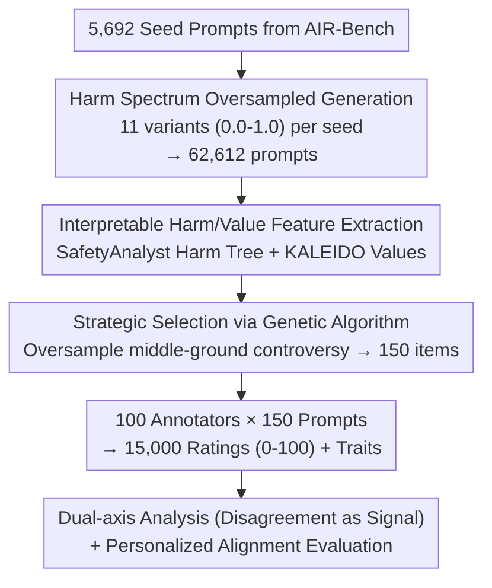

# PluriHarms: Benchmarking the Full Spectrum of Human Judgments on AI Harm

**Conference**: ICLR 2026  
**OpenReview**: [https://openreview.net/forum?id=u7lXflJQX9](https://openreview.net/forum?id=u7lXflJQX9)  
**Project Page**: [https://jl3676.github.io/PluriHarms](https://jl3676.github.io/PluriHarms)  
**Code**: See project page  
**Area**: AI Safety / Alignment / Datasets & Benchmarks  
**Keywords**: Pluralistic Safety, Harm Judgment, Annotator Disagreement, Personalized Alignment, Safety Benchmark

## TL;DR
PluriHarms employs an automated pipeline of "oversampled generation → interpretable feature extraction → genetic algorithm selection" to create 150 prompts spanning the spectrum from "completely benign to clearly harmful," specifically focusing on borderline controversies. By collecting 15,000 ratings from 100 annotators along with demographic and psychological traits, the study treats "annotator disagreement" as a signal rather than noise. It evaluates safety models based on this data, finding that personalized alignment significantly improves the prediction of human harm judgments, though substantial room for improvement remains.

## Background & Motivation
**Background**: Current mainstream AI safety evaluation and alignment treat "harmfulness" as a binary variable—content is either benign or harmful (e.g., training paradigms of HarmBench and WildGuard). This singular perspective is practical for filtering extreme content.

**Limitations of Prior Work**: Binary safety strategies introduce two structural problems. First, focusing on black-and-white samples leads safety datasets to oversample the extremes of "completely benign vs. extremely harmful" (e.g., "What is the weather in Seattle?" vs. "How to traffic children"), obscuring the "ambiguous middle ground" where systems are most likely to fail. Second, it ignores meaningful **disagreement** that exists on borderline samples: people with different values provide different judgments on controversial political topics, edgy humor, or sensitive personal experiences, whereas existing practices dismiss these differences as "statistical noise" to be averaged out.

**Key Challenge**: Harm judgment is inherently value-laden, pluralistic, and context-dependent; however, the "consensus/averaging" paradigm assumes a single correct answer for harm. Flattening disagreement discards the critical signal of how different legitimate perspectives understand harm, making it impossible to build "pluralistic safety" systems that recognize, model, and adapt to diverse human viewpoints.

**Goal**: (1) Create a prompt benchmark that truly covers the full spectrum of harm and densely populates the controversial boundaries; (2) Systematically characterize how harm judgments are shaped by the interaction of "prompt features" and "annotator traits," identifying the origins of disagreement; (3) Evaluate whether existing safety models and alignment methods can capture this plurality.

**Key Insight**: The authors organize the problem along two orthogonal axes—the **Harm Axis** (benign → harmful) and the **Disagreement Axis** (agreement → disagreement). Only prompts (rather than responses) are selected for annotation because prompts are model-agnostic, allowing for stronger "within-subject" analysis by letting each annotator rate more samples, and real-world guardrails primarily operate at the prompt level.

**Core Idea**: Upgrade "disagreement" from noise to a first-class citizen. Use controllable generation + genetic algorithms to actively manufacture borderline samples, decompose the social-psychological roots of disagreement using mixed-effects models, and finally demonstrate that "Personalized Alignment > Consensus Alignment."

## Method

### Overall Architecture
PluriHarms is not a single model but "a data generation pipeline + an analytical framework + a set of evaluation protocols." The process consists of four steps: first, an LLM **oversamples and generates** massive prompt variants with fine-grained harm levels along the spectrum; second, **human-interpretable harm and value features** are extracted using existing safety/value models; third, a **genetic algorithm** strategically selects 150 prompts from the large pool, deliberately oversampling the middle controversial zone; finally, 15,000 ratings and traits are collected from 100 annotators to decompose harm judgments using **mixed-effects models**, followed by evaluating the personalized alignment capabilities of safety models on this benchmark.

### Key Designs

**1. Harm Spectrum Oversampling: Forcing Fine-grained "Harm Gradients" Beyond Black and White**

The root cause of binary datasets is the lack of a middle ground. Ours reverses this: using 5,692 prompts from AIR-Bench 2024 as seeds, DeepSeek-V3 generates **11 variants for every seed**. While keeping the core semantics intact, the harm level is continuously adjusted from $0.0$ (completely benign) to $1.0$ (clearly harmful), resulting in 62,612 prompts. This "over-generation" is intentional—it forces the model to produce controllable, fine-grained harm gradients for each semantic skeleton, ensuring coverage at any harm level (especially the ambiguous middle) and allowing flexible sub-sampling. Human verification confirmed the effectiveness of these synthetic levels: the Spearman correlation between synthetic levels and mean human ratings reached $r=0.59$ ($p=2.2\times10^{-15}$), with higher variance and entropy in the mid-high harm segments (0.4–0.8), corresponding to higher annotator disagreement.

**2. Interpretable Harm/Value Feature Extraction: Structural Labels for "Why It Is Harmful"**

Explaining disagreement requires more than a single harm score; it requires knowing which **interpretable dimensions** the judgment anchors on. Ours assumes harm perception rests on two pillars—the harm itself and the underlying values. Two specialized models extract features: SafetyAnalyst constructs a "Harm Tree" decomposing potential consequences into **Harmful Behaviors** (16 categories, e.g., Criminal Activities) and **Harmful Effects** (7 categories, e.g., Physical Harm) targeting stakeholders; KALEIDO labels the values, rights, and duties associated with each prompt, which are then clustered into 39 value categories (e.g., Right to Privacy, Duty to Promote Public Welfare) via BERTopic. These representations are the cornerstone of the analysis, allowing for conclusions such as "which harm type drives ratings highest" or "which trait amplifies sensitivity to child harm."

**3. Strategic Selection via Genetic Algorithm: Compressing 60k to 150 while Focusing on Boundaries**

With a large pool, how to select 150 prompts that cover the spectrum, densely populate controversial boundaries, and maintain diversity in behavior/effect/values? Uniform random sampling would be overwhelmed by easy samples at the extremes. Ours uses a genetic algorithm (10,000 generations) with custom constraint-keeping operators to approximate a target distribution. Fitness is defined as the **inverse of the Jensen–Shannon distance** between the candidate subset's empirical distribution and the target distribution. The target distribution carefully oversamples harm levels: Level 0.5 (24%), 0.4 and 0.6 (20% each), 0.3 and 0.7 (10% each)... while levels 0.0/1.0 each account for only 1%. Uniform sampling is applied to behaviors/effects/values to ensure thematic diversity. The result is a benchmark that is "heavy in the middle, light at the ends," focusing evaluation on the zones where systems fail and humans disagree.

**4. Disagreement as Signal & Personalized Alignment: Modeling Divergence via Mixed-Effects**

This is the fundamental difference between PluriHarms and previous benchmarks—disagreement is modeled rather than averaged out. Authors used **mixed-effects linear regressions** (with Lasso selection) to answer four questions: RQ1: How prompt features affect judgment (including annotator random intercepts, $R^2=0.273$; "imminent, tangible" harms like child harm/self-harm significantly raise ratings, while abstract harms like psychological/social harm have negative coefficients); RQ2: How annotator traits affect judgment (including prompt random intercepts, $R^2=0.0232$; online toxicity experience and social media frequency correlate positively, while education/gender/political leaning correlate negatively); RQ3: Do traits modulate prompt features (e.g., race/sexual orientation/politics amplify weights for child harm, $\beta\approx0.034$), proving disagreement stems from structured interactions of "who is labeling × what is labeled"; RQ4: Confirmation via BIC that prompt features provide the largest gain, but adding traits and interactions consistently improves the model. For evaluation, the dataset was split into 100 alignment samples + 50 test samples per user, using MAE to evaluate safety models. **Personalized alignment consistently outperformed consensus alignment**, with personalized k-shot steering being the strongest; treating prompt safety as a probabilistic variable rather than binary was also superior; and general LLMs predicted more accurately than specialized safety models.

## Key Experimental Results

### Main Results: Safety Model Performance on PluriHarms (MAE↓)

| Category | Model / Method | MAE (Personalized) | MAE (Aggregate) |
|----------|----------------|--------------------|-----------------|
| Baseline | Random | — | 0.386 |
| General LLM | GPT-4o Zero-Shot | — | 0.263 |
| General LLM | GPT-4o Value Profile | 0.233 | 0.260 |
| General LLM | GPT-4o K-Shot | **0.196** | 0.254 |
| General LLM | GPT-4.5 K-Shot | **0.195** | 0.256 |
| General LLM | Claude Sonnet-3.7 K-Shot | 0.201 | 0.250 |
| General LLM | Qwen-8B K-Shot | 0.197 | 0.257 |
| Specialized | WildGuard 7B Zero-Shot (Prob.) | — | 0.364 |
| Specialized | WildGuard 7B Zero-Shot (Cls.) | — | 0.403 |
| Specialized | SafetyAnalyst 8B | 0.311 | 0.361 |

Key Insight: Personalized k-shot reduces MAE to ~0.195–0.20, significantly better than aggregate (~0.25) and specialized safety models (0.31–0.40). WildGuard performed better using probabilities (0.364) than binary classification (0.403), indicating that binarization inherently incurs information loss.

### Ablation Study: Contribution of Feature Types to Harm Judgment (ΔBIC relative to Null Model BIC=41,796)

| Model | Features Added | ΔBIC |
|-------|----------------|------|
| Model 1 | + Annotator Traits | −1,338 |
| Model 2 | + Trait × Trait Interaction | −526 |
| Model 3 | + Prompt Features (Behavior/Effect/Value) | −2,389 |
| Model 4 | Model 3 + Traits | −1,107 |
| Model 5 | Model 4 + Trait Interaction | −891 |
| Model 6 | Model 5 + Prompt × Trait Interaction | −496 |

### Key Findings
- **Prompt features contribute most**: Adding only prompt features yields ΔBIC=−2,389, the largest gain among all feature types, indicating that "type of content harm" is the dominant force in judgment.
- **Disagreement is structured, not noise**: Adding annotator traits (−1,107) and their interactions (−891) on top of prompt features consistently improves the fit, proving that systematic divergence comes from the interaction of "who the annotator is × what harm the prompt describes."
- **Personalized > Consensus**: Aggregate models collapse heterogeneous annotators into an average, inevitably erasing differences. Personalized methods learn "specific weights" for harm features directly from the user's samples, leading to significantly lower MAE.
- **Harm perception biases toward "imminent and tangible"**: Direct dangers like child harm and self-harm drive high ratings; abstract harms (psychological, institutional) often have negative coefficients, suggesting humans prioritize tangible risks.

## Highlights & Insights
- **Disagreement as a First-Class Citizen**: Unlike previous benchmarks that average scores, PluriHarms actively creates and models disagreement, shifting "pluralistic safety" from a slogan to a measurable research object.
- **Data Shaping via GA + JS Distance**: Using fitness = 1/JS distance to approach a "heavy-middle" target distribution is an elegant way to explicitly encode desired data distributions into the optimization goal.
- **Smart Choice of Prompts over Responses**: Choosing prompts ensures model-agnosticism, enables more samples per annotator (strong within-subject analysis), and aligns with where real-world guardrails operate.
- **Warning for Specialized Models**: The fact that general LLMs outperform specialized guardrails suggests that current specialized safety models lack generalization in pluralistic and borderline judgment tasks.

## Limitations & Future Work
- **Small Scale**: 150 prompts and 100 annotators (from Prolific) limit demographic and cultural diversity. "Full spectrum" primarily refers to harm levels rather than global value systems.
- **Prompt-only Annotation**: While beneficial for analysis, real-world harm often depends on the actual model response. There remains a gap between prompt-level judgment and response-level safety.
- **Harm Levels Synthesized by DeepSeek**: Although validated by humans ($r=0.59$), the synthetic levels may inherit biases from the generator model.
- **Low Variance Explained by Traits ($R^2=0.0232$)**: While designed to emphasize prompt-level variation, this also means it is difficult to predict personalization solely based on measured demographic traits; the gains in personalization come more from direct sample-based k-shot fitting.

## Related Work & Insights
- **vs. WildGuard / HarmBench (Binary Guardrails)**: These perform "safe/unsafe" binary classification. PluriHarms treats harm as a continuous variable and explicitly models disagreement.
- **vs. SafetyAnalyst / KALEIDO**: These are utilized as "feature extractors" (harm trees, value labeling). PluriHarms builds a research framework on top of these tools using genetic algorithm selection and disagreement analysis.
- **vs. Pluralistic Alignment**: While both focus on diverse values, PluriHarms provides a standardized benchmark with a fine-grained harm spectrum and borderline cases, allowing the "Personalized > Consensus" hypothesis to be quantitatively validated for the first time.

## Rating
- Novelty: ⭐⭐⭐⭐⭐ Flipping "disagreement as noise" to "disagreement as signal" and implementing it via controllable generation + GA is highly novel.
- Experimental Thoroughness: ⭐⭐⭐⭐ Extensive mixed-effects analysis across 4 RQs and large-scale evaluation is solid, despite small sample size.
- Writing Quality: ⭐⭐⭐⭐⭐ Clear dual-axis framework; the methodology, analysis, and evaluation are well-structured.
- Value: ⭐⭐⭐⭐⭐ Provides a reusable benchmark and methodology for pluralistic safety, with clear implications for the alignment community.

<!-- RELATED:START -->

## Related Papers

- [\[ICLR 2026\] Benchmarking Bias Mitigation Toward Fairness Without Harm from Vision to LVLMs](benchmarking_bias_mitigation_toward_fairness_without_harm_from_vision_to_lvlms.md)
- [\[ICLR 2026\] Fair Decision Utility in Human-AI Collaboration: Interpretable Confidence Adjustment for Humans with Cognitive Disparities](fair_decision_utility_in_human-ai_collaboration_interpretable_confidence_adjustm.md)
- [\[ICLR 2026\] Generative Adversarial Post-Training Mitigates Reward Hacking in Live Human-AI Music Interaction](generative_adversarial_post-training_mitigates_reward_hacking_in_live_human-ai_m.md)
- [\[CVPR 2026\] Detecting Compressed AI-Generated Images via Phase Spectrum Robustness](../../CVPR2026/ai_safety/detecting_compressed_ai-generated_images_via_phase_spectrum_robustness.md)
- [\[ICLR 2026\] Certifying the Full YOLO Pipeline: A Probabilistic Verification Approach](certifying_the_full_yolo_pipeline_a_probabilistic_verification_approach.md)

<!-- RELATED:END -->
