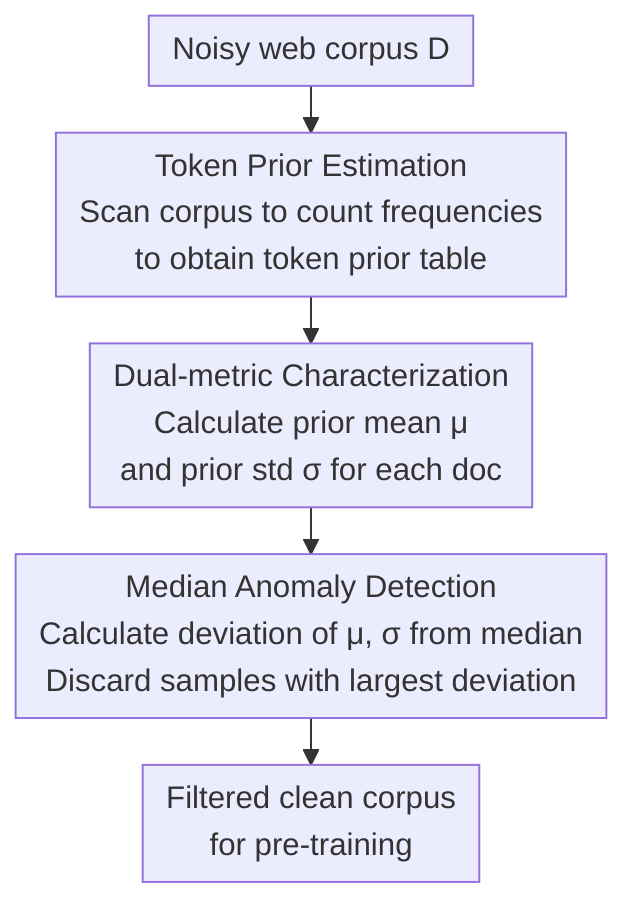

# Prior-based Noisy Text Data Filtering: Fast and Strong Alternative for Perplexity

**Conference**: ICLR 2026  
**arXiv**: [2509.18577](https://arxiv.org/abs/2509.18577)  
**Code**: [GitHub](https://github.com/ybseo-ac/prior_filter)  
**Area**: Multilingual Translation  
**Keywords**: Data Filtering, Pre-training, Perplexity, Word Frequency Prior, Data Quality

## TL;DR

A text data filtering method based on token priors (word frequency statistics) is proposed. By utilizing the mean and standard deviation of in-document token priors as an approximation for PPL, it achieves the highest average performance across 20 downstream benchmarks while being over 1000x faster than PPL-based filtering.

## Background & Motivation

### Importance of pre-training data quality

Large language models rely on massive amounts of web data for pre-training, but web data is highly noisy. Two major challenges exist: (1) the enormous volume requires efficient screening to save computational resources; (2) noisy data harms model performance.

### Limitations of PPL filtering

Perplexity (PPL) based filtering is currently the state-of-the-art (SOTA), but it has two inherent flaws:

- **Time Cost**: It requires training a reference model (e.g., 137M) first, then performing inference on the entire corpus. For a 6B token corpus, this takes approximately 216 GPU hours.
- **Reliability Issues**: Models provide inaccurate PPL estimates for out-of-distribution (OOD) samples (e.g., noisy data). Small models are particularly prone to assigning low PPL to repetitive or patterned noise, misidentifying it as high-quality.

### Linguistic inspiration

The paper is inspired by the cryptanalysis methods of 8th-century linguist Al-Kindi: **analyzing word frequencies can reveal linguistic structures**.

Two key linguistic insights:
1. **Word frequency is a one-dimensional representation of a word's role**: High-frequency words = functional words ("the", "is"), low-frequency words = content words ("president", "algorithm").
2. **Canonical sentences have stable lexical density**: The ratio of functional words to content words remains relatively stable across different documents.

## Method

### Overall Architecture

The method eliminates all heavy lifting associated with "training reference models + full inference" in PPL filtering, retaining only a word frequency table. The core observation is that PPL can be Bayesian-decomposed into likelihood and prior terms, where the prior term is entirely determined by token frequency without needing model inference. Consequently, the mean and standard deviation of in-document token priors are used to approximate PPL, and documents are discarded based on a "maximum deviation from the corpus median" criterion. This reduces filtering costs from hundreds of GPU hours to less than an hour. The workflow consists of three steps: scanning the corpus to estimate token priors into a frequency table, characterizing each document using prior mean and standard deviation, and performing median anomaly detection to discard documents furthest from typical values.

### Key Designs

**1. Token Prior Estimation: Converting the prior term into a one-time table lookup**

PPL filtering is slow because it calculates conditional probabilities for every token, requiring model forward passes. This method estimates the corpus-level token prior once: given corpus $D$ and vocabulary $V$, the prior probability of token $x$ is its normalized frequency $p_{\text{prior}}(x) = f_D(x) / \sum_{x' \in V} f_D(x')$, where $f_D(x)$ is the count of $x$ in the corpus. This table is generated in a single pass; subsequently, all document scoring reduces to simple table lookups, bypassing model inference entirely.

**2. Dual-metric Characterization: Mean for composition, standard deviation for structure**

Word frequency alone cannot judge if a document is canonical. The paper calculates two statistics for each document $\texttt{d}$. The prior mean $\mu_{\texttt{d}} = \mathbb{E}_{x_i \in \texttt{d}}[\log p_{\text{prior}}(x_i)]$ reflects the balance between high and low prior tokens, capturing overall composition. The prior standard deviation $\sigma_{\texttt{d}} = \text{std}_{x_i \in \texttt{d}}[p_{\text{prior}}(x_i)]$ reflects the distribution structure of priors within the document, representing lexical diversity and uniformity. The two are complementary: $\mu_{\texttt{d}}$ anomalies often involve excessive high/low prior tokens (e.g., newline spam or non-English text), while $\sigma_{\texttt{d}}$ anomalies often involve noun lists with content words but no syntax.

**3. Median Anomaly Detection: Quantifying "distance from canonical"**

The lexical density of canonical sentences is relatively stable across documents. Therefore, the further a document deviates from the typical corpus value, the more suspicious it is. The corpus-level medians are used as reference centers: $M_\mu = \text{median}(\mu_{\texttt{d}})$ and $M_\sigma = \text{median}(\sigma_{\texttt{d}})$. Anomaly is measured by absolute deviation $\delta_\mu(\texttt{d}) = |\mu_{\texttt{d}} - M_\mu|$ and $\delta_\sigma(\texttt{d}) = |\sigma_{\texttt{d}} - M_\sigma|$. Samples are discarded starting from the largest $\delta$, maintaining an equal exclusion count $|F_\mu| = |F_\sigma|$ until the target size is reached. Using the median instead of the mean prevents the reference point from being skewed by extreme noise.

**4. Theoretical connection to PPL: Explaining why two statistics suffice**

Decomposing PPL via Bayes' theorem:
$$ \log \text{PPL}(\texttt{d}) \propto \underbrace{\sum_i \log p_\theta(x_{<i}\mid x_i)}_{\pi_{\text{likelihood}}} + \underbrace{\sum_i \log p_\theta(x_i)}_{\pi_{\text{prior}}} $$
where $\mu_{\texttt{d}}$ is exactly equivalent to the $\pi_{\text{prior}}$ term, and $\sigma_{\texttt{d}}$ approximately captures the regularity of inter-token relationships reflected by $\pi_{\text{likelihood}}$. Together, they serve as a reasonable proxy for PPL. Crucially, the prior is more reliable than PPL in some cases: small models fail to learn likelihood accurately and provide unreliable estimates for OOD noise, often misclassifying repetitive noise as high quality. Word statistics are stable and immune to such distortions.

## Key Experimental Results

### Main Results: Downstream performance on Dolma corpus

GPT-2 architecture, 1.5B and 137M models, trained for 40K steps (~6B tokens), 20 downstream benchmarks.

| Method | Type | Time | Avg | World Knowledge | Commonsense | Lang. Understanding | Symbolic Reasoning | Reading Comp. |
|------|------|------|------|----------|----------|----------|----------|----------|
| No-filter | Rule | - | 5.78 | 5.52 | 0.44 | 6.14 | 13.22 | 3.59 |
| FastText | Classifier | 3.6h | 7.09 | 6.71 | 6.11 | 6.89 | 11.93 | 3.82 |
| DSIR | n-gram | 4h | 7.56 | 7.03 | 6.84 | 7.31 | 12.67 | 3.97 |
| PPL-based | Model | **216 GPU h** | 8.22 | 9.98 | 11.91 | 7.34 | 7.91 | 3.96 |
| **Prior-based** | Statistical | **0.25h** | **9.20** | 9.53 | 11.27 | **10.31** | 11.13 | 3.79 |

**Key conclusion**: Prior-based filtering achieves higher average performance than PPL (9.20 vs 8.22) at 0.1% of the time cost.

### Symbolic Language Results: Pile-github

| Method | Time | Avg | CS | Dyck | Ops | Elem Math | GSM | SVAMP |
|------|------|------|-----|------|------|----------|-----|-------|
| No-filter | - | 9.51 | 35.75 | 12.30 | 5.71 | 1.15 | 0.15 | 2.00 |
| PPL-based | 224 GPU h | 11.21 | 37.42 | 20.60 | 7.14 | 2.09 | 0.00 | 0.00 |
| **Prior-based** | 0.26h | **12.03** | 38.86 | 21.30 | **9.04** | 1.17 | 0.15 | 1.67 |

The prior-based method also outperforms PPL filtering in symbolic languages like code and mathematics.

### Ablation Study

**Large-scale consistency verification** (Qwen2.5-3B and 1.5B models, 12B tokens): Prior-based filtering consistently outperforms PPL filtering.

**Sub-sampling efficiency**: Using only a 1% subset of the corpus to calculate token priors yields results nearly identical to using the full corpus (reducing time from 30 minutes to ~70 seconds).

**PPL Overlap Analysis**: At a filtering ratio $e=0.10$, the overlap between $F_\mu$ and $F_{\text{ppl}}$ approaches 50%, confirming that prior filtering effectively approximates PPL filtering.

### Key Findings

1. **PPL performs worst on symbolic reasoning**: PPL tends to filter out small but meaningful code or math fragments.
2. **$\mu_{\texttt{d}}$ outliers** are mostly documents with extreme high/low prior tokens (newline spam, non-English text).
3. **$\sigma_{\texttt{d}}$ outliers** are mostly unstructured noun lists—possessing content words but lacking syntax.
4. **Multilingual adaptation**: When Chinese data accounts for <1% of an English corpus, it is automatically filtered as noise; if >20%, it is recognized as a learnable language.

## Highlights & Insights

1. **Triumph of simplicity**: Achieving results superior to PPL methods using only word frequency statistics.
2. **Strong linguistic foundation**: Every step is supported by linguistics, from Al-Kindi’s cryptanalysis to lexical density theory.
3. **Disparate speed advantage**: 0.25h vs 216 GPU h (~1000x speedup), with the gap widening as web data grows.
4. **Adaptive multilingual processing**: Automatically judges whether to filter or retain languages based on their proportion, without requiring reference datasets.
5. **Dual-metric complementarity**: $\mu_{\texttt{d}}$ captures token composition while $\sigma_{\texttt{d}}$ captures distribution structure, covering different noise types.

## Limitations & Future Work

1. Based on linguistic characteristics, it is not applicable to non-text modalities (images, audio, etc.).
2. As an approximation of PPL, it is weaker at capturing "syntactically canonical but semantically meaningless" noise.
3. Experiments primarily used the GPT-2 architecture; verification on modern architectures (Llama, etc.) is limited.
4. For training targets heavily biased toward specific data types (e.g., pure math), manual adjustments might be necessary.

## Related Work & Insights

- **Ankner et al. 2024 (PPL filtering)**: The primary baseline; this work proves priors are better and faster than PPL.
- **DSIR (Xie et al. 2023)**: Requires manual specification of reference datasets, whereas prior filtering is automatic.
- **FastText Classifier**: Requires human-annotated reference data; prior filtering is entirely unsupervised.
- **Insight**: Data filtering does not require complex model inference; returning to statistical foundations may be a superior choice.

## Rating

- **Novelty**: ⭐⭐⭐⭐☆ — Extremely simple and elegant idea rooted in linguistics.
- **Theoretical Depth**: ⭐⭐⭐⭐ — Thorough Bayesian decomposition analysis of PPL approximation.
- **Experimental Thoroughness**: ⭐⭐⭐⭐ — 20 benchmarks + symbolic language + large-scale verification + multilingual analysis.
- **Value**: ⭐⭐⭐⭐⭐ — 1000x speedup with better performance; directly applicable to industrial data pipelines.
- **Overall**: ⭐⭐⭐⭐☆ — A simple yet effective methodological contribution with significant practical value for pre-training data selection.

<!-- RELATED:START -->

## Related Papers

- [\[ICLR 2026\] Wring Out the Bias: A Rotation-Based Alternative to Projection Debiasing](wring_out_the_bias_a_rotation-based_alternative_to_projection_debiasing.md)
- [\[CVPR 2025\] Joint Out-of-Distribution Filtering and Data Discovery Active Learning](../../CVPR2025/ai_safety/joint_out-of-distribution_filtering_and_data_discovery_active_learning.md)
- [\[CVPR 2025\] Data-free Universal Adversarial Perturbation with Pseudo-Semantic Prior](../../CVPR2025/ai_safety/data-free_universal_adversarial_perturbation_with_pseudo-semantic_prior.md)
- [\[ICLR 2026\] No Prior, No Leakage: Revisiting Reconstruction Attacks in Trained Neural Networks](no_prior_no_leakage_revisiting_reconstruction_attacks_in_trained_neural_networks.md)
- [\[ICLR 2026\] Jailbreaking on Text-to-Video Models via Scene Splitting Strategy](jailbreaking_on_text-to-video_models_via_scene_splitting_strategy.md)

<!-- RELATED:END -->
