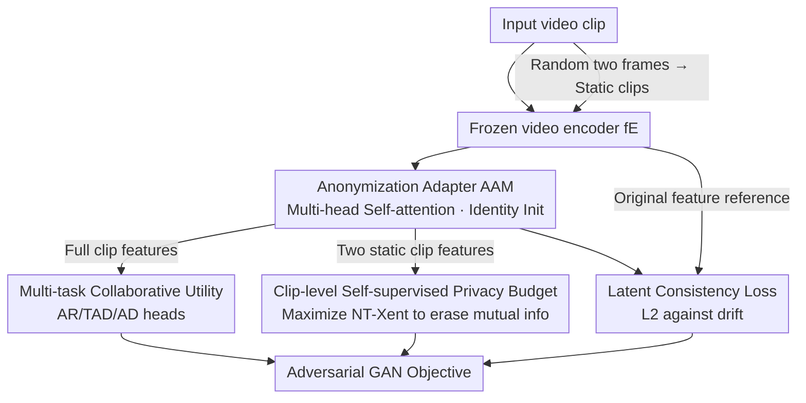

# Privacy Beyond Pixels: Latent Anonymization for Privacy-Preserving Video Understanding

**Conference**: ICLR 2026  
**OpenReview**: [https://openreview.net/forum?id=ncA3UUL0Ri](https://openreview.net/forum?id=ncA3UUL0Ri)  
**Code**: To be confirmed  
**Area**: AI Security / Privacy Protection / Video Understanding  
**Keywords**: Latent Anonymization, Privacy Protection, Video Foundation Models, Self-supervised, Gender Bias

## TL;DR
By attaching a lightweight "anonymization adapter" to a frozen video foundation model and employing self-supervised adversarial training directly in the latent feature space, private information such as skin tone, gender, and clothing is erased. This allows a single set of anonymized features to be generic across various downstream tasks—including action recognition, temporal localization, and anomaly detection—reducing privacy leakage by 35% while downstream performance only drops by 1-2%.

## Background & Motivation

**Background**: Video Foundation Models (VFMs, such as VideoMAE and V-JEPA) extract powerful spatio-temporal features. In practice, these features are commonly extracted, stored, and reused across multiple tasks such as action recognition, temporal action detection, and anomaly detection (in scenarios like patient monitoring, sports analysis, and surveillance).

**Limitations of Prior Work**: High-quality features simultaneously leak significant private attributes; an attacker can train a classifier on these features to extract sensitive information like skin tone, gender, and clothing, making direct storage or sharing unsafe. Existing privacy protection methods are almost entirely **pixel-level (input-level) anonymization**: they rewrite input frames, necessitating (1) **retraining the entire utility model** with modified data—which is impractical for large VFMs trained on millions of videos with specific recipes; and (2) being effective only for a **single downstream task** (e.g., SPAct for action recognition, TeD-SPAD for anomaly detection), losing efficacy if the task changes.

**Key Challenge**: The fundamental issue with pixel-level anonymization is that it couples "anonymization" with a "specific utility task"—modifying the input and training the entire task pipeline makes it neither cost-effective nor generic, conflicting with the modern paradigm of "frozen foundation models + feature reuse."

**Goal**: To allow extracted latent features to preserve generic video understanding capabilities while erasing private attributes, without **modifying the frozen encoder or targeting a specific task**, ensuring these anonymized features can transfer directly to unseen downstream tasks.

**Key Insight**: The authors shift the focus from pixel space to **latent feature space**. Since downstream tasks utilize features, the modification occurs only at the feature level. A lightweight, plug-and-play adapter is attached behind the frozen encoder to learn "how to modify features" without touching the foundation model itself.

**Core Idea**: Utilizing an Anonymization Adapter (AAM) that operates on clip-level temporal features, combined with three training objectives, the framework performs GAN-style adversarial training to "erase spatial information and retain temporal information" in the latent space—spatial information typically carries privacy (skin/clothing), while temporal information is required for utility tasks.

## Method

### Overall Architecture

The method is named **SPLAVU** (Self-supervised Privacy-preservation via Latent Anonymization for general Video Understanding). The entire pipeline contains only one trainable component: the **Anonymization Adapter** ($f_A$, AAM) attached after the **frozen video encoder** $f_E$; all other encoders and task heads are frozen or trained offline.

Inputting a video clip, the frozen encoder first extracts a clip-level global embedding $h_t = f_E(x_t)$ (e.g., [CLS] for Transformers, average pooling for CNNs). Simultaneously, two frames are randomly sampled from the video to form two "static clips." All clips pass through $f_E$ then $f_A$. The output of $f_A$ serves three purposes: full clip features are sent to various utility task heads (AR/TAD/AD) for utility loss; the two static clip features are sent to a self-supervised privacy budget loss; and the features before and after $f_A$ are used to calculate total latent consistency loss. These losses are jointly optimized in an adversarial GAN-style manner, with gradients backpropagating to $f_A$. Once trained, this lightweight $f_A$ can be attached to any existing $f_E$.

### Key Designs

**1. Latent Space Anonymization Paradigm + Lightweight AAM: Shifting Anonymization from Input to Features**

Addressing the pain point that pixel-level anonymization requires retraining large models and is task-specific, SPLAVU leaves the frozen encoder $f_E$ untouched, adding only $f_A$ (AAM) to rewrite latent features, thus eliminating the need to re-extract features or fine-tune the VFM. The AAM uses a multi-head self-attention Transformer, crucial because it acts on **clip-level temporal features** rather than single frames—allowing the anonymizer to "communicate" across the temporal dimension, naturally fitting video tasks, unlike prior 2D U-Net frame-by-frame processing. Key engineering details of the AAM include **identity initialization** (starting by not modifying features to ensure stability) and **maintaining feature dimensionality** (output shape matching $f_E$, so downstream heads remain unchanged). Because it decouples from specific tasks and operates on single clip embeddings, this is the first anonymization method that is "cross-task generic and compatible with large-scale VFMs."

**2. Clip-level Self-supervised Privacy Budget: Erasing Spatial Privacy via Mutual Information Destruction Without Labels**

The most difficult aspect of privacy protection is avoiding reliance on private attribute labels (as collecting them violates privacy). The authors' intuition is that two frames from the same video **share significant mutual information**, which is mostly static spatial information (skin tone, clothing, background)—exactly where privacy resides. By sampling two frames to create two static clips and using SimCLR's NT-Xent contrastive loss to measure similarity:

$$L_B^{(i)} = -\log \frac{d(\bar h^{(i)}_{\bar t_1}, \bar h^{(i)}_{\bar t_2})}{\sum_{j=1}^{N}\mathbb{1}_{[j\neq i]}\,[\,d(\bar h^{(i)}_{\bar t_1}, \bar h^{(j)}_{\bar t_1}) + d(\bar h^{(i)}_{\bar t_1}, \bar h^{(j)}_{\bar t_2})\,]}$$

where $d(u,v)=\exp(u^\top v/(\lVert u\rVert\lVert v\rVert\tau))$ is similarity with temperature $\tau$. While NT-Xent normally **maximizes** similarity, the authors do the opposite—applying a **negative sign in the total objective to maximize this loss**, forcing the anonymizer to **destroy** mutual information between static clips and thus erase shared spatial privacy. Two distinctions make this superior to previous work: first, the anonymizer works across time (3D clips vs 2D frames), learning to "delete space, keep time" for utility; second, static clip features **directly reuse $f_E$** (by tiling frames into clip shapes) instead of using a separate image encoder, smoothing the privacy-utility interaction.

**3. Latent Consistency Loss: Preventing Overfitting to Proxy Tasks and Ensuring Generalization**

With only privacy and utility losses, the authors found the anonymization process **overfits to the proxy utility tasks** used during training (Tab. 6), failing on unseen tasks. The anonymizer might push features into a space beneficial only to the training tasks. Thus, a latent consistency loss is added to constrain the feature drift:

$$L_{LC}^{(i)} = \lVert f_E(x^{(i)}) - f_A(f_E(x^{(i)}))\rVert_2^2$$

This preserves the original generic latent structure of $f_E$, allowing anonymized features to transfer to tasks not seen during training. Tab. 6 confirms that removing $L_{LC}$ causes mAP on unseen THUMOS14 to plummet from 56.50 to 3.81. Interestingly, it also acts as a "knob": for sensitive attributes that **rely on temporal signatures** (like gait), $L_{LC}$ prevents excessive suppression (Tab. 7).

**4. Multi-task Collaborative Utility + GAN-style Adversarial Objective: Linking Anonymization and Utility via Multi-task Gradients**

To preserve action understanding, several tasks jointly optimize the anonymizer. Using the latent representation, this is the **first implementation where gradients from other downstream tasks assist anonymization training**: action recognition uses standard cross-entropy, while TAD and AD use SOTA objectives (TriDet, MGFN), weighted as:

$$L_{T^*}^{(i)} = \omega_{AR}L_{AR} + \omega_{TAD}L_{TAD} + \omega_{AD}L_{AD}$$

By default, weights are set to 1. The final objective combines the three loss types, using a negative sign to make the privacy term adversarial to utility and consistency:

$$L^{(i)} = \omega_{LC}L_{LC}^{(i)} + \omega_{T}L_{T^*}^{(i)} - \omega_{B}L_{B}^{(i)}$$

This is a GAN-style game: the privacy term is maximized, pulling against $L_T$ and $L_{LC}$ until the anonymizer learns to "delete all encoded spatial information and leave only what is necessary for utility tasks." Ablations (Tab. 5) show that even if only some tasks are seen during training, the latent consistency loss enables generalization (e.g., training on TAD only, AR/AD performance stays within 1.3% of non-anonymized baselines).

### Loss & Training
- $f_A$ is identity initialized; $f_E$ uses Kinetics400 pre-trained weights and is frozen; task heads are pre-trained on non-anonymized features (linear for AR, TriDet/MGFN for TAD/AD).
- Training is an adversarial optimization between $L_B$ (privacy) and $L_{T^*}$ (utility), regularized by $L_{LC}$. Gradients update $f_A$ and task heads.
- Privacy scores are "higher is more private," so $L_B$ is maximized.

## Key Experimental Results

### Main Results (Tab. 1: Privacy-Utility Trade-off on Downstream Suites)

| Backbone | Method | VISPR Privacy cMAP↓ | K400 Top-1↑ | UCF101 Top-1↑ | THUMOS14 mAP↑ | UCF-Crime AUC↑ |
| :--- | :--- | :--- | :--- | :--- | :--- | :--- |
| I3D | Raw Videos | 63.64 | 62.67 | 90.30 | 25.29 | 77.68 |
| I3D | TeD-SPAD'23 | 52.30 | 47.20 | 76.64 | 17.27 | 74.81 |
| I3D | **Ours** | **41.07** (↓35.5%) | 62.11 (↓0.9%) | 90.14 (↓0.2%) | 24.92 (↓1.5%) | 75.69 (↓2.6%) |
| VideoMAE-B | Raw / **Ours** | 70.47 / **49.92** (↓28.9%) | 74.86 / 74.23 | 96.80 / 96.11 | 60.82 / 60.50 | 85.79 / 85.08 |
| V-JEPA-H | Raw / **Ours** | 72.44 / **51.42** (↓29.0%) | 77.03 / 76.62 | 97.67 / 97.54 | 66.66 / 66.30 | 85.79 / 84.81 |

Key contrast: Previous methods (SPAct/TeD-SPAD) see huge drops in THUMOS14 temporal detection (25.29 → 16~17), while SPLAVU maintains performance (24.92) with a much larger privacy reduction.

Temporal Private Attributes (Tab. 2): On VP-HMDB51/VP-UCF101, SPLAVU's cMAP (70.5/69.6) matches the version **trained with supervised privacy labels** (70.4/69.5), but with almost no drop in action accuracy, proving label-free self-supervision is sufficient.

### Ablation Study

| Config (LT / LB / LLC) | VISPR cMAP↓ | HMDB51 Top-1↑ | THUM14 mAP↑ | Description |
| :--- | :--- | :--- | :--- | :--- |
| ✗ / ✗ / ✗ | 70.47 | 74.20 | 60.82 | Raw Features |
| ✗ / ✓ / ✓ | 45.12 | 4.71 | 1.52 | No utility → Utility fails |
| ✓ / ✗ / ✓ | 70.44 | 73.17 | 60.34 | No privacy loss → No privacy drop|
| ✓ / ✓ / ✗ | 51.70 | 72.88 | **3.81** | No latent consistency → Unseen tasks fail|
| ✓ / ✓ / ✓ | 54.35 | 73.92 | 56.50 | Full Model |

### Key Findings
- **Latent consistency loss is the most critical and subtle**: Removing it causes mAP on unseen THUMOS14 to crash from 56.50 to 3.81, identifying it as the core for cross-task generalization (Tab. 6).
- **Data Efficiency**: Even when the anonymizer is trained only on the small HMDB51 dataset, it maintains an excellent privacy-utility trade-off across all downstream tasks (Tab. 4).
- **Task Generalizability**: If trained on only one task (e.g., TAD), performance on unseen tasks remains within 1.3% of the non-anonymized score (Tab. 5).
- **Gender Bias Mitigation**: On NTU-Bias-F, the accuracy gap between perceived gender sub-classes is reduced by 42.3% (from 9.42%); on real-world Toyota Smarthome, it is reduced by 39.5% (Tab. 3)—all without any explicit de-biasing objective.
- **Adjustability for Temporal Privacy (Gait)**: Retaining $L_{LC}$ partially preserves gait recognition (Casia-B), while removing $L_{LC}$ further compresses it from 53.45 to 26.67 (Tab. 7), showing consistency loss also controls the preservation of temporal private attributes.

## Highlights & Insights
- **The "Erase Spatial, Leave Temporal" intuition is elegant**: Privacy (skin/clothing) is almost entirely in spatial channels, while utility (action) is in temporal channels; applying contrastive mutual information minimization on clip-level temporal features naturally separates the two.
- **Reusing the encoder itself for static clip features**, rather than a separate image encoder, is a subtle but critical design—it allows the privacy loss and utility loss to compete within the same feature space.
- **Latent consistency loss transforms the risk of overfitting into a tunable knob**: It ensures unseen task generalization while controlling the retention of temporal-sensitive attributes like gait.
- **Unity between privacy protection and de-biasing**: Self-supervising the erasure of human-related spurious correlations is equivalent to de-biasing, an observation that could transfer to other fairness tasks.

## Limitations & Future Work
- Gender evaluation relies on a male/female binary assumption, which the authors acknowledge as insufficient and not inclusive of all gender categories.
- Privacy-utility remains a trade-off: On large backbones, privacy cMAP remains at 49~51 (well above random), indicating incomplete erasure; tasks like UCF-Crime still see a ~1-3% downstream loss.
- Performance drops across backbones and tasks are not directly comparable due to varying task difficulties and metrics. 
- Primarily designed for RGB video and clip-level global embeddings; doesn't cover tasks requiring dense/patch-level features or sensor-level (source-side) privacy.

## Related Work & Insights
- **vs SPAct (CVPR'22)**: Both use self-supervised mutual information minimization, but SPAct is **pixel-level and task-specific for action recognition**, failing on tasks like TAD; this work moves to latent space for multi-task generality without retraining VFMs.
- **vs TeD-SPAD (ICCV'23)**: Adapts SPAct's self-supervised privacy objective specifically for **anomaly detection**; this work uses a single set of anonymized features for AR/TAD/AD, with significantly better utility preservation on THUMOS14.
- **vs Wu et al. (TPAMI'20, VITA)**: Adversarial anonymization based on 2D U-Nets (frame-by-frame), requiring private attribute labels and retraining task models; this work is 3D clip-level, self-supervised (label-free), and uses a plug-and-play adapter for frozen encoders.

## Rating
- Novelty: ⭐⭐⭐⭐⭐ First to move video anonymization to latent space with a frozen foundation model and cross-task generality—a paradigm shift.
- Experimental Thoroughness: ⭐⭐⭐⭐⭐ Coverage of 3 backbones × 5 tasks + data scaling/task generalization/gait/gender bias/feature inversion attacks.
- Writing Quality: ⭐⭐⭐⭐ Clear explanation of the three losses and adversarial mechanism; Figure 2 workflow is intuitive.
- Value: ⭐⭐⭐⭐⭐ Directly addresses privacy in the "feature reuse era," being plug-and-play, data-efficient, and mitigating gender bias.

<!-- RELATED:START -->

## Related Papers

- [\[ICLR 2026\] Rethinking LoRA for Privacy-Preserving Federated Learning in Large Models](rethinking_lora_for_privacy-preserving_federated_learning_in_large_models.md)
- [\[ICLR 2026\] Beyond Membership: Limitations of Add/Remove Adjacency in Differential Privacy](beyond_membership_limitations_of_addremove_adjacency_in_differential_privacy.md)
- [\[CVPR 2026\] PrivateEyes: Gaze-Preserving Anonymization for Data Sharing](../../CVPR2026/ai_safety/privateeyes_gaze-preserving_anonymization_for_data_sharing.md)
- [\[ICML 2026\] MetaMoE: Diversity-Aware Proxy Selection for Privacy-Preserving Mixture-of-Experts Unification](../../ICML2026/ai_safety/metamoe_diversity-aware_proxy_selection_for_privacy-preserving_mixture-of-expert.md)
- [\[ICCV 2025\] FedMeNF: Privacy-Preserving Federated Meta-Learning for Neural Fields](../../ICCV2025/ai_safety/fedmenf_privacy-preserving_federated_meta-learning_for_neural_fields.md)

<!-- RELATED:END -->
