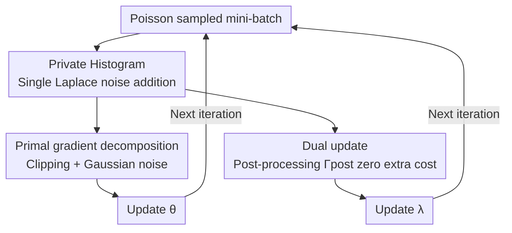

# Private Rate-Constrained Optimization with Applications to Fair Learning

**Conference**: ICLR 2026  
**OpenReview**: [https://openreview.net/forum?id=mex3rvs2KX](https://openreview.net/forum?id=mex3rvs2KX)  
**Code**: https://github.com/cleverhans-lab/dp-raco  
**Area**: Differential Privacy / Fair Learning / Constrained Optimization  
**Keywords**: Differential Privacy, Rate Constraints, Group Fairness, SGDA, Private Histogram

## TL;DR
This paper proposes RaCO-DP—a differential privacy version of the Stochastic Gradient Descent-Ascent (SGDA) algorithm. By unifying various "group fairness" metrics into "generalized rate constraints" based on histograms, the additional privacy overhead of the entire constrained optimization is reduced to the cost of a private mini-batch histogram estimation per step. This approach Pareto-dominates existing private fair learning methods on the privacy-utility-fairness triangle.

## Background & Motivation
**Background**: A broad class of tasks in trustworthy machine learning—such as group fairness (demographic parity, equalized odds), robust optimization, and cost-sensitive learning—can be formulated as constrained optimization problems that "minimize model error subject to certain **rate constraints** (prediction rate constraints)." Rate constraints impose conditions on the model's prediction rates across different data subsets (e.g., the proportion of different demographic groups predicted as "positive"). When these tasks are trained on sensitive data like medical records or employee profiles, Differential Privacy (DP) protection is mandatory.

**Limitations of Prior Work**: Private constrained optimization has focused almost exclusively on "fairness" constraints, and these specialized methods cannot be generalized to more general rate constraints. Fundamentally, standard DP optimization tools (DP-SGD) rely on the assumption that the objective function can be **decomposed per-sample**, allowing for per-sample gradient clipping and noise addition. However, rate constraints depend on **aggregated statistics** across groups (e.g., how many samples in a subset are predicted as a certain class), which naturally introduces inter-sample dependencies, breaks decomposability, and prevents direct integration into DP-SGD.

**Key Challenge**: The privacy guarantees of DP-SGD are built on the principle that "the influence of each sample on the gradient can be independently clipped." In contrast, the normalization term $|B_{\cap I}|$ (the number of samples in a mini-batch falling into a specific subset) appearing in rate constraints (or their regularizers) involves the entire mini-batch and cannot be split into per-sample terms. Decomposability and rate constraints are inherently incompatible.

**Goal**: Construct the first general DP framework for **arbitrary rate constraints** that supports multi-class classification, efficiently evaluates constraints under DP, and provides convergence proofs for non-convex cases.

**Key Insight**: The authors observe that all rate constraints are essentially linear combinations of "prediction rates for various categories on subsets of a dataset partition." If these prediction rates are first privately aggregated into a histogram, then **constraint evaluation and constraint gradients become mere post-processing of this histogram**—and post-processing does not consume additional privacy budget.

**Core Idea**: Use a "privately estimated histogram shared by both primal and dual updates" at each step to compress the privacy overhead of rate constraints to just the cost of "privately releasing a histogram."

## Method

### Overall Architecture
RaCO-DP solves the Lagrangian min-max form of constrained empirical risk minimization:

$$\min_{\theta\in\mathbb{R}^d}\ \max_{\lambda\in\Lambda}\ \Big\{ L(\theta,\lambda) := \ell(\theta) + \sum_{j=1}^{J}\lambda_j\big(\Gamma_j(\theta)-\gamma_j\big) \Big\}$$

Where $\theta$ represents the model parameters (primal), $\lambda$ represents the Lagrange multipliers (dual), $\Gamma_j$ is the $j$-th rate constraint, and $\gamma_j$ is the relaxation threshold. It wraps standard SGDA (descent on $\theta$, ascent on $\lambda$) with differential privacy.

Each iteration performs three actions on a mini-batch $B^{(t)}$ obtained via Poisson sampling: (1) **Private histogram calculation**: For each subset $D_q$ in the partition and each category $k$, privately aggregate the softmax predictions of samples in the mini-batch belonging to $D_q$ to obtain a noisy histogram $\hat H^{(t)}$. (2) **Private primal update**: Rewrite the constraint-related terms in the Lagrangian into a **per-sample calculable form** (relying on $\hat H^{(t)}$ as post-processing), then perform per-sample clipping, averaging, and Gaussian noise addition to update $\theta$ as in DP-SGD. (3) **Private dual update**: Directly calculate the value of each constraint by post-processing $\hat H^{(t)}$, thereby updating $\lambda$ without spending extra privacy budget. The privacy of the entire algorithm stems from the composition of "subsampled Laplace mechanism + subsampled Gaussian mechanism" over $T$ steps.

> The histogram, primal gradient decomposition, and dual post-processing blocks in the figure correspond to Key Designs 2/3/4 below; their unification into a single histogram is predicated on the Generalized Rate Constraints in Key Design 1.

### Key Designs

**1. Generalized Rate Constraints: Unifying all rate constraints into a histogram-expressible form**

Existing rate constraints (Goh, Cotter, etc.) are typically defined for binary classification and lack a clear pathway for efficient DP evaluation. The authors generalize them by first taking a "global partition" $\{D_1,\dots,D_Q\}$ of the dataset and allowing each constraint to be calculated over any **union of subsets** from this partition. Formally, the $j$-th constraint is written as:

$$\Gamma_j(\theta) = \sum_{I\in\mathcal{I}_j}\sum_{k=1}^{K}\alpha_{j,I,k}\,P_k\big(\cup_{i\in I}D_i;\theta\big)$$

where $\mathcal{I}_j\subseteq 2^{[Q]}$ is a family of subsets, $\alpha_j$ is a public weight vector, and $P_k(\cdot;\theta, \tau)=\frac{1}{|D|}\sum_x \sigma_\tau(h(\theta;x))_k$ is the differentiable prediction rate smoothed by a tempered softmax $\sigma_\tau$ (returning to hard rates as the temperature $\tau\to\infty$). For demographic parity, the global partition would be sensitive groups (e.g., Asian/Black/Caucasian), a specific constraint's local dataset would be {Asian, Non-Asian}, and weights would be $+1/-1$. This unified form offers two advantages: it natively supports multi-classification (which old forms could not), and **all constraints boil down to the "sum of prediction rates across categories within partitioned subsets"**—providing the structural basis for privacy efficiency via a single histogram. The authors also note that smaller global partitions (smaller $Q$) lead to more efficient noise utilization and better privacy-utility trade-offs.

**2. Private Histogram: Single noise addition shared by primal and dual updates**

All quantities to be calculated at each step (normalization terms in the primal gradient, constraint values in the dual) depend on the "sum of prediction rates for each category within each subset." The authors aggregate these into a histogram $H^{(t)}_{q,k}=\sum_{x\in D_q\cap B^{(t)}}\sigma(h(\theta;x))_k$. A key observation is that the $\ell_1$ sensitivity of this histogram is exactly 1: each sample belongs to exactly one subset of the global partition, and its softmax predictions sum to 1 across categories. Thus, $\varepsilon$-DP can be achieved by adding Laplace noise to each element:

$$\hat H^{(t)}_{q,k} = H^{(t)}_{q,k} + \mathrm{Lap}(1/\varepsilon)$$

Since $\hat H^{(t)}$ is already DP, any subsequent primal or dual updates are merely **post-processing** of it, consuming no additional budget according to the post-processing property of differential privacy. This is why the "additional privacy cost = private release of one histogram"—the overhead of multiple data queries is compressed into one.

**3. Primal Gradient Decomposition: Removing mini-batch dependency**

DP-SGD requires that each sample's contribution to the gradient can be independently clipped. However, the regularizer $R(\theta,\lambda;B)$ contains $P_k(B_{\cap I};\theta)=\frac{1}{|B_{\cap I}|}\sum_{x\in B_{\cap I}}\sigma(h(\theta;x))_k$, which includes a normalization denominator $|B_{\cap I}|$ that depends on the entire mini-batch, preventing per-sample decomposition. The authors resolve this by noting that $|B_{\cap I}|=\sum_{i\in I}\sum_k H^{(t)}_{i,k}$, allowing the denominator to be "read" from the histogram, yielding a per-sample regularizer estimate:

$$\hat R(\theta,\lambda;H,x)=\sum_{j=1}^{J}\lambda_j\Big(\sum_{I\in\mathcal{I}_j}\sum_{k_1}\alpha_{j,I,k_1}\frac{\mathbb{1}[x\in B_{\cap I}]}{\sum_{i\in I}\sum_{k_2}H^{(t)}_{i,k_2}}\sigma(h(\theta;x))_{k_1}-\gamma_j\Big)$$

In practice, $H$ is replaced by the private version $\hat H$. This makes each sample's gradient (the loss term $\frac{\nabla_\theta\ell(\theta;x)}{r|D|}$ plus the derivative of the above expression w.r.t. $\theta$) a well-defined, per-sample clippable quantity. Thus, the standard DP-SGD triad—clipping, averaging, and Gaussian noise—is directly applicable. Note that this estimate is biased due to the normalization term; the authors incorporate this bias into their convergence analysis.

**4. Zero Extra Cost for Dual Updates + Convergence Analysis under Biased Gradients**

The dual gradient is the current constraint value minus the slack $\nabla_\lambda L_j=\Gamma_j(\theta^{(t)};B^{(t)})-\gamma_j$. Directly re-evaluating the constraint on the mini-batch would consume additional privacy budget. The authors introduce a post-processing function acting directly on the private histogram:

$$\Gamma^{\text{post}}_j(\hat H^{(t)})=\sum_{I\in\mathcal{I}_j}\sum_{k_1}\alpha_{j,I,k_1}\frac{\sum_{i\in I}\hat H^{(t)}_{i,k_1}}{\sum_{i\in I}\sum_{k_2}\hat H^{(t)}_{i,k_2}}$$

It replaces the "sum of predictions of samples within a subset" with the corresponding histogram count. Since $\hat H^{(t)}$ is DP, dual updates cost zero extra privacy budget. Theoretically, because noisy histograms lead to **biased** primal/dual gradients and the noise scales drastically with dimension $d$ and constraint count $J$, classic SGDA convergence proofs do not apply. The authors provide a new analysis: it allows for biased gradients, requires dual error characterization via $\ell_\infty$ (rather than $\ell_2$), and **leverages the linear structure of dual parameters** to improve the convergence rate from $T^{-1/6}$ (Lin et al.) to $T^{-1/4}$, approaching the rate of standard minimization (rather than min-max) problems. The final (unclipped version) proof shows that under Lipschitz and smoothness assumptions, the algorithm finds an $(\alpha,\alpha)$-stationary point with high probability, where:

$$\alpha=O\Big(\big(\tfrac{\sqrt{d\log(JKn/\rho)\log(n/\delta)}}{n\varepsilon}\big)^{1/3}+\tfrac{K^{1/4}\sqrt{\log(n/\delta)}\log^{1/4}(JKn/\rho)}{(n\varepsilon)^{1/4}}\Big)$$

where $n=\min_q|D_q|$ is the size of the smallest subset—explaining why smaller global partitions and larger subsets yield better utility.

### Loss & Training
The objective is the Lagrangian min-max form; dual variables are restricted to a compact convex set $\Lambda$ (capping penalties when constraints are violated to ensure stability under non-convexity). Privacy parameters are scaled per Theorem 4.1: Laplace parameter $b\ge 2\max(1/\varepsilon, r\sqrt{T\log(T/\delta)}/\varepsilon)$, and Gaussian noise $\sigma\ge 10\max(C\log(T/\delta)/(r|D|\varepsilon), C\sqrt{T\log(T/\delta)}/(|D|\varepsilon))$. In practice, a tighter numerical privacy accountant (Doroshenko et al.) is used. Poisson sampling is employed for mini-batches to benefit from privacy amplification by subsampling. A tempered softmax temperature $\tau=1$ is sufficient in practice to make soft constraints approximate hard ones. The clipping norm $C$ is a critical hyperparameter (setting it too small can push convergence out of the feasible region).

## Key Experimental Results

### Main Results
Evaluation covers three types of constraints (demographic parity, FNR, equalized odds) across multiple datasets (Adult, Credit-Card, Parkinsons, ACSEmployment, CelebA, Heart), with baselines including DP-FERMI (Lowy 2023), Tran 2021, and Jagielski 2019, all with $\delta=10^{-5}$.

| Scenario | Model / Data | Key Results | Comparison |
|------|------------|---------|------|
| Tabular Data Fairness | Logistic Regression / Adult, Credit, Parkinsons | At the same privacy budget, accuracy is higher than all baselines for any fixed fairness gap (Pareto dominant). | Superior to DP-FERMI / Tran 2021 |
| Deep Networks | ResNet16 (6.4M) / CelebA, $\varepsilon=1$ | 90% accuracy + only 10% demographic disparity. | Approaches non-private 95%. |
| Multi-Constraint Extension | Logistic Regression / ACSEmployment | 18 subgroup constraints satisfied simultaneously; remains competitive at $\varepsilon=1$. | Compares to non-private SGDA. |
| Computational Efficiency | Adult | Training per step is **approx. three orders of magnitude faster** than DP-FERMI. | Comparison using open-source code on same hardware. |

### Ablation Study
| Configuration | Phenomenon | Explanation |
|------|------|------|
| Constraint Satisfiability (Adult) | Hard rate constraints consistently converge to preset $\gamma$ ($\gamma=0.01\sim0.2$). | Direct Lagrangian control is more reliable than "indirect hyperparameter tuning" in baselines. |
| Temperature $\tau=1$ | Sufficient to enforce hard constraints in practice. | No need for fine-tuning temperature. |
| Clipping Norm $C$ (FNR=0, no noise) | Constraints cannot be satisfied when $C<12.5$. | Clipping can push convergence out of the feasible region; $C$ is a critical hyperparameter. |
| Hard Constraints vs Soft (Dual Update) | Limited utility gain and deviates from theoretical guarantees. | Soft constraints are the more stable default choice. |

### Key Findings
- **When the Privacy Gap Narrows**: When the data volume is large relative to model dimension and convergence is fast (within dozens of steps), large batch denoising and subsampling amplification allow for small $\sigma$ and $b$. RaCO-DP nearly matches non-private accuracy (evident in Logistic Regression); the gap re-widens with high-capacity models like ResNet16.
- **Directly Controllable Fairness**: Unlike DP-FERMI, which relies on penalty terms and hyperparameter tuning to control fairness indirectly, RaCO-DP allows practitioners to **directly specify the maximum allowable gap** $\gamma$, which is empirically reliable.
- **Stronger Privacy Semantics**: Compared to methods that only protect sensitive label privacy (Tran/Jagielski), RaCO-DP protects the entire dataset while still achieving a better privacy-fairness trade-off.

## Highlights & Insights
- **Leveraging "One Histogram"**: Compressing the privacy overhead of all rate constraints into "private release of a single histogram" relies on the clean structure where $\ell_1$ sensitivity is exactly 1. This is a key pivot for fitting trustworthy ML constraints into DP and can be generalized to other "aggregate statistics-driven" constraints.
- **Post-Processing Free Lunch**: The primal update uses the histogram to read the normalization denominator, and the dual update calculates constraint values directly from the histogram. Both are post-processing steps and thus incur zero additional privacy cost.
- **Faster Convergence via Linear Dual Structure**: Improving min-max convergence analysis from $T^{-1/6}$ to $T^{-1/4}$ shows that the structural fact of "linear dual parameters" can be explicitly exploited—a valuable insight for general private min-max optimization.
- **Breaking the Myth that "Privacy Must Hurt Fairness"**: The authors demonstrate that with proper algorithm design, the privacy-fairness trade-off for constraints like demographic parity is far less severe than previously thought.

## Limitations & Future Work
- **Bias from Clipping**: Gradient clipping can cause SGD convergence to shift away from the feasible region, making the clipping norm $C$ a sensitive hyperparameter. This is a general issue for DP-SGD methods, not unique to this paper, but requires careful tuning.
- **Soft vs Hard Constraints**: Theoretical guarantees are built on soft constraints (tempered softmax). Hard constraints can be used in practice but lose theoretical grounding and offer limited utility gains.
- **Moderate Convergence Rate**: Compared to the proxy-objective method of Lowy 2023, RaCO-DP has a slower theoretical convergence rate, which is the trade-off for higher generality (arbitrary combinable rate constraints).
- **Future Work**: Exploring private learning under individual fairness—these constraints cannot be written as rate constraints and require new approaches.

## Related Work & Insights
- **vs DP-FERMI (Lowy et al. 2023)**: They design proxy objectives for fairness and control fairness indirectly; RaCO-DP directly addresses rate constraints, supports arbitrary combinations, allows direct specification of the maximum gap, and achieves better trade-offs under stronger standard DP (vs. weaker sensitive attribute DP), while being three orders of magnitude faster.
- **vs Jagielski 2019 / Tran 2023 (Sensitive Attribute Privacy)**: These methods only protect sensitive labels, adding less noise and thus having higher utility, but individuals can still be re-identified via non-sensitive attributes. Their privacy semantics are weaker than this work.
- **vs Berrada et al. 2023**: They use vanilla DP-SGD and found that the privacy-fairness trade-off is not obvious in well-generalized models, but their "fairness" is an error gap (more like subgroup generalization). This paper shows that constraints like demographic parity do require specialized mitigation, and proper algorithm design can overcome the trade-off.
- **vs Classic SGDA / DP min-max (Yang 2022, Lin 2020, Bassily et al.)**: This is one of the first works to integrate rate constraints, DP, and non-convex SGDA convergence analysis, achieving a faster rate by exploiting dual linearity.

## Rating
- Novelty: ⭐⭐⭐⭐⭐ The first general DP framework for arbitrary rate constraints; the "generalized rate constraints + private histogram post-processing" structural insight is very clean.
- Experimental Thoroughness: ⭐⭐⭐⭐ Covers three types of constraints, ranging from tabular data to deep networks, and single to 18 constraints. Pareto dominance and efficiency gains are significant.
- Writing Quality: ⭐⭐⭐⭐⭐ Logical progression from motivation to structure, algorithm, and theory. Figure 1 explains generalized rate constraints intuitively.
- Value: ⭐⭐⭐⭐⭐ Unifies a major class of constraints in trustworthy ML into DP and provides a practical tool for specifying fairness directly. Wide application potential.

<!-- RELATED:START -->

## Related Papers

- [\[ICLR 2026\] A Bayesian Nonparametric Framework for Private, Fair, and Balanced Tabular Data Synthesis](a_bayesian_nonparametric_framework_for_private_fair_and_balanced_tabular_data_sy.md)
- [\[ICLR 2026\] On Optimal Hyperparameters for Differentially Private Deep Transfer Learning](on_optimal_hyperparameters_for_differentially_private_deep_transfer_learning.md)
- [\[ICLR 2026\] Fair Graph Machine Learning under Adversarial Missingness Processes](fair_graph_machine_learning_under_adversarial_missingness_processes.md)
- [\[ICLR 2026\] Fair Reinforcement Learning for Just AI](fair_reinforcement_learning_for_just_ai.md)
- [\[ICLR 2026\] PateGAIL++: Utility Optimized Private Trajectory Generation with Imitation Learning](pategail_utility_optimized_private_trajectory_generation_with_imitation_learning.md)

<!-- RELATED:END -->
