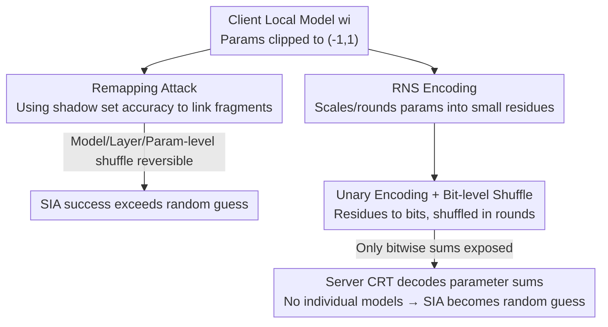

# Protection against Source Inference Attacks in Federated Learning

**Conference**: ICLR 2026  
**OpenReview**: [https://openreview.net/forum?id=1GMw3IwEHW](https://openreview.net/forum?id=1GMw3IwEHW)  
**Code**: To be confirmed  
**Area**: AI Security / Federated Learning Privacy  
**Keywords**: Federated Learning, Source Inference Attack, Shuffle Model, Residue Number System, Privacy Protection

## TL;DR
Addressing Source Inference Attacks (SIA) in Federated Learning—where a server guesses which client a specific data record belongs to—this paper demonstrates that standard shuffling is insufficient as attackers can remap shuffled models back to owners using shadow datasets. The authors propose combining **parameter-level shuffling with the Residue Number System (RNS) and unary encoding** at bit-level granularity. This ensures the server only perceives aggregated results without access to individual client models, reducing SIA success rates to random guessing levels with negligible impact on joint model accuracy.

## Background & Motivation
**Background**: Federated Learning (FL) was originally promoted as a privacy-friendly paradigm where "data stays local." Clients train locally and upload only model updates, which the server aggregates via functions like FedAvg: $W \leftarrow \sum_{i=1}^{n} \frac{N_i}{N} w_i$. However, an honest-but-curious central server can observe individual updates before aggregation, enabling various privacy attacks.

**Limitations of Prior Work**: While Membership Inference Attacks (MIA) ask if a data point was used for training, **Source Inference Attacks (SIA)** are more severe, asking **which specific client** owns a known training record. Attackers compare the prediction accuracy of the target record across individual client models; the model with the highest performance likely belongs to the data owner. This is critical in cross-silo scenarios: if hospitals collaborate and Hospital A specializes in cancer, an attacker confirming via SIA that a patient's data originated from Hospital A could infer a cancer diagnosis.

**Key Challenge**: MIA relies on model overfitting and can be mitigated by regularization or knowledge distillation. However, SIA exploits **heterogeneity in data distribution between clients**. As long as local models remain distinguishable, the attack persists. Conventional defenses fail: Differential Privacy (DP) requires noise levels that severely degrade accuracy to make models indistinguishable; regularization does not reduce distributional differences; and defenses against Data Reconstruction Attacks (DRA) like InstaHide or FedAdOb target gradient inversion, which SIA does not require.

**Goal**: Design a defense within the widely studied **shuffle model** (utilizing a trusted shuffler as an intermediary) that reduces SIA accuracy to random guessing without sacrificing joint model accuracy, while remaining compatible with mechanisms like DP.

**Key Insight**: Intuitively, a shuffler breaks the link between "data owner ↔ values," which should theoretically thwart SIA. However, the authors prove that **naive model-level shuffling is insufficient**—an attacker with a small "shadow dataset" (identically distributed but disjoint) can remap shuffled models back to owners based on shadow set accuracy.

**Core Idea**: Since coarse-grained shuffling is reversible, the granularity must be refined to the **bit-level**. Using RNS, parameters are decomposed into small residues, which are then unary-encoded into bit-strings and shuffled in rounds. Consequently, the server can only recover the **summed value** of each parameter (necessary for aggregation) while losing access to any individual client model. Without models to compare, SIA degrades to random guessing.

## Method
The methodology consists of two parts: **The "Attack" in Section 5**, constructing three remapping attacks to prove naive shuffling is reversible at various granularities; and **The "Defense" in Section 6**, utilizing parameter-level shuffling with RNS and unary encoding (Algorithm 1) to restrict leakage to aggregate sums.

### Overall Architecture
Threat Model: The attacker is an honest-but-curious central server observing the output of a trusted shuffler (non-colluding). The attacker knows a data point $z$ was used in training and possesses a shadow dataset $S_x$ for the target client. The focus is on cross-silo settings (2–100 clients, high compute/bandwidth) with parameters clipped to $(-1, 1)$ using FedAvg.

Defense Data Flow: Each client scales and rounds local model parameters $\lfloor p \cdot 10^r \rfloor$, encodes them via RNS into residues, and unary-encodes residues into bit vectors for the shuffler. The shuffler concatenates and **shuffles bits** for each residue position across all clients. The server sums the bits, uses the Chinese Remainder Theorem (CRT) to recover the **parameter sum**, and divides by $n$ and $10^r$ for the global model. The attack flow operates in reverse: using $S_x$ accuracy as a "fingerprint" to remap shuffled fragments back to clients.

### Key Designs

**1. Three Remapping Attacks: Proving Shuffling is Reversible**
These demonstrate why bit-level granularity is necessary. All attacks operate at $O(n \cdot \lVert S_x \rVert)$ complexity. **Model-level** (Algorithm 2): Shuffler shuffles whole models $w_{\pi(1)},\dots,w_{\pi(n)}$; attacker tests each on $S_x$, selecting the most accurate. **Layer-level** (Algorithm 3): Shuffling by layer would normally cause combinatorial explosion, but the authors focus on remapping the **last layer** FC$_L$ while averaging others, as the final layer best reflects distribution differences. **Parameter-level** (Algorithm 5): Parameters are shuffled individually. The attacker swaps single parameters in the global model with $n$ candidates to maximize $S_x$ accuracy. Even at parameter-level (e.g., CIFAR-10, $\alpha=0.1$), SIA remains at 28%—**higher than random guessing**.

**2. Bit-level Shuffle via RNS and Unary Encoding (Algorithm 1)**
To eliminate residual leakage, the authors refine granularity to bits. **RNS** decomposes parameters: given coprime moduli $M=\{m_1,\dots,m_u\}$ where $\prod m > n(10^r-1)$, a parameter $p \in (-1,1)$ becomes $\lfloor p\cdot 10^r \rfloor$ and then a set of residues $\{p_1,\dots,p_u\}$ where $p_i = x \bmod m_i$. Additive aggregation holds in the residue domain. Each residue $p_i$ is **unary-encoded** $U(x,k)=\{1\}^x\cup\{0\}^{k-x}$ into $m_i$ bits and submitted. The shuffler shuffles these bits. The server only recovers the count of 1s (the sum) per residue, recovering the aggregate sum via CRT. This process is lossless (Claim A.1) and restricts SIA to random guessing (Theorem 1).

**3. Trust Models and Compatibility**
The defense supports three shuffler trust levels via MixNet (Alg. 8): **Fully Trusted** (can use Run-Length Encoding to reduce overhead to 1.03×); **Semi-honest** (uses Onion Encryption); and **Malicious** (uses Zero-Knowledge Proofs for integrity). It is fully compatible with DP-SGD and inherently mitigates DRA by effectively increasing the batch size $n$-fold, making reconstructed images unreadable.

### Mechanism: Server-side Aggregation Example
Assume 2 clients, precision $r=1$, moduli $M=\{3,5,7\}$. Client A has parameter $p_A=0.3 \Rightarrow \lfloor 3 \rfloor$, RNS encoded as $\{3\bmod 3, 3\bmod 5, 3\bmod 7\}=\{0,3,3\}$. Client B has $p_B=0.4 \Rightarrow 4$, encoded as $\{1,4,4\}$. Bits are shuffled per round. Round 1 (mod 3) reveals the count of 1s is 1 (sum = 1). Round 2 (mod 5) reveals sum 7 $\equiv 2$. Round 3 (mod 7) reveals sum 7 $\equiv 0$. Applying CRT to $(1,2,0)$ recovers parameter sum $7$. Dividing by $10^r\cdot n = 20$ yields $0.35$—precisely $(0.3+0.4)/2$. The server cannot distinguish which bits belonged to A or B.

## Key Experimental Results

### Main Results
Evaluated on MNIST (CNN), CIFAR-10 (CNN), and CIFAR-100 (ResNet-18). Heterogeneity controlled by Dirichlet parameter $\alpha$. Shadow set is 5% of target training set.

| Setting (CIFAR-10, $\alpha=0.1$, 10 clients) | SIA Success Rate | Note |
|---|---|---|
| Vanilla FL (No shuffle) | ~50% | Strongest attack |
| Model-level shuffle + Alg. 2 | ~50% | Almost fully remapped |
| Parameter-level shuffle + Alg. 5 | ~28% | Reduced but > random guess |
| **Ours (Alg. 1)** | ≈ Random Guess | Validates Theorem 1 |

For CIFAR-100/ResNet-18 at $\alpha=0.1$, model-level remapping reaches ~78% success, while Alg. 1 consistently maintains random guessing levels.

### Communication and Accuracy Analysis

| Model / Dataset | $r$ | Inflation Factor (vs Vanilla, Semi-honest) |
|---|---|---|
| CNN / MNIST | 3 | 1.04× |
| CNN / CIFAR-10 | 5 | 1.81× |
| ResNet / CIFAR-100 | 5 | 1.81× |

$r=3$ provides near-vanilla accuracy, while $r=8$ matches it exactly. Computational cost is low: encoding 11M ResNet parameters takes ~19 seconds.

## Highlights & Insights
- **Privacy Identity**: "Exposing shuffled bit vectors is equivalent to exposing only their sum" (Proposition A.2). This enables lossless privacy amplification.
- **Overcoming Bit-level Overhead**: Using RNS to compress parameters before unary encoding prevents the communication explosion typically associated with bit-level shuffling.
- **Rethinking Shuffling**: The discovery that naive shuffling is reversible via shadow datasets serves as a critical warning for existing shuffle-model FL systems.
- **Versatility**: Alg. 1 acts as a secure aggregation primitive that also mitigates DRA without the overhead of heavy cryptographic protocols like MPC.

## Limitations & Future Work
- **Sum-based Aggregation Only**: Relies on additive properties in residue domains; not directly applicable to median or clustering-based aggregation.
- **Shuffler Dependence**: Requires a non-colluding shuffler or MixNet infrastructure.
- **De-aggregation Attacks**: Does not account for attacks reconstructing individual models from multiple rounds of global model updates.
- **Shadow Dataset Assumption**: Assumes attackers can obtain 5% identically distributed data, which varies in feasibility by domain.

## Related Work & Insights
- **Comparison with DP**: DP adds noise that damages accuracy to hide sources. Ours is a **noise-free** defense that hides sources by restricting leakage to the aggregate sum, compatible with DP.
- **Comparison with Regularization**: Techniques like FedMD fail to hide distribution heterogeneity; SIA remains effective against them.
- **Comparison with Secure Aggregation (SA)**: Traditional SA (secret sharing) has high communication costs at $t=n-1$ and fails if clients drop out. MixNet shuffling is more robust and efficient in cross-silo settings.

## Rating
- Novelty: ⭐⭐⭐⭐⭐ First robust defense against SIA in the shuffle model using bit-level granularity.
- Experimental Thoroughness: ⭐⭐⭐⭐ Extensive datasets, though some results are visual rather than tabular.
- Writing Quality: ⭐⭐⭐⭐ Clear logical flow from attack feasibility to defensive solution.
- Value: ⭐⭐⭐⭐⭐ Highly practical for privacy-preserving cross-silo FL and serves as a general secure aggregation primitive.

<!-- RELATED:START -->

## Related Papers

- [\[ICLR 2026\] Curation Leaks: Membership Inference Attacks against Data Curation for Machine Learning](curation_leaks_membership_inference_attacks_against_data_curation_for_machine_le.md)
- [\[ICLR 2026\] Federated Learning of Quantile Inference under Local Differential Privacy](federated_learning_of_quantile_inference_under_local_differential_privacy.md)
- [\[ICLR 2026\] Robust Federated Inference](robust_federated_inference.md)
- [\[ICML 2025\] Theoretically Unmasking Inference Attacks Against LDP-Protected Clients in Federated Vision Models](../../ICML2025/ai_safety/theoretically_unmasking_inference_attacks_against_ldp-protected_clients_in_feder.md)
- [\[ICLR 2026\] Traceable Black-box Watermarks for Federated Learning](traceable_black-box_watermarks_for_federated_learning.md)

<!-- RELATED:END -->
