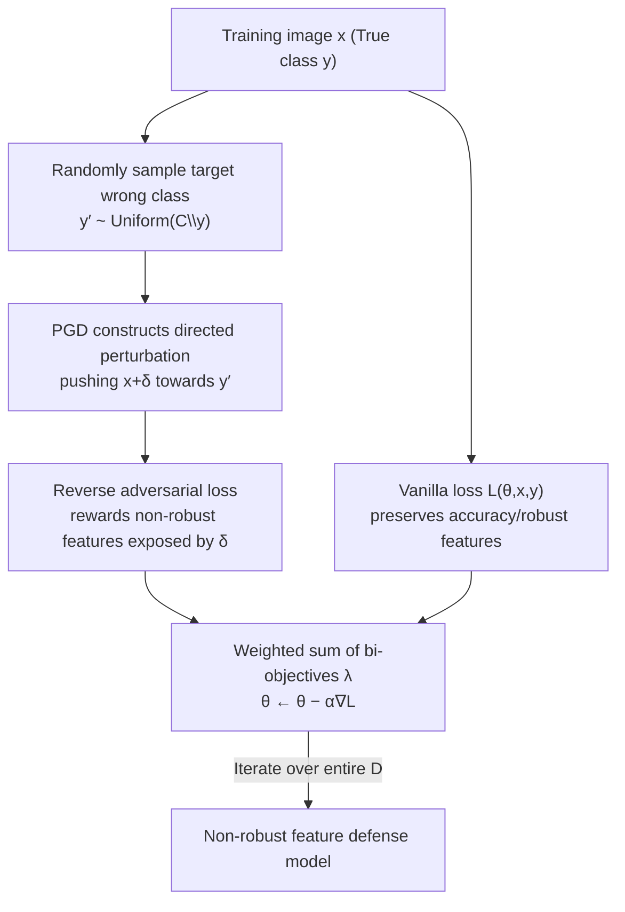

# Reducing Information Dependency Does Not Cause Training Data Privacy. Adversarially Non-Robust Features Do.

**Conference**: ICLR 2026  
**OpenReview**: [https://openreview.net/forum?id=BnEG8pn3pK](https://openreview.net/forum?id=BnEG8pn3pK)  
**Code**: https://github.com/BreuerLabs/Anti-Adversarial-Training  
**Area**: AI Safety / Training Data Privacy / Model Inversion Attack  
**Keywords**: Model Inversion Attack, Training Data Reconstruction, Information Dependency, Non-robust Features, Adversarial Robustness

## TL;DR
This paper overturns the mainstream hypothesis that "reducing information dependency between training data and models prevents reconstruction attacks" through three counter-intuitive experiments. It demonstrates that privacy under Model Inversion Attacks (MIA) actually stems from "adverserially non-robust features." Based on this, it proposes Anti-Adversarial Training (AT-AT), reducing the reconstruction rate of ResNet-152 from 84% to 6.5% while maintaining higher accuracy than existing SOTA defenses.

## Background & Motivation
**Background**: Model Inversion Attacks (MIA) have become the primary tool for measuring the degree of "training data leakage" in high-resolution vision models. Attackers with white-box access and significant computing power/external data can reconstruct training samples (e.g., faces) class by class. To defend against MIA, a group of recent SOTA methods (MID, BiDO, TL-DMI, SCA) are almost all built on the same theoretical assumption: **training data leakage stems from excessive "information dependency" between training inputs and internal model representations/outputs (including rote memorization).** Therefore, reducing this dependency (via mutual information regularization, HSIC penalties, sparse coding, etc.) should stop reconstruction.

**Limitations of Prior Work**: This "information dependency $\to$ reconstruction" theory has never been strictly verified. It assumes that "effective defense" and "reduced information dependency" are inherently linked, but no one has tested whether effective defenses actually lower dependency metrics. Furthermore, it remains unknown whether models with extremely low or high dependency actually exhibit better or worse privacy.

**Key Challenge**: The intuition of information dependency ("the more the model remembers $\to$ the easier it is to reconstruct") may not align with the actual reconstruction mechanism. If the mechanism is misunderstood, the entire direction of defense design ("memorizing less") is misguided.

**Goal**: (1) Verify whether "information dependency-driven leakage" holds; (2) identify the representation attributes that truly determine MIA reconstructibility; (3) design a defense that directly manipulates these attributes.

**Key Insight**: The authors pivot from "information-theoretic dependency" to **non-robust features** in adversarial example literature—features that are "generalizable and useful for classification but imperceptible to humans and fragile" (Ilyas et al., 2019). The intuition is that what humans can reconstruct depends on human-perceptible "robust features." If a model relies solely on non-robust features that humans cannot interpret for classification, the reconstructed images will naturally fail to be recognized by humans or external models as the target class.

**Core Idea**: Use "non-robust features" rather than "information dependency" to explain and create MIA privacy—by intentionally forcing the model to learn imperceptible non-robust features, one can block reconstruction while preserving accuracy.

## Method

### Overall Architecture
The paper follows a three-part argumentative chain: "falsify old theories, establish new causality, and develop a defense":

1.  **Falsification (Section 3)**: Three counter-intuitive experiments to strike down three corollaries of the "information dependency $\to$ leakage" hypothesis.
2.  **Correlation (Section 4)**: Systematic measurement of the adversarial robustness of privacy defenses. It reveals a strong linear correlation ($R^2 \approx 0.93$–$0.95$) between "decreased leakage" and "decreased adversarial robust accuracy," suggesting SOTA defenses are unconsciously pushing models toward non-robust features.
3.  **Causality (Section 5)**: The proposal of **Anti-Adversarial Training (AT-AT)**. By intentionally rewarding non-robust features, randomized controlled trials (half $\lambda=0$ control, half $\lambda>0$ treatment) prove this mechanism **causally** creates stronger defenses.

AT-AT is the only component with a specific training process, following this single-step SGD loop:

### Key Designs

**1. Three Experiments Falsifying "Information Dependency $\to$ Leakage"**

The authors designed experiments for three inevitable corollaries of the old theory, all of which failed. First, **effective defenses do not reduce dependency metrics**: The standard measure of dependency in MIA literature is HSIC (dependency between input $X$ and intermediate embedding $Z_j$), defined as:
$$\mathrm{HSIC}(X, Z_j) = \big\|\, \mathbb{E}[\phi(X)\psi(Z_j)^\top] - \mathbb{E}[\phi(X)]\,\mathbb{E}[\psi(Z_j)]^\top \,\big\|_{\mathrm{HS}}^2$$
Empirical results show that for defenses like TL-DMI and NegLS, which minimize reconstruction rates (AttAcc@1), HSIC barely decreases or even increases. Conversely, increasing the HSIC weight $\lambda_x$ in BiDO to manually suppress HSIC (BiDO\*\* model) actually worsens the defense. Second, **perfect rote memorization does not lead to reconstruction**: Using the random label setting (Zhang et al., 2017), networks were made to memorize the entire training set (train acc $\approx$ 1.0, test acc $\approx$ 0.001). MIA failed completely with high L2 reconstruction distances, showing that maximized information dependency can lead to maximum privacy. Third, **unseen pixels are still reconstructed**: The authors trained on images with >97% of pixels removed via Lasso. These pixels have "arbitrarily strong" privacy guarantees under information-theoretic bounds (Fisher Information Loss / HCR bounds), yet PPA attacks still classified >50% of reconstructed images correctly. Conclusion: **reducing information dependency is neither sufficient nor necessary for preventing leakage.**

**2. Privacy-Adversarial Robustness Trade-off: Quantifying the "Robustness Cost of Privacy"**

The authors systematically evaluated the robustness of MIA defenses against adversarial examples. Using AutoAttack (where robust accuracy is 0 at $\epsilon=0.031$, so smaller $\epsilon \in \{0.031, 0.0025, 0.0005, 10^{-5}\}$ were used), they modeled leakage as a linear function of robust accuracy:
$$\mathrm{Leakage}_{\text{AttAcc@1},j}=\beta_0+\beta_1\mathrm{TestAcc}_j+\beta_2\mathrm{Acc}_{\epsilon=0.0025,j}+\beta_3\mathrm{Acc}_{\epsilon=0.0005,j}+\beta_4\mathrm{Acc}_{\epsilon=10^{-5},j}+e_j$$
Robust accuracy alone almost perfectly predicted leakage ($R^2 \approx 0.93$–$0.95$), while clean accuracy contributed insignificantly once robust accuracy was controlled. This allows for calculating the "robustness cost of privacy"—reducing PPA leakage by 1 percentage point (pp) corresponds to a 5.4 pp drop in robust accuracy at $\epsilon=0.0005$. This trade-off holds for "general information dependency" defenses (MID/BiDO/TL-DMI) but not "gradient suppression" defenses (NegLS/RoLSS/Trap-MID), proving that many SOTA defenses move along a quantifiable statistical trade-off.

**3. AT-AT Anti-Adversarial Training: Rewarding Non-Robust Features**

The third design proves **causality**. Classic Adversarial Training (AT, Madry et al., 2017) rewards robust features as signals and penalizes non-robust features. AT-AT **inverts this logic**: it treats human-perceptible image $x$ as "noise" and treats the imperceptible non-robust features exposed by perturbation $\delta$ as "signals" to be learned (i.e., optimizing $(x_{\text{Yoda}} + \delta_{\text{Luke}}) \to \text{Luke}$). AT-AT uses a bi-objective loss balanced by a user-selected $\lambda$:
$$\min_\theta\ \mathbb{E}_{(x,y)\sim D}\Big[\,L(\theta,x,y)\ +\ \lambda\cdot\min_{\delta\in S}L(\theta,x+\delta,y')\,\Big],\quad y'\neq y$$
In each SGD step, a training image $x$ and a random target class $y'$ are sampled. PGD computes a directed perturbation $\delta$ pushing $x$ toward $y'$. The model is updated to satisfy both the vanilla loss (learn $y$ for accuracy) and the reverse adversarial loss (learn $y'$ to reward non-robust features). Randomized trials showed the treatment group (AT-AT) reduced PPA AttAcc@1 from 84% to 6.5% ($p < 10^{-16}$).

### Loss & Training
The core loss is the AT-AT bi-objective formula above. The vanilla term ensures utility (while inevitably containing some robust features), and the reverse adversarial term via the inner PGD loop pushes the model toward non-robust features. A larger $\lambda$ increases privacy (making reconstruction harder and adversarial vulnerability higher).

## Key Experimental Results

The study focused on white-box face recognition: datasets FaceScrub / CelebA; attacks PPA / IF-GMI / PPDG; architectures ResNet-152 / ResNet-18 / DenseNet-169.

### Main Results: Three Falsification Experiments

| Experiment | Setting (RN-152, FaceScrub) | Key Phenomenon | Impact on Old Theory |
| :--- | :--- | :--- | :--- |
| HSIC Testing | AttAcc@1 vs HSIC | TL-DMI reduces AttAcc@1 to 0.190 but HSIC barely drops; BiDO\*\* with low HSIC has worse defense (AttAcc@1 0.815) | Effective defenses do not reduce dependency |
| Rote Memorization | Random label training | Train Acc 1.000 / Test 0.001; L2-Face 0.768 $\to$ 1.249, reconstruction collapses | Max dependency is most private |
| Unseen Pixels | Training with 97.8% pixels deleted | TestAcc 0.910, AttAcc@1 remains 0.592 (NoDef 0.881) | Information-theoretic bounds are ineffective |

### Key Findings
- **Non-robust/robust accuracy, not information dependency, determines MIA reconstructibility**: Robust accuracy alone explains leakage with $R^2 \approx 0.95$.
- **The privacy-robustness trade-off is non-uniform**: The cost is highest for "medium-sized" perturbations ($\epsilon=0.0005$).
- **The trade-off applies to general dependency defenses**: Gradient suppression defenses follow a different mechanism.
- **AT-AT is superior**: Across all datasets and attacks, AT-AT (red dots) achieves stronger privacy at higher clean accuracy compared to 7 SOTA baselines.

## Highlights & Insights
- **Bridging Non-Robust Features and Privacy**: Connecting the theory that non-robust features are "generalizable but imperceptible" to the goal of "accurate classification without visual leakage."
- **Causal Interpretation**: Moving beyond correlation through randomized controlled trials + Beta regression makes the findings significantly more robust.
- **Quantifiable Cost Table**: Providing a "price tag" (robustness loss per unit of privacy gain) for defense design.

## Limitations & Future Work
- **Scope**: Limited to high-resolution image classification. Extension to LLMs or diffusion models remains an open question.
- **Adversarial Vulnerability**: AT-AT increases sensitivity to adversarial attacks by design; deployment in safety-critical scenarios requires caution.
- **Metric Sensitivity**: Reconstructibility is measured by an external model (Inception-v3); whether the "imperceptible = private" equation holds for medical or remote sensing imagery (where "machine reading" is standard) is questionable.

## Related Work & Insights
- **vs. MID / BiDO / SCA**: These reduce "information dependency" to defend against MIA. Ours proves these metrics are irrelevant; their effectiveness actually comes from an unconscious shift to non-robust features.
- **vs. TL-DMI**: Prev. SOTA that limits parameters to prevent private information encoding. Ours shows it also works via non-robust feature transfer.
- **vs. Adversarial Training (AT)**: AT rewards robust features; AT-AT is its mirror image, rewarding non-robust features.
- **vs. Information-Theoretic Bounds**: These bounds are often too optimistic in practice and fail to protect against modern MIA.

## Rating
- Novelty: ⭐⭐⭐⭐⭐ Overturns mainstream assumptions with a clear new mechanism.
- Experimental Thoroughness: ⭐⭐⭐⭐⭐ Extensive benchmarks across defenses, attacks, and causal tests.
- Writing Quality: ⭐⭐⭐⭐ Clear argumentation, though technical details are heavily relegated to the appendix.
- Value: ⭐⭐⭐⭐⭐ Redefines the design guidelines for MIA defense and reveals a new trade-off axis.

<!-- RELATED:START -->

## Related Papers

- [\[ICLR 2026\] When Flatness Does (Not) Guarantee Adversarial Robustness](when_flatness_does_not_guarantee_adversarial_robustness.md)
- [\[ICLR 2026\] Why Do Unlearnable Examples Work: A Novel Perspective of Mutual Information](why_do_unlearnable_examples_work_a_novel_perspective_of_mutual_information.md)
- [\[ICLR 2026\] Robust Fine-Tuning from Non-Robust Pretrained Models: Mitigating Suboptimal Transfer with Epsilon-Scheduling](robust_fine-tuning_from_non-robust_pretrained_models_mitigating_suboptimal_trans.md)
- [\[CVPR 2026\] ReMoE: Region-Mixture Experts for Adversarially-Robust Vision Transformers](../../CVPR2026/ai_safety/remoe_region-mixture_experts_for_adversarially-robust_vision_transformers.md)
- [\[CVPR 2026\] Towards Robust Vision Transformers: Path Dependency Analysis and a Simple Two-Stage Adversarial Training](../../CVPR2026/ai_safety/towards_robust_vision_transformers_path_dependency_analysis_and_a_simple_two-sta.md)

<!-- RELATED:END -->
