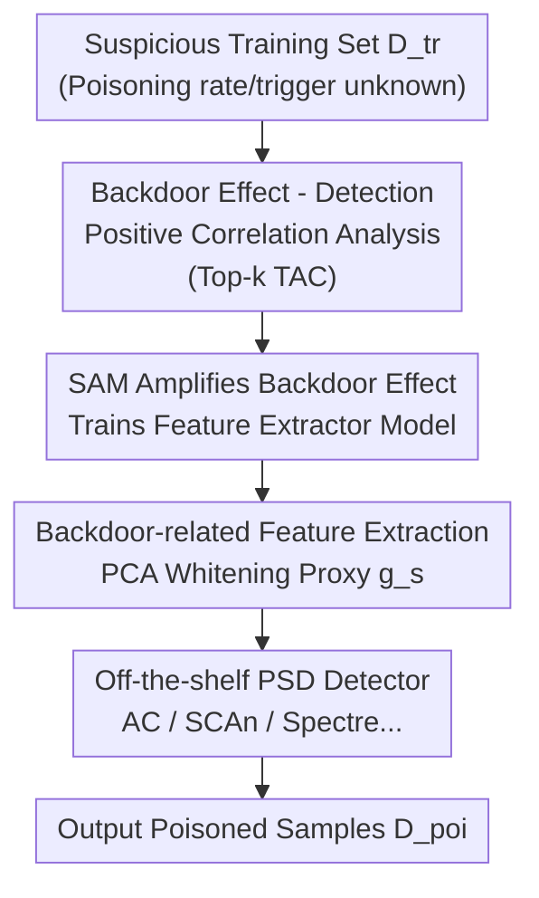

# Reliable Poisoned Sample Detection against Backdoor Attacks Enhanced by Sharpness-Aware Minimization

**Conference**: ICLR 2026  
**OpenReview**: [https://openreview.net/forum?id=q5ePtZc9N7](https://openreview.net/forum?id=q5ePtZc9N7)  
**Code**: To be confirmed  
**Area**: AI Security / Backdoor Defense  
**Keywords**: Backdoor Attacks, Poisoned Sample Detection, Sharpness-Aware Minimization, Trigger Activation Change, Feature Separability

## TL;DR
This paper discovers that the root cause of the severe degradation of Poisoned Sample Detection (PSD) methods under weak backdoor attacks is that the "backdoor effect" is too weak. Consequently, it proposes using Sharpness-Aware Minimization (SAM) to train the feature extraction model to **amplify** the backdoor effect, thereby enhancing various existing PSD methods in a plug-and-play manner, achieving an average True Positive Rate (TPR) improvement of +34.3%.

## Background & Motivation

**Background**: For data-poisoning backdoor attacks, Poisoned Sample Detection (PSD) during the pre-training phase is a promising defense paradigm. Its general workflow is to first train a model normally on a suspicious (potentially poisoned) dataset, and then exploit the statistical differences (e.g., clustering, spectral analysis) between poisoned and clean samples in the feature space to filter out the poisoned samples. Representative methods include Activation Clustering, Spectral Signature, SCAn, Spectre, and Beatrix.

**Limitations of Prior Work**: The authors observe that these "advanced" PSD methods degrade significantly when encountering **weak backdoor attacks** (e.g., low poisoning rate such as 0.5%/1%, or weak triggers like Adap-Blend)—poisoned and clean samples cluster closely together in the feature space, leaving detectors ineffective. Notably, a weak backdoor effect **does not equate to** a low Attack Success Rate (ASR): in many cases, the ASR remains high, yet the detection performance collapses completely, implying that the attack remains dangerous but indefensible.

**Key Challenge**: The authors attribute the root cause of degradation to the weakening of the "**backdoor effect**"—specifically, the relative intensity of neuron activations induced by the trigger compared to benign feature activations decreases, which can be measured by the Trigger Activation Change (TAC) metric. Through statistical analysis on CIFAR-10/ResNet-18, they find that the Pearson correlation coefficient of Top-k TAC with detection AUC is as high as 0.73, and with the Silhouette coefficient is up to 0.87. This confirms that "strong backdoor effect → separable features → easy detection" is a strongly positively correlated chain.

**Goal**: Under the constraint that the defender cannot modify data-level factors such as trigger properties and poisoning rates, how can feature separability for detection be enhanced under weak backdoor attacks?

**Key Insight**: Since the data level cannot be altered, the approach focuses on **how the feature extraction model is trained**. The authors leverage a known property of SAM: SAM tends to yield sparse activations, amplifying dominant activations while suppressing weaker ones. If the backdoor-related neurons happen to be the "dominant" ones, SAM can further amplify them.

**Core Idea**: Use SAM to replace standard SGD for training the feature extraction model in PSD. This actively **amplifies** the backdoor effect and widens the feature gap between poisoned and clean samples, facilitating the operation of existing detectors. It is a model-agnostic and attack-agnostic plug-and-play enhancement module rather than a brand-new detector.

## Method

### Overall Architecture

The overall method revolves around a counter-intuitive operation: **deliberately learning the backdoor more "intensely" during defense** to expose the poisoned samples more easily. The design is divided into two parts: first, statistical analysis establishes the causal intuition of "backdoor effect ↔ detection performance", which is then used to design a three-stage SAM-enhanced PSD pipeline. The input is a potentially poisoned training set $D_{tr}$ (the defender is unaware of the poisoning rate $p$, trigger $\Delta$, or generator function $g$, but has access to a small clean reference set), and the output is the set of identified poisoned samples $D_{poi}$.

The key shift occurs in the first stage: while the traditional paradigm passively accepts features trained by SGD, this work replaces the first stage with SAM training to actively amplify activation differences in Top-k TAC neurons; the second stage extracts backdoor-related features from intermediate activations (using PCA whitening as a proxy since the defender cannot access the true TAC indices); the third stage feeds these features to any off-the-shelf PSD detector.

### Key Designs

**1. Strong Positive Correlation between Backdoor Effect and Detection Performance: Translating "Hard to Detect" into "Low TAC"**

This design addresses the question of why PSD fails under weak attacks. The authors quantify the backdoor effect using Trigger Activation Change (TAC). For the $j$-th neuron in the $l$-th layer, TAC is defined as the mean squared difference in activation between a clean sample $x$ and its poisoned counterpart $\tilde{x}$ on that neuron:

$$\text{TAC}^{(l)}_j(D) = \frac{1}{|D|}\sum_{x \in D}\left(f^{(l)}_j(x) - f^{(l)}_j(\tilde{x})\right)^2$$

A larger TAC indicates that the neuron is more sensitive to the trigger, marking it as a "backdoor neuron". Averaging the TAC of the top $k$ neurons ($k=30$) in the last convolutional layer yields the Top-k TAC: $\text{Top-}k\,\text{TAC}^{(l)}(D) = \frac{1}{|T_k|}\sum_{j \in T_k}\text{TAC}^{(l)}_j(D)$. Running sweep experiments across various attack/defense combinations with varying poisoning rates, the authors find that Top-k TAC exhibits a strong linear positive correlation with detection AUC (Pearson correlation 0.73, regression $R^2=0.54$) and with the Silhouette coefficient (Pearson 0.87, $R^2=0.76$). The key conclusion is: detection difficulty is not due to inferior detectors, but because the backdoor effect is deliberately weakened by adversaries. As long as the Top-k TAC can be increased without knowing attack details, detection performance will recover. This correlation serves as the foundational argument for the proposed methodology.

**2. Selective Amplification of Backdoor Neurons via SAM: Cultivating Trigger Activations via Flat Minima Optimization**

This design answers how to boost TAC without touching the data. SAM's objective is to solve min-max optimization within a $\rho$-neighborhood of weights: $\min_\theta \max_{\|\epsilon\|_2 \le \rho} L(\theta+\epsilon)$, whose update rule introduces a second-order regularization term compared to SGD: $\theta^{SAM}_{t+1} \approx \theta_t - \eta[\nabla L(\theta_t) + \rho \frac{\nabla^2 L(\theta_t)\nabla L(\theta_t)}{\|\nabla L(\theta_t)\|}]$. The authors perform theoretical decomposition on a two-layer ReLU network $f(x;\theta)=a^\top\sigma(Wx)$ and provide **Proposition 1**: under certain conditions (where neurons activate on poisoned inputs, do not activate on clean inputs, and have negative output weights), SAM, compared to SGD, increases the single-step TAC of these "backdoor neurons" by **at least** an order of $\eta\rho$. The intuition is that, to fit poisoned data points precisely, SAM is driven to selectively amplify the pre-activations of these neurons. Empirically (Fig. 3), SAM consistently elevates high-TAC neurons (backdoor neurons, blue bars) while suppressing irrelevant ones (red bars), essentially "sharpening" the backdoor effect. This is in stark contrast to FT-SAM—which uses clean data post-training to **suppress** backdoors to repair the model, whereas this work uses poisoned data during pre-training to **amplify** backdoors to assist detection, operating in completely opposite directions.

**3. Three-Stage SAM-enhanced PSD Framework: Bypassing Unknown TAC Indices with a PCA Whitening Proxy**

This design translates the first two points into a plug-and-play pipeline. **Stage-1**: Train a backdoored model $f_{\theta_{SAM}}$ using SAM (Eq. 3). **Stage-2**: Extract intermediate layer features $g=\phi_{\theta_{SAM}}(x)$. Since the defender does not know which neurons are the actual Top-k TAC neurons, they employ a PCA whitening proxy to approximate the backdoor-related features: $g_s = \Sigma^{-1/2}Pg$, where $P$ is the PCA projection matrix estimated from the training data, and $\Sigma$ is the covariance matrix estimated from the clean reference set combined with dynamically filtered candidate clean samples—whitening amplifies the variance along the backdoor direction, facilitating subsequent extraction by detectors. **Stage-3**: Input $g_s$ to any off-the-shelf PSD detector (such as Activation Clustering). The entire framework is model-agnostic and attack-agnostic, causing zero intrusion to existing PSD methods: only the model used for feature extraction is substituted, leaving the detection algorithms untouched. Therefore, it can be seamlessly integrated with Spectre, SCAn, SS, AC, Beatrix, and other methodologies.

### Loss & Training
The core training objective is the sharpness-aware cross-entropy of SAM: the inner loop computes the worst-case perturbation with an $\ell_2$ radius of $\rho$ on weights, while the outer loop minimizes the loss under this perturbation. $\rho$ is the critical hyperparameter controlling the perturbation budget, directly determining the degree of amplification of the backdoor effect. Other settings follow standard backdoor training configurations (default poisoning rate 5%, with 1%/0.5% specifically configured for weak attack scenarios).

## Key Experimental Results

### Main Results

Evaluations are conducted across 13 backdoor attacks $\times$ 5 PSD detectors (Spectre/SCAn/SS/AC/Beatrix) $\times$ multiple datasets (CIFAR-10/GTSRB/Tiny-ImageNet) $\times$ multiple architectures (ResNet-18/VGG19-BN/DenseNet-161), using TPR↑, FPR↓, and F1↑ as metrics. The table below shows the average changes across detectors when combined with SAM on CIFAR-10/ResNet-18:

| Detector | Avg. TPR Change | Avg. FPR Change | Avg. F1 Change |
|--------|------|------|------|
| Spectre + SAM | **+30.6** | −1.7 | +26.1 |
| SCAn + SAM | +3.2 | −0.0 | +1.9 |
| SS + SAM | +20.5 | −1.1 | +19.4 |
| AC + SAM | +29.8 | +3.0 | +13.7 |
| Beatrix + SAM | **+87.4** | −1.8 | +68.1 |

The gains under weak attacks are particularly striking: Beatrix on Blended demonstrates a TPR jump from 5.0% $\rightarrow$ 99.8%, and F1 from 5.0% $\rightarrow$ 87.6%; AC on Adap-Blend sees TPR rise from 1.5% $\rightarrow$ 97.1%; Spectre on WaNet increases TPR from 66.4% $\rightarrow$ 97.7%. The average TPR gain across the entire table is +34.3%.

### Ablation Study & Cross-Dataset

| Configuration | Phenomenon | Explanation |
|------|------|------|
| GTSRB / Blended / AC | 0.0% → 99.7% TPR | Resurrects a combination that was previously completely ineffective |
| GTSRB / LF / AC | 0.0% → 87.9% TPR | Significant recovery under weak triggers |
| Restricted/Filtered/OOD Clean Auxiliary Set | Remains robust | Sec. D.2.2, insensitive to the quality of the reference set |

### Key Findings
- **The backdoor effect is the bottleneck of detection performance**: The strong positive correlation (0.73) between Top-k TAC and AUC proves that "detection difficulty" is essentially due to "weak backdoors", and elevating TAC can restore detection capabilities.
- **SAM acts as a selective amplifier**: It selectively elevates backdoor neurons and suppresses irrelevant ones (Fig. 3), backed by the theoretical lower bound of Proposition 1, rather than offering undifferentiated amplification.
- **Largest gain observed on Beatrix**: Beatrix heavily relies on the feature separability of high-order statistics. By magnifying the backdoor variance, SAM transforms Beatrix from "almost completely ineffective" to "near-perfect," demonstrating that its prior failures were indeed bottlenecked by weak separability.

## Highlights & Insights
- **Counter-intuitive perspective of "amplifying the backdoor to defend against it"**: Traditional defenses focus on suppressing the backdoor, whereas this work deliberately trains the backdoor more aggressively because a stronger backdoor translates to more separable poisoned samples. This inverse logic is highly ingenious.
- **Translating an engineering issue into quantifiable physical metrics**: Quantifying "detection difficulty" as neuronal activation intensity via Top-k TAC, and establishing the causal direction through correlation experiments, establishes a solid foundation for the methodology.
- **Plug-and-play and non-intrusive**: Substituting only the feature extraction model without altering the detection algorithms seamlessly enhances an entire array of off-the-shelf PSD methods. Positioning the work as an "enhancement paradigm" rather than a "new detector" holds great transfer value and can be generalized to other security detection tasks that rely on feature separability.

## Limitations & Future Work
- The theoretical analysis is built upon simplified settings of a two-layer ReLU network. The generalizability to deep networks is verified only empirically in Fig. 3, limiting its analytical rigor.
- Deliberately amplifying the backdoor implies producing a model that is more heavily corrupted by the backdoor. Since it is intended only for feature extraction and detection, deploying it accidentally would pose high risks; the "byproduct" of this methodology must be handled with care.
- Compared to SGD, SAM training doubles the computational overhead (two forward/backward passes per step), and the costs on large-scale datasets are not sufficiently discussed.
- The choice of $\rho$ is sensitive to the degree of amplification, and the paper does not provide an adaptive scheme for selecting $\rho$ without prior knowledge of the attack.

## Related Work & Insights
- **vs FT-SAM**: Although both utilize SAM, FT-SAM uses clean data post-training to **suppress** the backdoor for model repair, while this work uses poisoned data during pre-training to **amplify** the backdoor to aid detection—their objectives and directions are completely inverted.
- **vs Traditional PSD (AC/SS/SCAn/Spectre/Beatrix)**: These methods design more sophisticated detectors under the premise of "passively accepting SGD features." This work does not design a new detector but instead reforms the feature source in the first stage, serving as a unified enhancement for all of them.
- **vs Adaptive Attacks (Adap-Blend/TaCT)**: These attacks specifically weaken feature-level separability to evade detection. This work reconstructs the separability from the training side, directly counteracting the threat models of such attacks.

## Rating
- Novelty: ⭐⭐⭐⭐⭐ Reverse perspective of "amplifying the backdoor to detect the backdoor" + TAC causal analysis, highly novel concept
- Experimental Thoroughness: ⭐⭐⭐⭐⭐ 13 attacks $\times$ 5 detectors $\times$ 3 datasets $\times$ 3 architectures, extremely comprehensive coverage
- Writing Quality: ⭐⭐⭐⭐ Clear observation-theory-methodology chain, though some theoretical details require referring to the appendix
- Value: ⭐⭐⭐⭐⭐ Plug-and-play, average TPR gain of +34.3%, highly practical for backdoor defense

<!-- RELATED:START -->

## Related Papers

- [\[ICLR 2026\] Membership Privacy Risks of Sharpness Aware Minimization](sam_membership_privacy_risks.md)
- [\[ICLR 2026\] Test-Time Poisoned Sample Detection by Exploiting Shallow Malicious Matching in Backdoored CLIP](test-time_poisoned_sample_detection_by_exploiting_shallow_malicious_matching_in_.md)
- [\[ICLR 2026\] Defending against Backdoor Attacks via Module Switching](defending_against_backdoor_attacks_via_module_switching.md)
- [\[AAAI 2026\] Transferable Backdoor Attacks for Code Models via Sharpness-Aware Adversarial Perturbation](../../AAAI2026/ai_safety/transferable_backdoor_attacks_for_code_models_via_sharpness-aware_adversarial_pe.md)
- [\[ICLR 2026\] TrojanTO: Action-Level Backdoor Attacks Against Trajectory Optimization Models](trojanto_action-level_backdoor_attacks_against_trajectory_optimization_models.md)

<!-- RELATED:END -->
