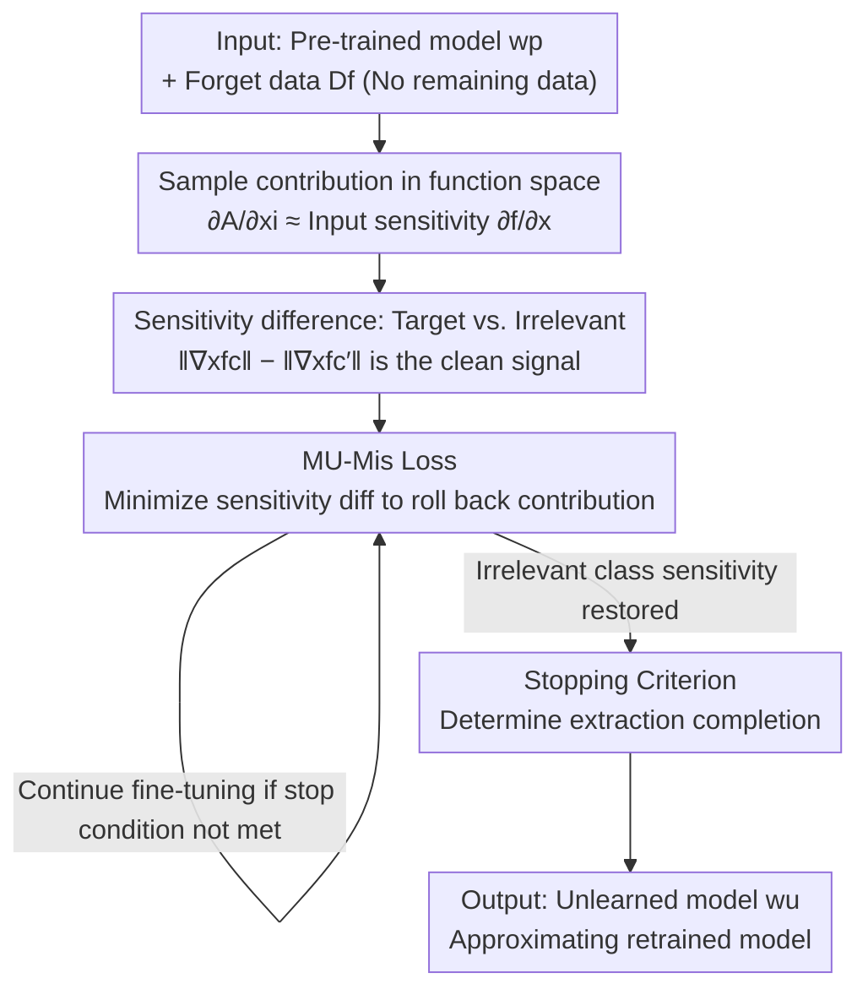

# Remaining-data-free Machine Unlearning by Suppressing Sample Contribution

**Conference**: ICLR 2026  
**OpenReview**: [https://openreview.net/forum?id=3iw5t2W41F](https://openreview.net/forum?id=3iw5t2W41F)  
**Code**: https://github.com/poppopbean0903/MU-Mis  
**Area**: AI Security / Privacy / Machine Unlearning  
**Keywords**: Machine Unlearning, input sensitivity, sample contribution, right to be forgotten, remaining-data-free  

## TL;DR
This paper characterizes "sample contribution to training" as the input sensitivity of the pre-trained model toward that sample. It proposes MU-Mis, which utilizes only the pre-trained model and forget data without accessing any remaining data. By minimizing the "sensitivity difference between target and irrelevant classes," it directly erases the contribution of forget samples. It is the first remaining-data-free method to achieve utility parity with state-of-the-art (SOTA) methods that rely on remaining data.

## Background & Motivation

**Background**: Machine Unlearning (MU) aims to erase the influence of specific training samples from a trained model so that the model behaves as if those data were never used for training (technical implementation of the "right to be forgotten"). The ideal approach is retraining from scratch using the remaining data, but the cost is prohibitive. Thus, approximate unlearning approximates the output distribution of the retrained model by fine-tuning the pre-trained model.

**Limitations of Prior Work**: The fundamental difference between a pre-trained model and a retrained model lies in whether the forget data transitions from a "contributor" to an "observer." However, characterizing "what sample contribution actually is" is extremely difficult. Early methods relied on retracing training trajectories or accumulating historical gradients, which violates efficiency requirements and has limited effectiveness due to the incremental nature of training. Consequently, mainstream methods bypass this problem by using heuristics: randomizing labels or performing knowledge distillation from "incompetent teachers" to create confusion.

**Key Challenge**: These "confusion-making" operations do not identify "what should be forgotten," leading to catastrophic unlearning or over-forgetting—where utility on remaining data severely degrades. This degradation forces methods to use remaining data for repair, which slows down efficiency and makes the process impossible when remaining data is unavailable (due to privacy or compliance). In other words, the lack of a precise characterization of sample contribution is the root of all degradation and subsequent remediation.

**Key Insight**: Instead of accumulating historical gradients in parameter space, the authors examine the derivative of the training algorithm with respect to samples $\partial A_D/\partial x_i$. Samples within the training set satisfy $\partial A_D/\partial x_i \neq 0$, while samples outside the set are 0 (analogous to how only training data serve as support vectors impacting the decision boundary in SVM). Removing sample contribution is equivalent to suppressing $\partial A_D/\partial x_i$.

**Core Idea**: While the training algorithm $A_D$ lacks a closed-form expression, the authors theoretically prove that $\partial A_D/\partial x_i$ can be approximated by the "sensitivity of the learned model to its input" $\partial f(x)/\partial x$. In short: **the contribution of a sample to training manifests as an increase in the model's sensitivity to changes in that sample's input after training**. Thus, the pre-trained model itself can be used to locate and erase the contribution.

## Method

### Overall Architecture

The inputs to MU-Mis (Machine Unlearning by Minimizing Input Sensitivity) are only two things: pre-trained model weights $w_p$ and the data to be forgotten $D_f$—**with no access to remaining data $D_r$ throughout the process**. The workflow is: first, theoretically translate "sample contribution" into "input sensitivity"; then, refine this sensitivity into the "sensitivity difference between the target class logit and irrelevant class logits"; next, construct a loss to directly suppress this difference for model fine-tuning; finally, use a stopping criterion to decide when to terminate. Unlike the old paradigm of "create confusion and then repair," this is a precise, targeted extraction that does not damage utility on remaining data, thereby eliminating the need for repair using remaining data.

### Key Designs

**1. Moving Sample Contribution from Parameter Space to Function Space: Using Input Sensitivity as an Optimizable Proxy**

Old methods were stuck because "contribution is hidden in training trajectories"—unlearning required replaying historical gradients, which is slow and inaccurate due to incrementality. this paper changes the space: training is a mapping from dataset to function $f = A(D)$. Following a first-order Taylor expansion of gradient descent, the learned function can be written as $f(x;w_p) = f(x;w_0) - \eta \sum_k g_k^\top(x) \sum_i g_k(x_i)(e_c - p(x_i))$, where $g_k(x)=\partial f/\partial w|_{w_k}$. Calculating $\partial f/\partial x_i$ (influence of a training sample on learning) and $\partial f/\partial x$ (model sensitivity to input during inference) shows they are equal at $x=x_i$: $S_k(x_i,x_i)=C_k(x_i,x_i)$. Further breaking down the sensitivity of a training sample $\hat x$ into a "contribution term $-\eta\sum_k S_k(\hat x,\hat x)$ + a residual term," the authors argue the residual is much smaller than the contribution (as a randomly initialized $f_0$ barely responds to input, and $S_k(\hat x,\tilde x)\ll S_k(\hat x,\hat x)$).

The conclusion is that $\partial f(x_i;w_p)/\partial x_i$ can be regarded as the manifestation of sample $x_i$'s contribution—echoing the definition of "memory as self-influence" (the difference in a sample's prediction given small variations in itself). Empirically, it is more intuitive: the input sensitivity $\|\nabla_x f\|_F$ of a randomly initialized model is approximately $10^{-4}$, but it surges to $10^3$ after training, jumping several orders of magnitude, indicating that training indeed pushes up sensitivity to training samples. The value of this step is: contribution becomes a **quantity that only requires the pre-trained model, is directly differentiable with respect to input, and is optimizable**, completely bypassing trajectory replay.

**2. Sensitivity Difference between Target and Irrelevant Classes: Purifying "Clean" Contribution Signals from Raw Sensitivity**

Raw total sensitivity $\|\nabla_x f\|_F$ is not clean enough. Training pushes sample predictions toward the correct label, so contribution is asymmetric across logits. The authors examine the sensitivity of the target class logit $\|\nabla_x f_c\|_F$ and the average sensitivity of irrelevant classes $\|\nabla_x f_{c'}\|_F$: at random initialization, they are comparable, but after training, $\|\nabla_x f_c\|_F$ significantly exceeds $\|\nabla_x f_{c'}\|_F$. This is supported by a generative interpretation—a discriminative softmax classifier is implicitly a density model where the logit is the unnormalized log-density, $\nabla_x f_i(x)=\nabla_x \log p_\theta(x|y=i)$; thus, the input gradient of the target class is naturally larger.

Crucially, this aligns with the retrained model: for each forget sample, the authors compare the per-sample change direction between the retrained and pre-trained models across three metrics ($\|\nabla_x f_c\|_F$, $\|\nabla_x f_{c'}\|_F$, and their difference). Results are consistent: in the retrained model, target class sensitivity is lower and irrelevant class sensitivity is higher. Therefore, **the sensitivity magnitude difference $\|\nabla_x f_c\|_F - \|\nabla_x f_{c'}\|_F$ is consistently smaller in the retrained model**. This identifies the direction for unlearning—compressing this difference moves the model toward the retrained state, making it a reliable optimization objective rather than an arbitrarily set target value.

**3. MU-Mis Loss: Directly Minimizing Sensitivity Difference to "Roll Back" Contribution**

With a reliable signal, unlearning becomes a clean optimization problem. The loss is defined as:

$$L(D_f; w) = \frac{1}{N_f} \sum_{x_f \in D_f} \left( \|\nabla_x f_c(x_f, w)\|_F^2 - \|\nabla_x f_{c'}(x_f, w)\|_F^2 \right)$$

where $c$ is the target class and $c'\neq c$ is an **irrelevant class randomly sampled for each loss calculation**. Minimizing this simultaneously suppresses target class sensitivity $\|\nabla_x f_c\|_F$ (rolling back contribution) and increases irrelevant class sensitivity $\|\nabla_x f_{c'}\|_F$ (recovery), exactly matching the observed behavior of retrained models. This is the literal implementation of "suppressing sample contribution": no confusion labels are created, no incompetent teachers are distilled; it simply subtracts the sensitivity difference that training originally built up. Because the operation is targeted and only affects parts related to forget data, utility on remaining data is barely touched, which is why it can be remaining-data-free.

**4. Stopping Criterion: Judging "Extraction Completion" by Irrelevant Class Sensitivity Recovery**

Directly optimizing the loss risks collapsing the model. The authors observed a stable pattern: as the loss decreases, Forget Accuracy (FA) drops steadily, while Remaining/Test Accuracy (RA/TA) slightly dips before recovering as irrelevant class logit sensitivity restores. RA reaches its peak (approximating the retrained model) precisely when this sensitivity returns to its initial level. Thus, a threshold ratio $\delta$ is set: stop when irrelevant class sensitivity $\|\nabla_x f_{c'}\|_F$ exceeds both its previously recorded minimum $\epsilon$ and recovers by more than $\delta$ relative to its initial value. This criterion allows the algorithm to stop exactly when extraction is complete but utility is not yet damaged, requiring no remaining data to monitor validation accuracy.

### Loss & Training
The core loss is the equation $L(D_f;w)$ above. Optimization involves fine-tuning the pre-trained model via gradient descent: $w_{t+1}\leftarrow w_t - \eta\nabla L$. An irrelevant class $c'$ is randomly swapped for each forget sample in every round to avoid bias toward any fixed class. Termination is controlled by the stopping criterion (threshold ratio $\delta$ + recovery of irrelevant class sensitivity). The entire process is lightweight and only involves forward/backward passes on the small batch of forget data.

## Key Experimental Results

The evaluation covers 3 types of unlearning tasks (full-class / sub-class / random-subset), 6 datasets (CIFAR-100, PinsFaceRecognition, Tiny ImageNet, CIFAR-20, CIFAR-10, SVHN), and backbones including ResNet-18 and ViT. Comparisons involve 8 methods relying on remaining data and 4 remaining-data-free methods. Key metrics are the average gap (Avg. Gap, lower is better) between the unlearned and retrained models in FA/RA/TA, MIA privacy metrics, and runtime (RTE).

### Main Results (full-class, ResNet-18)

| Dataset | Method | RA | FA | TA | Avg. Gap↓ | RTE(s) |
|--------|------|-----|-----|-----|-----------|--------|
| CIFAR-100 | Retrain (Gold standard) | 76.52 | 0.00 | 75.76 | 0.00 | 7432 |
| CIFAR-100 | SalUn (Needs remaining) | 76.63 | 1.20 | 75.85 | 0.47 | 254 |
| CIFAR-100 | SCAR (Free, needs OOD) | 71.33 | 5.61 | 70.66 | 5.29 | 367 |
| CIFAR-100 | JiT (Free) | 65.44 | 3.00 | 64.87 | 8.32 | 15 |
| CIFAR-100 | **MU-Mis (Ours)** | 76.42 | 0.00 | 75.64 | **0.07** | **30** |
| Tiny ImageNet | Retrain | 65.36 | 0.00 | 64.90 | 0.00 | 10367 |
| Tiny ImageNet | SalUn | 65.21 | 0.00 | 64.88 | 0.06 | 2630 |
| Tiny ImageNet | **MU-Mis** | 64.95 | 0.00 | 64.85 | **0.15** | **83** |

MU-Mis significantly outperforms all remaining-data-free baselines (which typically show degradation of RA/TA > 5% vs. retraining) and is nearly equal to the strongest remaining-data dependent method, SalUn. On Tiny ImageNet, the Avg. Gap is only 0.09 higher than SalUn, but it is approximately 30x faster. On ViT, the efficiency advantage is even more pronounced—SalUn takes 81 minutes, while MU-Mis takes only 3 minutes.

### Tasks & Ablation Insights

| Task | Method | Avg. Gap↓ | Note |
|------|------|-----------|------|
| sub-class Sea | MU-Mis | 0.20 | Best overall |
| sub-class Sea | SCAR | 6.77 | Free methods lag significantly |
| sub-class Rocket | MU-Mis | 0.49 | High consistency with retraining |
| sub-class Rocket | LoTus | 44.42 | Remaining-data methods can collapse |

The paper analyzes consistency with retraining (stability of proportional changes across settings), sequential unlearning robustness, and KL divergence with the retrained model.

### Key Findings
- **Sequential unlearning exposes three flaws in old methods**: performance recovery (FA of forget classes bounces back in BT/SalUn, knowledge not truly deleted), knowledge residual (FT relies on catastrophic forgetting and fails to clean similar data in sub-classes), and utility collapse (RA in SSD drops from 84% to 76% after multiple rounds). MU-Mis remains close to retraining in both utility and resilience with the lowest KL divergence.
- **Principle-based nature reflected in KL**: even in the difficult random-subset scenario where it ranks below RUM overall, it maintains the lowest KL divergence for forget data, meaning its removal is closer to the true distribution of a retrained model.
- **Efficiency scales with model size**: for larger models like ViT, the speedup from avoiding remaining data becomes more significant.

## Highlights & Insights
- **Shifting "contribution" from parameter space to function space** is the most effective move. In parameter space, contribution is hidden in historical trajectories and is non-optimizable; in function space (input sensitivity), it becomes directly differentiable, requires only the pre-trained model, and allows end-to-end optimization.
- **Justifying objectives via consistency with retraining**: the authors did not set the loss by intuition; they measured that retraining reduces the sensitivity difference and designed the optimization direction accordingly. This grounds "minimizing sensitivity difference" in a gold standard rather than another heuristic.
- **Remaining-data-free without utility loss** is due to the targeted nature of the operation: simply rolling back the sensitivity difference caused by forget samples without creating global confusion prevents remaining data utility from being collateral damage.
- The idea is transferable: using "input sensitivity" as a proxy for sample influence/memory could be useful for membership inference, data valuation, and privacy auditing.

## Limitations & Future Work
- **Random-subset is a weakness**: MU-Mis is less effective than RUM in the most challenging scenario of deleting mixed-memory samples.
- **Theoretical approximations**: the derivation omits the derivative of softmax probability $p(x_i)$ with respect to $x_i$ and terms where $g_k$ changes with $x_i$. The claim that residuals are "much smaller" relies on MLP intuition and empirical evidence rather than strict bounds. Applicability outside of cross-entropy classification remains to be verified.
- **Stopping criterion depends on $\delta$**: although insensitive across many tasks, $\delta$ is still a hyperparameter, and the recovery of irrelevant class sensitivity may drift across different backbones.
- Evaluation focuses on image classification; generalization to text or generative models is not yet explored.

## Related Work & Insights
- **vs. Gradient Replay (Amnesiac / DeltaGrad / Influence Functions)**: these accumulate or invert historical gradients in parameter space, requiring storage of trajectories or Hessian inversion. Influence functions are fragile in DNNs due to convexity assumptions. MU-Mis operates in function space using input gradients from the pre-trained model.
- **vs. Heuristics (Random Labels RL / Teacher Distillation BT/SCRUB / SalUn)**: these fail to identify "what to delete," relying on confusion that causes over-forgetting and necessitates repair. MU-Mis precisely locates and extracts contribution, skipping repair.
- **vs. Other remaining-data-free (JiT / SCAR)**: JiT minimizes local Lipschitz to smooth outputs; SCAR requires OOD data distillation. Both have significant utility gaps compared to SOTA. MU-Mis requires no extra data and matches the utility of SOTA remaining-data methods.

## Rating
- Novelty: ⭐⭐⭐⭐⭐ Reinterpreting sample contribution as input sensitivity and refining it to the target/irrelevant difference is a fresh, well-supported perspective.
- Experimental Thoroughness: ⭐⭐⭐⭐ Coverage of 3 tasks, 6 datasets, ViT, sequential unlearning, and KL/MIA is extensive, though random-subset results are secondary.
- Writing Quality: ⭐⭐⭐⭐ Clear chain from motivation to theory and method, though some theoretical omissions could be more detailed.
- Value: ⭐⭐⭐⭐⭐ First remaining-data-free method to match SOTA utility while being an order of magnitude faster; high deployment value.

<!-- RELATED:START -->

## Related Papers

- [\[ICLR 2026\] Distributional Machine Unlearning via Selective Data Removal](distributional_machine_unlearning_via_selective_data_removal.md)
- [\[ICLR 2026\] Label Smoothing Improves Machine Unlearning](label_smoothing_improves_machine_unlearning.md)
- [\[ICLR 2026\] Machine Unlearning under Retain–Forget Entanglement](machine_unlearning_under_retainforget_entanglement.md)
- [\[CVPR 2025\] Towards Source-Free Machine Unlearning](../../CVPR2025/ai_safety/towards_source-free_machine_unlearning.md)
- [\[ICLR 2026\] Mitigating Privacy Risk via Forget Set-Free Unlearning](mitigating_privacy_risk_via_forget_set-free_unlearning.md)

<!-- RELATED:END -->
