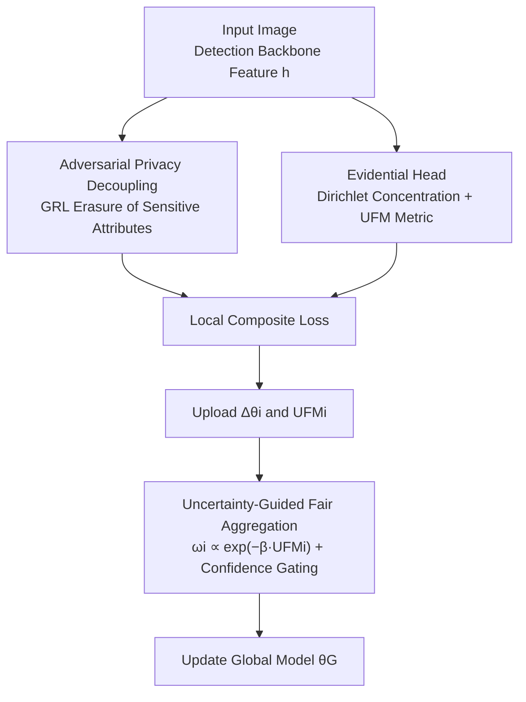

# RESFL: An Uncertainty-Aware Framework for Responsible Federated Learning by Balancing Privacy, Fairness and Utility

**Conference**: ICLR 2026  
**OpenReview**: [https://openreview.net/forum?id=Wfz7gpoDSl](https://openreview.net/forum?id=Wfz7gpoDSl)  
**Code**: None  
**Area**: AI Security / Federated Learning / Fairness  
**Keywords**: Federated Learning, Privacy-Fairness Trade-off, Evidential Uncertainty, Gradient Reversal, Fair Aggregation

## TL;DR
RESFL integrates "adversarial privacy decoupling" and "uncertainty-guided fair aggregation" into a single Federated Learning (FL) pipeline. It utilizes an evidential neural network to compute a scale-invariant group fairness metric, UFM, to weight client updates. In autonomous driving object detection, this framework simultaneously reduces privacy leakage and narrows group disparities with minimal impact on accuracy.

## Background & Motivation
**Background**: Federated Learning (FL) enables multiple clients to collaboratively train models without uploading raw data, naturally reducing the privacy risks associated with centralized aggregation. It has been widely deployed in sensitive fields such as healthcare, finance, and smart cities. To further bolster privacy, common practices involve overlaying mechanisms like Differential Privacy (DP), Secure Multi-Party Computation, or Homomorphic Encryption.

**Limitations of Prior Work**: These privacy mechanisms are inherently in conflict with "fairness." DP relies on injecting noise and hiding sensitive attributes (e.g., skin tone, gender, age) to prevent data leakage. However, fairness interventions typically require direct access to these sensitive attributes for detection and correction. Once attributes are hidden, the data patterns of minority groups are obscured by noise, often exacerbating performance gaps between groups. Conversely, performing fair re-weighting risks exposing sensitive information. Most FL methods optimize only one objective at the expense of the other and rarely verify their guarantees in the presence of "adversarial clients."

**Key Challenge**: There is a direct trade-off between privacy (hiding attributes) and fairness (requiring attributes for bias correction), which is further complicated by real-world uncertainties (sensor noise, weather, lighting, domain shift). These uncertainties disproportionately affect marginalized sub-groups (e.g., higher miss rates for pedestrians with darker skin tones in foggy or low-light conditions), amplifying disparities. Furthermore, servers cannot see sensitive attributes, making it impossible to measure bias directly.

**Goal**: To simultaneously optimize privacy and group fairness within an end-to-end FL pipeline without sacrificing utility, while remaining robust in both benign and adversarial client settings.

**Key Insight**: The authors observe that fairness can be measured indirectly without direct access to sensitive attributes. If the "epistemic uncertainty" of predictions for a specific group is significantly higher than others, it indicates the model has not learned that group well, signifying a gap. By using "inter-group uncertainty variance" as a proxy signal for fairness, the framework bypasses direct access to sensitive attributes while still driving aggregation.

**Core Idea**: Evidential neural networks are used to quantify the epistemic uncertainty of each group, constructing a scale-invariant uncertainty fairness metric (UFM). Client updates are weighted by $\omega_i \propto \exp(-\beta\,\text{UFM}_i)$. Simultaneously, a Gradient Reversal Layer (GRL) is used to remove sensitive attributes from representations. These three objectives are jointly optimized via a composite loss function.

## Method

### Overall Architecture
RESFL follows a standard FL cycle of "local training + weighted server aggregation" but adds specific mechanisms on both sides. On the client side: the detection backbone (a modified YOLOv8) extracts feature representations $h$. One path passes through a GRL to an adversary classifier for adversarial privacy decoupling, stripping sensitive attributes from $h$. Another path replaces the standard softmax detection head with an evidential head, outputting Dirichlet concentration vectors to calculate epistemic uncertainty for each group and deriving the local fairness metric $\text{UFM}_i$. Training uses a composite loss combining detection, adversarial, and uncertainty losses. Finally, parameter updates $\Delta\theta_i$ and $\text{UFM}_i$ are sent to the server. On the server side: instead of FedAvg's equal weighting, updates are weighted by $\omega_i \propto \exp(-\beta\,\text{UFM}_i)$—assigning higher weights to clients with smaller group gaps and higher confidence. A deterministic confidence gate suppresses the weight of clients with low validation accuracy (potentially poisoned) to near zero before updating the global model.

### Key Designs

**1. Evidential Uncertainty and UFM Metric: Quantifying Group Fairness Without Sensitive Attributes**

This design addresses the issue that "servers cannot access sensitive attributes to measure bias." RESFL requires each client to replace the softmax layer with an evidential output layer, predicting a non-negative concentration vector $\alpha=(\alpha_1,\dots,\alpha_C)$. This parameterizes a Dirichlet distribution over the class probability simplex, allowing epistemic uncertainty to be calculated in closed form without Monte Carlo sampling or deep ensembles. The total evidence $\alpha_0=\sum_c \alpha_c$ provides an approximate epistemic variance $\sigma^2_{\text{epi},c}\sim 1/\alpha_0$—where larger $\alpha_0$ indicates lower uncertainty. To ensure positivity and stability, logits are transformed via $\alpha_c = 1 + \text{softplus}(z_c)$.

From the average total evidence per image, the group mean $\bar\alpha_{0,g}$ is calculated (only for detections matching group $g$ ground truth). This defines the uncertainty gap and the normalized UFM:

$$\Delta_u = \max_g\Big(\frac{1}{\bar\alpha_{0,g}}\Big) - \min_g\Big(\frac{1}{\bar\alpha_{0,g}}\Big),\qquad \text{UFM} = \frac{\Delta_u}{\frac{1}{G}\sum_{g=1}^{G}\frac{1}{\bar\alpha_{0,g}} + \epsilon}$$

A higher UFM indicates greater group disparity. Crucially, it is scale-invariant and relies only on evidence rather than explicit sensitive labels. The authors theoretically prove that controlling UFM tightens the confidence-adjusted group generalization bound.

**2. Adversarial Privacy Decoupling: Extracting Sensitive Attributes from Representations via GRL**

To address sensitive attributes remaining in shared representations/gradients, RESFL embeds a Gradient Reversal Layer $R_{\lambda_{\text{adv}}}$ between the feature extractor $f(x;\theta)$ and an adversary classifier $A(h;\phi)$. The adversary attempts to predict the sensitive attribute $s$ from representation $h$, while the feature extractor is trained to make this prediction fail. The GRL acts as an identity mapping during forward propagation and multiplies the gradient by $-\lambda_{\text{adv}}$ during backpropagation, implementing the min-max game in a single pass:

$$\min_\theta \max_\phi\ \mathbb{E}_{(x,s)\sim D_i}\Big[-\lambda_{\text{adv}}\sum_{k=1}^{K}\mathbf{1}\{s=k\}\log A_k\big(R_{\lambda_{\text{adv}}}(f(x;\theta));\phi\big)\Big]$$

This reduces the mutual information $I(H;S)$. Unlike DP, which injects noise indiscriminately, this decoupling specifically targets sensitive attributes while preserving task-relevant discriminative information.

**3. Uncertainty-Guided Fair Aggregation + Confidence Gating: Prioritizing Consistent Clients**

To prevent clients with high disparities or low confidence from polluting the global model, the server uses temperature-scaled exponential weights:

$$\omega_i = \frac{\exp(-\beta\,\text{UFM}_i)}{\sum_{j=1}^{N}\exp(-\beta\,\text{UFM}_j)},\qquad \theta_G^{(t+1)} = \theta_G^{(t)} + \eta\sum_{i=1}^{N}\omega_i\,\Delta\theta_i$$

The temperature $\beta$ controls the fairness preference. Additionally, a deterministic confidence gate sets the weight $\omega_i \approx 0$ for any client whose validation accuracy falls below a fixed threshold, defending against poisoned or low-confidence updates.

### Loss & Training
Each client minimizes a local composite loss:

$$\mathcal{L}_{\text{local}}(\theta,\phi) = \mathcal{L}_{\text{task}}(\theta) + \lambda_{\text{priv}}\,\mathcal{L}_{\text{adv}}(\theta,\phi) + \lambda_{\text{fair}}\,\mathcal{L}_{\text{uncertainty}}(\theta)$$

Where $\lambda_{\text{priv}}$ scales the privacy loss and $\lambda_{\text{fair}}$ weights the uncertainty term. Updates for $\phi$ and $\theta$ alternate within each local SGD step. The backbone is a modified YOLOv8 with $K=4$ clients and $T=100$ communication rounds.

## Key Experimental Results

### Main Results
Evaluated on the FACET dataset (32,000 images, 50k+ pedestrian instances classified by Monk Skin Tone) across utility (mAP↑), fairness ($|1-\text{DI}|$↓, $\Delta$EOP↓), and privacy (MIA/AIA success rate↓):

| Method | mAP↑ | $\lvert1-\text{DI}\rvert$↓ | $\Delta$EOP↓ | MIA SR↓ | AIA SR↓ |
|------|------|------|------|------|------|
| FedAvg | 0.6378 | 0.2159 | 0.2362 | 0.3341 | 0.4431 |
| FedAvg-DP ($\epsilon=1$) | 0.4612 | 0.3945 | 0.2879 | 0.2364 | 0.2627 |
| FairFed | 0.7013 | 0.2496 | 0.2562 | 0.4409 | 0.5256 |
| PUFFLE | 0.4192 | 0.3721 | 0.2976 | 0.2725 | 0.2909 |
| PFU-FL | 0.3952 | 0.3356 | 0.3446 | 0.2409 | 0.2546 |
| **RESFL (Ours)** | **0.6654** | **0.2287** | **0.1959** | **0.2093** | **0.1832** |

RESFL achieves a mAP of 0.6654, close to FairFed (0.7013), while reducing FairFed's high privacy leakage (MIA 0.4409 / AIA 0.5256) to 0.2093 / 0.1832. Compared to DP methods, RESFL maintains significantly higher utility.

### Ablation Study
Varying $\lambda_{\text{fair}}$ and $\lambda_{\text{priv}}$ (Task loss fixed at 1):

| $\lambda_{\text{fair}}$ | $\lambda_{\text{priv}}$ | mAP↑ | $\lvert1-\text{DI}\rvert$↓ | $\Delta$EOP↓ | MIA SR↓ |
|------|------|------|------|------|------|
| 1 | 0 | 0.6278 | 0.2258 | 0.2062 | 0.3341 |
| 0 | 1 | 0.5856 | 0.2571 | 0.2846 | 0.1025 |
| 0.1 | 0.01 | **0.6654** | 0.2287 | 0.1959 | 0.2093 |
| 0.1 | 1 | 0.5839 | 0.3862 | 0.4146 | 0.1176 |

Increasing $\lambda_{\text{fair}}$ improves fairness by shifting model capacity toward high-uncertainty slices, though average mAP slightly decreases. Increasing $\lambda_{\text{priv}}$ further reduces MIA but impacts utility and fairness.

## Related Work & Insights

**Related Work**: RESFL sits at the intersection of privacy-fairness joint optimization in FL. Privacy methods include DP and HE, while fairness focuses on either client or group fairness. Existing joint methods like PUFFLE or PFU-FL often suffer from significant utility loss due to noise injection. RESFL differentiates itself by using evidential uncertainty for calibration and adversarial decoupling for privacy.

**Limitations & Future Work**: While the method claims to be domain-agnostic, experiments are limited to autonomous driving scenarios. Under extreme low-visibility conditions (e.g., heavy fog), all methods degrade due to physical limits; RESFL only mitigates the rate of deterioration. Furthermore, adversarial decoupling provides information-theoretic benefits rather than formal $(\epsilon, \delta)$-DP guarantees. The reliability of UFM also depends on the robustness of evidence, which could be targeted by sophisticated adversarial attacks.

<!-- RELATED:START -->

## Related Papers

- [\[ICLR 2026\] Federated Learning of Quantile Inference under Local Differential Privacy](federated_learning_of_quantile_inference_under_local_differential_privacy.md)
- [\[ICLR 2026\] Fairness-Aware Multi-view Evidential Learning with Adaptive Prior](fairness-aware_multi-view_evidential_learning_with_adaptive_prior.md)
- [\[ICLR 2026\] PateGAIL++: Utility Optimized Private Trajectory Generation with Imitation Learning](pategail_utility_optimized_private_trajectory_generation_with_imitation_learning.md)
- [\[ICLR 2026\] Convergent Differential Privacy Analysis for General Federated Learning](convergent_differential_privacy_analysis_for_general_federated_learning.md)
- [\[ICLR 2026\] Fine-Grained Class-Conditional Distribution Balancing for Debiased Learning](fine-grained_class-conditional_distribution_balancing_for_debiased_learning.md)

<!-- RELATED:END -->
