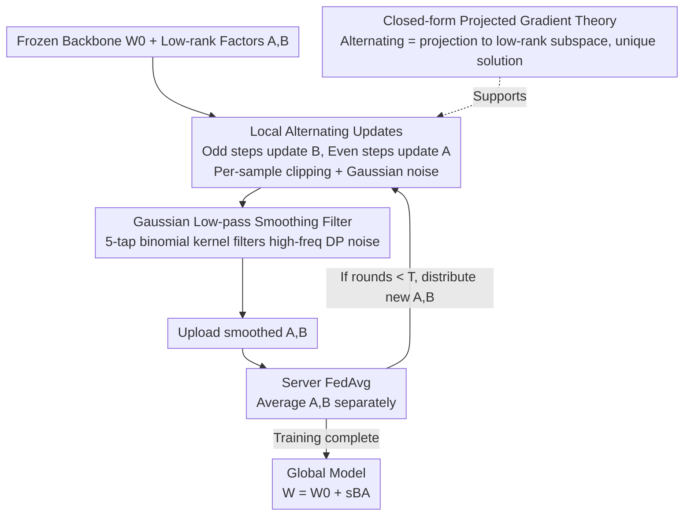

# Rethinking LoRA for Privacy-Preserving Federated Learning in Large Models

**Conference**: ICLR 2026  
**OpenReview**: [https://openreview.net/forum?id=BPzSV4uw0x](https://openreview.net/forum?id=BPzSV4uw0x)  
**Code**: https://github.com/junkangLiu0/LA-LORA  
**Area**: AI Security / Differential Privacy / Federated Learning / Parameter-Efficient Fine-Tuning  
**Keywords**: Differentially Private Federated Learning, LoRA, Gradient Decoupling, Noise Amplification, Flat Minima  

## TL;DR
Aiming at the performance collapse of directly applying LoRA in Differentially Private Federated Learning (DPFL), this paper identifies three root causes—gradient coupling, noise multiplicative amplification, and entrapment in sharp minima after aggregation. It proposes LA-LoRA, which alternately updates two low-rank matrices within each local round and smooths noisy gradients using a fixed Gaussian low-pass filter. It achieves SOTA on Swin Transformer and RoBERTa (outperforming the best baseline RoLoRA by 16.83% on Swin-B / Tiny-ImageNet / $\epsilon=1$).

## Background & Motivation

**Background**: Adapting foundation models like GPT, BERT, and ViT to downstream tasks increasingly relies on private data scattered across various parties. Federated Learning (FL) allows multiple clients to collaborate without sharing raw data. Parameter-Efficient Fine-Tuning (PEFT) methods like LoRA freeze the backbone and only train low-rank matrices $A$ and $B$, reducing communication to less than 0.1% of the full model. Consequently, "LoRA + FL" has become the dominant paradigm for private adaptation of large models.

**Limitations of Prior Work**: Even without transmitting raw data, FL remains vulnerable to gradient-based privacy attacks; thus, Differential Privacy (DP) must be layered—clipping individual gradients to a fixed $\ell_2$ norm and adding Gaussian noise. However, the authors found that applying LoRA within DPFL leads to severe performance degradation, especially in Large Vision Models (LVM). Previously, this was vaguely attributed to "DP loss" without clarifying the root cause.

**Key Challenge**: The authors decompose the failure of LoRA under DPFL into three overlooked structural root causes: (1) **Gradient Coupling**: Role asymmetry between $A$ and $B$ (dimension reduction vs. expansion) where their gradients are parameters for each other ($\nabla_A L = sB^\top(\nabla_W L)$, $\nabla_B L = s(\nabla_W L)A^\top$). Synchronous updates cause the latent space basis defined by $A$ to drift while $B$ still adapts to an outdated direction, leading to divergence under DP noise and Non-IID data. (2) **Noise Multiplicative Amplification**: After adding independent noise to $A$ and $B$, the product introduces a non-Gaussian second-order cross-term $N_{B}N_{A}$, which grows quadratically with noise scale $\sigma$, eventually making LoRA perturbations exceed those of the full model. (3) **Aggregation into Sharp Minima**: Misalignment of low-rank factors across clients causes FedAvg to fall into sharp minima with high curvature, resulting in poor generalization, which DP noise further exacerbates.

**Goal**: To simultaneously alleviate these three root causes without modifying model architecture or weakening DP guarantees, making LoRA both private and performant in DPFL.

**Core Idea**: Utilizing both "optimization-level" and "pre-aggregation" perspectives—optimizationally **decoupling the tight coupling of low-rank factors** (alternating updates) and **filtering out high-frequency components of DP perturbations** before aggregation (low-pass smoothing), resulting in LA-LoRA (Local Alternating LoRA).

## Method

### Overall Architecture

LA-LoRA takes a frozen backbone $W_0$ and a pair of low-rank factors $(A, B)$ as input. Its output is the global weight $W^T = W_0 + sB^T A^T$ after $T$ rounds of federated aggregation. Throughout the process, only $BA$ is updated while $W_0$ remains fixed. It modifies the "synchronous update + direct aggregation" of standard DP-LoRA into two actions: **alternating updates of $B$ and $A$ at even/odd local steps** within each client's local training (updating one while freezing the other) and applying a **fixed Gaussian low-pass filter** to smooth gradients corrupted by DP noise before uploading. The server still performs vanilla FedAvg on $A$ and $B$. Three contributing components—local alternating updates, low-pass filtering, and the supporting closed-form projected gradient theory—address the three aforementioned root causes.

### Key Designs

**1. Local Alternating Updates: Decoupling Gradient Coupling and Synchronous Noise**

This is the core of LA-LoRA. Instead of updating $A$ and $B$ simultaneously as in DP-LoRA, it alternates updates every local step $k$ **within each local round**: odd steps fix $A$ to update $B$ ($B^t_{i,k+1} = B^t_{i,k} - \eta_B \nabla_B L_i$), and even steps fix $B$ to update $A$. Note the difference from RoLoRA, which alternates **across communication rounds**; LA-LoRA alternates **step-by-step within rounds**, offering much finer granularity.

This step addresses the three causes: For **Gradient Coupling**, only one matrix moves at a time, preventing the basis defined by $A$ from conflicting with the update of $B$. The cosine similarity between $\nabla_A L$ and $\nabla_B L$ is measured significantly higher than in synchronous updates. For **Noise Amplification**, because only one matrix is noised per step, the fatal synchronous multiplicative term $N_{B}N_{A}$ never appears—perturbations degrade into linear terms $N_{B_i}A_i$ or $B_i N_{A_i}$, removing the source of quadratic growth. For **Sharp Minima**, updates are constrained within the structured low-dimensional subspace of $A_i$'s column space or $B_i$'s row space, acting as implicit regularization that lowers sensitivity to noise and heterogeneity. The measured maximum Hessian eigenvalue drops significantly (from 101.62 in DP-LoRA to 64.77 on Swin-B / CIFAR-100 / $\epsilon=1$), indicating a flatter loss landscape.

**2. Gaussian Low-pass Smoothing Filter: Filtering DP Noise as High-frequency Perturbation**

While alternating updates solve structural amplification, residual variance from per-step DP noise remains. Observing that DP noise manifests as **high-frequency perturbations**, the authors apply a lightweight smoothing to LoRA gradients before uploading: using a fixed 5-tap binomial low-pass kernel $G_s = \tfrac{1}{16}[1,4,6,4,1]$, convolving row-wise for $A \in \mathbb{R}^{r\times n}$ and column-wise for $B \in \mathbb{R}^{m\times r}$ along feature dimensions (using symmetric padding), i.e., $\hat{\nabla}_A L_i[j,:] = G_s * \nabla_A L_i[j,:]$.

The elegance lies in being "cheap and harmless": the kernel is fixed with no learned parameters and smooths along meaningful feature axes without mixing low-rank components. From an optimization perspective, this imposes 1D smoothing regularization, penalizing sharp jumps in adjacent entries and biasing optimization toward flat global solutions. Crucially, **it does not weaken privacy**—noise is added to clipped gradients, and the filter is a deterministic post-processing function. By the post-processing property of DP, the privacy budget remains unchanged. This filtering provides gains for both DP-LoRA and LA-LoRA (from 53.07% to 61.97% on Tiny-ImageNet/Swin-B). It is an **optional** module but yields maximum benefit when stacked with alternating updates.

**3. Closed-form Projected Gradient and Stable Feature Learning: Why Alternating is Correct**

The authors provide theoretical guarantees that elevate alternating updates from an "engineering trick" to a "principled update." Theorem 2 proves that when $A_k, B_k$ are full rank, updates to $B$ and $A$ are equivalent to projecting the full gradient $\nabla_W L$ onto the column space of $A_k$ and the row space of $B_{k+1}$, respectively. This least-squares projection has a **unique closed-form solution** $\tilde\nabla_{B_k}L = \tfrac{1}{s^2}\nabla_{B_k}L (A_kA_k^\top)^{-1}$ and $\tilde\nabla_{A_k}L = \tfrac{1}{s^2}(B_{k+1}^\top B_{k+1})^{-1}\nabla_{A_k}L$. This only requires solving an $r\times r$ small system without touching full model gradients, incurring minimal overhead when $r \ll \min\{m,n\}$. Theorem 3 (Stable Feature Learning) states that alternating updates remain stable with learning rates $\eta = O(1)$, whereas **synchronous updates** introduce a second-order term $\eta^2 (B_k^\top B_k)^{-1}B_k^\top(\nabla_W L)(\nabla_W L)A_k^\top (A_kA_k^\top)^{-1}$ that is non-negligible in infinite-width networks, breaking the clean projection interpretation.

### Loss & Training

The training objective is the standard task loss $L_i$ on each client's private data, without additional regularization terms (smoothing is a gradient operator, not a loss term). Local procedure: each selected client starts from the frozen backbone, initializes $A^t_{i,1}\leftarrow A^{t-1}, B^t_{i,1}\leftarrow B^{t-1}$, and runs $K$ local steps with alternating updates. Each step computes per-sample gradients, applies $\ell_2$ clipping at threshold $C$, injects Gaussian noise $\tfrac{C}{bR}N(0,\sigma^2)$ after aggregation, smooths via $G_s$, and performs gradient descent. The server averages $A$ and $B$ from participating clients $\mathcal{C}_t$. Vision tasks use SGD + LoRA rank $r=16, \alpha=16, N=8$ clients, Dirichlet $\beta=0.1$ Non-IID; NLP tasks use AdamW + $r=\alpha=8, N=20, \beta=0.8$; privacy budgets $\epsilon\in\{3,2,1\}, \delta=10^{-5}$.

## Key Experimental Results

### Main Results

Vision tasks (Swin-T / Swin-B, CIFAR-100 and Tiny-ImageNet), LA-LoRA leads across all privacy budgets:

| Model / Dataset | $\epsilon$ | DP-LoRA | FFA-LoRA | RoLoRA | LA-LoRA |
|--------------|-----------|---------|----------|--------|---------|
| Swin-T / CIFAR-100 | 3 | 45.40 | 52.09 | 55.19 | **60.07** |
| Swin-T / Tiny-ImageNet | 3 | 32.27 | 44.62 | 50.87 | **60.97** |
| Swin-B / CIFAR-100 | 1 | 55.98 | 61.94 | 67.88 | **74.56** |
| Swin-B / Tiny-ImageNet | 1 | 30.20 | 39.33 | 43.85 | **60.68** |

In the most extreme case (Swin-B / Tiny-ImageNet / $\epsilon=1$), LA-LoRA outperforms the best baseline RoLoRA by **16.83 percentage points** (60.68 vs 43.85), indicating that LVMs degrade most under strict privacy and derive the greatest gain from this method. NLP tasks (RoBERTa-Base / GLUE) also show consistent leads, achieving 88.73% on QNLI and 82.35% on MNLI at $\epsilon=1$.

### Ablation Study

With $\epsilon=3$, decomposing alternating updates and low-pass filtering (Swin-B / Tiny-ImageNet):

| Configuration | Tiny-ImageNet | Description |
|------|--------------|------|
| DP-LoRA | 30.64 | Synch update + No filtering (Baseline) |
| DP-LoRA(+filter) | 49.85 | Filtering only, +19.21 |
| LA-LoRA(-filter) | 53.07 | Alternating only, +22.43 |
| LA-LoRA | 61.97 | Both combined (Full) |

### Key Findings

- **Alternating updates provide the largest contribution**: Using alternating updates alone improves Tiny-ImageNet/Swin-B from 30.64% to 53.07% (+22.43), effectively addressing structural noise amplification.
- **Filtering is a valuable additive term**: Filtering alone improves performance to 49.85% and continues to boost LA-LoRA from 53.07% to 61.97%. The components are non-conflicting.
- **Flat minima visualization matches quantification**: Loss landscape visualization shows LA-LoRA in a smooth broad basin while DP-LoRA is in a sharp, irregular one. Hessian eigenvalues are consistently smaller for LA-LoRA, verifying the "alternating → flatter → robust generalization" logic.
- **Cross-model applicability**: Effective across both vision (Swin) and language (RoBERTa) domains and all $\epsilon$ levels.

## Highlights & Insights
- **Decomposing the failure of LoRA in DPFL into three locatable structural root causes**, rather than vaguely blaming DP loss—gradient coupling (quantified by cosine similarity), multiplicative noise $N_BN_A$ (Frobenius norm curve growing quadratically with $\sigma$), and sharp aggregation (Hessian eigenvalues + loss landscapes). Each point is supported by independent evidence.
- **One alternating update mechanism cures three ills**: Within-round alternating stops coupling, eliminates synchronous multiplicative noise, and constrains updates to low-dimensional subspaces for implicit regularization.
- **"Free lunch" accuracy gains via DP post-processing invariance**: Smoothing after clipping and noising yields performance gains without consuming privacy budget. This trick is transferable to any DPFL method.
- **Granular comparison with RoLoRA**: Changing "inter-round" alternation to "intra-round step-wise" alternation yields a gap of over ten points, suggesting that the granularity of alternation is a critical, previously ignored design dimension.

## Limitations & Future Work
- **Filtering kernel is fixed and hand-designed** (5-tap binomial kernel + small $\sigma_s$); adaptive or learned versions for different tasks/layers remain unexplored.
- **Theoretical assumptions are somewhat strong**: Theorem 2 requires full rank, Theorem 3 is argued in infinite-width networks, and Theorem 4 relies on RIP assumptions, which may deviate from actual finite-width and low-rank settings.
- **Limited scale and heterogeneity validation**: Experiments up to Swin-B / RoBERTa-Base with 8-20 clients. Scaling to larger foundation models and harder heterogeneity is left for future work.
- **Implicit costs of alternating updates**: Updating only half the parameters per step might require more local steps to achieve equivalent effects; the paper does not deeply compare convergence speeds under equal compute budgets.

## Related Work & Insights
- **vs DP-LoRA**: DP-LoRA updates $A$ and $B$ synchronously and noises both, which this paper identifies as the source of gradient coupling and $N_BN_A$ noise; LA-LoRA removes these structurally.
- **vs FFA-LoRA**: FFA-LoRA freezes $A$ and only trains $B$, avoiding multiplicative noise but sacrificing expressivity; LA-LoRA trains both matrices at different times to preserve expressivity while avoiding noise.
- **vs RoLoRA**: RoLoRA alternates $A$ and $B$ across communication rounds without DP; LA-LoRA alternates step-wise within rounds and integrates DP, providing much finer granularity and higher gains.
- **vs FedSA-LoRA**: FedSA-LoRA only uploads $A$ and keeps $B$ local for personalization; LA-LoRA focuses on DP noise robustness rather than personalization, making the two approaches orthogonal.

## Rating
- Novelty: ⭐⭐⭐⭐⭐ Decoupling DPFL failure into three root causes and solving them via intra-round alternation + post-processing filtering is highly original.
- Experimental Thoroughness: ⭐⭐⭐⭐ Vision + Language domains across three privacy budgets with Hessian/landscape analysis, though model scale is somewhat conservative.
- Writing Quality: ⭐⭐⭐⭐⭐ Clear "diagnosis then treatment" structure with quantitative evidence for each point.
- Value: ⭐⭐⭐⭐⭐ DPFL + PEFT is a high-demand scenario; the +16.83% gain at $\epsilon=1$ and the transferable filtering trick are of high practical value.

<!-- RELATED:START -->

## Related Papers

- [\[ICLR 2026\] Privacy Beyond Pixels: Latent Anonymization for Privacy-Preserving Video Understanding](privacy_beyond_pixels_latent_anonymization_for_privacy-preserving_video_understa.md)
- [\[ICLR 2026\] Federated Learning of Quantile Inference under Local Differential Privacy](federated_learning_of_quantile_inference_under_local_differential_privacy.md)
- [\[ICCV 2025\] FedMeNF: Privacy-Preserving Federated Meta-Learning for Neural Fields](../../ICCV2025/ai_safety/fedmenf_privacy-preserving_federated_meta-learning_for_neural_fields.md)
- [\[ICLR 2026\] RESFL: An Uncertainty-Aware Framework for Responsible Federated Learning by Balancing Privacy, Fairness and Utility](resfl_an_uncertainty-aware_framework_for_responsible_federated_learning_by_balan.md)
- [\[ICLR 2026\] Convergent Differential Privacy Analysis for General Federated Learning](convergent_differential_privacy_analysis_for_general_federated_learning.md)

<!-- RELATED:END -->
