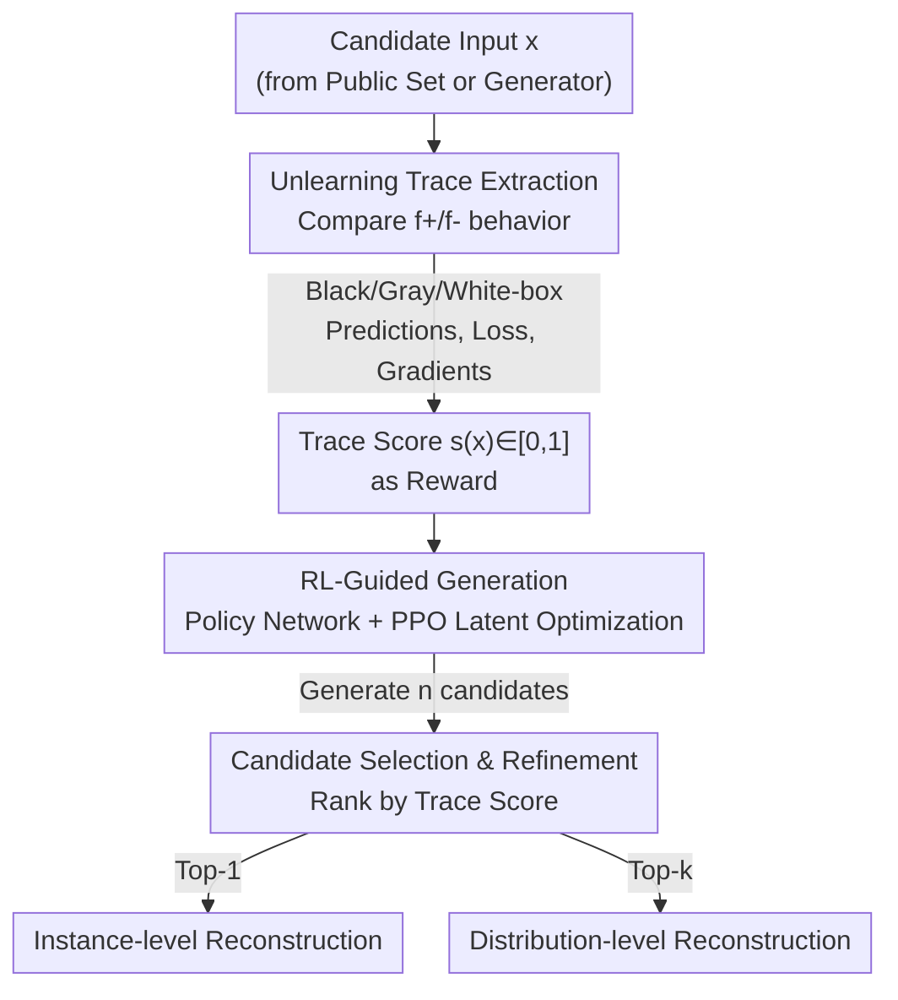

# ReTrace: Reinforcement Learning-Guided Reconstruction Attacks on Machine Unlearning

**Conference**: ICLR 2026  
**OpenReview**: [https://openreview.net/forum?id=wKi4Jeqqrb](https://openreview.net/forum?id=wKi4Jeqqrb)  
**Code**: To be confirmed  
**Area**: AI Security / Privacy Attacks / Machine Unlearning  
**Keywords**: Machine Unlearning, Reconstruction Attack, Reinforcement Learning, Unlearning Trace, Privacy Leakage

## TL;DR
The authors model the recovery of "unlearned data" as a reinforcement learning (RL) problem. By treating the residual differences (traces) between the pre-unlearning and post-unlearning models as reward signals, they guide a generator to search for high-reward regions in the input space. This approach successfully reconstructs samples and class distributions on large-scale models like ResNet and DistilBERT, achieving an instance-level recovery success rate of up to 73.1%.

## Background & Motivation

**Background**: To meet compliance requirements like the GDPR "right to be forgotten," machine unlearning has become essential. Exact unlearning ensures deletion by retraining from scratch on the dataset after removing target samples, but this is too costly for today's large models. Consequently, the focus has shifted toward approximate unlearning, which directly modifies the parameters or gradients of a trained model to erase the influence of specific data, striking a balance between efficiency and unlearning strength.

**Limitations of Prior Work**: Approximate unlearning can rarely erase data "cleanly"; it leaves discernible residual traces in the model. Worse, the unlearning action itself may be counterproductive: instead of hiding the data, it acts like highlighting a needle in a haystack, making it easier for an attacker to locate sensitive records. This has severe consequences in scenarios like healthcare; even if a patient requests the deletion of medical images, a reconstruction attack might still restore identifiable details.

**Key Challenge**: Existing reconstruction attacks targeting unlearning are limited by access conditions or model scale. One class of attacks based on closed-form parameter analysis (e.g., HRec) can achieve precise recovery but only applies to linear or simple models. Another class based on update differences (e.g., UIA) requires white-box gradients and is restricted to instance-level recovery, failing to generalize across multiple deletions. No existing framework can simultaneously leverage unlearning traces in deep models, support multiple access levels, and handle both instance-level and distribution-level recovery.

**Goal**: Construct a universal reconstruction attack framework that maps "unlearning traces → deleted data" on large-scale deep models (CNN + Transformer), providing both instance-level (recovering individual samples) and distribution-level (approximating the overall distribution of deleted classes) results.

**Key Insight**: A critical observation is that the behavioral difference between the pre-unlearning model $f^+$ and the post-unlearning model $f^-$ on deleted data is a quantifiable and optimizable signal. If this difference is treated as a "reward," then "finding the deleted data" is equivalent to "searching for points in the input space that maximize the reward," which is precisely the type of exploration problem that reinforcement learning excels at.

**Core Idea**: Use RL to treat residual traces as rewards, guiding a generator to actively explore the input space and converge to the distribution of forgotten data—essentially, "using traces as rewards and the generator as a policy to transform data reconstruction into policy optimization."

## Method

### Overall Architecture

ReTrace assumes the attacker has access to both the pre-unlearning and post-unlearning models, $f^+$ and $f^-$ (common in scenarios involving model versioning or API updates), but lacks access to the original training set $D$ or the deleted set $D_{del}$. The attacker uses a publicly available auxiliary set $D_{pub}$ with a similar distribution to initialize candidate inputs. The pipeline consists of three serial steps: first, **Unlearning Trace Extraction**, where the behavioral differences between the two models on a candidate input are quantified into a trace score $s(x) \in [0,1]$. Second, **RL-Guided Generation**, where a policy network searches the latent space of a generator, using the trace score as a reward and PPO to push latent vectors toward high-score regions. Finally, **Candidate Selection & Refinement**, where the best individual samples (instance-level) or the top-$k$ samples (distribution-level) are selected based on their trace scores.

The "environment" for the attack comprises the frozen model pair $(f^+, f^-)$, the "action" is rewriting latent vectors, the "state" is the generated image, and the "reward" is derived from the traces. ReTrace categorizes access levels into black-box, gray-box, and white-box: deeper access provides richer trace signals.

### Key Designs

**1. Multi-level Unlearning Trace Extraction: Quantifying "Deletion Traces" as Optimizable Rewards**

This step directly addresses the insight that residual traces can be exploited. While the attacker cannot see the deleted data, they can probe the behavioral gap between the models using candidate input $x$. ReTrace defines three types of traces based on access levels: in the black-box setting, the $\ell_2$ distance of prediction vectors $\delta_{pred}(x) = \|f^+(x) - f^-(x)\|_2$ is used. In the gray-box setting, the loss difference $\delta_{loss}(x) = |\ell(f^+(x), \hat{y}) - \ell(f^-(x), \hat{y})|$ is added, where the pseudo-label $\hat{y}$ is obtained from $f^+$. In the white-box setting, the cosine distance of input gradients $\delta_{grad}(x) = 1 - \cos(\nabla_x \ell(f^+), \nabla_x \ell(f^-))$ is included. The combined trace vector $T(x)$ is weighted and aggregated into a scalar reward:

$$r(x_i) = -\alpha \delta_{pred}(x_i) - \beta \delta_{loss}(x_i) - \gamma \delta_{grad}(x_i),$$

which is then min-max normalized to $s(x_i) \in [0,1]$. A higher trace score indicates that $x_i$ is closer to the manifold of the unlearned data. This is effective because unlearning significantly distorts model behavior only near the deleted samples; the traces act as a "navigation signal," and deeper access (especially white-box gradients) provides clearer separation.

**2. RL-Guided Latent Space Generation: Using PPO to Push Generators to High-Trace Regions**

The trace score is only a scorer; it cannot generate samples by itself. ReTrace formulates this as policy optimization. Starting from a prior $z_0 \sim \mathcal{N}(0, I)$, a policy network $\pi_\theta$ (an MLP) maps it to a new latent vector $z_1 = \pi_\theta(z_0)$, which is fed into a frozen generator $G$ (e.g., DCGAN/GPT-2) to synthesize sample $x_1 = G(z_1)$. The environment returns the reward $s(x_1)$. Optimization uses an actor-critic version of PPO with advantage $A_{i+1} = s(x_i) - V_\psi(z_i)$, where the critic $V_\psi$ estimates the expected trace score to stabilize training. The clipped surrogate objective is:

$$L_{PPO}(\theta) = \mathbb{E}_{z_i} \left[ \min(r_\theta(z_i)A_{i+1}, \text{clip}(r_\theta(z_i), 1-\epsilon, 1+\epsilon)A_{i+1}) \right].$$.

A positive advantage means the generation step moved closer to the deleted manifold. Unlike methods requiring white-box gradient backpropagation through the model, this RL framework is black-box friendly for both the generator and the target models, allowing it to scale to complex architectures like ResNet and DistilBERT.

**3. Dual-Level Candidate Selection**

After training the policy, ReTrace generates $n$ candidates $\{d_i\}$ using independent latent vectors. For instance-level recovery, it selects the candidate with the highest score: $\hat{d} = \arg\max_{d_i} s(d_i)$. For distribution-level recovery, it takes the top-k set $\{d_i \mid i \in I_k\}$ to approximate $P_{del}$. The authors theoretically prove that the RL objective converges to an exponentially tilted distribution $\pi^\star(x) \propto p_0(x) \exp(s(x)/\tau)$, which amplifies probability mass in high-trace regions.

### Loss & Training

The reward is the normalized trace score $s(x) \in [0,1]$. Policy optimization uses the PPO clipped objective with $\epsilon$ typically set to 0.1 or 0.2. Weights $\alpha, \beta, \gamma \ge 0$ control the relative contributions of the trace components. The total complexity is $O(I \cdot N \cdot C_f + N \log N)$, dominated by $I$ RL iterations of $N$ candidate generations and evaluations ($C_f$ is the cost of a single forward/backward pass).

## Key Experimental Results

### Main Results

Datasets: CIFAR-100, Food-101, PathMNIST using ResNet-18; text tasks use GPT-2 + DistilBERT. Unlearning is performed class-wise. Metrics include MSE, Success Rate (SR), Cosine Similarity (CS), FID, and KL divergence.

Instance-level recovery (White-box, Approximate Unlearning):

| Dataset | Access Level | MSE ↓ | SR ↑ | CS ↑ | Intra-class Baseline MSE |
| :--- | :--- | :--- | :--- | :--- | :--- |
| CIFAR-100 | Black-box | 0.24 | 55.9% | 0.46 | 0.16 |
| CIFAR-100 | White-box | 0.17 | 73.1% | 0.50 | 0.16 |
| Food-101 | White-box | 0.16 | 65.3% | 0.49 | 0.13 |
| PathMNIST | White-box | 0.19 | 59.7% | 0.33 | 0.13 |

Comparison with state-of-the-art (SOTA) baselines (UIA, HRec, both white-box only):

| Dataset | Metric | UIA | HRec | ReTrace |
| :--- | :--- | :--- | :--- | :--- |
| CIFAR-100 | MSE ↓ / SR ↑ | 0.33 / 59.5% | 0.32 / 43.0% | **0.17 / 73.1%** |
| Food-101 | MSE ↓ / SR ↑ | 0.31 / 41.4% | 0.45 / 30.2% | **0.16 / 65.3%** |
| PathMNIST | MSE ↓ / SR ↑ | 0.39 / 37.4% | 0.44 / 37.1% | **0.19 / 59.7%** |

In distribution-level attacks (CIFAR-100), FID improved from 125.3 (black-box) to 99.1 (white-box), outperforming all baselines.

### Ablation Study

| Configuration | Key Metrics | Note |
| :--- | :--- | :--- |
| Different Classes | SR 59%–70%, MSE 0.16–0.23 | Stable across categories |
| Access Black→Gray→White | Trace signal intensifies | Gradients provide best separation |
| Exact vs. Approx Unlearning | Approx metrics generally better | Approx unlearning leaves more usable traces |
| Text Tasks (AG News) | BLEU 2.8→4.6, MMD 0.46→0.32 | Generalizes to structured text |

### Key Findings

- **Deeper Access, Sharper Traces**: Even black-box prediction differences can identify deleted classes, but white-box gradient differences provide the most stable and clear separation.
- **Approximate Unlearning is More Vulnerable**: Since approximate unlearning only modifies parameters/gradients without truly removing data influence, the residual traces are easier for RL to capture compared to exact unlearning.
- **Cross-Modal Generalization**: The framework works on DistilBERT for text tasks, showing that the paradigm is not limited to images.

## Highlights & Insights

- **Turning Side-Effects into Leverage**: While unlearning aims to erase information, ReTrace shows that the "before vs. after" difference is a high-SNR signal. The more "effort" put into unlearning, the more traces are left behind.
- **Reward as Trace, Policy as Generator**: Framing reconstruction as RL removes the dependency on white-box gradient inversion, making the attack applicable to larger and more complex models.
- **Theoretical-Empirical Loop**: The use of exponentially tilted distributions provides a theoretical explanation for convergence to the deleted manifold.

## Limitations & Future Work

- The threat model requires both $f^+$ and $f^-$ and a similar public auxiliary dataset, which may not always be available.
- Instance-level MSE is still higher than the intra-class baseline, meaning reconstructions are approximations rather than pixel-perfect.
- Experiments focused on class-wise unlearning; scalability to sample-wise deletion or much larger LLMs remains to be fully explored.
- Future work should investigate "provably private" unlearning mechanisms that actively obscure these residual traces.

## Related Work & Insights

- **vs. HRec**: HRec relies on closed-form parameter analysis, which is accurate but limited to linear models. ReTrace uses RL to explore the input space of non-linear deep models.
- **vs. UIA**: UIA requires white-box gradients and only performs instance-level recovery. ReTrace supports multiple access levels and distribution-level results.
- **vs. Membership Inference (MIA)**: MIA only determines *if* a sample was present; ReTrace *reconstructs* the data, presenting a much higher privacy threat.

## Rating
- **Novelty**: ⭐⭐⭐⭐⭐ First to formalize unlearning reconstruction as RL with theoretical backing.
- **Experimental Thoroughness**: ⭐⭐⭐⭐ Covers multiple domains and access levels, though scalability to massive LLMs is a future step.
- **Writing Quality**: ⭐⭐⭐⭐ Clear connection between theory and empirical results.
- **Value**: ⭐⭐⭐⭐⭐ Highlights a critical privacy flaw in machine unlearning with direct implications for regulatory compliance.

<!-- RELATED:START -->

## Related Papers

- [\[ICLR 2026\] Label Smoothing Improves Machine Unlearning](label_smoothing_improves_machine_unlearning.md)
- [\[ICLR 2026\] No Prior, No Leakage: Revisiting Reconstruction Attacks in Trained Neural Networks](no_prior_no_leakage_revisiting_reconstruction_attacks_in_trained_neural_networks.md)
- [\[ICLR 2026\] Beware Untrusted Simulators -- Reward-Free Backdoor Attacks in Reinforcement Learning](beware_untrusted_simulators_--_reward-free_backdoor_attacks_in_reinforcement_lea.md)
- [\[ICLR 2026\] Machine Unlearning under Retain–Forget Entanglement](machine_unlearning_under_retainforget_entanglement.md)
- [\[ICLR 2026\] Distributional Machine Unlearning via Selective Data Removal](distributional_machine_unlearning_via_selective_data_removal.md)

<!-- RELATED:END -->
